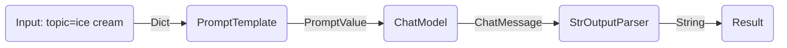
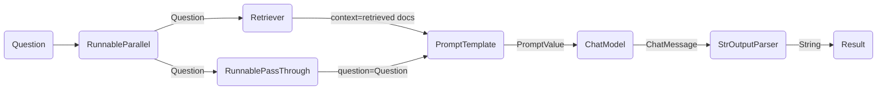

LCEL makes it easy to build complex chains from basic components, and supports out of the box functionality such as streaming, parallelism, and logging.

## Basic example: prompt + model + output parser

The most basic and common use case is chaining a prompt template and a model together. To see how this works, let's create a chain that takes a topic and generates a joke:

```python
%pip install --upgrade --quiet  langchain-core langchain-community langchain-openai
```

import ChatModelTabs from "@theme/ChatModelTabs";

<ChatModelTabs openaiParams={`model="gpt-4"`} />

```python
# | output: false
# | echo: false

from langchain_openai import ChatOpenAI

model = ChatOpenAI(model="gpt-4")
```

```python
from langchain_core.output_parsers import StrOutputParser
from langchain_core.prompts import ChatPromptTemplate

prompt = ChatPromptTemplate.from_template("tell me a short joke about {topic}")
output_parser = StrOutputParser()

chain = prompt | model | output_parser

chain.invoke({"topic": "ice cream"})
```

```output
"Why don't ice creams ever get invited to parties?\n\nBecause they always drip when things heat up!"
```

Notice this line of the code, where we piece together these different components into a single chain using LCEL:

```python
chain = prompt | model | output_parser
```

The `|` symbol is similar to a [unix pipe operator](https://en.wikipedia.org/wiki/Pipeline_(Unix)), which chains together the different components, feeding the output from one component as input into the next component.

In this chain the user input is passed to the prompt template, then the prompt template output is passed to the model, then the model output is passed to the output parser. Let's take a look at each component individually to really understand what's going on.

### 1. Prompt

`prompt` is a `BasePromptTemplate`, which means it takes in a dictionary of template variables and produces a `PromptValue`. A `PromptValue` is a wrapper around a completed prompt that can be passed to either an `LLM` (which takes a string as input) or `ChatModel` (which takes a sequence of messages as input). It can work with either language model type because it defines logic both for producing `BaseMessage`s and for producing a string.

```python
prompt_value = prompt.invoke({"topic": "ice cream"})
prompt_value
```

```output
ChatPromptValue(messages=[HumanMessage(content='tell me a short joke about ice cream')])
```

```python
prompt_value.to_messages()
```

```output
[HumanMessage(content='tell me a short joke about ice cream')]
```

```python
prompt_value.to_string()
```

```output
'Human: tell me a short joke about ice cream'
```

### 2. Model

The `PromptValue` is then passed to `model`. In this case our `model` is a `ChatModel`, meaning it will output a `BaseMessage`.

```python
message = model.invoke(prompt_value)
message
```

```output
AIMessage(content="Why don't ice creams ever get invited to parties?\n\nBecause they always bring a melt down!")
```

If our `model` was an `LLM`, it would output a string.

```python
from langchain_openai import OpenAI

llm = OpenAI(model="gpt-3.5-turbo-instruct")
llm.invoke(prompt_value)
```

```output
'\n\nRobot: Why did the ice cream truck break down? Because it had a meltdown!'
```

### 3. Output parser

And lastly we pass our `model` output to the `output_parser`, which is a `BaseOutputParser` meaning it takes either a string or a
`BaseMessage` as input. The specific `StrOutputParser` simply converts any input into a string.

```python
output_parser.invoke(message)
```

```output
"Why did the ice cream go to therapy? \n\nBecause it had too many toppings and couldn't find its cone-fidence!"
```

### 4. Entire Pipeline

To follow the steps along:

1. We pass in user input on the desired topic as `{"topic": "ice cream"}`
2. The `prompt` component takes the user input, which is then used to construct a PromptValue after using the `topic` to construct the prompt.
3. The `model` component takes the generated prompt, and passes into the OpenAI LLM model for evaluation. The generated output from the model is a `ChatMessage` object.
4. Finally, the `output_parser` component takes in a `ChatMessage`, and transforms this into a Python string, which is returned from the invoke method.



:::info

Note that if you’re curious about the output of any components, you can always test out a smaller version of the chain such as `prompt` or `prompt | model` to see the intermediate results:

:::

```python
input = {"topic": "ice cream"}

prompt.invoke(input)
# > ChatPromptValue(messages=[HumanMessage(content='tell me a short joke about ice cream')])

(prompt | model).invoke(input)
# > AIMessage(content="Why did the ice cream go to therapy?\nBecause it had too many toppings and couldn't cone-trol itself!")
```

## RAG Search Example

For our next example, we want to run a retrieval-augmented generation chain to add some context when responding to questions.

<ChatModelTabs />

```python
# Requires:
# pip install langchain docarray tiktoken

from langchain_community.vectorstores import DocArrayInMemorySearch
from langchain_core.output_parsers import StrOutputParser
from langchain_core.prompts import ChatPromptTemplate
from langchain_core.runnables import RunnableParallel, RunnablePassthrough
from langchain_openai import OpenAIEmbeddings

vectorstore = DocArrayInMemorySearch.from_texts(
    ["harrison worked at kensho", "bears like to eat honey"],
    embedding=OpenAIEmbeddings(),
)
retriever = vectorstore.as_retriever()

template = """Answer the question based only on the following context:
{context}

Question: {question}
"""
prompt = ChatPromptTemplate.from_template(template)
output_parser = StrOutputParser()

setup_and_retrieval = RunnableParallel(
    {"context": retriever, "question": RunnablePassthrough()}
)
chain = setup_and_retrieval | prompt | model | output_parser

chain.invoke("where did harrison work?")
```

In this case, the composed chain is:

```python
chain = setup_and_retrieval | prompt | model | output_parser
```

To explain this, we first can see that the prompt template above takes in `context` and `question` as values to be substituted in the prompt. Before building the prompt template, we want to retrieve relevant documents to the search and include them as part of the context.

As a preliminary step, we’ve setup the retriever using an in memory store, which can retrieve documents based on a query. This is a runnable component as well that can be chained together with other components, but you can also try to run it separately:

```python
retriever.invoke("where did harrison work?")
```

We then use the `RunnableParallel` to prepare the expected inputs into the prompt by using the entries for the retrieved documents as well as the original user question, using the retriever for document search, and `RunnablePassthrough` to pass the user’s question:

```python
setup_and_retrieval = RunnableParallel(
    {"context": retriever, "question": RunnablePassthrough()}
)
```

To review, the complete chain is:

```python
setup_and_retrieval = RunnableParallel(
    {"context": retriever, "question": RunnablePassthrough()}
)
chain = setup_and_retrieval | prompt | model | output_parser
```

With the flow being:

1. The first steps create a `RunnableParallel` object with two entries.  The first entry, `context` will include the document results fetched by the retriever. The second entry, `question` will contain the user’s original question. To pass on the question, we use `RunnablePassthrough` to copy this entry.
2. Feed the dictionary from the step above to the `prompt` component. It then takes the user input which is `question` as well as the retrieved document which is `context` to construct a prompt and output a PromptValue.
3. The `model` component takes the generated prompt, and passes into the OpenAI LLM model for evaluation. The generated output from the model is a `ChatMessage` object.
4. Finally, the `output_parser` component takes in a `ChatMessage`, and transforms this into a Python string, which is returned from the invoke method.



## Next steps

We recommend reading our [Advantages of LCEL](/docs/expression_language/why) section next to see a side-by-side comparison of the code needed to produce common functionality with and without LCEL.