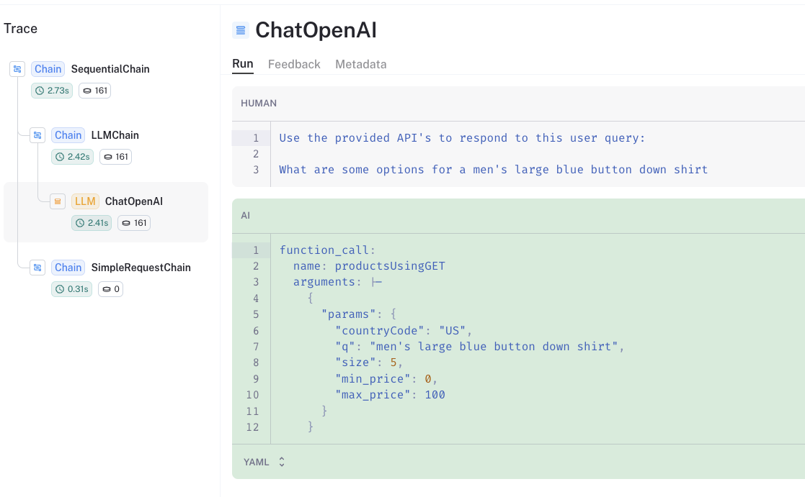
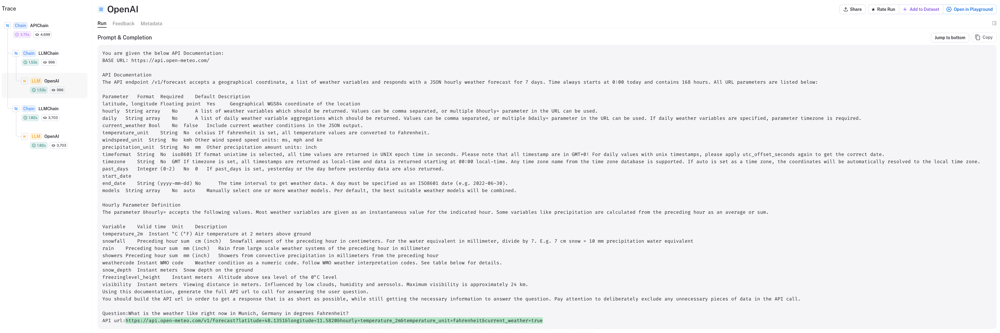
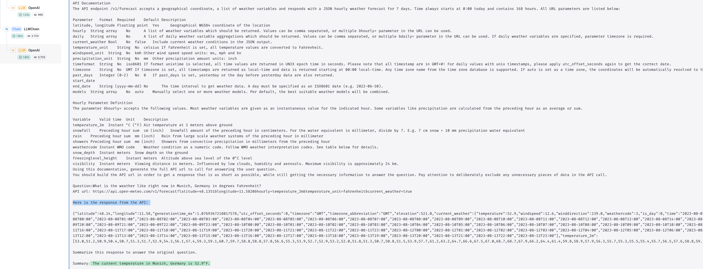

[](https://colab.research.google.com/github/langchain-ai/langchain/blob/master/docs/docs/use_cases/apis.ipynb)

## Use case

Suppose you want an LLM to interact with external APIs.

This can be very useful for retrieving context for the LLM to utilize.

And, more generally, it allows us to interact with APIs using natural language!

## Overview

There are two primary ways to interface LLMs with external APIs:

* `Functions`: For example, [OpenAI functions](https://platform.openai.com/docs/guides/gpt/function-calling) is one popular means of doing this.
* `LLM-generated interface`: Use an LLM with access to API documentation to create an interface.


## Quickstart

Many APIs are already compatible with OpenAI function calling.

For example, [Klarna](https://www.klarna.com/international/press/klarna-brings-smoooth-shopping-to-chatgpt/) has a YAML file that describes its API and allows OpenAI to interact with it:

```text
https://www.klarna.com/us/shopping/public/openai/v0/api-docs/
```

Other options include:

* [Speak](https://api.speak.com/openapi.yaml) for translation
* [XKCD](https://gist.githubusercontent.com/roaldnefs/053e505b2b7a807290908fe9aa3e1f00/raw/0a212622ebfef501163f91e23803552411ed00e4/openapi.yaml) for comics

We can supply the specification to `get_openapi_chain` directly in order to query the API with OpenAI functions:

```python
pip install langchain langchain-openai

# Set env var OPENAI_API_KEY or load from a .env file:
# import dotenv
# dotenv.load_dotenv()
```

```python
from langchain.chains.openai_functions.openapi import get_openapi_chain

chain = get_openapi_chain(
    "https://www.klarna.com/us/shopping/public/openai/v0/api-docs/"
)
chain("What are some options for a men's large blue button down shirt")
```

```output
Attempting to load an OpenAPI 3.0.1 spec.  This may result in degraded performance. Convert your OpenAPI spec to 3.1.* spec for better support.
```

```output
{'query': "What are some options for a men's large blue button down shirt",
 'response': {'products': [{'name': 'Cubavera Four Pocket Guayabera Shirt',
    'url': 'https://www.klarna.com/us/shopping/pl/cl10001/3202055522/Clothing/Cubavera-Four-Pocket-Guayabera-Shirt/?utm_source=openai&ref-site=openai_plugin',
    'price': '$13.50',
    'attributes': ['Material:Polyester,Cotton',
     'Target Group:Man',
     'Color:Red,White,Blue,Black',
     'Properties:Pockets',
     'Pattern:Solid Color',
     'Size (Small-Large):S,XL,L,M,XXL']},
   {'name': 'Polo Ralph Lauren Plaid Short Sleeve Button-down Oxford Shirt',
    'url': 'https://www.klarna.com/us/shopping/pl/cl10001/3207163438/Clothing/Polo-Ralph-Lauren-Plaid-Short-Sleeve-Button-down-Oxford-Shirt/?utm_source=openai&ref-site=openai_plugin',
    'price': '$52.20',
    'attributes': ['Material:Cotton',
     'Target Group:Man',
     'Color:Red,Blue,Multicolor',
     'Size (Small-Large):S,XL,L,M,XXL']},
   {'name': 'Brixton Bowery Flannel Shirt',
    'url': 'https://www.klarna.com/us/shopping/pl/cl10001/3202331096/Clothing/Brixton-Bowery-Flannel-Shirt/?utm_source=openai&ref-site=openai_plugin',
    'price': '$27.48',
    'attributes': ['Material:Cotton',
     'Target Group:Man',
     'Color:Gray,Blue,Black,Orange',
     'Properties:Pockets',
     'Pattern:Checkered',
     'Size (Small-Large):XL,3XL,4XL,5XL,L,M,XXL']},
   {'name': 'Vineyard Vines Gingham On-The-Go brrr Classic Fit Shirt Crystal',
    'url': 'https://www.klarna.com/us/shopping/pl/cl10001/3201938510/Clothing/Vineyard-Vines-Gingham-On-The-Go-brrr-Classic-Fit-Shirt-Crystal/?utm_source=openai&ref-site=openai_plugin',
    'price': '$80.64',
    'attributes': ['Material:Cotton',
     'Target Group:Man',
     'Color:Blue',
     'Size (Small-Large):XL,XS,L,M']},
   {'name': "Carhartt Men's Loose Fit Midweight Short Sleeve Plaid Shirt",
    'url': 'https://www.klarna.com/us/shopping/pl/cl10001/3201826024/Clothing/Carhartt-Men-s-Loose-Fit-Midweight-Short-Sleeve-Plaid-Shirt/?utm_source=openai&ref-site=openai_plugin',
    'price': '$17.99',
    'attributes': ['Material:Cotton',
     'Target Group:Man',
     'Color:Red,Brown,Blue,Green',
     'Properties:Pockets',
     'Pattern:Checkered',
     'Size (Small-Large):S,XL,L,M']}]}}
```

## Functions

We can unpack what is happening when we use the functions to call external APIs.

Let's look at the [LangSmith trace](https://smith.langchain.com/public/76a58b85-193f-4eb7-ba40-747f0d5dd56e/r):

* See [here](https://github.com/langchain-ai/langchain/blob/7fc07ba5df99b9fa8bef837b0fafa220bc5c932c/libs/langchain/langchain/chains/openai_functions/openapi.py#L279C9-L279C19) that we call the OpenAI LLM with the provided API spec:

```text
https://www.klarna.com/us/shopping/public/openai/v0/api-docs/
```

* The prompt then tells the LLM to use the API spec with input question:

```text
Use the provided APIs to respond to this user query:
What are some options for a men's large blue button down shirt
```

* The LLM returns the parameters for the function call `productsUsingGET`, which is [specified in the provided API spec](https://www.klarna.com/us/shopping/public/openai/v0/api-docs/):

```text
function_call:
  name: productsUsingGET
  arguments: |-
    {
      "params": {
        "countryCode": "US",
        "q": "men's large blue button down shirt",
        "size": 5,
        "min_price": 0,
        "max_price": 100
      }
    }
```



* This `Dict` above split and the [API is called here](https://github.com/langchain-ai/langchain/blob/7fc07ba5df99b9fa8bef837b0fafa220bc5c932c/libs/langchain/langchain/chains/openai_functions/openapi.py#L215).

## API Chain

We can also build our own interface to external APIs using the `APIChain` and provided API documentation.

```python
from langchain.chains import APIChain
from langchain.chains.api import open_meteo_docs
from langchain_openai import OpenAI

llm = OpenAI(temperature=0)
chain = APIChain.from_llm_and_api_docs(
    llm,
    open_meteo_docs.OPEN_METEO_DOCS,
    verbose=True,
    limit_to_domains=["https://api.open-meteo.com/"],
)
chain.run(
    "What is the weather like right now in Munich, Germany in degrees Fahrenheit?"
)
```

```output


> Entering new APIChain chain...
https://api.open-meteo.com/v1/forecast?latitude=48.1351&longitude=11.5820&hourly=temperature_2m&temperature_unit=fahrenheit&current_weather=true
{"latitude":48.14,"longitude":11.58,"generationtime_ms":0.1710653305053711,"utc_offset_seconds":0,"timezone":"GMT","timezone_abbreviation":"GMT","elevation":521.0,"current_weather_units":{"time":"iso8601","interval":"seconds","temperature":"°F","windspeed":"km/h","winddirection":"°","is_day":"","weathercode":"wmo code"},"current_weather":{"time":"2023-11-01T21:30","interval":900,"temperature":46.5,"windspeed":7.7,"winddirection":259,"is_day":0,"weathercode":3},"hourly_units":{"time":"iso8601","temperature_2m":"°F"},"hourly":{"time":["2023-11-01T00:00","2023-11-01T01:00","2023-11-01T02:00","2023-11-01T03:00","2023-11-01T04:00","2023-11-01T05:00","2023-11-01T06:00","2023-11-01T07:00","2023-11-01T08:00","2023-11-01T09:00","2023-11-01T10:00","2023-11-01T11:00","2023-11-01T12:00","2023-11-01T13:00","2023-11-01T14:00","2023-11-01T15:00","2023-11-01T16:00","2023-11-01T17:00","2023-11-01T18:00","2023-11-01T19:00","2023-11-01T20:00","2023-11-01T21:00","2023-11-01T22:00","2023-11-01T23:00","2023-11-02T00:00","2023-11-02T01:00","2023-11-02T02:00","2023-11-02T03:00","2023-11-02T04:00","2023-11-02T05:00","2023-11-02T06:00","2023-11-02T07:00","2023-11-02T08:00","2023-11-02T09:00","2023-11-02T10:00","2023-11-02T11:00","2023-11-02T12:00","2023-11-02T13:00","2023-11-02T14:00","2023-11-02T15:00","2023-11-02T16:00","2023-11-02T17:00","2023-11-02T18:00","2023-11-02T19:00","2023-11-02T20:00","2023-11-02T21:00","2023-11-02T22:00","2023-11-02T23:00","2023-11-03T00:00","2023-11-03T01:00","2023-11-03T02:00","2023-11-03T03:00","2023-11-03T04:00","2023-11-03T05:00","2023-11-03T06:00","2023-11-03T07:00","2023-11-03T08:00","2023-11-03T09:00","2023-11-03T10:00","2023-11-03T11:00","2023-11-03T12:00","2023-11-03T13:00","2023-11-03T14:00","2023-11-03T15:00","2023-11-03T16:00","2023-11-03T17:00","2023-11-03T18:00","2023-11-03T19:00","2023-11-03T20:00","2023-11-03T21:00","2023-11-03T22:00","2023-11-03T23:00","2023-11-04T00:00","2023-11-04T01:00","2023-11-04T02:00","2023-11-04T03:00","2023-11-04T04:00","2023-11-04T05:00","2023-11-04T06:00","2023-11-04T07:00","2023-11-04T08:00","2023-11-04T09:00","2023-11-04T10:00","2023-11-04T11:00","2023-11-04T12:00","2023-11-04T13:00","2023-11-04T14:00","2023-11-04T15:00","2023-11-04T16:00","2023-11-04T17:00","2023-11-04T18:00","2023-11-04T19:00","2023-11-04T20:00","2023-11-04T21:00","2023-11-04T22:00","2023-11-04T23:00","2023-11-05T00:00","2023-11-05T01:00","2023-11-05T02:00","2023-11-05T03:00","2023-11-05T04:00","2023-11-05T05:00","2023-11-05T06:00","2023-11-05T07:00","2023-11-05T08:00","2023-11-05T09:00","2023-11-05T10:00","2023-11-05T11:00","2023-11-05T12:00","2023-11-05T13:00","2023-11-05T14:00","2023-11-05T15:00","2023-11-05T16:00","2023-11-05T17:00","2023-11-05T18:00","2023-11-05T19:00","2023-11-05T20:00","2023-11-05T21:00","2023-11-05T22:00","2023-11-05T23:00","2023-11-06T00:00","2023-11-06T01:00","2023-11-06T02:00","2023-11-06T03:00","2023-11-06T04:00","2023-11-06T05:00","2023-11-06T06:00","2023-11-06T07:00","2023-11-06T08:00","2023-11-06T09:00","2023-11-06T10:00","2023-11-06T11:00","2023-11-06T12:00","2023-11-06T13:00","2023-11-06T14:00","2023-11-06T15:00","2023-11-06T16:00","2023-11-06T17:00","2023-11-06T18:00","2023-11-06T19:00","2023-11-06T20:00","2023-11-06T21:00","2023-11-06T22:00","2023-11-06T23:00","2023-11-07T00:00","2023-11-07T01:00","2023-11-07T02:00","2023-11-07T03:00","2023-11-07T04:00","2023-11-07T05:00","2023-11-07T06:00","2023-11-07T07:00","2023-11-07T08:00","2023-11-07T09:00","2023-11-07T10:00","2023-11-07T11:00","2023-11-07T12:00","2023-11-07T13:00","2023-11-07T14:00","2023-11-07T15:00","2023-11-07T16:00","2023-11-07T17:00","2023-11-07T18:00","2023-11-07T19:00","2023-11-07T20:00","2023-11-07T21:00","2023-11-07T22:00","2023-11-07T23:00"],"temperature_2m":[47.9,46.9,47.1,46.6,45.8,45.2,43.4,43.5,46.8,51.5,55.0,56.3,58.1,57.9,57.0,56.6,54.4,52.1,49.1,48.3,47.7,46.9,46.2,45.8,44.4,42.4,41.7,41.7,42.0,42.7,43.6,44.3,45.9,48.0,49.1,50.7,52.2,52.6,51.9,50.3,48.1,47.4,47.1,46.9,46.2,45.7,45.6,45.6,45.7,45.3,45.1,44.2,43.6,43.2,42.8,41.6,41.0,42.1,42.4,42.3,42.7,43.9,44.2,43.6,41.9,40.4,39.0,40.8,40.2,40.1,39.6,38.8,38.2,36.9,35.8,36.4,37.3,38.5,38.9,39.0,41.8,45.4,48.7,50.8,51.7,52.1,51.3,49.8,48.6,47.8,47.0,46.3,45.9,45.6,45.7,46.1,46.3,46.4,46.3,46.3,45.8,45.4,45.5,47.1,49.3,51.2,52.4,53.1,53.5,53.4,53.0,52.4,51.6,50.5,49.6,49.0,48.6,48.1,47.6,47.0,46.4,46.0,45.5,45.1,44.4,43.7,43.9,45.6,48.1,50.3,51.7,52.8,53.5,52.7,51.5,50.2,48.8,47.4,46.2,45.5,45.0,44.6,44.3,44.2,43.9,43.4,43.0,42.6,42.3,42.0,42.2,43.0,44.3,45.5,46.8,48.1,48.9,49.0,48.7,48.1,47.4,46.5,45.7,45.1,44.5,44.3,44.5,45.1]}}

> Finished chain.
```

```output
' The current temperature in Munich, Germany is 46.5°F.'
```

Note that we supply information about the API:

```python
open_meteo_docs.OPEN_METEO_DOCS[0:500]
```

```output
'BASE URL: https://api.open-meteo.com/\n\nAPI Documentation\nThe API endpoint /v1/forecast accepts a geographical coordinate, a list of weather variables and responds with a JSON hourly weather forecast for 7 days. Time always starts at 0:00 today and contains 168 hours. All URL parameters are listed below:\n\nParameter\tFormat\tRequired\tDefault\tDescription\nlatitude, longitude\tFloating point\tYes\t\tGeographical WGS84 coordinate of the location\nhourly\tString array\tNo\t\tA list of weather variables which shou'
```

Under the hood, we do two things:

* `api_request_chain`: Generate an API URL based on the input question and the api_docs
* `api_answer_chain`: generate a final answer based on the API response

We can look at the [LangSmith trace](https://smith.langchain.com/public/1e0d18ca-0d76-444c-97df-a939a6a815a7/r) to inspect this:

* The `api_request_chain` produces the API url from our question and the API documentation:



* [Here](https://github.com/langchain-ai/langchain/blob/bbd22b9b761389a5e40fc45b0570e1830aabb707/libs/langchain/langchain/chains/api/base.py#L82) we make the API request with the API url.
* The `api_answer_chain` takes the response from the API and provides us with a natural language response:



### Going deeper

**Test with other APIs**

```python
import os

os.environ["TMDB_BEARER_TOKEN"] = ""
from langchain.chains.api import tmdb_docs

headers = {"Authorization": f"Bearer {os.environ['TMDB_BEARER_TOKEN']}"}
chain = APIChain.from_llm_and_api_docs(
    llm,
    tmdb_docs.TMDB_DOCS,
    headers=headers,
    verbose=True,
    limit_to_domains=["https://api.themoviedb.org/"],
)
chain.run("Search for 'Avatar'")
```

```python
import os

from langchain.chains import APIChain
from langchain.chains.api import podcast_docs
from langchain_openai import OpenAI

listen_api_key = "xxx"  # Get api key here: https://www.listennotes.com/api/pricing/
llm = OpenAI(temperature=0)
headers = {"X-ListenAPI-Key": listen_api_key}
chain = APIChain.from_llm_and_api_docs(
    llm,
    podcast_docs.PODCAST_DOCS,
    headers=headers,
    verbose=True,
    limit_to_domains=["https://listen-api.listennotes.com/"],
)
chain.run(
    "Search for 'silicon valley bank' podcast episodes, audio length is more than 30 minutes, return only 1 results"
)
```

**Web requests**

URL requests are such a common use-case that we have the `LLMRequestsChain`, which makes an HTTP GET request.

```python
from langchain.chains import LLMChain, LLMRequestsChain
from langchain_core.prompts import PromptTemplate
from langchain_openai import OpenAI
```

```python
template = """Between >>> and <<< are the raw search result text from google.
Extract the answer to the question '{query}' or say "not found" if the information is not contained.
Use the format
Extracted:<answer or "not found">
>>> {requests_result} <<<
Extracted:"""

PROMPT = PromptTemplate(
    input_variables=["query", "requests_result"],
    template=template,
)
```

```python
chain = LLMRequestsChain(llm_chain=LLMChain(llm=OpenAI(temperature=0), prompt=PROMPT))
question = "What are the Three (3) biggest countries, and their respective sizes?"
inputs = {
    "query": question,
    "url": "https://www.google.com/search?q=" + question.replace(" ", "+"),
}
chain(inputs)
```

```output
{'query': 'What are the Three (3) biggest countries, and their respective sizes?',
 'url': 'https://www.google.com/search?q=What+are+the+Three+(3)+biggest+countries,+and+their+respective+sizes?',
 'output': ' Russia (17,098,242 km²), Canada (9,984,670 km²), China (9,706,961 km²)'}
```