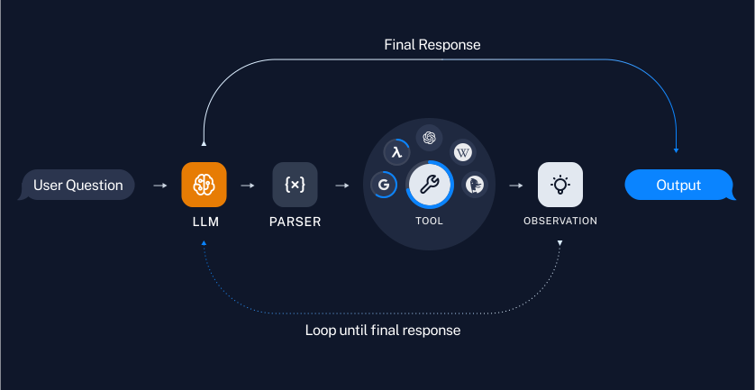

## Repeated tool use with agents

Chains are great when we know the specific sequence of tool usage needed for any user input. But for certain use cases, how many times we use tools depends on the input. In these cases, we want to let the model itself decide how many times to use tools and in what order. [Agents](/docs/modules/agents/) let us do just this.

LangChain comes with a number of built-in agents that are optimized for different use cases. Read about all the [agent types here](/docs/modules/agents/agent_types/).

We'll use the [tool calling agent](/docs/modules/agents/agent_types/tool_calling/), which is generally the most reliable kind and the recommended one for most use cases. "Tool calling" in this case refers to a specific type of model API that allows for explicitly passing tool definitions to models and getting explicit tool invocations out. For more on tool calling models see [this guide](/docs/modules/model_io/chat/function_calling/).



## Setup

We'll need to install the following packages:

```python
%pip install --upgrade --quiet langchain langchainhub
```

If you'd like to use LangSmith, set the environment variables below:

```python
import getpass
import os


# os.environ["LANGCHAIN_TRACING_V2"] = "true"
# os.environ["LANGCHAIN_API_KEY"] = getpass.getpass()
```

## Create tools

First, we need to create some tool to call. For this example, we will create custom tools from functions. For more information on creating custom tools, please see [this guide](/docs/modules/tools/).

```python
from langchain_core.tools import tool


@tool
def multiply(first_int: int, second_int: int) -> int:
    """Multiply two integers together."""
    return first_int * second_int


@tool
def add(first_int: int, second_int: int) -> int:
    "Add two integers."
    return first_int + second_int


@tool
def exponentiate(base: int, exponent: int) -> int:
    "Exponentiate the base to the exponent power."
    return base**exponent


tools = [multiply, add, exponentiate]
```

## Create prompt

```python
from langchain import hub
from langchain.agents import AgentExecutor, create_tool_calling_agent
```

```python
# Get the prompt to use - you can modify this!
prompt = hub.pull("hwchase17/openai-tools-agent")
prompt.pretty_print()
```

```output
================================ System Message ================================

You are a helpful assistant

============================= Messages Placeholder =============================

{chat_history}

================================ Human Message =================================

{input}

============================= Messages Placeholder =============================

{agent_scratchpad}
```

## Create agent

We'll need to use a model with tool calling capabilities. You can see which models support tool calling [here](/docs/integrations/chat/).

import ChatModelTabs from "@theme/ChatModelTabs";

<ChatModelTabs customVarName="llm"/>

```python
# | echo: false
# | output: false
from langchain_anthropic import ChatAnthropic

llm = ChatAnthropic(model="claude-3-sonnet-20240229", temperature=0)
```

```python
# Construct the tool calling agent
agent = create_tool_calling_agent(llm, tools, prompt)
```

```python
# Create an agent executor by passing in the agent and tools
agent_executor = AgentExecutor(agent=agent, tools=tools, verbose=True)
```

## Invoke agent

```python
agent_executor.invoke(
    {
        "input": "Take 3 to the fifth power and multiply that by the sum of twelve and three, then square the whole result"
    }
)
```

```output


> Entering new AgentExecutor chain...

Invoking: `exponentiate` with `{'base': 3, 'exponent': 5}`
responded: [{'text': "Okay, let's break this down step-by-step:", 'type': 'text'}, {'id': 'toolu_01CjdiDhDmMtaT1F4R7hSV5D', 'input': {'base': 3, 'exponent': 5}, 'name': 'exponentiate', 'type': 'tool_use'}]

243
Invoking: `add` with `{'first_int': 12, 'second_int': 3}`
responded: [{'text': '3 to the 5th power is 243.', 'type': 'text'}, {'id': 'toolu_01EKqn4E5w3Zj7bQ8s8xmi4R', 'input': {'first_int': 12, 'second_int': 3}, 'name': 'add', 'type': 'tool_use'}]

15
Invoking: `multiply` with `{'first_int': 243, 'second_int': 15}`
responded: [{'text': '12 + 3 = 15', 'type': 'text'}, {'id': 'toolu_017VZJgZBYbwMo2KGD6o6hsQ', 'input': {'first_int': 243, 'second_int': 15}, 'name': 'multiply', 'type': 'tool_use'}]

3645
Invoking: `multiply` with `{'first_int': 3645, 'second_int': 3645}`
responded: [{'text': '243 * 15 = 3645', 'type': 'text'}, {'id': 'toolu_01RtFCcQgbVGya3NVDgTYKTa', 'input': {'first_int': 3645, 'second_int': 3645}, 'name': 'multiply', 'type': 'tool_use'}]

13286025So 3645 squared is 13,286,025.

Therefore, the final result of taking 3 to the 5th power (243), multiplying by 12 + 3 (15), and then squaring the whole result is 13,286,025.

> Finished chain.
```

```output
{'input': 'Take 3 to the fifth power and multiply that by the sum of twelve and three, then square the whole result',
 'output': 'So 3645 squared is 13,286,025.\n\nTherefore, the final result of taking 3 to the 5th power (243), multiplying by 12 + 3 (15), and then squaring the whole result is 13,286,025.'}
```

You can see the [LangSmith trace here](https://smith.langchain.com/public/92694ff3-71b7-44ed-bc45-04bdf04d4689/r).