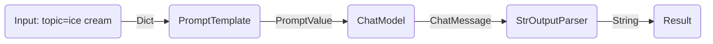
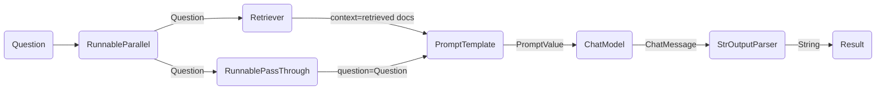

---
keywords:
- chain.invoke
sidebar_position: 0
title: Empezar
translated: true
---

LCEL facilita la construcción de cadenas complejas a partir de componentes básicos y admite funcionalidades integradas como streaming, paralelismo y registro.

## Ejemplo básico: prompt + modelo + analizador de salida

El caso de uso más básico y común es encadenar una plantilla de prompt y un modelo. Para ver cómo funciona, creemos una cadena que tome un tema y genere un chiste:

```python
%pip install --upgrade --quiet  langchain-core langchain-community langchain-openai
```

import ChatModelTabs from "@theme/ChatModelTabs";

<ChatModelTabs openaiParams={`model="gpt-4"`} />

```python
# | output: false
# | echo: false

from langchain_openai import ChatOpenAI

model = ChatOpenAI(model="gpt-4")
```

```python
from langchain_core.output_parsers import StrOutputParser
from langchain_core.prompts import ChatPromptTemplate

prompt = ChatPromptTemplate.from_template("tell me a short joke about {topic}")
output_parser = StrOutputParser()

chain = prompt | model | output_parser

chain.invoke({"topic": "ice cream"})
```

```output
"Why don't ice creams ever get invited to parties?\n\nBecause they always drip when things heat up!"
```

Observe esta línea del código, donde unimos estos diferentes componentes en una sola cadena usando LCEL:

```python
chain = prompt | model | output_parser
```

El símbolo `|` es similar al [operador de tubería unix](https://en.wikipedia.org/wiki/Pipeline_(Unix)), que encadena los diferentes componentes, alimentando la salida de un componente como entrada al siguiente.

En esta cadena, la entrada del usuario se pasa a la plantilla de prompt, luego la salida de la plantilla de prompt se pasa al modelo, y luego la salida del modelo se pasa al analizador de salida. Veamos cada componente individualmente para entender realmente lo que está sucediendo.

### 1. Prompt

`prompt` es un `BasePromptTemplate`, lo que significa que toma un diccionario de variables de plantilla y produce un `PromptValue`. Un `PromptValue` es un contenedor de un prompt completado que se puede pasar a un `LLM` (que toma una cadena como entrada) o a un `ChatModel` (que toma una secuencia de mensajes como entrada). Puede funcionar con cualquier tipo de modelo de lenguaje porque define lógica tanto para producir `BaseMessage`s como para producir una cadena.

```python
prompt_value = prompt.invoke({"topic": "ice cream"})
prompt_value
```

```output
ChatPromptValue(messages=[HumanMessage(content='tell me a short joke about ice cream')])
```

```python
prompt_value.to_messages()
```

```output
[HumanMessage(content='tell me a short joke about ice cream')]
```

```python
prompt_value.to_string()
```

```output
'Human: tell me a short joke about ice cream'
```

### 2. Modelo

Luego se pasa el `PromptValue` al `model`. En este caso, nuestro `model` es un `ChatModel`, lo que significa que generará un `BaseMessage`.

```python
message = model.invoke(prompt_value)
message
```

```output
AIMessage(content="Why don't ice creams ever get invited to parties?\n\nBecause they always bring a melt down!")
```

Si nuestro `model` fuera un `LLM`, generaría una cadena.

```python
from langchain_openai import OpenAI

llm = OpenAI(model="gpt-3.5-turbo-instruct")
llm.invoke(prompt_value)
```

```output
'\n\nRobot: Why did the ice cream truck break down? Because it had a meltdown!'
```

### 3. Analizador de salida

Y finalmente pasamos la salida de nuestro `model` al `output_parser`, que es un `BaseOutputParser`, lo que significa que toma una cadena o un `BaseMessage` como entrada. El `StrOutputParser` específico simplemente convierte cualquier entrada en una cadena.

```python
output_parser.invoke(message)
```

```output
"Why did the ice cream go to therapy? \n\nBecause it had too many toppings and couldn't find its cone-fidence!"
```

### 4. Toda la canalización

Para seguir los pasos:

1. Pasamos la entrada del usuario sobre el tema deseado como `{"topic": "helado"}`
2. El componente `prompt` toma la entrada del usuario, que luego se usa para construir un PromptValue después de usar el `topic` para construir el prompt.
3. El componente `model` toma el prompt generado y lo pasa al modelo LLM de OpenAI para su evaluación. La salida generada por el modelo es un objeto `ChatMessage`.
4. Finalmente, el componente `output_parser` toma un `ChatMessage` y lo transforma en una cadena de Python, que se devuelve desde el método invoke.



:::info

Tenga en cuenta que si está interesado en la salida de cualquier componente, siempre puede probar una versión más pequeña de la cadena, como `prompt` o `prompt | model`, para ver los resultados intermedios:

:::

```python
input = {"topic": "ice cream"}

prompt.invoke(input)
# > ChatPromptValue(messages=[HumanMessage(content='tell me a short joke about ice cream')])

(prompt | model).invoke(input)
# > AIMessage(content="Why did the ice cream go to therapy?\nBecause it had too many toppings and couldn't cone-trol itself!")
```

## Ejemplo de búsqueda RAG

Para nuestro siguiente ejemplo, queremos ejecutar una cadena de generación aumentada por recuperación para agregar un poco de contexto al responder a las preguntas.

<ChatModelTabs />

```python
# Requires:
# pip install langchain docarray tiktoken

from langchain_community.vectorstores import DocArrayInMemorySearch
from langchain_core.output_parsers import StrOutputParser
from langchain_core.prompts import ChatPromptTemplate
from langchain_core.runnables import RunnableParallel, RunnablePassthrough
from langchain_openai import OpenAIEmbeddings

vectorstore = DocArrayInMemorySearch.from_texts(
    ["harrison worked at kensho", "bears like to eat honey"],
    embedding=OpenAIEmbeddings(),
)
retriever = vectorstore.as_retriever()

template = """Answer the question based only on the following context:
{context}

Question: {question}
"""
prompt = ChatPromptTemplate.from_template(template)
output_parser = StrOutputParser()

setup_and_retrieval = RunnableParallel(
    {"context": retriever, "question": RunnablePassthrough()}
)
chain = setup_and_retrieval | prompt | model | output_parser

chain.invoke("where did harrison work?")
```

En este caso, la cadena compuesta es:

```python
chain = setup_and_retrieval | prompt | model | output_parser
```

Para explicar esto, primero podemos ver que la plantilla de solicitud anterior toma `context` y `question` como valores que se sustituirán en la solicitud. Antes de construir la plantilla de solicitud, queremos recuperar los documentos relevantes a la búsqueda e incluirlos como parte del contexto.

Como paso preliminar, hemos configurado el buscador utilizando un almacén en memoria, que puede recuperar documentos en función de una consulta. Este es también un componente ejecutable que se puede encadenar con otros componentes, pero también puedes intentar ejecutarlo por separado:

```python
retriever.invoke("where did harrison work?")
```

Luego usamos `RunnableParallel` para preparar los inputs esperados en la solicitud utilizando las entradas de los documentos recuperados, así como la pregunta original del usuario, utilizando el buscador para la búsqueda de documentos y `RunnablePassthrough` para pasar la pregunta del usuario:

```python
setup_and_retrieval = RunnableParallel(
    {"context": retriever, "question": RunnablePassthrough()}
)
```

Para revisar, la cadena completa es:

```python
setup_and_retrieval = RunnableParallel(
    {"context": retriever, "question": RunnablePassthrough()}
)
chain = setup_and_retrieval | prompt | model | output_parser
```

Con el flujo siendo:

1. Los primeros pasos crean un objeto `RunnableParallel` con dos entradas. La primera entrada, `context`, incluirá los resultados del documento recuperados por el buscador. La segunda entrada, `question`, contendrá la pregunta original del usuario. Para pasar la pregunta, usamos `RunnablePassthrough` para copiar esta entrada.
2. Alimenta el diccionario del paso anterior al componente `prompt`. Luego toma la entrada del usuario que es `question` y el documento recuperado que es `context` para construir un prompt y generar un PromptValue.
3. El componente `model` toma el prompt generado y lo pasa al modelo LLM de OpenAI para su evaluación. La salida generada del modelo es un objeto `ChatMessage`.
4. Finalmente, el componente `output_parser` toma un `ChatMessage` y lo transforma en una cadena de Python, que se devuelve desde el método invoke.



## Próximos pasos

Le recomendamos leer nuestra sección [Ventajas de LCEL](/docs/expression_language/why) a continuación para ver una comparación lado a lado del código necesario para producir funcionalidad común con y sin LCEL.
