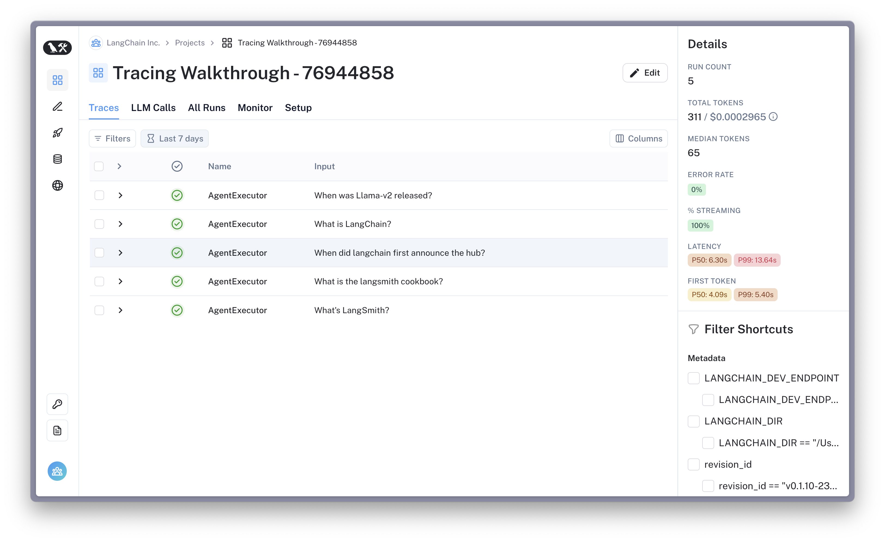

# LangSmith Walkthrough

[](https://colab.research.google.com/github/langchain-ai/langchain/blob/master/docs/docs/langsmith/walkthrough.ipynb)

LangChain hace que sea fácil prototipar aplicaciones y agentes de LLM. Sin embargo, entregar aplicaciones de LLM a producción puede ser engañosamente difícil. Tendrás que iterar sobre tus indicaciones, cadenas y otros componentes para construir un producto de alta calidad.

LangSmith facilita la depuración, prueba y mejora continua de tus aplicaciones de LLM.

¿Cuándo puede ser útil esto? Puede ser útil cuando quieres:

- Depurar rápidamente una nueva cadena, agente o conjunto de herramientas
- Crear y administrar conjuntos de datos para el ajuste fino, el prompting de pocos disparos y la evaluación
- Ejecutar pruebas de regresión en tu aplicación para desarrollar con confianza
- Capturar análisis de producción para obtener información sobre el producto y mejoras continuas

## Requisitos previos

**[Crea una cuenta de LangSmith](https://smith.langchain.com/) y crea una clave API (consulta la esquina inferior izquierda). Familiarízate con la plataforma revisando la [documentación](https://docs.smith.langchain.com/)**

Tenga en cuenta que LangSmith se encuentra en beta cerrada; estamos en el proceso de implementarlo a más usuarios. Sin embargo, puedes completar el formulario en el sitio web para obtener acceso acelerado.

¡Ahora, comencemos!

## Registra ejecuciones en LangSmith

Primero, configura tus variables de entorno para indicarle a LangChain que registre rastros. Esto se hace estableciendo la variable de entorno `LANGCHAIN_TRACING_V2` en verdadero.
Puedes indicarle a LangChain a qué proyecto registrar estableciendo la variable de entorno `LANGCHAIN_PROJECT` (si no se establece, las ejecuciones se registrarán en el proyecto `predeterminado`). Esto creará automáticamente el proyecto para ti si no existe. También debes establecer las variables de entorno `LANGCHAIN_ENDPOINT` y `LANGCHAIN_API_KEY`.

Para obtener más información sobre otras formas de configurar el seguimiento, consulta la [documentación de LangSmith](https://docs.smith.langchain.com/docs/).

**NOTA:** También puedes usar un administrador de contexto en Python para registrar rastros usando

```python
from langchain_core.tracers.context import tracing_v2_enabled

with tracing_v2_enabled(project_name="My Project"):
    agent.run("How many people live in canada as of 2023?")
```

Sin embargo, en este ejemplo, usaremos variables de entorno.

```python
%pip install --upgrade --quiet  langchain langsmith langchainhub
%pip install --upgrade --quiet  langchain-openai tiktoken pandas duckduckgo-search
```

```python
import os
from uuid import uuid4

unique_id = uuid4().hex[0:8]
os.environ["LANGCHAIN_TRACING_V2"] = "true"
os.environ["LANGCHAIN_PROJECT"] = f"Tracing Walkthrough - {unique_id}"
os.environ["LANGCHAIN_ENDPOINT"] = "https://api.smith.langchain.com"
os.environ["LANGCHAIN_API_KEY"] = "<YOUR-API-KEY>"  # Update to your API key

# Used by the agent in this tutorial
os.environ["OPENAI_API_KEY"] = "<YOUR-OPENAI-API-KEY>"
```

Crea el cliente de langsmith para interactuar con la API

```python
from langsmith import Client

client = Client()
```

Crea un componente de LangChain y registra ejecuciones en la plataforma. En este ejemplo, crearemos un agente estilo ReAct con acceso a una herramienta de búsqueda general (DuckDuckGo). La indicación del agente se puede ver en el [Hub aquí](https://smith.langchain.com/hub/wfh/langsmith-agent-prompt).

```python
from langchain import hub
from langchain.agents import AgentExecutor
from langchain.agents.format_scratchpad.openai_tools import (
    format_to_openai_tool_messages,
)
from langchain.agents.output_parsers.openai_tools import OpenAIToolsAgentOutputParser
from langchain_community.tools import DuckDuckGoSearchResults
from langchain_openai import ChatOpenAI

# Fetches the latest version of this prompt
prompt = hub.pull("wfh/langsmith-agent-prompt:5d466cbc")

llm = ChatOpenAI(
    model="gpt-3.5-turbo-16k",
    temperature=0,
)

tools = [
    DuckDuckGoSearchResults(
        name="duck_duck_go"
    ),  # General internet search using DuckDuckGo
]

llm_with_tools = llm.bind_tools(tools)

runnable_agent = (
    {
        "input": lambda x: x["input"],
        "agent_scratchpad": lambda x: format_to_openai_tool_messages(
            x["intermediate_steps"]
        ),
    }
    | prompt
    | llm_with_tools
    | OpenAIToolsAgentOutputParser()
)

agent_executor = AgentExecutor(
    agent=runnable_agent, tools=tools, handle_parsing_errors=True
)
```

Estamos ejecutando el agente de forma concurrente en múltiples entradas para reducir la latencia. Las ejecuciones se registran en LangSmith en segundo plano, por lo que la latencia de ejecución no se ve afectada.

```python
inputs = [
    "What is LangChain?",
    "What's LangSmith?",
    "When was Llama-v2 released?",
    "What is the langsmith cookbook?",
    "When did langchain first announce the hub?",
]

results = agent_executor.batch([{"input": x} for x in inputs], return_exceptions=True)
```

```python
results[:2]
```

```output
[{'input': 'What is LangChain?',
  'output': 'I\'m sorry, but I couldn\'t find any information about "LangChain". Could you please provide more context or clarify your question?'},
 {'input': "What's LangSmith?",
  'output': 'I\'m sorry, but I couldn\'t find any information about "LangSmith". It could be a company, a product, or a person. Can you provide more context or details about what you are referring to?'}]
```

Suponiendo que has configurado correctamente tu entorno, tus rastros de agente deberían aparecer en la sección `Proyectos` de la [aplicación](https://smith.langchain.com/). ¡Felicidades!



Parece que el agente no está usando eficazmente las herramientas. Vamos a evaluarlo para tener una línea de base.

## Evaluar el agente

Además de registrar ejecuciones, LangSmith también te permite probar y evaluar tus aplicaciones de LLM.

En esta sección, aprovecharás LangSmith para crear un conjunto de datos de referencia y ejecutar evaluadores asistidos por IA en un agente. Lo harás en unos pasos:

1. Crear un conjunto de datos
2. Inicializar un nuevo agente para la referencia
3. Configurar evaluadores para calificar la salida de un agente
4. Ejecutar el agente sobre el conjunto de datos y evaluar los resultados

### 1. Crear un conjunto de datos de LangSmith

A continuación, usamos el cliente de LangSmith para crear un conjunto de datos a partir de las preguntas de entrada anteriores y una lista de etiquetas. Los usarás más adelante para medir el rendimiento de un nuevo agente. Un conjunto de datos es una colección de ejemplos, que no son más que pares de entrada-salida que puedes usar como casos de prueba para tu aplicación.

Para obtener más información sobre los conjuntos de datos, incluido cómo crearlos a partir de archivos CSV u otros archivos o cómo crearlos en la plataforma, consulta la [documentación de LangSmith](https://docs.smith.langchain.com/).

```python
outputs = [
    "LangChain is an open-source framework for building applications using large language models. It is also the name of the company building LangSmith.",
    "LangSmith is a unified platform for debugging, testing, and monitoring language model applications and agents powered by LangChain",
    "July 18, 2023",
    "The langsmith cookbook is a github repository containing detailed examples of how to use LangSmith to debug, evaluate, and monitor large language model-powered applications.",
    "September 5, 2023",
]
```

```python
dataset_name = f"agent-qa-{unique_id}"

dataset = client.create_dataset(
    dataset_name,
    description="An example dataset of questions over the LangSmith documentation.",
)

client.create_examples(
    inputs=[{"input": query} for query in inputs],
    outputs=[{"output": answer} for answer in outputs],
    dataset_id=dataset.id,
)
```

### 2. Inicializar un nuevo agente para la referencia

LangSmith te permite evaluar cualquier LLM, cadena, agente o incluso una función personalizada. Los agentes conversacionales son con estado (tienen memoria); para asegurarnos de que este estado no se comparta entre las ejecuciones del conjunto de datos, pasaremos una función `chain_factory` (también conocida como `constructor`) para inicializar para cada llamada.

En este caso, probaremos un agente que usa los puntos finales de llamada de función de OpenAI.

```python
from langchain import hub
from langchain.agents import AgentExecutor, AgentType, initialize_agent, load_tools
from langchain_openai import ChatOpenAI


# Since chains can be stateful (e.g. they can have memory), we provide
# a way to initialize a new chain for each row in the dataset. This is done
# by passing in a factory function that returns a new chain for each row.
def create_agent(prompt, llm_with_tools):
    runnable_agent = (
        {
            "input": lambda x: x["input"],
            "agent_scratchpad": lambda x: format_to_openai_tool_messages(
                x["intermediate_steps"]
            ),
        }
        | prompt
        | llm_with_tools
        | OpenAIToolsAgentOutputParser()
    )
    return AgentExecutor(agent=runnable_agent, tools=tools, handle_parsing_errors=True)
```

### 3. Configurar la evaluación

Comparar manualmente los resultados de las cadenas en la interfaz de usuario es efectivo, pero puede llevar mucho tiempo.
Puede ser útil usar métricas automatizadas y comentarios asistidos por IA para evaluar el rendimiento de tu componente.

A continuación, crearemos un evaluador de ejecución personalizado que registra una evaluación heurística.

**Evaluadores heurísticos**

```python
from langsmith.evaluation import EvaluationResult
from langsmith.schemas import Example, Run


def check_not_idk(run: Run, example: Example):
    """Illustration of a custom evaluator."""
    agent_response = run.outputs["output"]
    if "don't know" in agent_response or "not sure" in agent_response:
        score = 0
    else:
        score = 1
    # You can access the dataset labels in example.outputs[key]
    # You can also access the model inputs in run.inputs[key]
    return EvaluationResult(
        key="not_uncertain",
        score=score,
    )
```

#### Evaluadores por lotes

Algunas métricas se agregan a lo largo de una "prueba" completa sin asignarse a ejecuciones/ejemplos individuales. Estos podrían ser tan simples como métricas de clasificación comunes como Precisión, Recuerdo o AUC, o podrían ser otra métrica agregada personalizada.

Puedes definir cualquier métrica por lotes a nivel de prueba completa definiendo una función (o cualquier elemento llamable) que acepte una lista de Ejecuciones (rastros del sistema) y una lista de Ejemplos (registros del conjunto de datos).

```python
from typing import List


def max_pred_length(runs: List[Run], examples: List[Example]):
    predictions = [len(run.outputs["output"]) for run in runs]
    return EvaluationResult(key="max_pred_length", score=max(predictions))
```

A continuación, configuraremos la evaluación con el evaluador personalizado anterior, así como algunos evaluadores de ejecución preimplementados que hacen lo siguiente:
- Comparar los resultados con las etiquetas de referencia.
- Medir la (des)similitud semántica utilizando la distancia de incrustación
- Evaluar los 'aspectos' de la respuesta del agente de una manera independiente de la referencia utilizando criterios personalizados

Para una discusión más larga sobre cómo seleccionar un evaluador apropiado para tu caso de uso y cómo crear tus propios evaluadores personalizados, consulta la [documentación de LangSmith](https://docs.smith.langchain.com/).

```python
from langchain.evaluation import EvaluatorType
from langchain.smith import RunEvalConfig

evaluation_config = RunEvalConfig(
    # Evaluators can either be an evaluator type (e.g., "qa", "criteria", "embedding_distance", etc.) or a configuration for that evaluator
    evaluators=[
        check_not_idk,
        # Measures whether a QA response is "Correct", based on a reference answer
        # You can also select via the raw string "qa"
        EvaluatorType.QA,
        # Measure the embedding distance between the output and the reference answer
        # Equivalent to: EvalConfig.EmbeddingDistance(embeddings=OpenAIEmbeddings())
        EvaluatorType.EMBEDDING_DISTANCE,
        # Grade whether the output satisfies the stated criteria.
        # You can select a default one such as "helpfulness" or provide your own.
        RunEvalConfig.LabeledCriteria("helpfulness"),
        # The LabeledScoreString evaluator outputs a score on a scale from 1-10.
        # You can use default criteria or write our own rubric
        RunEvalConfig.LabeledScoreString(
            {
                "accuracy": """
Score 1: The answer is completely unrelated to the reference.
Score 3: The answer has minor relevance but does not align with the reference.
Score 5: The answer has moderate relevance but contains inaccuracies.
Score 7: The answer aligns with the reference but has minor errors or omissions.
Score 10: The answer is completely accurate and aligns perfectly with the reference."""
            },
            normalize_by=10,
        ),
    ],
    batch_evaluators=[max_pred_length],
)
```

### 4. Ejecuta el agente y los evaluadores

Usa la función [run_on_dataset](https://api.python.langchain.com/en/latest/smith/langchain.smith.evaluation.runner_utils.run_on_dataset.html#langchain.smith.evaluation.runner_utils.run_on_dataset) (o la asíncrona [arun_on_dataset](https://api.python.langchain.com/en/latest/smith/langchain.smith.evaluation.runner_utils.arun_on_dataset.html#langchain.smith.evaluation.runner_utils.arun_on_dataset))) para evaluar tu modelo. Esto hará lo siguiente:
1. Obtener filas de ejemplo del conjunto de datos especificado.
2. Ejecutar tu agente (o cualquier función personalizada) en cada ejemplo.
3. Aplicar evaluadores a los rastros de ejecución resultantes y a los ejemplos de referencia correspondientes para generar comentarios automatizados.

Los resultados serán visibles en la aplicación LangSmith.

```python
from langchain import hub

# We will test this version of the prompt
prompt = hub.pull("wfh/langsmith-agent-prompt:798e7324")
```

```python
import functools

from langchain.smith import arun_on_dataset, run_on_dataset

chain_results = run_on_dataset(
    dataset_name=dataset_name,
    llm_or_chain_factory=functools.partial(
        create_agent, prompt=prompt, llm_with_tools=llm_with_tools
    ),
    evaluation=evaluation_config,
    verbose=True,
    client=client,
    project_name=f"tools-agent-test-5d466cbc-{unique_id}",
    # Project metadata communicates the experiment parameters,
    # Useful for reviewing the test results
    project_metadata={
        "env": "testing-notebook",
        "model": "gpt-3.5-turbo",
        "prompt": "5d466cbc",
    },
)

# Sometimes, the agent will error due to parsing issues, incompatible tool inputs, etc.
# These are logged as warnings here and captured as errors in the tracing UI.
```

### Revisar los resultados de la prueba

Puedes revisar la interfaz de usuario de seguimiento de los resultados de la prueba a continuación haciendo clic en la URL en la salida anterior o navegando a la página "Pruebas y conjuntos de datos" en LangSmith **"agent-qa-{unique_id}"** conjunto de datos.


Esto mostrará las nuevas ejecuciones y los comentarios registrados de los evaluadores seleccionados. También puedes explorar un resumen de los resultados en formato tabular a continuación.

```python
chain_results.to_dataframe()
```

### (Opcional) Comparar con otro mensaje

Ahora que tenemos los resultados de la ejecución de la prueba, podemos hacer cambios en nuestro agente y compararlos. Intentemos esto de nuevo con un mensaje diferente y veamos los resultados.

```python
candidate_prompt = hub.pull("wfh/langsmith-agent-prompt:39f3bbd0")

chain_results = run_on_dataset(
    dataset_name=dataset_name,
    llm_or_chain_factory=functools.partial(
        create_agent, prompt=candidate_prompt, llm_with_tools=llm_with_tools
    ),
    evaluation=evaluation_config,
    verbose=True,
    client=client,
    project_name=f"tools-agent-test-39f3bbd0-{unique_id}",
    project_metadata={
        "env": "testing-notebook",
        "model": "gpt-3.5-turbo",
        "prompt": "39f3bbd0",
    },
)
```

## Exportar conjuntos de datos y ejecuciones

LangSmith te permite exportar datos a formatos comunes como CSV o JSONL directamente en la aplicación web. También puedes usar el cliente para obtener ejecuciones para un análisis adicional, almacenarlas en tu propia base de datos o compartirlas con otros. Vamos a obtener los rastros de ejecución de la ejecución de evaluación.

**Nota: Puede pasar un momento antes de que todas las ejecuciones estén accesibles.**

```python
runs = client.list_runs(project_name=chain_results["project_name"], execution_order=1)
```

```python
# The resulting tests are stored in a project.  You can programmatically
# access important metadata from the test, such as the dataset version it was run on
# or your application's revision ID.
client.read_project(project_name=chain_results["project_name"]).metadata
```

```python
# After some time, the test metrics will be populated as well.
client.read_project(project_name=chain_results["project_name"]).feedback_stats
```

## Conclusión

¡Felicitaciones! ¡Has rastreado y evaluado con éxito un agente utilizando LangSmith!

Esta fue una guía rápida para empezar, pero hay muchas más formas de aprovechar LangSmith para acelerar tu flujo de trabajo y producir mejores resultados.

Para obtener más información sobre cómo puedes sacar el máximo provecho de LangSmith, consulta la [documentación de LangSmith](https://docs.smith.langchain.com/) y no dudes en comunicarte con preguntas, solicitudes de funciones o comentarios a [support@langchain.dev](mailto:support@langchain.dev).
