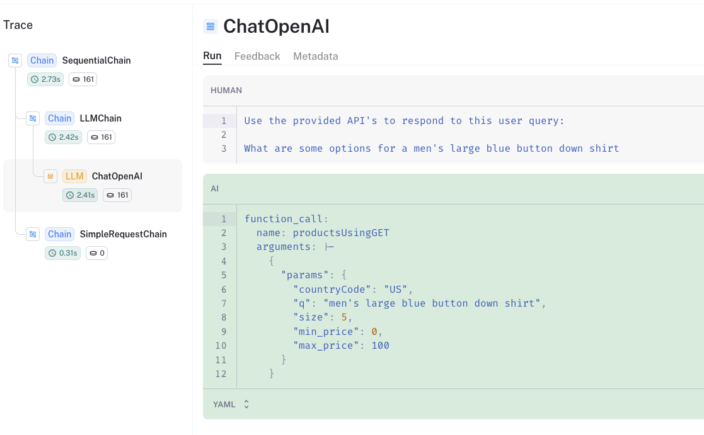
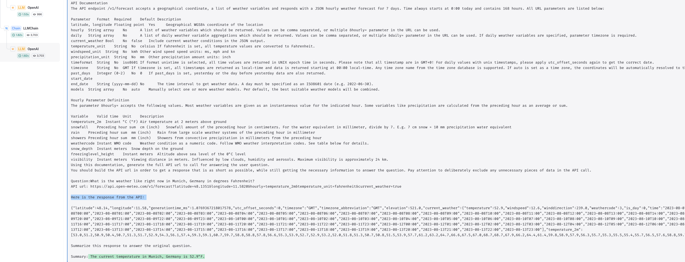

[](https://colab.research.google.com/github/langchain-ai/langchain/blob/master/docs/docs/use_cases/apis.ipynb)

## Caso de uso

Supongamos que quieres que un LLM interactúe con APIs externas.

Esto puede ser muy útil para recuperar contexto que el LLM pueda utilizar.

Y, en general, nos permite interactuar con APIs utilizando lenguaje natural.

## Resumen

Hay dos formas principales de interfaz de LLMs con APIs externas:

* `Funciones`: Por ejemplo, [Funciones de OpenAI](https://platform.openai.com/docs/guides/gpt/function-calling) es un medio popular de hacer esto.
* `Interfaz generada por LLM`: Utilizar un LLM con acceso a la documentación de la API para crear una interfaz.


## Inicio rápido

Muchas APIs ya son compatibles con la llamada de funciones de OpenAI.

Por ejemplo, [Klarna](https://www.klarna.com/international/press/klarna-brings-smoooth-shopping-to-chatgpt/) tiene un archivo YAML que describe su API y permite a OpenAI interactuar con ella:

```text
https://www.klarna.com/us/shopping/public/openai/v0/api-docs/
```

Otras opciones incluyen:

* [Speak](https://api.speak.com/openapi.yaml) para traducción
* [XKCD](https://gist.githubusercontent.com/roaldnefs/053e505b2b7a807290908fe9aa3e1f00/raw/0a212622ebfef501163f91e23803552411ed00e4/openapi.yaml) para cómics

Podemos suministrar la especificación a `get_openapi_chain` directamente para consultar la API con las funciones de OpenAI:

```python
pip install langchain langchain-openai

# Set env var OPENAI_API_KEY or load from a .env file:
# import dotenv
# dotenv.load_dotenv()
```

```python
from langchain.chains.openai_functions.openapi import get_openapi_chain

chain = get_openapi_chain(
    "https://www.klarna.com/us/shopping/public/openai/v0/api-docs/"
)
chain("What are some options for a men's large blue button down shirt")
```

```output
Attempting to load an OpenAPI 3.0.1 spec.  This may result in degraded performance. Convert your OpenAPI spec to 3.1.* spec for better support.
```

```output
{'query': "What are some options for a men's large blue button down shirt",
 'response': {'products': [{'name': 'Cubavera Four Pocket Guayabera Shirt',
    'url': 'https://www.klarna.com/us/shopping/pl/cl10001/3202055522/Clothing/Cubavera-Four-Pocket-Guayabera-Shirt/?utm_source=openai&ref-site=openai_plugin',
    'price': '$13.50',
    'attributes': ['Material:Polyester,Cotton',
     'Target Group:Man',
     'Color:Red,White,Blue,Black',
     'Properties:Pockets',
     'Pattern:Solid Color',
     'Size (Small-Large):S,XL,L,M,XXL']},
   {'name': 'Polo Ralph Lauren Plaid Short Sleeve Button-down Oxford Shirt',
    'url': 'https://www.klarna.com/us/shopping/pl/cl10001/3207163438/Clothing/Polo-Ralph-Lauren-Plaid-Short-Sleeve-Button-down-Oxford-Shirt/?utm_source=openai&ref-site=openai_plugin',
    'price': '$52.20',
    'attributes': ['Material:Cotton',
     'Target Group:Man',
     'Color:Red,Blue,Multicolor',
     'Size (Small-Large):S,XL,L,M,XXL']},
   {'name': 'Brixton Bowery Flannel Shirt',
    'url': 'https://www.klarna.com/us/shopping/pl/cl10001/3202331096/Clothing/Brixton-Bowery-Flannel-Shirt/?utm_source=openai&ref-site=openai_plugin',
    'price': '$27.48',
    'attributes': ['Material:Cotton',
     'Target Group:Man',
     'Color:Gray,Blue,Black,Orange',
     'Properties:Pockets',
     'Pattern:Checkered',
     'Size (Small-Large):XL,3XL,4XL,5XL,L,M,XXL']},
   {'name': 'Vineyard Vines Gingham On-The-Go brrr Classic Fit Shirt Crystal',
    'url': 'https://www.klarna.com/us/shopping/pl/cl10001/3201938510/Clothing/Vineyard-Vines-Gingham-On-The-Go-brrr-Classic-Fit-Shirt-Crystal/?utm_source=openai&ref-site=openai_plugin',
    'price': '$80.64',
    'attributes': ['Material:Cotton',
     'Target Group:Man',
     'Color:Blue',
     'Size (Small-Large):XL,XS,L,M']},
   {'name': "Carhartt Men's Loose Fit Midweight Short Sleeve Plaid Shirt",
    'url': 'https://www.klarna.com/us/shopping/pl/cl10001/3201826024/Clothing/Carhartt-Men-s-Loose-Fit-Midweight-Short-Sleeve-Plaid-Shirt/?utm_source=openai&ref-site=openai_plugin',
    'price': '$17.99',
    'attributes': ['Material:Cotton',
     'Target Group:Man',
     'Color:Red,Brown,Blue,Green',
     'Properties:Pockets',
     'Pattern:Checkered',
     'Size (Small-Large):S,XL,L,M']}]}}
```

## Funciones

Podemos desempacar lo que está sucediendo cuando usamos las funciones para llamar a APIs externas.

Echemos un vistazo al [rastro de LangSmith](https://smith.langchain.com/public/76a58b85-193f-4eb7-ba40-747f0d5dd56e/r):

* Vea [aquí](https://github.com/langchain-ai/langchain/blob/7fc07ba5df99b9fa8bef837b0fafa220bc5c932c/libs/langchain/langchain/chains/openai_functions/openapi.py#L279C9-L279C19) que llamamos al LLM de OpenAI con la especificación de API proporcionada:

```text
https://www.klarna.com/us/shopping/public/openai/v0/api-docs/
```

* El prompt luego le dice al LLM que use la especificación de API con la pregunta de entrada:

```text
Use the provided APIs to respond to this user query:
What are some options for a men's large blue button down shirt
```

* El LLM devuelve los parámetros para la llamada a la función `productsUsingGET`, que se [especifica en la especificación de API proporcionada](https://www.klarna.com/us/shopping/public/openai/v0/api-docs/):

```text
function_call:
  name: productsUsingGET
  arguments: |-
    {
      "params": {
        "countryCode": "US",
        "q": "men's large blue button down shirt",
        "size": 5,
        "min_price": 0,
        "max_price": 100
      }
    }
```



* Este `Dict` anterior se divide y [se llama a la API aquí](https://github.com/langchain-ai/langchain/blob/7fc07ba5df99b9fa8bef837b0fafa220bc5c932c/libs/langchain/langchain/chains/openai_functions/openapi.py#L215).

## Cadena de API

También podemos construir nuestra propia interfaz para APIs externas usando `APIChain` y la documentación de la API proporcionada.

```python
from langchain.chains import APIChain
from langchain.chains.api import open_meteo_docs
from langchain_openai import OpenAI

llm = OpenAI(temperature=0)
chain = APIChain.from_llm_and_api_docs(
    llm,
    open_meteo_docs.OPEN_METEO_DOCS,
    verbose=True,
    limit_to_domains=["https://api.open-meteo.com/"],
)
chain.run(
    "What is the weather like right now in Munich, Germany in degrees Fahrenheit?"
)
```

```output


> Entering new APIChain chain...
https://api.open-meteo.com/v1/forecast?latitude=48.1351&longitude=11.5820&hourly=temperature_2m&temperature_unit=fahrenheit&current_weather=true
{"latitude":48.14,"longitude":11.58,"generationtime_ms":0.1710653305053711,"utc_offset_seconds":0,"timezone":"GMT","timezone_abbreviation":"GMT","elevation":521.0,"current_weather_units":{"time":"iso8601","interval":"seconds","temperature":"°F","windspeed":"km/h","winddirection":"°","is_day":"","weathercode":"wmo code"},"current_weather":{"time":"2023-11-01T21:30","interval":900,"temperature":46.5,"windspeed":7.7,"winddirection":259,"is_day":0,"weathercode":3},"hourly_units":{"time":"iso8601","temperature_2m":"°F"},"hourly":{"time":["2023-11-01T00:00","2023-11-01T01:00","2023-11-01T02:00","2023-11-01T03:00","2023-11-01T04:00","2023-11-01T05:00","2023-11-01T06:00","2023-11-01T07:00","2023-11-01T08:00","2023-11-01T09:00","2023-11-01T10:00","2023-11-01T11:00","2023-11-01T12:00","2023-11-01T13:00","2023-11-01T14:00","2023-11-01T15:00","2023-11-01T16:00","2023-11-01T17:00","2023-11-01T18:00","2023-11-01T19:00","2023-11-01T20:00","2023-11-01T21:00","2023-11-01T22:00","2023-11-01T23:00","2023-11-02T00:00","2023-11-02T01:00","2023-11-02T02:00","2023-11-02T03:00","2023-11-02T04:00","2023-11-02T05:00","2023-11-02T06:00","2023-11-02T07:00","2023-11-02T08:00","2023-11-02T09:00","2023-11-02T10:00","2023-11-02T11:00","2023-11-02T12:00","2023-11-02T13:00","2023-11-02T14:00","2023-11-02T15:00","2023-11-02T16:00","2023-11-02T17:00","2023-11-02T18:00","2023-11-02T19:00","2023-11-02T20:00","2023-11-02T21:00","2023-11-02T22:00","2023-11-02T23:00","2023-11-03T00:00","2023-11-03T01:00","2023-11-03T02:00","2023-11-03T03:00","2023-11-03T04:00","2023-11-03T05:00","2023-11-03T06:00","2023-11-03T07:00","2023-11-03T08:00","2023-11-03T09:00","2023-11-03T10:00","2023-11-03T11:00","2023-11-03T12:00","2023-11-03T13:00","2023-11-03T14:00","2023-11-03T15:00","2023-11-03T16:00","2023-11-03T17:00","2023-11-03T18:00","2023-11-03T19:00","2023-11-03T20:00","2023-11-03T21:00","2023-11-03T22:00","2023-11-03T23:00","2023-11-04T00:00","2023-11-04T01:00","2023-11-04T02:00","2023-11-04T03:00","2023-11-04T04:00","2023-11-04T05:00","2023-11-04T06:00","2023-11-04T07:00","2023-11-04T08:00","2023-11-04T09:00","2023-11-04T10:00","2023-11-04T11:00","2023-11-04T12:00","2023-11-04T13:00","2023-11-04T14:00","2023-11-04T15:00","2023-11-04T16:00","2023-11-04T17:00","2023-11-04T18:00","2023-11-04T19:00","2023-11-04T20:00","2023-11-04T21:00","2023-11-04T22:00","2023-11-04T23:00","2023-11-05T00:00","2023-11-05T01:00","2023-11-05T02:00","2023-11-05T03:00","2023-11-05T04:00","2023-11-05T05:00","2023-11-05T06:00","2023-11-05T07:00","2023-11-05T08:00","2023-11-05T09:00","2023-11-05T10:00","2023-11-05T11:00","2023-11-05T12:00","2023-11-05T13:00","2023-11-05T14:00","2023-11-05T15:00","2023-11-05T16:00","2023-11-05T17:00","2023-11-05T18:00","2023-11-05T19:00","2023-11-05T20:00","2023-11-05T21:00","2023-11-05T22:00","2023-11-05T23:00","2023-11-06T00:00","2023-11-06T01:00","2023-11-06T02:00","2023-11-06T03:00","2023-11-06T04:00","2023-11-06T05:00","2023-11-06T06:00","2023-11-06T07:00","2023-11-06T08:00","2023-11-06T09:00","2023-11-06T10:00","2023-11-06T11:00","2023-11-06T12:00","2023-11-06T13:00","2023-11-06T14:00","2023-11-06T15:00","2023-11-06T16:00","2023-11-06T17:00","2023-11-06T18:00","2023-11-06T19:00","2023-11-06T20:00","2023-11-06T21:00","2023-11-06T22:00","2023-11-06T23:00","2023-11-07T00:00","2023-11-07T01:00","2023-11-07T02:00","2023-11-07T03:00","2023-11-07T04:00","2023-11-07T05:00","2023-11-07T06:00","2023-11-07T07:00","2023-11-07T08:00","2023-11-07T09:00","2023-11-07T10:00","2023-11-07T11:00","2023-11-07T12:00","2023-11-07T13:00","2023-11-07T14:00","2023-11-07T15:00","2023-11-07T16:00","2023-11-07T17:00","2023-11-07T18:00","2023-11-07T19:00","2023-11-07T20:00","2023-11-07T21:00","2023-11-07T22:00","2023-11-07T23:00"],"temperature_2m":[47.9,46.9,47.1,46.6,45.8,45.2,43.4,43.5,46.8,51.5,55.0,56.3,58.1,57.9,57.0,56.6,54.4,52.1,49.1,48.3,47.7,46.9,46.2,45.8,44.4,42.4,41.7,41.7,42.0,42.7,43.6,44.3,45.9,48.0,49.1,50.7,52.2,52.6,51.9,50.3,48.1,47.4,47.1,46.9,46.2,45.7,45.6,45.6,45.7,45.3,45.1,44.2,43.6,43.2,42.8,41.6,41.0,42.1,42.4,42.3,42.7,43.9,44.2,43.6,41.9,40.4,39.0,40.8,40.2,40.1,39.6,38.8,38.2,36.9,35.8,36.4,37.3,38.5,38.9,39.0,41.8,45.4,48.7,50.8,51.7,52.1,51.3,49.8,48.6,47.8,47.0,46.3,45.9,45.6,45.7,46.1,46.3,46.4,46.3,46.3,45.8,45.4,45.5,47.1,49.3,51.2,52.4,53.1,53.5,53.4,53.0,52.4,51.6,50.5,49.6,49.0,48.6,48.1,47.6,47.0,46.4,46.0,45.5,45.1,44.4,43.7,43.9,45.6,48.1,50.3,51.7,52.8,53.5,52.7,51.5,50.2,48.8,47.4,46.2,45.5,45.0,44.6,44.3,44.2,43.9,43.4,43.0,42.6,42.3,42.0,42.2,43.0,44.3,45.5,46.8,48.1,48.9,49.0,48.7,48.1,47.4,46.5,45.7,45.1,44.5,44.3,44.5,45.1]}}

> Finished chain.
```

```output
' The current temperature in Munich, Germany is 46.5°F.'
```

Tenga en cuenta que proporcionamos información sobre la API:

```python
open_meteo_docs.OPEN_METEO_DOCS[0:500]
```

```output
'BASE URL: https://api.open-meteo.com/\n\nAPI Documentation\nThe API endpoint /v1/forecast accepts a geographical coordinate, a list of weather variables and responds with a JSON hourly weather forecast for 7 days. Time always starts at 0:00 today and contains 168 hours. All URL parameters are listed below:\n\nParameter\tFormat\tRequired\tDefault\tDescription\nlatitude, longitude\tFloating point\tYes\t\tGeographical WGS84 coordinate of the location\nhourly\tString array\tNo\t\tA list of weather variables which shou'
```

Debajo del capó, hacemos dos cosas:

* `api_request_chain`: Generar una URL de API en función de la pregunta de entrada y la api_docs
* `api_answer_chain`: generar una respuesta final en función de la respuesta de la API

Podemos mirar el [rastro de LangSmith](https://smith.langchain.com/public/1e0d18ca-0d76-444c-97df-a939a6a815a7/r) para inspeccionar esto:

* El `api_request_chain` produce la URL de la API a partir de nuestra pregunta y la documentación de la API:


* [Aquí](https://github.com/langchain-ai/langchain/blob/bbd22b9b761389a5e40fc45b0570e1830aabb707/libs/langchain/langchain/chains/api/base.py#L82) hacemos la solicitud de API con la URL de la API.
* El `api_answer_chain` toma la respuesta de la API y nos proporciona una respuesta en lenguaje natural:



### Profundizando

**Prueba con otras APIs**

```python
import os

os.environ["TMDB_BEARER_TOKEN"] = ""
from langchain.chains.api import tmdb_docs

headers = {"Authorization": f"Bearer {os.environ['TMDB_BEARER_TOKEN']}"}
chain = APIChain.from_llm_and_api_docs(
    llm,
    tmdb_docs.TMDB_DOCS,
    headers=headers,
    verbose=True,
    limit_to_domains=["https://api.themoviedb.org/"],
)
chain.run("Search for 'Avatar'")
```

```python
import os

from langchain.chains import APIChain
from langchain.chains.api import podcast_docs
from langchain_openai import OpenAI

listen_api_key = "xxx"  # Get api key here: https://www.listennotes.com/api/pricing/
llm = OpenAI(temperature=0)
headers = {"X-ListenAPI-Key": listen_api_key}
chain = APIChain.from_llm_and_api_docs(
    llm,
    podcast_docs.PODCAST_DOCS,
    headers=headers,
    verbose=True,
    limit_to_domains=["https://listen-api.listennotes.com/"],
)
chain.run(
    "Search for 'silicon valley bank' podcast episodes, audio length is more than 30 minutes, return only 1 results"
)
```

**Solicitudes web**

Las solicitudes de URL son un caso de uso tan común que tenemos `LLMRequestsChain`, que hace una solicitud HTTP GET.

```python
from langchain.chains import LLMChain, LLMRequestsChain
from langchain_core.prompts import PromptTemplate
from langchain_openai import OpenAI
```

```python
template = """Between >>> and <<< are the raw search result text from google.
Extract the answer to the question '{query}' or say "not found" if the information is not contained.
Use the format
Extracted:<answer or "not found">
>>> {requests_result} <<<
Extracted:"""

PROMPT = PromptTemplate(
    input_variables=["query", "requests_result"],
    template=template,
)
```

```python
chain = LLMRequestsChain(llm_chain=LLMChain(llm=OpenAI(temperature=0), prompt=PROMPT))
question = "What are the Three (3) biggest countries, and their respective sizes?"
inputs = {
    "query": question,
    "url": "https://www.google.com/search?q=" + question.replace(" ", "+"),
}
chain(inputs)
```

```output
{'query': 'What are the Three (3) biggest countries, and their respective sizes?',
 'url': 'https://www.google.com/search?q=What+are+the+Three+(3)+biggest+countries,+and+their+respective+sizes?',
 'output': ' Russia (17,098,242 km²), Canada (9,984,670 km²), China (9,706,961 km²)'}
```
