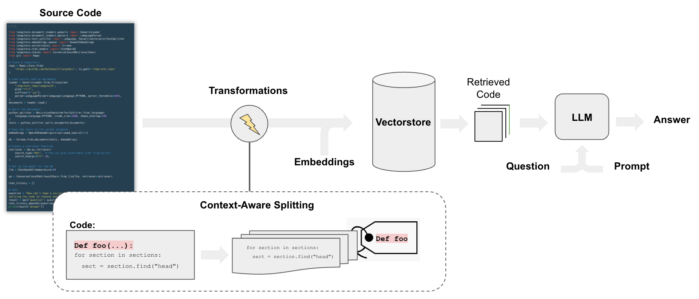

[](https://colab.research.google.com/github/langchain-ai/langchain/blob/master/docs/docs/use_cases/code_understanding.ipynb)

## Caso de uso

El análisis de código fuente es una de las aplicaciones más populares de los LLM (p. ej., [GitHub Copilot](https://github.com/features/copilot), [Code Interpreter](https://chat.openai.com/auth/login?next=%2F%3Fmodel%3Dgpt-4-code-interpreter), [Codium](https://www.codium.ai/) y [Codeium](https://codeium.com/about))) para casos de uso como:

- Preguntas y respuestas sobre la base de código para entender cómo funciona
- Uso de LLM para sugerir refactorizaciones o mejoras
- Uso de LLM para documentar el código



## Resumen

La canalización para preguntas y respuestas sobre el código sigue [los pasos que hacemos para la respuesta a preguntas sobre documentos](/docs/use_cases/question_answering), con algunas diferencias:

En particular, podemos emplear una [estrategia de división](/docs/integrations/document_loaders/source_code) que hace algunas cosas:

* Mantiene cada función y clase de nivel superior en el código cargado en documentos separados.
* Coloca el resto en un documento separado.
* Conserva los metadatos sobre el origen de cada división

## Inicio rápido

```python
%pip install --upgrade --quiet langchain-openai tiktoken langchain-chroma langchain GitPython

# Set env var OPENAI_API_KEY or load from a .env file
# import dotenv

# dotenv.load_dotenv()
```

Seguiremos la estructura de [este cuaderno](https://github.com/cristobalcl/LearningLangChain/blob/master/notebooks/04%20-%20QA%20with%20code.md) y emplearemos [división de código consciente del contexto](/docs/integrations/document_loaders/source_code).

### Carga

Cargaremos todos los archivos del proyecto de Python usando el `langchain_community.document_loaders.TextLoader`.

El siguiente script itera sobre los archivos del repositorio de LangChain y carga cada archivo `.py` (es decir, **documentos**):

```python
from git import Repo
from langchain_community.document_loaders.generic import GenericLoader
from langchain_community.document_loaders.parsers import LanguageParser
from langchain_text_splitters import Language
```

```python
# Clone
repo_path = "/Users/jacoblee/Desktop/test_repo"
repo = Repo.clone_from("https://github.com/langchain-ai/langchain", to_path=repo_path)
```

Cargamos el código de Python usando [`LanguageParser`](/docs/integrations/document_loaders/source_code), que:

* Mantendrá las funciones y clases de nivel superior juntas (en un solo documento)
* Colocará el código restante en un documento separado
* Conservará los metadatos sobre el origen de cada división

```python
# Load
loader = GenericLoader.from_filesystem(
    repo_path + "/libs/core/langchain_core",
    glob="**/*",
    suffixes=[".py"],
    exclude=["**/non-utf8-encoding.py"],
    parser=LanguageParser(language=Language.PYTHON, parser_threshold=500),
)
documents = loader.load()
len(documents)
```

```output
295
```

### División

Divide el `Documento` en fragmentos para su incrustación y almacenamiento vectorial.

Podemos usar `RecursiveCharacterTextSplitter` con `language` especificado.

```python
from langchain_text_splitters import RecursiveCharacterTextSplitter

python_splitter = RecursiveCharacterTextSplitter.from_language(
    language=Language.PYTHON, chunk_size=2000, chunk_overlap=200
)
texts = python_splitter.split_documents(documents)
len(texts)
```

```output
898
```

### RetrievalQA

Necesitamos almacenar los documentos de una manera que podamos buscar semánticamente su contenido.

El enfoque más común es incrustar el contenido de cada documento y luego almacenar la incrustación y el documento en un almacén vectorial.

Al configurar el recuperador del almacén vectorial:

* Probamos la [relevancia marginal máxima](/docs/use_cases/question_answering) para la recuperación
* Y se devuelven 8 documentos

#### Profundizar

- Explore las > 40 integraciones de vectorstores [aquí](https://integrations.langchain.com/).
- Consulte más documentación sobre vectorstores [aquí](/docs/modules/data_connection/vectorstores/).
- Explore las > 30 integraciones de modelos de incrustación de texto [aquí](https://integrations.langchain.com/).
- Consulte más documentación sobre modelos de incrustación [aquí](/docs/modules/data_connection/text_embedding/).

```python
from langchain_chroma import Chroma
from langchain_openai import OpenAIEmbeddings

db = Chroma.from_documents(texts, OpenAIEmbeddings(disallowed_special=()))
retriever = db.as_retriever(
    search_type="mmr",  # Also test "similarity"
    search_kwargs={"k": 8},
)
```

### Chat

Prueba el chat, tal como lo hacemos para [chatbots](/docs/use_cases/chatbots).

#### Profundizar

- Explore las > 55 integraciones de LLM y modelos de chat [aquí](https://integrations.langchain.com/).
- Consulte más documentación sobre LLM y modelos de chat [aquí](/docs/modules/model_io/).
- Usa LLM locales: La popularidad de [PrivateGPT](https://github.com/imartinez/privateGPT) y [GPT4All](https://github.com/nomic-ai/gpt4all) subraya la importancia de ejecutar LLM localmente.

```python
from langchain.chains import create_history_aware_retriever, create_retrieval_chain
from langchain.chains.combine_documents import create_stuff_documents_chain
from langchain_core.prompts import ChatPromptTemplate
from langchain_openai import ChatOpenAI

llm = ChatOpenAI(model="gpt-4")

# First we need a prompt that we can pass into an LLM to generate this search query

prompt = ChatPromptTemplate.from_messages(
    [
        ("placeholder", "{chat_history}"),
        ("user", "{input}"),
        (
            "user",
            "Given the above conversation, generate a search query to look up to get information relevant to the conversation",
        ),
    ]
)

retriever_chain = create_history_aware_retriever(llm, retriever, prompt)

prompt = ChatPromptTemplate.from_messages(
    [
        (
            "system",
            "Answer the user's questions based on the below context:\n\n{context}",
        ),
        ("placeholder", "{chat_history}"),
        ("user", "{input}"),
    ]
)
document_chain = create_stuff_documents_chain(llm, prompt)

qa = create_retrieval_chain(retriever_chain, document_chain)
```

```python
question = "What is a RunnableBinding?"
result = qa.invoke({"input": question})
result["answer"]
```

```output
'A RunnableBinding is a class in the LangChain library that is used to bind arguments to a Runnable. This is useful when a runnable in a chain requires an argument that is not in the output of the previous runnable or included in the user input. It returns a new Runnable with the bound arguments and configuration. The bind method in the RunnableBinding class is used to perform this operation.'
```

```python
questions = [
    "What classes are derived from the Runnable class?",
    "What one improvement do you propose in code in relation to the class hierarchy for the Runnable class?",
]

for question in questions:
    result = qa.invoke({"input": question})
    print(f"-> **Question**: {question} \n")
    print(f"**Answer**: {result['answer']} \n")
```

```output
-> **Question**: What classes are derived from the Runnable class?

**Answer**: The classes derived from the `Runnable` class as mentioned in the context are: `RunnableLambda`, `RunnableLearnable`, `RunnableSerializable`, `RunnableWithFallbacks`.

-> **Question**: What one improvement do you propose in code in relation to the class hierarchy for the Runnable class?

**Answer**: One potential improvement could be the introduction of abstract base classes (ABCs) or interfaces for different types of Runnable classes. Currently, it seems like there are lots of different Runnable types, like RunnableLambda, RunnableParallel, etc., each with their own methods and attributes. By defining a common interface or ABC for all these classes, we can ensure consistency and better organize the codebase. It would also make it easier to add new types of Runnable classes in the future, as they would just need to implement the methods defined in the interface or ABC.
```

Luego podemos mirar el [rastro de LangSmith](https://smith.langchain.com/public/616f6620-f49f-46c7-8f4b-dae847705c5d/r) para ver qué está sucediendo debajo del capó:

* En particular, el código bien estructurado y mantenido unido en la salida de recuperación
* El código recuperado y el historial de chat se pasan al LLM para la destilación de respuestas


### LLM de código abierto

Usaremos la [integración de Ollama](https://ollama.com/) de LangChain para consultar un modelo local de OSS.

Echa un vistazo a los últimos modelos disponibles [aquí](https://ollama.com/library).

```python
%pip install --upgrade --quiet langchain-community
```

```python
from langchain_community.chat_models.ollama import ChatOllama

llm = ChatOllama(model="codellama")
```

Ejecutémoslo con una pregunta de codificación genérica para probar su conocimiento:

```python
response_message = llm.invoke(
    "In bash, how do I list all the text files in the current directory that have been modified in the last month?"
)

print(response_message.content)
print(response_message.response_metadata)
```

```output

You can use the `find` command with the `-mtime` option to find all the text files in the current directory that have been modified in the last month. Here's an example command:
\```bash
find . -type f -name "*.txt" -mtime -30
\```

This will list all the text files in the current directory (`.`) that have been modified in the last 30 days. The `-type f` option ensures that only regular files are matched, and not directories or other types of files. The `-name "*.txt"` option restricts the search to files with a `.txt` extension. Finally, the `-mtime -30` option specifies that we want to find files that have been modified in the last 30 days.

You can also use `find` command with `-mmin` option to find all the text files in the current directory that have been modified within the last month. Here's an example command:

\```bash
find . -type f -name "*.txt" -mmin -4320
\```

This will list all the text files in the current directory (`.`) that have been modified within the last 30 days. The `-type f` option ensures that only regular files are matched, and not directories or other types of files. The `-name "*.txt"` option restricts the search to files with a `.txt` extension. Finally, the `-mmin -4320` option specifies that we want to find files that have been modified within the last 4320 minutes (which is equivalent to one month).

You can also use `ls` command with `-l` option and pipe it to `grep` command to filter out the text files. Here's an example command:

\```bash
ls -l | grep "*.txt"
\```

This will list all the text files in the current directory (`.`) that have been modified within the last 30 days. The `-l` option of `ls` command lists the files in a long format, including the modification time, and the `grep` command filters out the files that do not match the specified pattern.

Please note that these commands are case-sensitive, so if you have any files with different extensions (e.g., `.TXT`), they will not be matched by these commands.
{'model': 'codellama', 'created_at': '2024-04-03T00:41:44.014203Z', 'message': {'role': 'assistant', 'content': ''}, 'done': True, 'total_duration': 27078466916, 'load_duration': 12947208, 'prompt_eval_count': 44, 'prompt_eval_duration': 11497468000, 'eval_count': 510, 'eval_duration': 15548191000}

```

¡Parece razonable! Ahora configurémoslo con nuestro almacén vectorial cargado anteriormente.

Omitimos el aspecto conversacional para mantener las cosas más manejables para el modelo local de menor potencia:

```python
# from langchain.chains.question_answering import load_qa_chain

# # Prompt
# template = """Use the following pieces of context to answer the question at the end.
# If you don't know the answer, just say that you don't know, don't try to make up an answer.
# Use three sentences maximum and keep the answer as concise as possible.
# {context}
# Question: {question}
# Helpful Answer:"""
# QA_CHAIN_PROMPT = PromptTemplate(
#     input_variables=["context", "question"],
#     template=template,
# )

system_template = """
Answer the user's questions based on the below context.
If you don't know the answer, just say that you don't know, don't try to make up an answer.
Use three sentences maximum and keep the answer as concise as possible:

{context}
"""

# First we need a prompt that we can pass into an LLM to generate this search query
prompt = ChatPromptTemplate.from_messages(
    [
        ("system", system_template),
        ("user", "{input}"),
    ]
)
document_chain = create_stuff_documents_chain(llm, prompt)

qa_chain = create_retrieval_chain(retriever, document_chain)
```

```python
# Run, only returning the value under the answer key for readability
qa_chain.pick("answer").invoke({"input": "What is a RunnableBinding?"})
```

```output
"A RunnableBinding is a high-level class in the LangChain framework. It's an abstraction layer that sits between a program and an LLM or other data source.\n\nThe main goal of a RunnableBinding is to enable a program, which may be a chat bot or a backend service, to fetch responses from an LLM or other data sources in a way that is easy for both the program and the data sources to use. This is achieved through a set of predefined protocols that are implemented by the RunnableBinding.\n\nThe protocols defined by a RunnableBinding include:\n\n1. Fetching inputs from the program. The RunnableBinding should be able to receive inputs from the program and translate them into a format that can be processed by the LLM or other data sources.\n2. Translating outputs from the LLM or other data sources into something that can be returned to the program. This includes converting the raw output of an LLM into something that is easier for the program to process, such as text or a structured object.\n3. Handling errors that may arise during the fetching, processing, and returning of responses from the LLM or other data sources. The RunnableBinding should be able to catch exceptions and errors that occur during these operations and return a suitable error message or response to the program.\n4. Managing concurrency and parallelism in the communication with the LLM or other data sources. This may include things like allowing multiple requests to be sent to the LLM or other data sources simultaneously, handling the responses asynchronously, and retrying failed requests.\n5. Providing a way for the program to set configuration options that affect how the RunnableBinding interacts with the LLM or other data sources. This could include things like setting up credentials, providing additional contextual information to the LLM or other data sources, and controlling logging or error handling behavior.\n\nIn summary, a RunnableBinding provides a way for a program to easily communicate with an LLM or other data sources without having to know about the details of how they work. By providing a consistent interface between the program and the data sources, the RunnableBinding enables more robust and scalable communication protocols that are easier for both parties to use.\n\nIn the context of the chatbot tutorial, a RunnableBinding may be used to fetch responses from an LLM and return them as output for the bot to process. The RunnableBinding could also be used to handle errors that occur during this process, such as providing error messages or retrying failed requests to the LLM.\n\nTo summarize:\n\n* A RunnableBinding provides a way for a program to communicate with an LLM or other data sources without having to know about the details of how they work.\n* It enables more robust and scalable communication protocols that are easier for both parties to use.\n* It manages concurrency and parallelism in the communication with the LLM or other data sources.\n* It provides a way for the program to set configuration options that affect how the RunnableBinding interacts with the LLM or other data sources."
```

No es perfecto, pero captó el hecho de que permite al desarrollador establecer la opción de configuración.

Aquí está el [rastro de LangSmith](https://smith.langchain.com/public/d8bb2af8-99cd-406b-a870-f255f4a2423c/r) que muestra los documentos recuperados utilizados como contexto.
