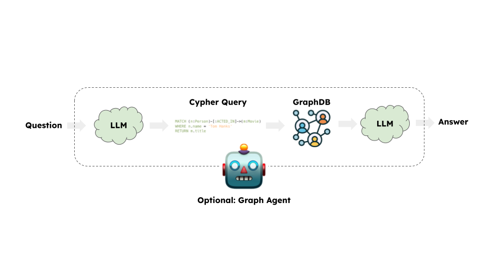

# Inicio rápido

En esta guía repasaremos las formas básicas de crear una cadena de preguntas y respuestas sobre una base de datos de gráficos. Estos sistemas nos permitirán hacer una pregunta sobre los datos de una base de datos de gráficos y obtener una respuesta en lenguaje natural.

## ⚠️ Nota de seguridad ⚠️

La construcción de sistemas de preguntas y respuestas de bases de datos de gráficos requiere la ejecución de consultas de gráficos generadas por modelos. Hay riesgos inherentes en hacer esto. Asegúrese de que los permisos de conexión a la base de datos siempre estén delimitados lo más estrechamente posible para las necesidades de su cadena/agente. Esto mitigará, aunque no eliminará, los riesgos de construir un sistema impulsado por modelos. Para obtener más información sobre las mejores prácticas de seguridad en general, [consulte aquí](/docs/security).

## Arquitectura

A un nivel alto, los pasos de la mayoría de las cadenas de gráficos son:

1. **Convertir la pregunta en una consulta de base de datos de gráficos**: El modelo convierte la entrada del usuario en una consulta de base de datos de gráficos (por ejemplo, Cypher).
2. **Ejecutar la consulta de la base de datos de gráficos**: Ejecutar la consulta de la base de datos de gráficos.
3. **Responder a la pregunta**: El modelo responde a la entrada del usuario utilizando los resultados de la consulta.



## Configuración

Primero, obtén los paquetes necesarios y establece las variables de entorno.
En este ejemplo, usaremos la base de datos de gráficos Neo4j.

```python
%pip install --upgrade --quiet  langchain langchain-community langchain-openai neo4j
```

Utilizamos modelos de OpenAI de forma predeterminada en esta guía.

```python
import getpass
import os

os.environ["OPENAI_API_KEY"] = getpass.getpass()

# Uncomment the below to use LangSmith. Not required.
# os.environ["LANGCHAIN_API_KEY"] = getpass.getpass()
# os.environ["LANGCHAIN_TRACING_V2"] = "true"
```

```output
 ········
```

A continuación, necesitamos definir las credenciales de Neo4j.
Siga [estos pasos de instalación](https://neo4j.com/docs/operations-manual/current/installation/) para configurar una base de datos Neo4j.

```python
os.environ["NEO4J_URI"] = "bolt://localhost:7687"
os.environ["NEO4J_USERNAME"] = "neo4j"
os.environ["NEO4J_PASSWORD"] = "password"
```

El siguiente ejemplo creará una conexión con una base de datos Neo4j y la poblará con datos de ejemplo sobre películas y sus actores.

```python
from langchain_community.graphs import Neo4jGraph

graph = Neo4jGraph()

# Import movie information

movies_query = """
LOAD CSV WITH HEADERS FROM
'https://raw.githubusercontent.com/tomasonjo/blog-datasets/main/movies/movies_small.csv'
AS row
MERGE (m:Movie {id:row.movieId})
SET m.released = date(row.released),
    m.title = row.title,
    m.imdbRating = toFloat(row.imdbRating)
FOREACH (director in split(row.director, '|') |
    MERGE (p:Person {name:trim(director)})
    MERGE (p)-[:DIRECTED]->(m))
FOREACH (actor in split(row.actors, '|') |
    MERGE (p:Person {name:trim(actor)})
    MERGE (p)-[:ACTED_IN]->(m))
FOREACH (genre in split(row.genres, '|') |
    MERGE (g:Genre {name:trim(genre)})
    MERGE (m)-[:IN_GENRE]->(g))
"""

graph.query(movies_query)
```

```output
[]
```

## Esquema de gráficos

Para que un LLM pueda generar una instrucción Cypher, necesita información sobre el esquema del gráfico. Cuando se instancia un objeto de gráfico, recupera la información sobre el esquema del gráfico. Si posteriormente realiza cambios en el gráfico, puede ejecutar el método `refresh_schema` para actualizar la información del esquema.

```python
graph.refresh_schema()
print(graph.schema)
```

```output
Node properties are the following:
Movie {imdbRating: FLOAT, id: STRING, released: DATE, title: STRING},Person {name: STRING},Genre {name: STRING},Chunk {id: STRING, question: STRING, query: STRING, text: STRING, embedding: LIST}
Relationship properties are the following:

The relationships are the following:
(:Movie)-[:IN_GENRE]->(:Genre),(:Person)-[:DIRECTED]->(:Movie),(:Person)-[:ACTED_IN]->(:Movie)
```

¡Genial! Tenemos una base de datos de gráficos que podemos consultar. Ahora vamos a conectarla a un LLM.

## Cadena

Usemos una cadena simple que tome una pregunta, la convierta en una consulta Cypher, ejecute la consulta y use el resultado para responder a la pregunta original.


LangChain viene con una cadena integrada para este flujo de trabajo que está diseñada para funcionar con Neo4j: [GraphCypherQAChain](/docs/integrations/graphs/neo4j_cypher)

```python
from langchain.chains import GraphCypherQAChain
from langchain_openai import ChatOpenAI

llm = ChatOpenAI(model="gpt-3.5-turbo", temperature=0)
chain = GraphCypherQAChain.from_llm(graph=graph, llm=llm, verbose=True)
response = chain.invoke({"query": "What was the cast of the Casino?"})
response
```

```output


> Entering new GraphCypherQAChain chain...
Generated Cypher:
MATCH (:Movie {title: "Casino"})<-[:ACTED_IN]-(actor:Person)
RETURN actor.name
Full Context:
[{'actor.name': 'Joe Pesci'}, {'actor.name': 'Robert De Niro'}, {'actor.name': 'Sharon Stone'}, {'actor.name': 'James Woods'}]

> Finished chain.
```

```output
{'query': 'What was the cast of the Casino?',
 'result': 'The cast of Casino included Joe Pesci, Robert De Niro, Sharon Stone, and James Woods.'}
```

# Validación de la dirección de la relación

Los LLM pueden tener problemas con las direcciones de las relaciones en las instrucciones Cypher generadas. Dado que el esquema del gráfico está predefinido, podemos validar y, opcionalmente, corregir las direcciones de las relaciones en las instrucciones Cypher generadas utilizando el parámetro `validate_cypher`.

```python
chain = GraphCypherQAChain.from_llm(
    graph=graph, llm=llm, verbose=True, validate_cypher=True
)
response = chain.invoke({"query": "What was the cast of the Casino?"})
response
```

```output


> Entering new GraphCypherQAChain chain...
Generated Cypher:
MATCH (:Movie {title: "Casino"})<-[:ACTED_IN]-(actor:Person)
RETURN actor.name
Full Context:
[{'actor.name': 'Joe Pesci'}, {'actor.name': 'Robert De Niro'}, {'actor.name': 'Sharon Stone'}, {'actor.name': 'James Woods'}]

> Finished chain.
```

```output
{'query': 'What was the cast of the Casino?',
 'result': 'The cast of Casino included Joe Pesci, Robert De Niro, Sharon Stone, and James Woods.'}
```

### Próximos pasos

Para una generación de consultas más compleja, es posible que queramos crear prompts de pocos disparos o agregar pasos de verificación de consultas. Para técnicas avanzadas como esta y más, consulte:

* [Estrategias de prompting](/docs/use_cases/graph/prompting): Técnicas avanzadas de ingeniería de prompts.
* [Asignación de valores](/docs/use_cases/graph/mapping): Técnicas para asignar valores de preguntas a la base de datos.
* [Capa semántica](/docs/use_cases/graph/semantic): Técnicas para implementar capas semánticas.
* [Construcción de gráficos](/docs/use_cases/graph/constructing): Técnicas para construir gráficos de conocimiento.
