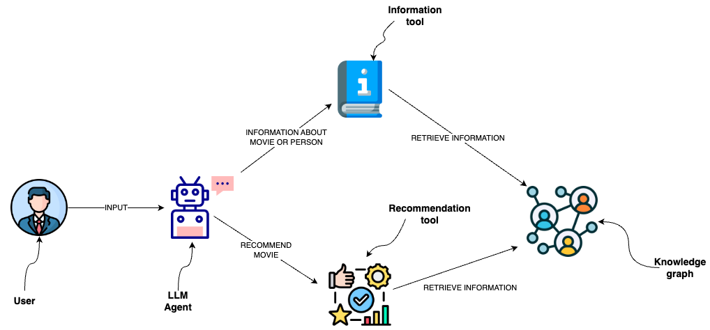

# Capa semántica sobre la base de datos de gráficos

Puede usar consultas de base de datos para recuperar información de una base de datos de gráficos como Neo4j.
Una opción es usar LLM para generar instrucciones Cypher.
Si bien esa opción proporciona una excelente flexibilidad, la solución podría ser frágil y no generar de manera consistente instrucciones Cypher precisas.
En lugar de generar instrucciones Cypher, podemos implementar plantillas Cypher como herramientas en una capa semántica con la que un agente LLM pueda interactuar.



## Configuración

Primero, obtén los paquetes necesarios y establece las variables de entorno:

```python
%pip install --upgrade --quiet  langchain langchain-community langchain-openai neo4j
```

```output
Note: you may need to restart the kernel to use updated packages.
```

Nos basamos en los modelos de OpenAI en esta guía, pero puedes intercambiarlos por el proveedor de modelos de tu elección.

```python
import getpass
import os

os.environ["OPENAI_API_KEY"] = getpass.getpass()

# Uncomment the below to use LangSmith. Not required.
# os.environ["LANGCHAIN_API_KEY"] = getpass.getpass()
# os.environ["LANGCHAIN_TRACING_V2"] = "true"
```

```output
 ········
```

A continuación, debemos definir las credenciales de Neo4j.
Sigue [estos pasos de instalación](https://neo4j.com/docs/operations-manual/current/installation/) para configurar una base de datos Neo4j.

```python
os.environ["NEO4J_URI"] = "bolt://localhost:7687"
os.environ["NEO4J_USERNAME"] = "neo4j"
os.environ["NEO4J_PASSWORD"] = "password"
```

El siguiente ejemplo creará una conexión con una base de datos Neo4j y la poblará con datos de ejemplo sobre películas y sus actores.

```python
from langchain_community.graphs import Neo4jGraph

graph = Neo4jGraph()

# Import movie information

movies_query = """
LOAD CSV WITH HEADERS FROM
'https://raw.githubusercontent.com/tomasonjo/blog-datasets/main/movies/movies_small.csv'
AS row
MERGE (m:Movie {id:row.movieId})
SET m.released = date(row.released),
    m.title = row.title,
    m.imdbRating = toFloat(row.imdbRating)
FOREACH (director in split(row.director, '|') |
    MERGE (p:Person {name:trim(director)})
    MERGE (p)-[:DIRECTED]->(m))
FOREACH (actor in split(row.actors, '|') |
    MERGE (p:Person {name:trim(actor)})
    MERGE (p)-[:ACTED_IN]->(m))
FOREACH (genre in split(row.genres, '|') |
    MERGE (g:Genre {name:trim(genre)})
    MERGE (m)-[:IN_GENRE]->(g))
"""

graph.query(movies_query)
```

```output
[]
```

## Herramientas personalizadas con plantillas Cypher

Una capa semántica consta de varias herramientas expuestas a un LLM que puede usar para interactuar con un grafo de conocimiento.
Pueden ser de diversa complejidad. Puedes pensar en cada herramienta en una capa semántica como una función.

La función que implementaremos es para recuperar información sobre películas o su elenco.

```python
from typing import Optional, Type

from langchain.callbacks.manager import (
    AsyncCallbackManagerForToolRun,
    CallbackManagerForToolRun,
)

# Import things that are needed generically
from langchain.pydantic_v1 import BaseModel, Field
from langchain.tools import BaseTool

description_query = """
MATCH (m:Movie|Person)
WHERE m.title CONTAINS $candidate OR m.name CONTAINS $candidate
MATCH (m)-[r:ACTED_IN|HAS_GENRE]-(t)
WITH m, type(r) as type, collect(coalesce(t.name, t.title)) as names
WITH m, type+": "+reduce(s="", n IN names | s + n + ", ") as types
WITH m, collect(types) as contexts
WITH m, "type:" + labels(m)[0] + "\ntitle: "+ coalesce(m.title, m.name)
       + "\nyear: "+coalesce(m.released,"") +"\n" +
       reduce(s="", c in contexts | s + substring(c, 0, size(c)-2) +"\n") as context
RETURN context LIMIT 1
"""


def get_information(entity: str) -> str:
    try:
        data = graph.query(description_query, params={"candidate": entity})
        return data[0]["context"]
    except IndexError:
        return "No information was found"
```

Puedes observar que hemos definido la instrucción Cypher utilizada para recuperar la información.
Por lo tanto, podemos evitar generar instrucciones Cypher y usar el agente LLM solo para rellenar los parámetros de entrada.
Para proporcionar información adicional a un agente LLM sobre cuándo usar la herramienta y sus parámetros de entrada, envolvemos la función como una herramienta.

```python
from typing import Optional, Type

from langchain.callbacks.manager import (
    AsyncCallbackManagerForToolRun,
    CallbackManagerForToolRun,
)

# Import things that are needed generically
from langchain.pydantic_v1 import BaseModel, Field
from langchain.tools import BaseTool


class InformationInput(BaseModel):
    entity: str = Field(description="movie or a person mentioned in the question")


class InformationTool(BaseTool):
    name = "Information"
    description = (
        "useful for when you need to answer questions about various actors or movies"
    )
    args_schema: Type[BaseModel] = InformationInput

    def _run(
        self,
        entity: str,
        run_manager: Optional[CallbackManagerForToolRun] = None,
    ) -> str:
        """Use the tool."""
        return get_information(entity)

    async def _arun(
        self,
        entity: str,
        run_manager: Optional[AsyncCallbackManagerForToolRun] = None,
    ) -> str:
        """Use the tool asynchronously."""
        return get_information(entity)
```

## Agente OpenAI

El lenguaje de expresión LangChain facilita mucho la definición de un agente para interactuar con una base de datos de gráficos a través de la capa semántica.

```python
from typing import List, Tuple

from langchain.agents import AgentExecutor
from langchain.agents.format_scratchpad import format_to_openai_function_messages
from langchain.agents.output_parsers import OpenAIFunctionsAgentOutputParser
from langchain_core.messages import AIMessage, HumanMessage
from langchain_core.prompts import ChatPromptTemplate, MessagesPlaceholder
from langchain_core.utils.function_calling import convert_to_openai_function
from langchain_openai import ChatOpenAI

llm = ChatOpenAI(model="gpt-3.5-turbo", temperature=0)
tools = [InformationTool()]

llm_with_tools = llm.bind(functions=[convert_to_openai_function(t) for t in tools])

prompt = ChatPromptTemplate.from_messages(
    [
        (
            "system",
            "You are a helpful assistant that finds information about movies "
            " and recommends them. If tools require follow up questions, "
            "make sure to ask the user for clarification. Make sure to include any "
            "available options that need to be clarified in the follow up questions "
            "Do only the things the user specifically requested. ",
        ),
        MessagesPlaceholder(variable_name="chat_history"),
        ("user", "{input}"),
        MessagesPlaceholder(variable_name="agent_scratchpad"),
    ]
)


def _format_chat_history(chat_history: List[Tuple[str, str]]):
    buffer = []
    for human, ai in chat_history:
        buffer.append(HumanMessage(content=human))
        buffer.append(AIMessage(content=ai))
    return buffer


agent = (
    {
        "input": lambda x: x["input"],
        "chat_history": lambda x: _format_chat_history(x["chat_history"])
        if x.get("chat_history")
        else [],
        "agent_scratchpad": lambda x: format_to_openai_function_messages(
            x["intermediate_steps"]
        ),
    }
    | prompt
    | llm_with_tools
    | OpenAIFunctionsAgentOutputParser()
)

agent_executor = AgentExecutor(agent=agent, tools=tools, verbose=True)
```

```python
agent_executor.invoke({"input": "Who played in Casino?"})
```

```output


> Entering new AgentExecutor chain...

Invoking: `Information` with `{'entity': 'Casino'}`


type:Movie
title: Casino
year: 1995-11-22
ACTED_IN: Joe Pesci, Robert De Niro, Sharon Stone, James Woods
The movie "Casino" starred Joe Pesci, Robert De Niro, Sharon Stone, and James Woods.

> Finished chain.
```

```output
{'input': 'Who played in Casino?',
 'output': 'The movie "Casino" starred Joe Pesci, Robert De Niro, Sharon Stone, and James Woods.'}
```
