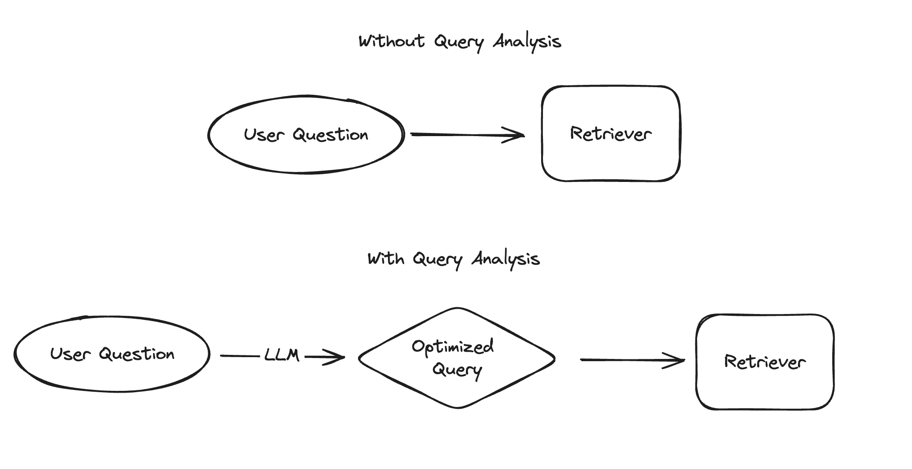

# Análisis de consultas

"Búsqueda" impulsa muchos casos de uso, incluida la parte de "recuperación" de la Generación Aumentada por Recuperación. La forma más sencilla de hacer esto implica pasar la pregunta del usuario directamente a un recuperador. Para mejorar el rendimiento, también puede "optimizar" la consulta de alguna manera usando *análisis de consultas*. Tradicionalmente, esto se ha hecho mediante técnicas basadas en reglas, pero con el auge de los LLM, se está volviendo más popular y más factible usar un LLM para esto. Específicamente, esto implica pasar la pregunta sin procesar (o lista de mensajes) a un LLM y devolver una o más consultas optimizadas, que típicamente contienen una cadena y opcionalmente otra información estructurada.

## Problemas resueltos

El análisis de consultas ayuda a optimizar la consulta de búsqueda que se enviará al recuperador. Esto puede ser el caso cuando:

* El recuperador admite búsquedas y filtros en campos específicos de los datos, y la entrada del usuario podría estar haciendo referencia a cualquiera de estos campos.
* La entrada del usuario contiene varias preguntas distintas.
* Para recuperar información relevante, se necesitan varias consultas.
* La calidad de la búsqueda es sensible a la redacción.
* Hay varios recuperadores que se podrían buscar, y la entrada del usuario podría estar haciendo referencia a cualquiera de ellos.

Tenga en cuenta que diferentes problemas requerirán diferentes soluciones. Para determinar qué técnica de análisis de consultas debe usar, querrá entender exactamente cuál es el problema con su sistema de recuperación actual. Esto se hace mejor mirando los puntos de falla de datos de su aplicación actual e identificando temas comunes. Solo una vez que sepa cuáles son sus problemas, podrá comenzar a resolverlos.

## Inicio rápido

Dirígete al [inicio rápido](/docs/use_cases/query_analysis/quickstart) para ver cómo usar el análisis de consultas en un ejemplo básico de principio a fin. Esto cubrirá la creación de un motor de búsqueda sobre el contenido de los videos de LangChain YouTube, mostrando un modo de falla que ocurre al pasar una pregunta de usuario sin procesar a ese índice, y luego un ejemplo de cómo el análisis de consultas puede ayudar a abordar ese problema. El inicio rápido se centra en la **estructuración de consultas**. A continuación se muestran técnicas adicionales de análisis de consultas que pueden ser relevantes según sus datos y caso de uso.

## Técnicas

Hay varias técnicas que admitimos para pasar de una pregunta sin procesar o una lista de mensajes a una consulta más optimizada. Estos incluyen:

* [Descomposición de consultas](/docs/use_cases/query_analysis/techniques/decomposition): Si una entrada de usuario contiene varias preguntas distintas, podemos descomponer la entrada en consultas separadas que se ejecutarán de forma independiente.
* [Expansión de consultas](/docs/use_cases/query_analysis/techniques/expansion): Si un índice es sensible a la redacción de la consulta, podemos generar múltiples versiones parafraseadas de la pregunta del usuario para aumentar nuestras posibilidades de recuperar un resultado relevante.
* [Incrustación de documentos hipotéticos (HyDE)](/docs/use_cases/query_analysis/techniques/hyde): Si trabajamos con un índice basado en búsqueda de similitud, como un almacén de vectores, entonces buscar en preguntas sin procesar puede no funcionar bien porque sus incrustaciones pueden no ser muy similares a las de los documentos relevantes. En su lugar, puede ayudar que el modelo genere un documento relevante hipotético y luego use eso para realizar una búsqueda de similitud.
* [Enrutamiento de consultas](/docs/use_cases/query_analysis/techniques/routing): Si tenemos múltiples índices y solo un subconjunto es útil para cualquier entrada de usuario dada, podemos enrutar la entrada para recuperar resultados solo de los relevantes.
* [Solicitud de paso atrás](/docs/use_cases/query_analysis/techniques/step_back): A veces, la calidad de la búsqueda y las generaciones de modelos pueden verse obstaculizadas por los detalles de una pregunta. Una forma de manejar esto es generar primero una pregunta más abstracta y "dar un paso atrás", y consultar en función de la pregunta original y la de paso atrás.
* [Estructuración de consultas](/docs/use_cases/query_analysis/techniques/structuring): Si nuestros documentos tienen varios atributos que se pueden buscar/filtrar, podemos inferir a partir de cualquier pregunta de usuario sin procesar qué atributos específicos se deben buscar/filtrar. Por ejemplo, cuando una entrada de usuario especifica algo sobre la fecha de publicación de un video, eso debería convertirse en un filtro en el atributo `publish_date` de cada documento.

## Cómo

* [Agregar ejemplos al mensaje](/docs/use_cases/query_analysis/how_to/few_shot): A medida que nuestro análisis de consultas se vuelve más complejo, agregar ejemplos al mensaje puede mejorar significativamente el rendimiento.
* [Lidiar con categorías de alta cardinalidad](/docs/use_cases/query_analysis/how_to/high_cardinality): Muchas de las consultas estructuradas que creará involucrarán variables categóricas. Cuando hay muchos valores potenciales, puede ser difícil hacer esto correctamente.
* [Construir filtros](/docs/use_cases/query_analysis/how_to/constructing-filters): Esta guía cubre cómo pasar de un modelo Pydantic a filtros en el lenguaje de consulta específico del almacén de vectores con el que está trabajando.
* [Manejar múltiples consultas](/docs/use_cases/query_analysis/how_to/multiple_queries): Algunas técnicas de análisis de consultas generan varias consultas. Esta guía maneja cómo pasarlas todas al recuperador.
* [Manejar sin consultas](/docs/use_cases/query_analysis/how_to/no_queries): Algunas técnicas de análisis de consultas pueden no generar una consulta en absoluto. Esta guía maneja cómo manejar esas situaciones de manera elegante.
* [Manejar múltiples recuperadores](/docs/use_cases/query_analysis/how_to/multiple_retrievers): Algunas técnicas de análisis de consultas implican el enrutamiento entre varios recuperadores. Esta guía cubre cómo manejar eso de manera elegante.
