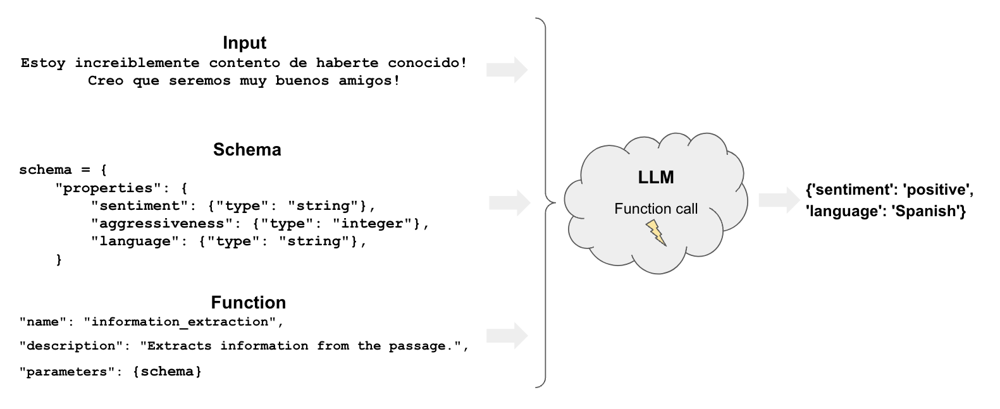

[](https://colab.research.google.com/github/langchain-ai/langchain/blob/master/docs/docs/use_cases/tagging.ipynb)

## Caso de uso

Etiquetar significa etiquetar un documento con clases como:

- sentimiento
- idioma
- estilo (formal, informal, etc.)
- temas cubiertos
- tendencia política



## Resumen

El etiquetado tiene varios componentes:

* `function`: Al igual que [extracción](/docs/use_cases/extraction), el etiquetado utiliza [funciones](https://openai.com/blog/function-calling-and-other-api-updates) para especificar cómo el modelo debe etiquetar un documento
* `schema`: define cómo queremos etiquetar el documento

## Inicio rápido

Veamos un ejemplo muy sencillo de cómo podemos usar la herramienta de llamada de OpenAI para el etiquetado en LangChain. Utilizaremos el método [`with_structured_output`](/docs/modules/model_io/chat/structured_output) compatible con los modelos de OpenAI:

```python
%pip install --upgrade --quiet langchain langchain-openai

# Set env var OPENAI_API_KEY or load from a .env file:
# import dotenv
# dotenv.load_dotenv()
```

Vamos a especificar un modelo Pydantic con algunas propiedades y su tipo esperado en nuestro esquema.

```python
from langchain_core.prompts import ChatPromptTemplate
from langchain_core.pydantic_v1 import BaseModel, Field
from langchain_openai import ChatOpenAI

tagging_prompt = ChatPromptTemplate.from_template(
    """
Extract the desired information from the following passage.

Only extract the properties mentioned in the 'Classification' function.

Passage:
{input}
"""
)


class Classification(BaseModel):
    sentiment: str = Field(description="The sentiment of the text")
    aggressiveness: int = Field(
        description="How aggressive the text is on a scale from 1 to 10"
    )
    language: str = Field(description="The language the text is written in")


# LLM
llm = ChatOpenAI(temperature=0, model="gpt-3.5-turbo-0125").with_structured_output(
    Classification
)

tagging_chain = tagging_prompt | llm
```

```python
inp = "Estoy increiblemente contento de haberte conocido! Creo que seremos muy buenos amigos!"
tagging_chain.invoke({"input": inp})
```

```output
Classification(sentiment='positive', aggressiveness=1, language='Spanish')
```

Si queremos salida JSON, solo tenemos que llamar a `.dict()`

```python
inp = "Estoy muy enojado con vos! Te voy a dar tu merecido!"
res = tagging_chain.invoke({"input": inp})
res.dict()
```

```output
{'sentiment': 'negative', 'aggressiveness': 8, 'language': 'Spanish'}
```

Como podemos ver en los ejemplos, interpreta correctamente lo que queremos.

Los resultados varían, por lo que podemos obtener, por ejemplo, sentimientos en diferentes idiomas ('positivo', 'enojado', etc.).

Veremos cómo controlar estos resultados en la siguiente sección.

## Control más preciso

Una definición de esquema cuidadosa nos da más control sobre la salida del modelo.

Específicamente, podemos definir:

- posibles valores para cada propiedad
- descripción para asegurarnos de que el modelo entiende la propiedad
- propiedades requeridas que se deben devolver

Volvamos a declarar nuestro modelo Pydantic para controlar cada uno de los aspectos mencionados anteriormente utilizando enumeraciones:

```python
class Classification(BaseModel):
    sentiment: str = Field(..., enum=["happy", "neutral", "sad"])
    aggressiveness: int = Field(
        ...,
        description="describes how aggressive the statement is, the higher the number the more aggressive",
        enum=[1, 2, 3, 4, 5],
    )
    language: str = Field(
        ..., enum=["spanish", "english", "french", "german", "italian"]
    )
```

```python
tagging_prompt = ChatPromptTemplate.from_template(
    """
Extract the desired information from the following passage.

Only extract the properties mentioned in the 'Classification' function.

Passage:
{input}
"""
)

llm = ChatOpenAI(temperature=0, model="gpt-3.5-turbo-0125").with_structured_output(
    Classification
)

chain = tagging_prompt | llm
```

¡Ahora las respuestas estarán restringidas de la manera que esperamos!

```python
inp = "Estoy increiblemente contento de haberte conocido! Creo que seremos muy buenos amigos!"
chain.invoke({"input": inp})
```

```output
Classification(sentiment='happy', aggressiveness=1, language='spanish')
```

```python
inp = "Estoy muy enojado con vos! Te voy a dar tu merecido!"
chain.invoke({"input": inp})
```

```output
Classification(sentiment='sad', aggressiveness=5, language='spanish')
```

```python
inp = "Weather is ok here, I can go outside without much more than a coat"
chain.invoke({"input": inp})
```

```output
Classification(sentiment='neutral', aggressiveness=2, language='english')
```

El [rastro de LangSmith](https://smith.langchain.com/public/38294e04-33d8-4c5a-ae92-c2fe68be8332/r) nos permite mirar bajo el capó:


### Profundizando

* Puede utilizar el [transformador de etiquetas de metadatos](/docs/integrations/document_transformers/openai_metadata_tagger) para extraer metadatos de un `Documento` de LangChain.
* Esto cubre la misma funcionalidad básica que la cadena de etiquetado, solo que aplicada a un `Documento` de LangChain.
