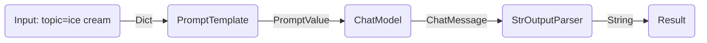
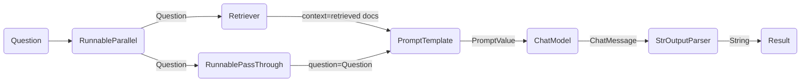

---
keywords:
- chain.invoke
sidebar_position: 0
title: Commencer
translated: true
---

LCEL facilite la construction de chaînes complexes à partir de composants de base et prend en charge des fonctionnalités intégrées telles que le streaming, le parallélisme et la journalisation.

## Exemple de base : prompt + modèle + analyseur de sortie

Le cas d'utilisation le plus basique et le plus courant consiste à enchaîner un modèle de prompt et un modèle. Pour voir comment cela fonctionne, créons une chaîne qui prend un sujet et génère une blague :

```python
%pip install --upgrade --quiet  langchain-core langchain-community langchain-openai
```

import ChatModelTabs from "@theme/ChatModelTabs";

<ChatModelTabs openaiParams={`model="gpt-4"`} />

```python
# | output: false
# | echo: false

from langchain_openai import ChatOpenAI

model = ChatOpenAI(model="gpt-4")
```

```python
from langchain_core.output_parsers import StrOutputParser
from langchain_core.prompts import ChatPromptTemplate

prompt = ChatPromptTemplate.from_template("tell me a short joke about {topic}")
output_parser = StrOutputParser()

chain = prompt | model | output_parser

chain.invoke({"topic": "ice cream"})
```

```output
"Why don't ice creams ever get invited to parties?\n\nBecause they always drip when things heat up!"
```

Remarquez cette ligne de code, où nous assemblons ces différents composants en une seule chaîne à l'aide de LCEL :

```python
chain = prompt | model | output_parser
```

Le symbole `|` est similaire à l'[opérateur de tuyau unix](https://en.wikipedia.org/wiki/Pipeline_(Unix)), qui enchaîne les différents composants, en transmettant la sortie d'un composant comme entrée au composant suivant.

Dans cette chaîne, l'entrée de l'utilisateur est transmise au modèle de prompt, puis la sortie du modèle de prompt est transmise au modèle, et enfin la sortie du modèle est transmise à l'analyseur de sortie. Examinons chaque composant individuellement pour bien comprendre ce qui se passe.

### 1. Prompt

`prompt` est un `BasePromptTemplate`, ce qui signifie qu'il prend un dictionnaire de variables de modèle et produit une `PromptValue`. Une `PromptValue` est un wrapper autour d'un prompt terminé qui peut être transmis soit à un `LLM` (qui prend une chaîne de caractères en entrée), soit à un `ChatModel` (qui prend une séquence de messages en entrée). Il peut fonctionner avec les deux types de modèles de langage car il définit une logique à la fois pour produire des `BaseMessage`s et pour produire une chaîne de caractères.

```python
prompt_value = prompt.invoke({"topic": "ice cream"})
prompt_value
```

```output
ChatPromptValue(messages=[HumanMessage(content='tell me a short joke about ice cream')])
```

```python
prompt_value.to_messages()
```

```output
[HumanMessage(content='tell me a short joke about ice cream')]
```

```python
prompt_value.to_string()
```

```output
'Human: tell me a short joke about ice cream'
```

### 2. Modèle

La `PromptValue` est ensuite transmise au `modèle`. Dans ce cas, notre `modèle` est un `ChatModel`, ce qui signifie qu'il produira un `BaseMessage`.

```python
message = model.invoke(prompt_value)
message
```

```output
AIMessage(content="Why don't ice creams ever get invited to parties?\n\nBecause they always bring a melt down!")
```

Si notre `modèle` était un `LLM`, il produirait une chaîne de caractères.

```python
from langchain_openai import OpenAI

llm = OpenAI(model="gpt-3.5-turbo-instruct")
llm.invoke(prompt_value)
```

```output
'\n\nRobot: Why did the ice cream truck break down? Because it had a meltdown!'
```

### 3. Analyseur de sortie

Enfin, nous transmettons la sortie de notre `modèle` à l'`output_parser`, qui est un `BaseOutputParser`, ce qui signifie qu'il prend soit une chaîne de caractères, soit un `BaseMessage` en entrée. Le `StrOutputParser` spécifique convertit simplement toute entrée en une chaîne de caractères.

```python
output_parser.invoke(message)
```

```output
"Why did the ice cream go to therapy? \n\nBecause it had too many toppings and couldn't find its cone-fidence!"
```

### 4. Pipeline complet

Pour suivre les étapes :

1. Nous transmettons l'entrée de l'utilisateur sur le sujet souhaité sous la forme `{"topic": "ice cream"}`.
2. Le composant `prompt` prend l'entrée de l'utilisateur, qui est ensuite utilisée pour construire une `PromptValue` après avoir utilisé le `topic` pour construire le prompt.
3. Le composant `model` prend le prompt généré et le transmet au modèle LLM d'OpenAI pour évaluation. La sortie générée par le modèle est un objet `ChatMessage`.
4. Enfin, le composant `output_parser` prend un `ChatMessage` et le transforme en une chaîne de caractères Python, qui est renvoyée par la méthode `invoke`.



:::info

Notez que si vous êtes curieux de connaître la sortie de n'importe quel composant, vous pouvez toujours tester une version plus petite de la chaîne comme `prompt` ou `prompt | model` pour voir les résultats intermédiaires :

:::

```python
input = {"topic": "ice cream"}

prompt.invoke(input)
# > ChatPromptValue(messages=[HumanMessage(content='tell me a short joke about ice cream')])

(prompt | model).invoke(input)
# > AIMessage(content="Why did the ice cream go to therapy?\nBecause it had too many toppings and couldn't cone-trol itself!")
```

## Exemple de recherche RAG

Pour notre prochain exemple, nous voulons exécuter une chaîne de génération augmentée par la recherche pour ajouter un certain contexte lors de la réponse aux questions.

<ChatModelTabs />

```python
# Requires:
# pip install langchain docarray tiktoken

from langchain_community.vectorstores import DocArrayInMemorySearch
from langchain_core.output_parsers import StrOutputParser
from langchain_core.prompts import ChatPromptTemplate
from langchain_core.runnables import RunnableParallel, RunnablePassthrough
from langchain_openai import OpenAIEmbeddings

vectorstore = DocArrayInMemorySearch.from_texts(
    ["harrison worked at kensho", "bears like to eat honey"],
    embedding=OpenAIEmbeddings(),
)
retriever = vectorstore.as_retriever()

template = """Answer the question based only on the following context:
{context}

Question: {question}
"""
prompt = ChatPromptTemplate.from_template(template)
output_parser = StrOutputParser()

setup_and_retrieval = RunnableParallel(
    {"context": retriever, "question": RunnablePassthrough()}
)
chain = setup_and_retrieval | prompt | model | output_parser

chain.invoke("where did harrison work?")
```

Dans ce cas, la chaîne composée est :

```python
chain = setup_and_retrieval | prompt | model | output_parser
```

Pour expliquer cela, nous pouvons d'abord voir que le modèle de prompt ci-dessus prend `context` et `question` comme valeurs à substituer dans le prompt. Avant de construire le modèle de prompt, nous voulons récupérer les documents pertinents à la recherche et les inclure dans le contexte.

En tant qu'étape préliminaire, nous avons configuré le récupérateur en utilisant un magasin en mémoire, qui peut récupérer des documents en fonction d'une requête. Il s'agit également d'un composant exécutable qui peut être enchaîné avec d'autres composants, mais vous pouvez également essayer de l'exécuter séparément :

```python
retriever.invoke("where did harrison work?")
```

Nous utilisons ensuite `RunnableParallel` pour préparer les entrées attendues dans le prompt en utilisant les entrées des documents récupérés ainsi que la question d'origine de l'utilisateur, en utilisant le récupérateur pour la recherche de documents et `RunnablePassthrough` pour transmettre la question de l'utilisateur :

```python
setup_and_retrieval = RunnableParallel(
    {"context": retriever, "question": RunnablePassthrough()}
)
```

Pour résumer, la chaîne complète est :

```python
setup_and_retrieval = RunnableParallel(
    {"context": retriever, "question": RunnablePassthrough()}
)
chain = setup_and_retrieval | prompt | model | output_parser
```

Avec le flux suivant :

1. Les premières étapes créent un objet `RunnableParallel` avec deux entrées. La première entrée, `context`, inclura les résultats des documents récupérés par le récupérateur. La deuxième entrée, `question`, contiendra la question d'origine de l'utilisateur. Pour transmettre la question, nous utilisons `RunnablePassthrough` pour copier cette entrée.
2. Alimentez le dictionnaire de l'étape ci-dessus dans le composant `prompt`. Il prend alors l'entrée de l'utilisateur qui est `question` ainsi que le document récupéré qui est `context` pour construire un prompt et produire une `PromptValue`.
3. Le composant `model` prend le prompt généré et le transmet au modèle LLM d'OpenAI pour évaluation. La sortie générée par le modèle est un objet `ChatMessage`.
4. Enfin, le composant `output_parser` prend un `ChatMessage` et le transforme en une chaîne Python, qui est renvoyée par la méthode invoke.



## Prochaines étapes

Nous vous recommandons de lire notre section [Avantages de LCEL](/docs/expression_language/why) pour voir une comparaison côte à côte du code nécessaire pour produire des fonctionnalités courantes avec et sans LCEL.
