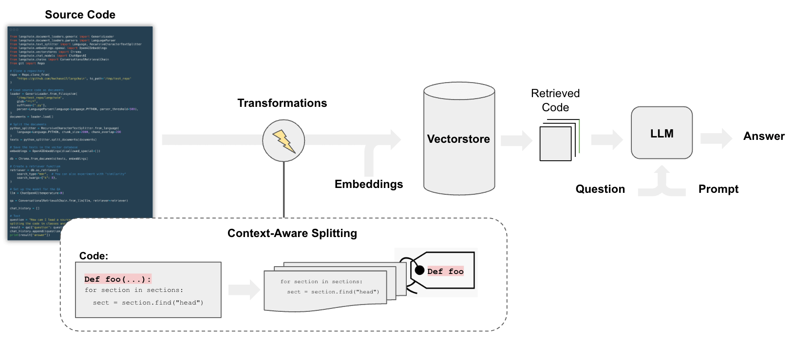
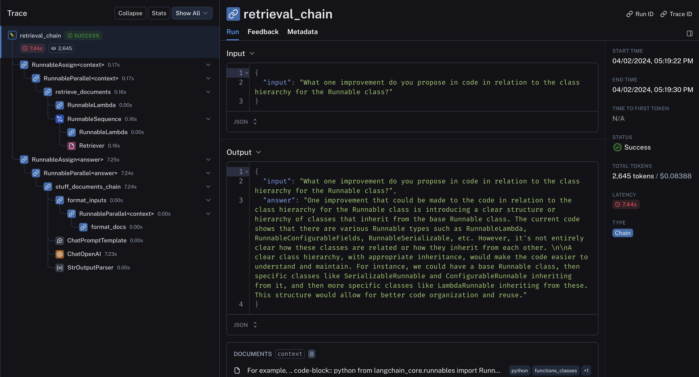

[](https://colab.research.google.com/github/langchain-ai/langchain/blob/master/docs/docs/use_cases/code_understanding.ipynb)

## Cas d'utilisation

L'analyse du code source est l'une des applications les plus populaires des LLM (par exemple, [GitHub Copilot](https://github.com/features/copilot), [Code Interpreter](https://chat.openai.com/auth/login?next=%2F%3Fmodel%3Dgpt-4-code-interpreter), [Codium](https://www.codium.ai/) et [Codeium](https://codeium.com/about))) pour des cas d'utilisation tels que :

- Questions-réponses sur la base de code pour comprendre son fonctionnement
- Utilisation des LLM pour suggérer des refactorisations ou des améliorations
- Utilisation des LLM pour documenter le code



## Aperçu

Le pipeline pour les questions-réponses sur le code suit [les étapes que nous faisons pour les questions-réponses sur les documents](/docs/use_cases/question_answering), avec quelques différences :

En particulier, nous pouvons employer une [stratégie de fractionnement](/docs/integrations/document_loaders/source_code) qui fait quelques choses :

* Conserve chaque fonction et classe de niveau supérieur dans le code chargé dans des documents séparés.
* Place le reste dans un document séparé.
* Conserve les métadonnées sur l'origine de chaque fractionnement

## Démarrage rapide

```python
%pip install --upgrade --quiet langchain-openai tiktoken langchain-chroma langchain GitPython

# Set env var OPENAI_API_KEY or load from a .env file
# import dotenv

# dotenv.load_dotenv()
```

Nous suivrons la structure de [ce notebook](https://github.com/cristobalcl/LearningLangChain/blob/master/notebooks/04%20-%20QA%20with%20code.md) et emploierons [le fractionnement du code sensible au contexte](/docs/integrations/document_loaders/source_code).

### Chargement

Nous allons télécharger tous les fichiers de projet Python en utilisant le `langchain_community.document_loaders.TextLoader`.

Le script suivant itère sur les fichiers du référentiel LangChain et charge chaque fichier `.py` (appelé **documents**) :

```python
from git import Repo
from langchain_community.document_loaders.generic import GenericLoader
from langchain_community.document_loaders.parsers import LanguageParser
from langchain_text_splitters import Language
```

```python
# Clone
repo_path = "/Users/jacoblee/Desktop/test_repo"
repo = Repo.clone_from("https://github.com/langchain-ai/langchain", to_path=repo_path)
```

Nous chargeons le code Python en utilisant [`LanguageParser`](/docs/integrations/document_loaders/source_code), qui :

* Conserve les fonctions et classes de niveau supérieur ensemble (dans un seul document)
* Place le reste du code dans un document séparé
* Conserve les métadonnées sur l'origine de chaque fractionnement

```python
# Load
loader = GenericLoader.from_filesystem(
    repo_path + "/libs/core/langchain_core",
    glob="**/*",
    suffixes=[".py"],
    exclude=["**/non-utf8-encoding.py"],
    parser=LanguageParser(language=Language.PYTHON, parser_threshold=500),
)
documents = loader.load()
len(documents)
```

```output
295
```

### Fractionnement

Fractionnez le `Document` en morceaux pour l'intégration et le stockage vectoriel.

Nous pouvons utiliser `RecursiveCharacterTextSplitter` avec `language` spécifié.

```python
from langchain_text_splitters import RecursiveCharacterTextSplitter

python_splitter = RecursiveCharacterTextSplitter.from_language(
    language=Language.PYTHON, chunk_size=2000, chunk_overlap=200
)
texts = python_splitter.split_documents(documents)
len(texts)
```

```output
898
```

### RetrievalQA

Nous devons stocker les documents d'une manière qui nous permette de les rechercher sémantiquement.

L'approche la plus courante consiste à intégrer le contenu de chaque document, puis à stocker l'intégration et le document dans un magasin vectoriel.

Lors de la configuration du récupérateur de magasin vectoriel :

* Nous testons [la pertinence marginale maximale](/docs/use_cases/question_answering) pour la récupération
* Et 8 documents retournés

#### Approfondir

- Parcourez les > 40 intégrations de magasins vectoriels [ici](https://integrations.langchain.com/).
- Consultez la documentation supplémentaire sur les magasins vectoriels [ici](/docs/modules/data_connection/vectorstores/).
- Parcourez les > 30 intégrations de modèles d'intégration de texte [ici](https://integrations.langchain.com/).
- Consultez la documentation supplémentaire sur les modèles d'intégration [ici](/docs/modules/data_connection/text_embedding/).

```python
from langchain_chroma import Chroma
from langchain_openai import OpenAIEmbeddings

db = Chroma.from_documents(texts, OpenAIEmbeddings(disallowed_special=()))
retriever = db.as_retriever(
    search_type="mmr",  # Also test "similarity"
    search_kwargs={"k": 8},
)
```

### Chat

Tester le chat, tout comme nous le faisons pour les [chatbots](/docs/use_cases/chatbots).

#### Approfondir

- Parcourez les > 55 intégrations de modèles LLM et de chat [ici](https://integrations.langchain.com/).
- Consultez la documentation supplémentaire sur les modèles LLM et de chat [ici](/docs/modules/model_io/).
- Utilisez des LLMS locaux : La popularité de [PrivateGPT](https://github.com/imartinez/privateGPT) et [GPT4All](https://github.com/nomic-ai/gpt4all) souligne l'importance d'exécuter les LLMs localement.

```python
from langchain.chains import create_history_aware_retriever, create_retrieval_chain
from langchain.chains.combine_documents import create_stuff_documents_chain
from langchain_core.prompts import ChatPromptTemplate
from langchain_openai import ChatOpenAI

llm = ChatOpenAI(model="gpt-4")

# First we need a prompt that we can pass into an LLM to generate this search query

prompt = ChatPromptTemplate.from_messages(
    [
        ("placeholder", "{chat_history}"),
        ("user", "{input}"),
        (
            "user",
            "Given the above conversation, generate a search query to look up to get information relevant to the conversation",
        ),
    ]
)

retriever_chain = create_history_aware_retriever(llm, retriever, prompt)

prompt = ChatPromptTemplate.from_messages(
    [
        (
            "system",
            "Answer the user's questions based on the below context:\n\n{context}",
        ),
        ("placeholder", "{chat_history}"),
        ("user", "{input}"),
    ]
)
document_chain = create_stuff_documents_chain(llm, prompt)

qa = create_retrieval_chain(retriever_chain, document_chain)
```

```python
question = "What is a RunnableBinding?"
result = qa.invoke({"input": question})
result["answer"]
```

```output
'A RunnableBinding is a class in the LangChain library that is used to bind arguments to a Runnable. This is useful when a runnable in a chain requires an argument that is not in the output of the previous runnable or included in the user input. It returns a new Runnable with the bound arguments and configuration. The bind method in the RunnableBinding class is used to perform this operation.'
```

```python
questions = [
    "What classes are derived from the Runnable class?",
    "What one improvement do you propose in code in relation to the class hierarchy for the Runnable class?",
]

for question in questions:
    result = qa.invoke({"input": question})
    print(f"-> **Question**: {question} \n")
    print(f"**Answer**: {result['answer']} \n")
```

```output
-> **Question**: What classes are derived from the Runnable class?

**Answer**: The classes derived from the `Runnable` class as mentioned in the context are: `RunnableLambda`, `RunnableLearnable`, `RunnableSerializable`, `RunnableWithFallbacks`.

-> **Question**: What one improvement do you propose in code in relation to the class hierarchy for the Runnable class?

**Answer**: One potential improvement could be the introduction of abstract base classes (ABCs) or interfaces for different types of Runnable classes. Currently, it seems like there are lots of different Runnable types, like RunnableLambda, RunnableParallel, etc., each with their own methods and attributes. By defining a common interface or ABC for all these classes, we can ensure consistency and better organize the codebase. It would also make it easier to add new types of Runnable classes in the future, as they would just need to implement the methods defined in the interface or ABC.
```

Ensuite, nous pouvons examiner la [trace LangSmith](https://smith.langchain.com/public/616f6620-f49f-46c7-8f4b-dae847705c5d/r) pour voir ce qui se passe sous le capot :

* En particulier, le code est bien structuré et conservé ensemble dans le résultat de la récupération
* Le code récupéré et l'historique du chat sont transmis au LLM pour la distillation de la réponse



### Modèles LLM open source

Nous utiliserons l'intégration [Ollama de LangChain](https://ollama.com/) pour interroger un modèle local OSS.

Consultez les derniers modèles disponibles [ici](https://ollama.com/library).

```python
%pip install --upgrade --quiet langchain-community
```

```python
from langchain_community.chat_models.ollama import ChatOllama

llm = ChatOllama(model="codellama")
```

Exécutons-le avec une question de codage générique pour tester ses connaissances :

```python
response_message = llm.invoke(
    "In bash, how do I list all the text files in the current directory that have been modified in the last month?"
)

print(response_message.content)
print(response_message.response_metadata)
```

```output

You can use the `find` command with the `-mtime` option to find all the text files in the current directory that have been modified in the last month. Here's an example command:
\```bash
find . -type f -name "*.txt" -mtime -30
\```

This will list all the text files in the current directory (`.`) that have been modified in the last 30 days. The `-type f` option ensures that only regular files are matched, and not directories or other types of files. The `-name "*.txt"` option restricts the search to files with a `.txt` extension. Finally, the `-mtime -30` option specifies that we want to find files that have been modified in the last 30 days.

You can also use `find` command with `-mmin` option to find all the text files in the current directory that have been modified within the last month. Here's an example command:

\```bash
find . -type f -name "*.txt" -mmin -4320
\```

This will list all the text files in the current directory (`.`) that have been modified within the last 30 days. The `-type f` option ensures that only regular files are matched, and not directories or other types of files. The `-name "*.txt"` option restricts the search to files with a `.txt` extension. Finally, the `-mmin -4320` option specifies that we want to find files that have been modified within the last 4320 minutes (which is equivalent to one month).

You can also use `ls` command with `-l` option and pipe it to `grep` command to filter out the text files. Here's an example command:

\```bash
ls -l | grep "*.txt"
\```

This will list all the text files in the current directory (`.`) that have been modified within the last 30 days. The `-l` option of `ls` command lists the files in a long format, including the modification time, and the `grep` command filters out the files that do not match the specified pattern.

Please note that these commands are case-sensitive, so if you have any files with different extensions (e.g., `.TXT`), they will not be matched by these commands.
{'model': 'codellama', 'created_at': '2024-04-03T00:41:44.014203Z', 'message': {'role': 'assistant', 'content': ''}, 'done': True, 'total_duration': 27078466916, 'load_duration': 12947208, 'prompt_eval_count': 44, 'prompt_eval_duration': 11497468000, 'eval_count': 510, 'eval_duration': 15548191000}

```

Cela semble raisonnable ! Maintenant, configurons-le avec notre magasin vectoriel précédemment chargé.

Nous omettons l'aspect conversationnel pour garder les choses plus gérables pour le modèle local à faible puissance :

```python
# from langchain.chains.question_answering import load_qa_chain

# # Prompt
# template = """Use the following pieces of context to answer the question at the end.
# If you don't know the answer, just say that you don't know, don't try to make up an answer.
# Use three sentences maximum and keep the answer as concise as possible.
# {context}
# Question: {question}
# Helpful Answer:"""
# QA_CHAIN_PROMPT = PromptTemplate(
#     input_variables=["context", "question"],
#     template=template,
# )

system_template = """
Answer the user's questions based on the below context.
If you don't know the answer, just say that you don't know, don't try to make up an answer.
Use three sentences maximum and keep the answer as concise as possible:

{context}
"""

# First we need a prompt that we can pass into an LLM to generate this search query
prompt = ChatPromptTemplate.from_messages(
    [
        ("system", system_template),
        ("user", "{input}"),
    ]
)
document_chain = create_stuff_documents_chain(llm, prompt)

qa_chain = create_retrieval_chain(retriever, document_chain)
```

```python
# Run, only returning the value under the answer key for readability
qa_chain.pick("answer").invoke({"input": "What is a RunnableBinding?"})
```

```output
"A RunnableBinding is a high-level class in the LangChain framework. It's an abstraction layer that sits between a program and an LLM or other data source.\n\nThe main goal of a RunnableBinding is to enable a program, which may be a chat bot or a backend service, to fetch responses from an LLM or other data sources in a way that is easy for both the program and the data sources to use. This is achieved through a set of predefined protocols that are implemented by the RunnableBinding.\n\nThe protocols defined by a RunnableBinding include:\n\n1. Fetching inputs from the program. The RunnableBinding should be able to receive inputs from the program and translate them into a format that can be processed by the LLM or other data sources.\n2. Translating outputs from the LLM or other data sources into something that can be returned to the program. This includes converting the raw output of an LLM into something that is easier for the program to process, such as text or a structured object.\n3. Handling errors that may arise during the fetching, processing, and returning of responses from the LLM or other data sources. The RunnableBinding should be able to catch exceptions and errors that occur during these operations and return a suitable error message or response to the program.\n4. Managing concurrency and parallelism in the communication with the LLM or other data sources. This may include things like allowing multiple requests to be sent to the LLM or other data sources simultaneously, handling the responses asynchronously, and retrying failed requests.\n5. Providing a way for the program to set configuration options that affect how the RunnableBinding interacts with the LLM or other data sources. This could include things like setting up credentials, providing additional contextual information to the LLM or other data sources, and controlling logging or error handling behavior.\n\nIn summary, a RunnableBinding provides a way for a program to easily communicate with an LLM or other data sources without having to know about the details of how they work. By providing a consistent interface between the program and the data sources, the RunnableBinding enables more robust and scalable communication protocols that are easier for both parties to use.\n\nIn the context of the chatbot tutorial, a RunnableBinding may be used to fetch responses from an LLM and return them as output for the bot to process. The RunnableBinding could also be used to handle errors that occur during this process, such as providing error messages or retrying failed requests to the LLM.\n\nTo summarize:\n\n* A RunnableBinding provides a way for a program to communicate with an LLM or other data sources without having to know about the details of how they work.\n* It enables more robust and scalable communication protocols that are easier for both parties to use.\n* It manages concurrency and parallelism in the communication with the LLM or other data sources.\n* It provides a way for the program to set configuration options that affect how the RunnableBinding interacts with the LLM or other data sources."
```

Pas parfait, mais il a bien saisi le fait que cela permet au développeur de définir une option de configuration !

Voici la [trace LangSmith](https://smith.langchain.com/public/d8bb2af8-99cd-406b-a870-f255f4a2423c/r) montrant les documents récupérés utilisés comme contexte.
