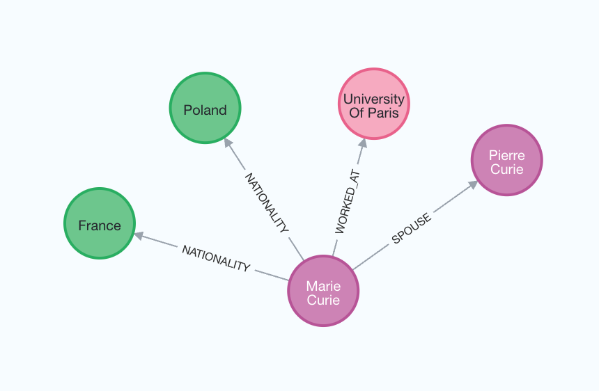

# Construction de graphes de connaissances

Dans ce guide, nous passerons en revue les moyens de base pour construire un graphe de connaissances à partir de texte non structuré. Le graphe construit peut ensuite être utilisé comme base de connaissances dans une application RAG.

## ⚠️ Note de sécurité ⚠️

La construction de graphes de connaissances nécessite l'exécution d'un accès en écriture à la base de données. Il y a des risques inhérents à cette opération. Assurez-vous de vérifier et de valider les données avant de les importer. Pour plus d'informations sur les meilleures pratiques de sécurité en général, [voir ici](/docs/security).

## Architecture

De manière générale, les étapes de construction d'un graphe de connaissances à partir de texte sont les suivantes :

1. **Extraction d'informations structurées à partir du texte** : Un modèle est utilisé pour extraire les informations structurées du graphe à partir du texte.
2. **Stockage dans une base de données de graphes** : Le stockage des informations structurées extraites du graphe dans une base de données de graphes permet les applications RAG en aval.

## Configuration

Tout d'abord, obtenez les packages requis et définissez les variables d'environnement.
Dans cet exemple, nous utiliserons la base de données de graphes Neo4j.

```python
%pip install --upgrade --quiet  langchain langchain-community langchain-openai langchain-experimental neo4j
```

```output
Note: you may need to restart the kernel to use updated packages.
```

Nous utilisons par défaut les modèles OpenAI dans ce guide.

```python
import getpass
import os

os.environ["OPENAI_API_KEY"] = getpass.getpass()

# Uncomment the below to use LangSmith. Not required.
# os.environ["LANGCHAIN_API_KEY"] = getpass.getpass()
# os.environ["LANGCHAIN_TRACING_V2"] = "true"
```

```output
 ········
```

Ensuite, nous devons définir les identifiants et la connexion Neo4j.
Suivez [ces étapes d'installation](https://neo4j.com/docs/operations-manual/current/installation/) pour configurer une base de données Neo4j.

```python
import os

from langchain_community.graphs import Neo4jGraph

os.environ["NEO4J_URI"] = "bolt://localhost:7687"
os.environ["NEO4J_USERNAME"] = "neo4j"
os.environ["NEO4J_PASSWORD"] = "password"

graph = Neo4jGraph()
```

## Transformateur de graphe LLM

L'extraction de données de graphe à partir de texte permet la transformation d'informations non structurées en formats structurés, facilitant ainsi des insights plus approfondis et une navigation plus efficace à travers les relations et les modèles complexes. Le `LLMGraphTransformer` convertit les documents textuels en documents de graphe structurés en utilisant un LLM pour analyser et catégoriser les entités et leurs relations. Le choix du modèle LLM influence de manière significative la sortie en déterminant la précision et la nuance des données de graphe extraites.

```python
import os

from langchain_experimental.graph_transformers import LLMGraphTransformer
from langchain_openai import ChatOpenAI

llm = ChatOpenAI(temperature=0, model_name="gpt-4-turbo")

llm_transformer = LLMGraphTransformer(llm=llm)
```

Maintenant, nous pouvons passer un texte d'exemple et examiner les résultats.

```python
from langchain_core.documents import Document

text = """
Marie Curie, born in 1867, was a Polish and naturalised-French physicist and chemist who conducted pioneering research on radioactivity.
She was the first woman to win a Nobel Prize, the first person to win a Nobel Prize twice, and the only person to win a Nobel Prize in two scientific fields.
Her husband, Pierre Curie, was a co-winner of her first Nobel Prize, making them the first-ever married couple to win the Nobel Prize and launching the Curie family legacy of five Nobel Prizes.
She was, in 1906, the first woman to become a professor at the University of Paris.
"""
documents = [Document(page_content=text)]
graph_documents = llm_transformer.convert_to_graph_documents(documents)
print(f"Nodes:{graph_documents[0].nodes}")
print(f"Relationships:{graph_documents[0].relationships}")
```

```output
Nodes:[Node(id='Marie Curie', type='Person'), Node(id='Pierre Curie', type='Person'), Node(id='University Of Paris', type='Organization')]
Relationships:[Relationship(source=Node(id='Marie Curie', type='Person'), target=Node(id='Pierre Curie', type='Person'), type='MARRIED'), Relationship(source=Node(id='Marie Curie', type='Person'), target=Node(id='University Of Paris', type='Organization'), type='PROFESSOR')]
```

Examinez l'image suivante pour mieux comprendre la structure du graphe de connaissances généré.


Notez que le processus de construction de graphe n'est pas déterministe car nous utilisons un LLM. Par conséquent, vous pourriez obtenir des résultats légèrement différents à chaque exécution.

De plus, vous avez la flexibilité de définir des types spécifiques de nœuds et de relations à extraire selon vos besoins.

```python
llm_transformer_filtered = LLMGraphTransformer(
    llm=llm,
    allowed_nodes=["Person", "Country", "Organization"],
    allowed_relationships=["NATIONALITY", "LOCATED_IN", "WORKED_AT", "SPOUSE"],
)
graph_documents_filtered = llm_transformer_filtered.convert_to_graph_documents(
    documents
)
print(f"Nodes:{graph_documents_filtered[0].nodes}")
print(f"Relationships:{graph_documents_filtered[0].relationships}")
```

```output
Nodes:[Node(id='Marie Curie', type='Person'), Node(id='Pierre Curie', type='Person'), Node(id='University Of Paris', type='Organization')]
Relationships:[Relationship(source=Node(id='Marie Curie', type='Person'), target=Node(id='Pierre Curie', type='Person'), type='SPOUSE'), Relationship(source=Node(id='Marie Curie', type='Person'), target=Node(id='University Of Paris', type='Organization'), type='WORKED_AT')]
```

Pour mieux comprendre le graphe généré, nous pouvons à nouveau le visualiser.



Le paramètre `node_properties` permet l'extraction des propriétés des nœuds, permettant la création d'un graphe plus détaillé.
Lorsqu'il est défini sur `True`, le LLM identifie et extrait de manière autonome les propriétés de nœud pertinentes.
Inversement, si `node_properties` est défini comme une liste de chaînes de caractères, le LLM récupère sélectivement uniquement les propriétés spécifiées dans le texte.

```python
llm_transformer_props = LLMGraphTransformer(
    llm=llm,
    allowed_nodes=["Person", "Country", "Organization"],
    allowed_relationships=["NATIONALITY", "LOCATED_IN", "WORKED_AT", "SPOUSE"],
    node_properties=["born_year"],
)
graph_documents_props = llm_transformer_props.convert_to_graph_documents(documents)
print(f"Nodes:{graph_documents_props[0].nodes}")
print(f"Relationships:{graph_documents_props[0].relationships}")
```

```output
Nodes:[Node(id='Marie Curie', type='Person', properties={'born_year': '1867'}), Node(id='Pierre Curie', type='Person'), Node(id='University Of Paris', type='Organization')]
Relationships:[Relationship(source=Node(id='Marie Curie', type='Person'), target=Node(id='Pierre Curie', type='Person'), type='SPOUSE'), Relationship(source=Node(id='Marie Curie', type='Person'), target=Node(id='University Of Paris', type='Organization'), type='WORKED_AT')]
```

## Stockage dans la base de données de graphes

Les documents de graphe générés peuvent être stockés dans une base de données de graphes à l'aide de la méthode `add_graph_documents`.

```python
graph.add_graph_documents(graph_documents_props)
```
