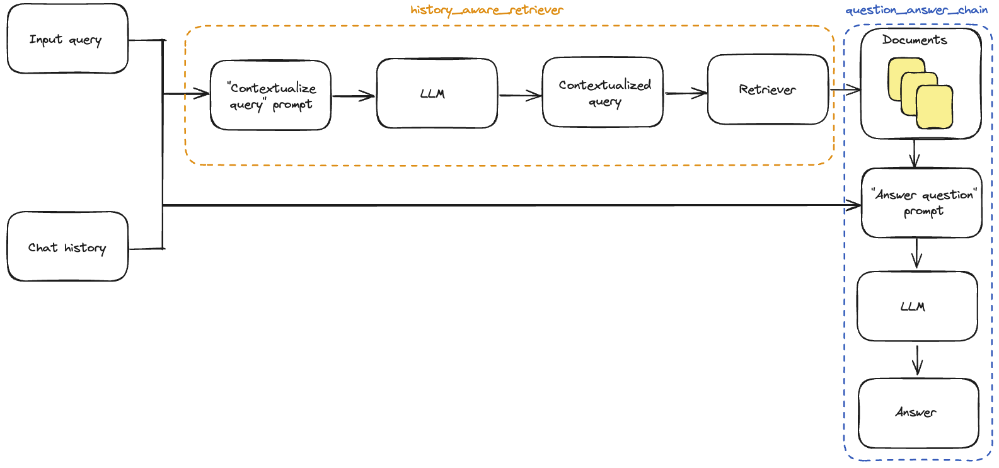

# Ajouter l'historique de la conversation

Dans de nombreuses applications de questions-réponses, nous voulons permettre à l'utilisateur d'avoir une conversation bidirectionnelle, ce qui signifie que l'application a besoin d'une sorte de "mémoire" des questions et réponses passées, et d'une logique pour les intégrer dans sa réflexion actuelle.

Dans ce guide, nous nous concentrons sur **l'ajout d'une logique pour intégrer les messages historiques.** Les détails supplémentaires sur la gestion de l'historique de la conversation sont [couverts ici](/docs/expression_language/how_to/message_history).

Nous nous baserons sur l'application de questions-réponses que nous avons construite dans le billet de blog [LLM Powered Autonomous Agents](https://lilianweng.github.io/posts/2023-06-23-agent/) de Lilian Weng dans le [Démarrage rapide](/docs/use_cases/question_answering/quickstart). Nous devrons mettre à jour deux éléments de notre application existante :

1. **Prompt** : Mettre à jour notre prompt pour prendre en charge les messages historiques en tant qu'entrée.
2. **Contextualisation des questions** : Ajouter une sous-chaîne qui prend la dernière question de l'utilisateur et la reformule dans le contexte de l'historique de la conversation. Cela est nécessaire au cas où la dernière question fait référence à un certain contexte des messages précédents. Par exemple, si un utilisateur pose une question de suivi comme "Pouvez-vous développer le deuxième point ?", cela ne peut pas être compris sans le contexte du message précédent. Par conséquent, nous ne pouvons pas effectuer efficacement la recherche avec une question comme celle-ci.

## Configuration

### Dépendances

Nous utiliserons un modèle de conversation OpenAI et des embeddings, ainsi qu'un magasin de vecteurs Chroma dans ce tutoriel, mais tout ce qui est montré ici fonctionne avec n'importe quel [ChatModel](/docs/modules/model_io/chat/) ou [LLM](/docs/modules/model_io/llms/), [Embeddings](/docs/modules/data_connection/text_embedding/), et [VectorStore](/docs/modules/data_connection/vectorstores/) ou [Retriever](/docs/modules/data_connection/retrievers/).

Nous utiliserons les packages suivants :

```python
%pip install --upgrade --quiet  langchain langchain-community langchainhub langchain-openai langchain-chroma bs4
```

Nous devons définir la variable d'environnement `OPENAI_API_KEY`, ce qui peut être fait directement ou chargé à partir d'un fichier `.env` comme suit :

```python
import getpass
import os

os.environ["OPENAI_API_KEY"] = getpass.getpass()

# import dotenv

# dotenv.load_dotenv()
```

### LangSmith

De nombreuses applications que vous construirez avec LangChain contiendront plusieurs étapes avec de multiples invocations d'appels LLM. À mesure que ces applications deviennent de plus en plus complexes, il devient crucial de pouvoir inspecter exactement ce qui se passe à l'intérieur de votre chaîne ou de votre agent. La meilleure façon de faire cela est avec [LangSmith](https://smith.langchain.com).

Notez que LangSmith n'est pas nécessaire, mais il est utile. Si vous voulez utiliser LangSmith, après vous être inscrit au lien ci-dessus, assurez-vous de définir vos variables d'environnement pour commencer à enregistrer les traces :

```python
os.environ["LANGCHAIN_TRACING_V2"] = "true"
os.environ["LANGCHAIN_API_KEY"] = getpass.getpass()
```

## Chaîne sans historique de conversation

Voici l'application de questions-réponses que nous avons construite dans le billet de blog [LLM Powered Autonomous Agents](https://lilianweng.github.io/posts/2023-06-23-agent/) de Lilian Weng dans le [Démarrage rapide](/docs/use_cases/question_answering/quickstart) :

```python
import bs4
from langchain import hub
from langchain_chroma import Chroma
from langchain_community.document_loaders import WebBaseLoader
from langchain_core.output_parsers import StrOutputParser
from langchain_core.runnables import RunnablePassthrough
from langchain_openai import ChatOpenAI, OpenAIEmbeddings
from langchain_text_splitters import RecursiveCharacterTextSplitter
```

```python
# Load, chunk and index the contents of the blog.
loader = WebBaseLoader(
    web_paths=("https://lilianweng.github.io/posts/2023-06-23-agent/",),
    bs_kwargs=dict(
        parse_only=bs4.SoupStrainer(
            class_=("post-content", "post-title", "post-header")
        )
    ),
)
docs = loader.load()

text_splitter = RecursiveCharacterTextSplitter(chunk_size=1000, chunk_overlap=200)
splits = text_splitter.split_documents(docs)
vectorstore = Chroma.from_documents(documents=splits, embedding=OpenAIEmbeddings())

# Retrieve and generate using the relevant snippets of the blog.
retriever = vectorstore.as_retriever()
prompt = hub.pull("rlm/rag-prompt")
llm = ChatOpenAI(model="gpt-3.5-turbo", temperature=0)


def format_docs(docs):
    return "\n\n".join(doc.page_content for doc in docs)


rag_chain = (
    {"context": retriever | format_docs, "question": RunnablePassthrough()}
    | prompt
    | llm
    | StrOutputParser()
)
```

```python
rag_chain.invoke("What is Task Decomposition?")
```

```output
'Task Decomposition is a technique used to break down complex tasks into smaller and simpler steps. This approach helps agents to plan and execute tasks more efficiently by dividing them into manageable subgoals. Task decomposition can be achieved through various methods, including using prompting techniques, task-specific instructions, or human inputs.'
```

## Contextualisation de la question

Tout d'abord, nous devrons définir une sous-chaîne qui prend les messages historiques et la dernière question de l'utilisateur, et reformule la question si elle fait référence à des informations dans les informations historiques.

Nous utiliserons un prompt qui inclut une variable `MessagesPlaceholder` sous le nom "chat_history". Cela nous permet de passer une liste de Messages au prompt en utilisant la clé d'entrée "chat_history", et ces messages seront insérés après le message système et avant le message humain contenant la dernière question.

Notez que nous utilisons une fonction d'assistance [create_history_aware_retriever](https://api.python.langchain.com/en/latest/chains/langchain.chains.history_aware_retriever.create_history_aware_retriever.html) pour cette étape, qui gère le cas où `chat_history` est vide, et applique sinon `prompt | llm | StrOutputParser() | retriever` en séquence.

`create_history_aware_retriever` construit une chaîne qui accepte les clés `input` et `chat_history` en entrée, et a le même schéma de sortie qu'un récupérateur.

```python
from langchain.chains import create_history_aware_retriever
from langchain_core.prompts import ChatPromptTemplate, MessagesPlaceholder

contextualize_q_system_prompt = """Given a chat history and the latest user question \
which might reference context in the chat history, formulate a standalone question \
which can be understood without the chat history. Do NOT answer the question, \
just reformulate it if needed and otherwise return it as is."""
contextualize_q_prompt = ChatPromptTemplate.from_messages(
    [
        ("system", contextualize_q_system_prompt),
        MessagesPlaceholder("chat_history"),
        ("human", "{input}"),
    ]
)
history_aware_retriever = create_history_aware_retriever(
    llm, retriever, contextualize_q_prompt
)
```

Cette chaîne ajoute une reformulation de la requête d'entrée à notre récupérateur, afin que la récupération intègre le contexte de la conversation.

## Chaîne avec historique de conversation

Et maintenant, nous pouvons construire notre chaîne de questions-réponses complète.

Ici, nous utilisons [create_stuff_documents_chain](https://api.python.langchain.com/en/latest/chains/langchain.chains.combine_documents.stuff.create_stuff_documents_chain.html) pour générer une `question_answer_chain`, avec les clés d'entrée `context`, `chat_history` et `input` - elle accepte le contexte récupéré ainsi que l'historique de la conversation et la requête pour générer une réponse.

Nous construisons notre chaîne `rag_chain` finale avec [create_retrieval_chain](https://api.python.langchain.com/en/latest/chains/langchain.chains.retrieval.create_retrieval_chain.html). Cette chaîne applique le `history_aware_retriever` et le `question_answer_chain` en séquence, en conservant les sorties intermédiaires comme le contexte récupéré pour plus de commodité. Elle a les clés d'entrée `input` et `chat_history`, et inclut `input`, `chat_history`, `context` et `answer` dans sa sortie.

```python
from langchain.chains import create_retrieval_chain
from langchain.chains.combine_documents import create_stuff_documents_chain

qa_system_prompt = """You are an assistant for question-answering tasks. \
Use the following pieces of retrieved context to answer the question. \
If you don't know the answer, just say that you don't know. \
Use three sentences maximum and keep the answer concise.\

{context}"""
qa_prompt = ChatPromptTemplate.from_messages(
    [
        ("system", qa_system_prompt),
        MessagesPlaceholder("chat_history"),
        ("human", "{input}"),
    ]
)


question_answer_chain = create_stuff_documents_chain(llm, qa_prompt)

rag_chain = create_retrieval_chain(history_aware_retriever, question_answer_chain)
```

```python
from langchain_core.messages import HumanMessage

chat_history = []

question = "What is Task Decomposition?"
ai_msg_1 = rag_chain.invoke({"input": question, "chat_history": chat_history})
chat_history.extend([HumanMessage(content=question), ai_msg_1["answer"]])

second_question = "What are common ways of doing it?"
ai_msg_2 = rag_chain.invoke({"input": second_question, "chat_history": chat_history})

print(ai_msg_2["answer"])
```

```output
Task decomposition can be done in several common ways, including using Language Model (LLM) with simple prompting like "Steps for XYZ" or "What are the subgoals for achieving XYZ?", providing task-specific instructions tailored to the specific task at hand, or incorporating human inputs to guide the decomposition process. These methods help in breaking down complex tasks into smaller, more manageable subtasks for efficient execution.
```

:::tip

Consultez la [trace LangSmith](https://smith.langchain.com/public/243301e4-4cc5-4e52-a6e7-8cfe9208398d/r)

:::

### Retourner les sources

Souvent, dans les applications de questions-réponses, il est important de montrer aux utilisateurs les sources qui ont été utilisées pour générer la réponse. La `create_retrieval_chain` intégrée à LangChain propagera les documents sources récupérés à la sortie dans la clé `"context"` :

```python
for document in ai_msg_2["context"]:
    print(document)
    print()
```

```output
page_content='Tree of Thoughts (Yao et al. 2023) extends CoT by exploring multiple reasoning possibilities at each step. It first decomposes the problem into multiple thought steps and generates multiple thoughts per step, creating a tree structure. The search process can be BFS (breadth-first search) or DFS (depth-first search) with each state evaluated by a classifier (via a prompt) or majority vote.\nTask decomposition can be done (1) by LLM with simple prompting like "Steps for XYZ.\\n1.", "What are the subgoals for achieving XYZ?", (2) by using task-specific instructions; e.g. "Write a story outline." for writing a novel, or (3) with human inputs.' metadata={'source': 'https://lilianweng.github.io/posts/2023-06-23-agent/'}

page_content='Fig. 1. Overview of a LLM-powered autonomous agent system.\nComponent One: Planning#\nA complicated task usually involves many steps. An agent needs to know what they are and plan ahead.\nTask Decomposition#\nChain of thought (CoT; Wei et al. 2022) has become a standard prompting technique for enhancing model performance on complex tasks. The model is instructed to “think step by step” to utilize more test-time computation to decompose hard tasks into smaller and simpler steps. CoT transforms big tasks into multiple manageable tasks and shed lights into an interpretation of the model’s thinking process.' metadata={'source': 'https://lilianweng.github.io/posts/2023-06-23-agent/'}

page_content='Resources:\n1. Internet access for searches and information gathering.\n2. Long Term memory management.\n3. GPT-3.5 powered Agents for delegation of simple tasks.\n4. File output.\n\nPerformance Evaluation:\n1. Continuously review and analyze your actions to ensure you are performing to the best of your abilities.\n2. Constructively self-criticize your big-picture behavior constantly.\n3. Reflect on past decisions and strategies to refine your approach.\n4. Every command has a cost, so be smart and efficient. Aim to complete tasks in the least number of steps.' metadata={'source': 'https://lilianweng.github.io/posts/2023-06-23-agent/'}

page_content='Fig. 11. Illustration of how HuggingGPT works. (Image source: Shen et al. 2023)\nThe system comprises of 4 stages:\n(1) Task planning: LLM works as the brain and parses the user requests into multiple tasks. There are four attributes associated with each task: task type, ID, dependencies, and arguments. They use few-shot examples to guide LLM to do task parsing and planning.\nInstruction:' metadata={'source': 'https://lilianweng.github.io/posts/2023-06-23-agent/'}
```

## Rassembler



Ici, nous avons vu comment ajouter une logique d'application pour incorporer les sorties historiques, mais nous mettons encore à jour manuellement l'historique de la conversation et l'insérons dans chaque entrée. Dans une véritable application de questions-réponses, nous voudrons une manière de conserver l'historique de la conversation et une manière de l'insérer et de le mettre à jour automatiquement.

Pour cela, nous pouvons utiliser :

- [BaseChatMessageHistory](/docs/modules/memory/chat_messages/) : Stocker l'historique de la conversation.
- [RunnableWithMessageHistory](/docs/expression_language/how_to/message_history) : Wrapper pour une chaîne LCEL et un `BaseChatMessageHistory` qui gère l'injection de l'historique de la conversation dans les entrées et sa mise à jour après chaque invocation.

Pour un guide détaillé sur la façon d'utiliser ces classes ensemble pour créer une chaîne conversationnelle avec état, rendez-vous sur la page LCEL [Comment ajouter l'historique des messages (mémoire)](/docs/expression_language/how_to/message_history).

Ci-dessous, nous implémentons un exemple simple de la deuxième option, dans laquelle les historiques de conversation sont stockés dans un simple dictionnaire.

Pour plus de commodité, nous rassemblons toutes les étapes nécessaires dans une seule cellule de code :

```python
import bs4
from langchain.chains import create_history_aware_retriever, create_retrieval_chain
from langchain.chains.combine_documents import create_stuff_documents_chain
from langchain_chroma import Chroma
from langchain_community.chat_message_histories import ChatMessageHistory
from langchain_community.document_loaders import WebBaseLoader
from langchain_core.chat_history import BaseChatMessageHistory
from langchain_core.prompts import ChatPromptTemplate, MessagesPlaceholder
from langchain_core.runnables.history import RunnableWithMessageHistory
from langchain_openai import ChatOpenAI, OpenAIEmbeddings
from langchain_text_splitters import RecursiveCharacterTextSplitter

llm = ChatOpenAI(model="gpt-3.5-turbo", temperature=0)


### Construct retriever ###
loader = WebBaseLoader(
    web_paths=("https://lilianweng.github.io/posts/2023-06-23-agent/",),
    bs_kwargs=dict(
        parse_only=bs4.SoupStrainer(
            class_=("post-content", "post-title", "post-header")
        )
    ),
)
docs = loader.load()

text_splitter = RecursiveCharacterTextSplitter(chunk_size=1000, chunk_overlap=200)
splits = text_splitter.split_documents(docs)
vectorstore = Chroma.from_documents(documents=splits, embedding=OpenAIEmbeddings())
retriever = vectorstore.as_retriever()


### Contextualize question ###
contextualize_q_system_prompt = """Given a chat history and the latest user question \
which might reference context in the chat history, formulate a standalone question \
which can be understood without the chat history. Do NOT answer the question, \
just reformulate it if needed and otherwise return it as is."""
contextualize_q_prompt = ChatPromptTemplate.from_messages(
    [
        ("system", contextualize_q_system_prompt),
        MessagesPlaceholder("chat_history"),
        ("human", "{input}"),
    ]
)
history_aware_retriever = create_history_aware_retriever(
    llm, retriever, contextualize_q_prompt
)


### Answer question ###
qa_system_prompt = """You are an assistant for question-answering tasks. \
Use the following pieces of retrieved context to answer the question. \
If you don't know the answer, just say that you don't know. \
Use three sentences maximum and keep the answer concise.\

{context}"""
qa_prompt = ChatPromptTemplate.from_messages(
    [
        ("system", qa_system_prompt),
        MessagesPlaceholder("chat_history"),
        ("human", "{input}"),
    ]
)
question_answer_chain = create_stuff_documents_chain(llm, qa_prompt)

rag_chain = create_retrieval_chain(history_aware_retriever, question_answer_chain)


### Statefully manage chat history ###
store = {}


def get_session_history(session_id: str) -> BaseChatMessageHistory:
    if session_id not in store:
        store[session_id] = ChatMessageHistory()
    return store[session_id]


conversational_rag_chain = RunnableWithMessageHistory(
    rag_chain,
    get_session_history,
    input_messages_key="input",
    history_messages_key="chat_history",
    output_messages_key="answer",
)
```

```python
conversational_rag_chain.invoke(
    {"input": "What is Task Decomposition?"},
    config={
        "configurable": {"session_id": "abc123"}
    },  # constructs a key "abc123" in `store`.
)["answer"]
```

```output
'Task decomposition is a technique used to break down complex tasks into smaller and simpler steps. This approach helps agents or models handle difficult tasks by dividing them into more manageable subtasks. It can be achieved through methods like Chain of Thought (CoT) or Tree of Thoughts, which guide the model in thinking step by step or exploring multiple reasoning possibilities at each step.'
```

```python
conversational_rag_chain.invoke(
    {"input": "What are common ways of doing it?"},
    config={"configurable": {"session_id": "abc123"}},
)["answer"]
```

```output
'Task decomposition can be done in common ways such as using Language Model (LLM) with simple prompting, task-specific instructions, or human inputs. For example, LLM can be guided with prompts like "Steps for XYZ" to break down tasks, or specific instructions like "Write a story outline" can be given for task decomposition. Additionally, human inputs can also be utilized to decompose tasks into smaller, more manageable steps.'
```
