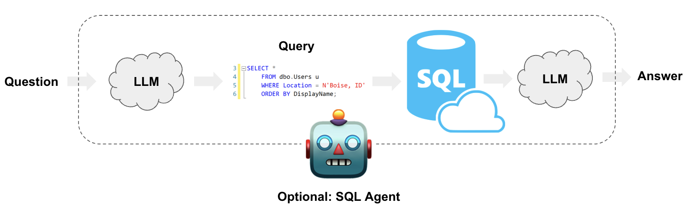

# Démarrage rapide

Dans ce guide, nous allons passer en revue les moyens de base pour créer une chaîne de questions-réponses et un agent sur une base de données SQL. Ces systèmes nous permettront de poser une question sur les données d'une base de données SQL et d'obtenir une réponse en langage naturel. La principale différence entre les deux est que notre agent peut interroger la base de données en boucle autant de fois que nécessaire pour répondre à la question.

## ⚠️ Note de sécurité ⚠️

La création de systèmes de questions-réponses sur des bases de données SQL nécessite l'exécution de requêtes SQL générées par le modèle. Il y a des risques inhérents à cela. Assurez-vous que les autorisations de connexion à votre base de données soient toujours définies de manière aussi restreinte que possible pour les besoins de votre chaîne/agent. Cela atténuera mais n'éliminera pas les risques de création d'un système piloté par un modèle. Pour plus d'informations sur les meilleures pratiques de sécurité générales, [voir ici](/docs/security).

## Architecture

À un niveau élevé, les étapes de toute chaîne et agent SQL sont :

1. **Convertir la question en requête SQL** : Le modèle convertit l'entrée de l'utilisateur en une requête SQL.
2. **Exécuter la requête SQL** : Exécuter la requête SQL.
3. **Répondre à la question** : Le modèle répond à l'entrée de l'utilisateur en utilisant les résultats de la requête.



## Configuration

Tout d'abord, obtenez les packages requis et définissez les variables d'environnement :

```python
%pip install --upgrade --quiet  langchain langchain-community langchain-openai
```

Nous utiliserons un modèle OpenAI dans ce guide.

```python
import getpass
import os

os.environ["OPENAI_API_KEY"] = getpass.getpass()

# Uncomment the below to use LangSmith. Not required.
# os.environ["LANGCHAIN_API_KEY"] = getpass.getpass()
# os.environ["LANGCHAIN_TRACING_V2"] = "true"
```

L'exemple ci-dessous utilisera une connexion SQLite avec la base de données Chinook. Suivez [ces étapes d'installation](https://database.guide/2-sample-databases-sqlite/) pour créer `Chinook.db` dans le même répertoire que ce notebook :

* Enregistrez [ce fichier](https://raw.githubusercontent.com/lerocha/chinook-database/master/ChinookDatabase/DataSources/Chinook_Sqlite.sql) sous `Chinook_Sqlite.sql`
* Exécutez `sqlite3 Chinook.db`
* Exécutez `.read Chinook_Sqlite.sql`
* Testez `SELECT * FROM Artist LIMIT 10;`

Maintenant, `Chinhook.db` est dans notre répertoire et nous pouvons l'interfacer en utilisant la classe `SQLDatabase` pilotée par SQLAlchemy :

```python
from langchain_community.utilities import SQLDatabase

db = SQLDatabase.from_uri("sqlite:///Chinook.db")
print(db.dialect)
print(db.get_usable_table_names())
db.run("SELECT * FROM Artist LIMIT 10;")
```

```output
sqlite
['Album', 'Artist', 'Customer', 'Employee', 'Genre', 'Invoice', 'InvoiceLine', 'MediaType', 'Playlist', 'PlaylistTrack', 'Track']
```

```output
"[(1, 'AC/DC'), (2, 'Accept'), (3, 'Aerosmith'), (4, 'Alanis Morissette'), (5, 'Alice In Chains'), (6, 'Antônio Carlos Jobim'), (7, 'Apocalyptica'), (8, 'Audioslave'), (9, 'BackBeat'), (10, 'Billy Cobham')]"
```

Super! Nous avons une base de données SQL que nous pouvons interroger. Maintenant, essayons de la connecter à un LLM.

## Chaîne

Créons une simple chaîne qui prend une question, la transforme en requête SQL, exécute la requête et utilise le résultat pour répondre à la question originale.

### Convertir la question en requête SQL

La première étape d'une chaîne ou d'un agent SQL est de prendre l'entrée de l'utilisateur et de la convertir en une requête SQL. LangChain propose une chaîne intégrée pour cela : [create_sql_query_chain](https://api.python.langchain.com/en/latest/chains/langchain.chains.sql_database.query.create_sql_query_chain.html).

```python
from langchain.chains import create_sql_query_chain
from langchain_openai import ChatOpenAI

llm = ChatOpenAI(model="gpt-3.5-turbo", temperature=0)
chain = create_sql_query_chain(llm, db)
response = chain.invoke({"question": "How many employees are there"})
response
```

```output
'SELECT COUNT(*) FROM Employee'
```

Nous pouvons exécuter la requête pour nous assurer qu'elle est valide :

```python
db.run(response)
```

```output
'[(8,)]'
```

Nous pouvons regarder la [trace LangSmith](https://smith.langchain.com/public/c8fa52ea-be46-4829-bde2-52894970b830/r) pour mieux comprendre ce que fait cette chaîne. Nous pouvons également inspecter directement la chaîne pour ses prompts. En regardant le prompt (ci-dessous), nous pouvons voir qu'il est :

* Spécifique au dialecte. Dans ce cas, il fait explicitement référence à SQLite.
* Contient des définitions pour toutes les tables disponibles.
* Contient trois lignes d'exemples pour chaque table.

Cette technique est inspirée par des articles comme [celui-ci](https://arxiv.org/pdf/2204.00498.pdf), qui suggèrent que montrer des exemples de lignes et être explicite sur les tables améliore les performances. Nous pouvons également inspecter le prompt complet comme ceci :

```python
chain.get_prompts()[0].pretty_print()
```

```output
You are a SQLite expert. Given an input question, first create a syntactically correct SQLite query to run, then look at the results of the query and return the answer to the input question.
Unless the user specifies in the question a specific number of examples to obtain, query for at most 5 results using the LIMIT clause as per SQLite. You can order the results to return the most informative data in the database.
Never query for all columns from a table. You must query only the columns that are needed to answer the question. Wrap each column name in double quotes (") to denote them as delimited identifiers.
Pay attention to use only the column names you can see in the tables below. Be careful to not query for columns that do not exist. Also, pay attention to which column is in which table.
Pay attention to use date('now') function to get the current date, if the question involves "today".

Use the following format:

Question: Question here
SQLQuery: SQL Query to run
SQLResult: Result of the SQLQuery
Answer: Final answer here

Only use the following tables:
{table_info}

Question: {input}
```

### Exécuter la requête SQL

Maintenant que nous avons généré une requête SQL, nous voulons l'exécuter. **C'est la partie la plus dangereuse de la création d'une chaîne SQL.** Réfléchissez bien si c'est acceptable d'exécuter des requêtes automatisées sur vos données. Minimisez autant que possible les autorisations de connexion à la base de données. Envisagez d'ajouter une étape d'approbation humaine à vos chaînes avant l'exécution de la requête (voir ci-dessous).

Nous pouvons utiliser l'outil `QuerySQLDatabaseTool` pour ajouter facilement l'exécution de requêtes à notre chaîne :

```python
from langchain_community.tools.sql_database.tool import QuerySQLDataBaseTool

execute_query = QuerySQLDataBaseTool(db=db)
write_query = create_sql_query_chain(llm, db)
chain = write_query | execute_query
chain.invoke({"question": "How many employees are there"})
```

```output
'[(8,)]'
```

### Répondre à la question

Maintenant que nous avons un moyen de générer et d'exécuter automatiquement des requêtes, nous devons simplement combiner la question originale et le résultat de la requête pour générer une réponse finale. Nous pouvons le faire en passant la question et le résultat au LLM une fois de plus :

```python
from operator import itemgetter

from langchain_core.output_parsers import StrOutputParser
from langchain_core.prompts import PromptTemplate
from langchain_core.runnables import RunnablePassthrough

answer_prompt = PromptTemplate.from_template(
    """Given the following user question, corresponding SQL query, and SQL result, answer the user question.

Question: {question}
SQL Query: {query}
SQL Result: {result}
Answer: """
)

answer = answer_prompt | llm | StrOutputParser()
chain = (
    RunnablePassthrough.assign(query=write_query).assign(
        result=itemgetter("query") | execute_query
    )
    | answer
)

chain.invoke({"question": "How many employees are there"})
```

```output
'There are 8 employees.'
```

### Prochaines étapes

Pour une génération de requêtes plus complexe, nous pourrions vouloir créer des prompts few-shot ou ajouter des étapes de vérification des requêtes. Pour des techniques avancées comme celles-ci et plus encore, consultez :

* [Stratégies de prompt](/docs/use_cases/sql/prompting) : Techniques avancées d'ingénierie de prompt.
* [Vérification des requêtes](/docs/use_cases/sql/query_checking) : Ajouter la validation des requêtes et la gestion des erreurs.
* [Grandes bases de données](/docs/use_cases/sql/large_db) : Techniques pour travailler avec de grandes bases de données.

## Agents

LangChain possède un agent SQL qui offre un moyen plus flexible d'interagir avec les bases de données SQL. Les principaux avantages de l'utilisation de l'agent SQL sont :

- Il peut répondre à des questions basées sur le schéma des bases de données ainsi que sur le contenu des bases de données (comme décrire une table spécifique).
- Il peut se remettre d'erreurs en exécutant une requête générée, en capturant la traceback et en la régénérant correctement.
- Il peut répondre à des questions nécessitant plusieurs requêtes dépendantes.
- Il économisera des jetons en ne considérant que le schéma des tables pertinentes.

Pour initialiser l'agent, nous utilisons la fonction `create_sql_agent`. Cet agent contient la `SQLDatabaseToolkit` qui contient des outils pour :

* Créer et exécuter des requêtes
* Vérifier la syntaxe des requêtes
* Récupérer des descriptions de tables
* ... et plus encore

### Initialisation de l'agent

```python
from langchain_community.agent_toolkits import create_sql_agent

agent_executor = create_sql_agent(llm, db=db, agent_type="openai-tools", verbose=True)
```

```python
agent_executor.invoke(
    {
        "input": "List the total sales per country. Which country's customers spent the most?"
    }
)
```

```output


> Entering new AgentExecutor chain...

Invoking: `sql_db_list_tables` with `{}`


Album, Artist, Customer, Employee, Genre, Invoice, InvoiceLine, MediaType, Playlist, PlaylistTrack, Track
Invoking: `sql_db_schema` with `Invoice,Customer`


CREATE TABLE "Customer" (
	"CustomerId" INTEGER NOT NULL,
	"FirstName" NVARCHAR(40) NOT NULL,
	"LastName" NVARCHAR(20) NOT NULL,
	"Company" NVARCHAR(80),
	"Address" NVARCHAR(70),
	"City" NVARCHAR(40),
	"State" NVARCHAR(40),
	"Country" NVARCHAR(40),
	"PostalCode" NVARCHAR(10),
	"Phone" NVARCHAR(24),
	"Fax" NVARCHAR(24),
	"Email" NVARCHAR(60) NOT NULL,
	"SupportRepId" INTEGER,
	PRIMARY KEY ("CustomerId"),
	FOREIGN KEY("SupportRepId") REFERENCES "Employee" ("EmployeeId")
)

/*
3 rows from Customer table:
CustomerId	FirstName	LastName	Company	Address	City	State	Country	PostalCode	Phone	Fax	Email	SupportRepId
1	Luís	Gonçalves	Embraer - Empresa Brasileira de Aeronáutica S.A.	Av. Brigadeiro Faria Lima, 2170	São José dos Campos	SP	Brazil	12227-000	+55 (12) 3923-5555	+55 (12) 3923-5566	luisg@embraer.com.br	3
2	Leonie	Köhler	None	Theodor-Heuss-Straße 34	Stuttgart	None	Germany	70174	+49 0711 2842222	None	leonekohler@surfeu.de	5
3	François	Tremblay	None	1498 rue Bélanger	Montréal	QC	Canada	H2G 1A7	+1 (514) 721-4711	None	ftremblay@gmail.com	3
*/


CREATE TABLE "Invoice" (
	"InvoiceId" INTEGER NOT NULL,
	"CustomerId" INTEGER NOT NULL,
	"InvoiceDate" DATETIME NOT NULL,
	"BillingAddress" NVARCHAR(70),
	"BillingCity" NVARCHAR(40),
	"BillingState" NVARCHAR(40),
	"BillingCountry" NVARCHAR(40),
	"BillingPostalCode" NVARCHAR(10),
	"Total" NUMERIC(10, 2) NOT NULL,
	PRIMARY KEY ("InvoiceId"),
	FOREIGN KEY("CustomerId") REFERENCES "Customer" ("CustomerId")
)

/*
3 rows from Invoice table:
InvoiceId	CustomerId	InvoiceDate	BillingAddress	BillingCity	BillingState	BillingCountry	BillingPostalCode	Total
1	2	2009-01-01 00:00:00	Theodor-Heuss-Straße 34	Stuttgart	None	Germany	70174	1.98
2	4	2009-01-02 00:00:00	Ullevålsveien 14	Oslo	None	Norway	0171	3.96
3	8	2009-01-03 00:00:00	Grétrystraat 63	Brussels	None	Belgium	1000	5.94
*/
Invoking: `sql_db_query` with `SELECT c.Country, SUM(i.Total) AS TotalSales FROM Invoice i JOIN Customer c ON i.CustomerId = c.CustomerId GROUP BY c.Country ORDER BY TotalSales DESC LIMIT 10;`
responded: To list the total sales per country, I can query the "Invoice" and "Customer" tables. I will join these tables on the "CustomerId" column and group the results by the "BillingCountry" column. Then, I will calculate the sum of the "Total" column to get the total sales per country. Finally, I will order the results in descending order of the total sales.

Here is the SQL query:

\```sql
SELECT c.Country, SUM(i.Total) AS TotalSales
FROM Invoice i
JOIN Customer c ON i.CustomerId = c.CustomerId
GROUP BY c.Country
ORDER BY TotalSales DESC
LIMIT 10;
\```

Now, I will execute this query to get the total sales per country.

[('USA', 523.0600000000003), ('Canada', 303.9599999999999), ('France', 195.09999999999994), ('Brazil', 190.09999999999997), ('Germany', 156.48), ('United Kingdom', 112.85999999999999), ('Czech Republic', 90.24000000000001), ('Portugal', 77.23999999999998), ('India', 75.25999999999999), ('Chile', 46.62)]The total sales per country are as follows:

1. USA: $523.06
2. Canada: $303.96
3. France: $195.10
4. Brazil: $190.10
5. Germany: $156.48
6. United Kingdom: $112.86
7. Czech Republic: $90.24
8. Portugal: $77.24
9. India: $75.26
10. Chile: $46.62

To answer the second question, the country whose customers spent the most is the USA, with a total sales of $523.06.

> Finished chain.

```

```output
{'input': "List the total sales per country. Which country's customers spent the most?",
 'output': 'The total sales per country are as follows:\n\n1. USA: $523.06\n2. Canada: $303.96\n3. France: $195.10\n4. Brazil: $190.10\n5. Germany: $156.48\n6. United Kingdom: $112.86\n7. Czech Republic: $90.24\n8. Portugal: $77.24\n9. India: $75.26\n10. Chile: $46.62\n\nTo answer the second question, the country whose customers spent the most is the USA, with a total sales of $523.06.'}
```

```python
agent_executor.invoke({"input": "Describe the playlisttrack table"})
```

```output


> Entering new AgentExecutor chain...

Invoking: `sql_db_list_tables` with `{}`


Album, Artist, Customer, Employee, Genre, Invoice, InvoiceLine, MediaType, Playlist, PlaylistTrack, Track
Invoking: `sql_db_schema` with `PlaylistTrack`


CREATE TABLE "PlaylistTrack" (
	"PlaylistId" INTEGER NOT NULL,
	"TrackId" INTEGER NOT NULL,
	PRIMARY KEY ("PlaylistId", "TrackId"),
	FOREIGN KEY("TrackId") REFERENCES "Track" ("TrackId"),
	FOREIGN KEY("PlaylistId") REFERENCES "Playlist" ("PlaylistId")
)

/*
3 rows from PlaylistTrack table:
PlaylistId	TrackId
1	3402
1	3389
1	3390
*/The `PlaylistTrack` table has two columns: `PlaylistId` and `TrackId`. It is a junction table that represents the many-to-many relationship between playlists and tracks.

Here is the schema of the `PlaylistTrack` table:

\```

CREATE TABLE "PlaylistTrack" (
	"PlaylistId" INTEGER NOT NULL,
	"TrackId" INTEGER NOT NULL,
	PRIMARY KEY ("PlaylistId", "TrackId"),
	FOREIGN KEY("TrackId") REFERENCES "Track" ("TrackId"),
	FOREIGN KEY("PlaylistId") REFERENCES "Playlist" ("PlaylistId")
)

\```

The `PlaylistId` column is a foreign key referencing the `PlaylistId` column in the `Playlist` table. The `TrackId` column is a foreign key referencing the `TrackId` column in the `Track` table.

Here are three sample rows from the `PlaylistTrack` table:

\```

PlaylistId   TrackId
1            3402
1            3389
1            3390

\```

Please let me know if there is anything else I can help with.

> Finished chain.
```

```output
{'input': 'Describe the playlisttrack table',
 'output': 'The `PlaylistTrack` table has two columns: `PlaylistId` and `TrackId`. It is a junction table that represents the many-to-many relationship between playlists and tracks. \n\nHere is the schema of the `PlaylistTrack` table:\n\n```\nCREATE TABLE "PlaylistTrack" (\n\t"PlaylistId" INTEGER NOT NULL, \n\t"TrackId" INTEGER NOT NULL, \n\tPRIMARY KEY ("PlaylistId", "TrackId"), \n\tFOREIGN KEY("TrackId") REFERENCES "Track" ("TrackId"), \n\tFOREIGN KEY("PlaylistId") REFERENCES "Playlist" ("PlaylistId")\n)\n```\n\nThe `PlaylistId` column is a foreign key referencing the `PlaylistId` column in the `Playlist` table. The `TrackId` column is a foreign key referencing the `TrackId` column in the `Track` table.\n\nHere are three sample rows from the `PlaylistTrack` table:\n\n```\nPlaylistId   TrackId\n1            3402\n1            3389\n1            3390\n```\n\nPlease let me know if there is anything else I can help with.'}
```

### Prochaines étapes

Pour plus d'informations sur l'utilisation et la personnalisation des agents, rendez-vous sur la page [Agents](/docs/use_cases/sql/agents).
