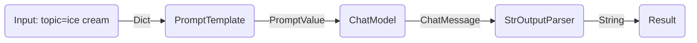
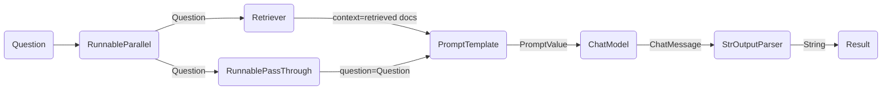

---
keywords:
- chain.invoke
sidebar_position: 0
title: शुरू करें
translated: true
---

LCEL से जटिल श्रृंखलाओं को बुनिyadी घटकों से बनाना आसान है, और स्ट्रीमिंग, समानांतरता और लॉगिंग जैसी बॉक्स-आउट सुविधाओं का समर्थन करता है।

## बुनियादी उदाहरण: प्रॉम्प्ट + मॉडल + आउटपुट पार्सर

सबसे बुनियादी और आम उपयोग मामला एक प्रॉम्प्ट टेम्पलेट और एक मॉडल को एक साथ जोड़ना है। यह कैसे काम करता है, यह देखने के लिए, आइए एक ऐसी श्रृंखला बनाते हैं जो एक विषय लेती है और एक चुटकुला उत्पन्न करती है:

```python
%pip install --upgrade --quiet  langchain-core langchain-community langchain-openai
```

import ChatModelTabs from "@theme/ChatModelTabs";

<ChatModelTabs openaiParams={`model="gpt-4"`} />

```python
# | output: false
# | echo: false

from langchain_openai import ChatOpenAI

model = ChatOpenAI(model="gpt-4")
```

```python
from langchain_core.output_parsers import StrOutputParser
from langchain_core.prompts import ChatPromptTemplate

prompt = ChatPromptTemplate.from_template("tell me a short joke about {topic}")
output_parser = StrOutputParser()

chain = prompt | model | output_parser

chain.invoke({"topic": "ice cream"})
```

```output
"Why don't ice creams ever get invited to parties?\n\nBecause they always drip when things heat up!"
```

इस कोड की इस पंक्ति पर ध्यान दें, जहां हम LCEL का उपयोग करके इन विभिन्न घटकों को एक एकल श्रृंखला में जोड़ते हैं:

```python
chain = prompt | model | output_parser
```

`|` प्रतीक [unix पाइप ऑपरेटर](https://en.wikipedia.org/wiki/Pipeline_(Unix)) के समान है, जो विभिन्न घटकों को एक साथ जोड़ता है, एक घटक से आउटपुट को अगले घटक के इनपुट के रूप में फ़ीड करता है।

इस श्रृंखला में उपयोगकर्ता इनपुट को प्रॉम्प्ट टेम्पलेट को पास किया जाता है, फिर प्रॉम्प्ट टेम्पलेट आउटपुट को मॉडल को पास किया जाता है, फिर मॉडल आउटपुट को आउटपुट पार्सर को पास किया जाता है। चलो प्रत्येक घटक को व्यक्तिगत रूप से देखें ताकि हम वास्तव में समझ सकें कि क्या हो रहा है।

### 1. प्रॉम्प्ट

`प्रॉम्प्ट` एक `BasePromptTemplate` है, जिसका मतलब है कि यह टेम्पलेट चर के एक डिक्शनरी को लेता है और एक `PromptValue` उत्पन्न करता है। एक `PromptValue` एक पूर्ण प्रॉम्प्ट का एक रैपर है जिसे या तो एक `LLM` (जो इनपुट के रूप में एक स्ट्रिंग लेता है) या `ChatModel` (जो इनपुट के रूप में संदेशों की एक श्रृंखला लेता है) को पास किया जा सकता है। यह या तो `BaseMessage` उत्पन्न करने या एक स्ट्रिंग उत्पन्न करने के लिए लॉजिक को परिभाषित करता है।

```python
prompt_value = prompt.invoke({"topic": "ice cream"})
prompt_value
```

```output
ChatPromptValue(messages=[HumanMessage(content='tell me a short joke about ice cream')])
```

```python
prompt_value.to_messages()
```

```output
[HumanMessage(content='tell me a short joke about ice cream')]
```

```python
prompt_value.to_string()
```

```output
'Human: tell me a short joke about ice cream'
```

### 2. मॉडल

`PromptValue` को फिर `model` को पास किया जाता है। इस मामले में हमारा `model` एक `ChatModel` है, जिसका मतलब है कि यह एक `BaseMessage` उत्पन्न करेगा।

```python
message = model.invoke(prompt_value)
message
```

```output
AIMessage(content="Why don't ice creams ever get invited to parties?\n\nBecause they always bring a melt down!")
```

यदि हमारा `model` एक `LLM` होता, तो यह एक स्ट्रिंग उत्पन्न करता।

```python
from langchain_openai import OpenAI

llm = OpenAI(model="gpt-3.5-turbo-instruct")
llm.invoke(prompt_value)
```

```output
'\n\nRobot: Why did the ice cream truck break down? Because it had a meltdown!'
```

### 3. आउटपुट पार्सर

और अंत में हम अपने `model` आउटपुट को `output_parser` को पास करते हैं, जो एक `BaseOutputParser` है, जिसका मतलब है कि यह या तो एक स्ट्रिंग या एक `BaseMessage` को इनपुट के रूप में लेता है। विशिष्ट `StrOutputParser` केवल किसी भी इनपुट को एक स्ट्रिंग में परिवर्तित करता है।

```python
output_parser.invoke(message)
```

```output
"Why did the ice cream go to therapy? \n\nBecause it had too many toppings and couldn't find its cone-fidence!"
```

### 4. पूरी पाइपलाइन

चरणों का पालन करने के लिए:

1. हम `{"topic": "ice cream"}` के रूप में इच्छित विषय पर उपयोगकर्ता इनपुट पास करते हैं
2. `prompt` घटक उपयोगकर्ता इनपुट को लेता है, जिसका उपयोग फिर `topic` का उपयोग करके एक PromptValue बनाने के लिए किया जाता है।
3. `model` घटक जनरेट किए गए प्रॉम्प्ट को लेता है, और इसे मूल्यांकन के लिए OpenAI LLM मॉडल में पास करता है। मॉडल से जनरेट किया गया आउटपुट एक `ChatMessage` ऑब्जेक्ट है।
4. अंत में, `output_parser` घटक एक `ChatMessage` को लेता है, और इसे एक Python स्ट्रिंग में रूपांतरित करता है, जो invoke विधि से वापस लौटता है।



:::info

ध्यान दें कि यदि आप किसी भी घटकों के आउटपुट के बारे में जानने में रुचि रखते हैं, तो आप हमेशा `prompt` या `prompt | model` जैसे एक छोटे संस्करण की श्रृंखला का परीक्षण कर सकते हैं ताकि आप मध्यवर्ती परिणामों को देख सकें:

:::

```python
input = {"topic": "ice cream"}

prompt.invoke(input)
# > ChatPromptValue(messages=[HumanMessage(content='tell me a short joke about ice cream')])

(prompt | model).invoke(input)
# > AIMessage(content="Why did the ice cream go to therapy?\nBecause it had too many toppings and couldn't cone-trol itself!")
```

## RAG Search Example

हमारे अगले उदाहरण में, हम एक पुनर्प्राप्ति-वर्धित उत्पादन श्रृंखला चलाना चाहते हैं ताकि प्रश्नों के जवाब देते समय कुछ संदर्भ जोड़ा जा सके।

<ChatModelTabs />

```python
# Requires:
# pip install langchain docarray tiktoken

from langchain_community.vectorstores import DocArrayInMemorySearch
from langchain_core.output_parsers import StrOutputParser
from langchain_core.prompts import ChatPromptTemplate
from langchain_core.runnables import RunnableParallel, RunnablePassthrough
from langchain_openai import OpenAIEmbeddings

vectorstore = DocArrayInMemorySearch.from_texts(
    ["harrison worked at kensho", "bears like to eat honey"],
    embedding=OpenAIEmbeddings(),
)
retriever = vectorstore.as_retriever()

template = """Answer the question based only on the following context:
{context}

Question: {question}
"""
prompt = ChatPromptTemplate.from_template(template)
output_parser = StrOutputParser()

setup_and_retrieval = RunnableParallel(
    {"context": retriever, "question": RunnablePassthrough()}
)
chain = setup_and_retrieval | prompt | model | output_parser

chain.invoke("where did harrison work?")
```

इस मामले में, संयुक्त श्रृंखला है:

```python
chain = setup_and_retrieval | prompt | model | output_parser
```

इसे समझाने के लिए, हम पहले देख सकते हैं कि ऊपर दिए गए प्रॉम्प्ट टेम्प्लेट में `context` और `question` मूल्य प्रतिस्थापित किए जाते हैं। प्रॉम्प्ट टेम्प्लेट बनाने से पहले, हम खोज के संबंधित दस्तावेजों को पुनर्प्राप्त करना और उन्हें संदर्भ का हिस्सा के रूप में शामिल करना चाहते हैं।

एक प्रारंभिक कदम के रूप में, हमने एक मेमोरी स्टोर का उपयोग करके रिट्रीवर सेट किया है, जो क्वेरी के आधार पर दस्तावेजों को पुनर्प्राप्त कर सकता है। यह एक चलने योग्य घटक भी है जिसे अन्य घटकों के साथ श्रृंखलाबद्ध किया जा सकता है, लेकिन आप इसे अलग से चलाने का भी प्रयास कर सकते हैं:

```python
retriever.invoke("where did harrison work?")
```

हम फिर `RunnableParallel` का उपयोग करते हैं ताकि पुनर्प्राप्त दस्तावेजों के प्रविष्टियों और मूल उपयोगकर्ता प्रश्न दोनों का उपयोग करके प्रॉम्प्ट के अपेक्षित इनपुट तैयार किया जा सके, जिसमें रिट्रीवर का उपयोग दस्तावेज खोज के लिए और `RunnablePassthrough` का उपयोग उपयोगकर्ता के प्रश्न को पास करने के लिए किया जाता है:

```python
setup_and_retrieval = RunnableParallel(
    {"context": retriever, "question": RunnablePassthrough()}
)
```

समीक्षा करने के लिए, पूरी श्रृंखला है:

```python
setup_and_retrieval = RunnableParallel(
    {"context": retriever, "question": RunnablePassthrough()}
)
chain = setup_and_retrieval | prompt | model | output_parser
```

प्रवाह इस प्रकार है:

1. पहले कदम `RunnableParallel` ऑब्जेक्ट बनाते हैं जिसमें दो प्रविष्टियां हैं। पहली प्रविष्टि, `context` में रिट्रीवर द्वारा पुनर्प्राप्त दस्तावेज परिणाम शामिल होंगे। दूसरी प्रविष्टि, `question` में उपयोगकर्ता का मूल प्रश्न होगा। प्रश्न को पास करने के लिए, हम `RunnablePassthrough` का उपयोग करते हैं।
2. उपरोक्त चरण से प्राप्त डिक्शनरी को `prompt` घटक को फीड करें। यह फिर उपयोगकर्ता इनपुट जो `question` है और पुनर्प्राप्त दस्तावेज जो `context` है, का उपयोग करके एक प्रॉम्प्ट बनाता है और एक PromptValue आउटपुट देता है।
3. `model` घटक जनरेट किए गए प्रॉम्प्ट को लेता है और इसे OpenAI LLM मॉडल में मूल्यांकन के लिए पास करता है। मॉडल से जनरेट किया गया आउटपुट एक `ChatMessage` ऑब्जेक्ट है।
4. अंत में, `output_parser` घटक एक `ChatMessage` लेता है और इसे Python स्ट्रिंग में रूपांतरित करता है, जो invoke विधि से वापस लौटता है।



## अगले कदम

हम आपको [LCEL के लाभ](/docs/expression_language/why) अनुभाग को पढ़ने की सलाह देते हैं ताकि आप LCEL के साथ और बिना LCEL के सामान्य कार्यक्षमता उत्पन्न करने के लिए आवश्यक कोड में एक-साथ तुलना देख सकें।
