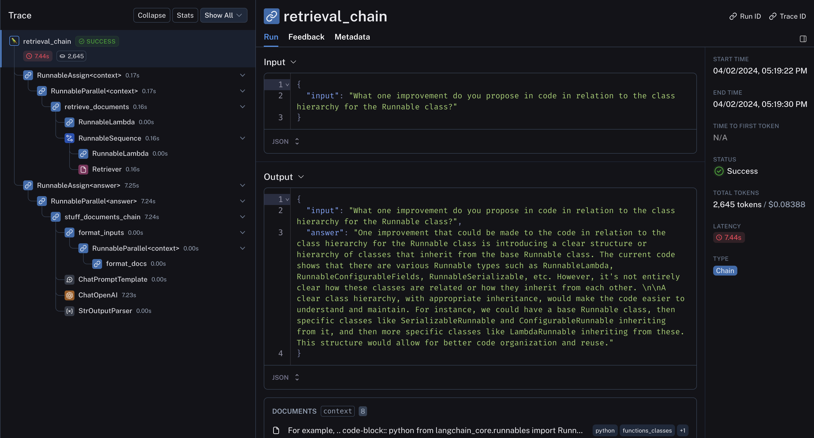

[](https://colab.research.google.com/github/langchain-ai/langchain/blob/master/docs/docs/use_cases/code_understanding.ipynb)

## उपयोग मामला

स्रोत कोड विश्लेषण एलएलएम अनुप्रयोगों में से एक सबसे लोकप्रिय है (उदाहरण के लिए, [GitHub Copilot](https://github.com/features/copilot), [Code Interpreter](https://chat.openai.com/auth/login?next=%2F%3Fmodel%3Dgpt-4-code-interpreter), [Codium](https://www.codium.ai/), और [Codeium](https://codeium.com/about))) जैसे उपयोग मामलों के लिए:

- कोड आधार को समझने के लिए प्रश्न और उत्तर
- कोड को रीफैक्टर या सुधार करने के लिए एलएलएम का उपयोग करना
- कोड को दस्तावेज़ीकरण करने के लिए एलएलएम का उपयोग करना


## अवलोकन

कोड पर प्रश्न और उत्तर के लिए पाइपलाइन [दस्तावेज़ प्रश्न उत्तर के लिए हम करते हैं](/docs/use_cases/question_answering) के कदमों का पालन करता है, कुछ अंतर के साथ:

विशेष रूप से, हम एक [विभाजन रणनीति](/docs/integrations/document_loaders/source_code) का उपयोग कर सकते हैं जो कुछ काम करता है:

* कोड में प्रत्येक शीर्ष स्तर के फ़ंक्शन और क्लास को अलग-अलग दस्तावेजों में लोड करता है।
* शेष को अलग दस्तावेज़ में रखता है।
* प्रत्येक विभाजन के बारे में मेटाडेटा को बरकरार रखता है

## त्वरित शुरुआत

```python
%pip install --upgrade --quiet langchain-openai tiktoken langchain-chroma langchain GitPython

# Set env var OPENAI_API_KEY or load from a .env file
# import dotenv

# dotenv.load_dotenv()
```

हम [इस नोटबुक](https://github.com/cristobalcl/LearningLangChain/blob/master/notebooks/04%20-%20QA%20with%20code.md) की संरचना का पालन करेंगे और [संदर्भ जागरूक कोड विभाजन](/docs/integrations/document_loaders/source_code) का उपयोग करेंगे।

### लोडिंग

हम `langchain_community.document_loaders.TextLoader` का उपयोग करके सभी पायथन प्रोजेक्ट फ़ाइलों को अपलोड करेंगे।

निम्नलिखित स्क्रिप्ट LangChain रिपॉजिटरी में मौजूद फ़ाइलों पर दौड़ती है और प्रत्येक `.py` फ़ाइल (यानी **दस्तावेज**) को लोड करती है:

```python
from git import Repo
from langchain_community.document_loaders.generic import GenericLoader
from langchain_community.document_loaders.parsers import LanguageParser
from langchain_text_splitters import Language
```

```python
# Clone
repo_path = "/Users/jacoblee/Desktop/test_repo"
repo = Repo.clone_from("https://github.com/langchain-ai/langchain", to_path=repo_path)
```

हम [`LanguageParser`](/docs/integrations/document_loaders/source_code) का उपयोग करके py कोड लोड करते हैं, जो:

* शीर्ष स्तर के फ़ंक्शन और क्लास को एक साथ रखेगा (एक ही दस्तावेज़ में)
* शेष कोड को अलग दस्तावेज़ में रखेगा
* प्रत्येक विभाजन के बारे में मेटाडेटा को बरकरार रखेगा

```python
# Load
loader = GenericLoader.from_filesystem(
    repo_path + "/libs/core/langchain_core",
    glob="**/*",
    suffixes=[".py"],
    exclude=["**/non-utf8-encoding.py"],
    parser=LanguageParser(language=Language.PYTHON, parser_threshold=500),
)
documents = loader.load()
len(documents)
```

```output
295
```

### विभाजन

एम्बेडिंग और वेक्टर स्टोरेज के लिए `Document` को टुकड़ों में विभाजित करें।

हम `RecursiveCharacterTextSplitter` का उपयोग कर सकते हैं `language` निर्दिष्ट करके।

```python
from langchain_text_splitters import RecursiveCharacterTextSplitter

python_splitter = RecursiveCharacterTextSplitter.from_language(
    language=Language.PYTHON, chunk_size=2000, chunk_overlap=200
)
texts = python_splitter.split_documents(documents)
len(texts)
```

```output
898
```

### RetrievalQA

हमें दस्तावेजों को ऐसे तरीके से संग्रहीत करने की आवश्यकता है जिससे हम उनके सामग्री को अर्थपूर्ण रूप से खोज सकें।

सबसे आम तरीका है प्रत्येक दस्तावेज़ के सामग्री को एम्बेड करना और फिर एम्बेडिंग और दस्तावेज़ को एक वेक्टर स्टोर में संग्रहीत करना।

वेक्टरस्टोर रिट्रीवर सेट करते समय:

* हम [अधिकतम सीमांत प्रासंगिकता](/docs/use_cases/question_answering) को पुनर्प्राप्ति के लिए परीक्षण करते हैं
* और 8 दस्तावेज़ लौटाते हैं

#### गहराई में जाएं

- [यहां](https://integrations.langchain.com/) 40 से अधिक वेक्टरस्टोर एकीकरण ब्राउज़ करें।
- वेक्टरस्टोर पर अधिक प्रलेखन [यहां](/docs/modules/data_connection/vectorstores/) देखें।
- [यहां](https://integrations.langchain.com/) 30 से अधिक पाठ एम्बेडिंग एकीकरण ब्राउज़ करें।
- एम्बेडिंग मॉडल पर अधिक प्रलेखन [यहां](/docs/modules/data_connection/text_embedding/) देखें।

```python
from langchain_chroma import Chroma
from langchain_openai import OpenAIEmbeddings

db = Chroma.from_documents(texts, OpenAIEmbeddings(disallowed_special=()))
retriever = db.as_retriever(
    search_type="mmr",  # Also test "similarity"
    search_kwargs={"k": 8},
)
```

### चैट

[चैटबॉट](/docs/use_cases/chatbots) के लिए हम जैसे ही चैट का परीक्षण करें।

#### गहराई में जाएं

- [यहां](https://integrations.langchain.com/) 55 से अधिक एलएलएम और चैट मॉडल एकीकरण ब्राउज़ करें।
- एलएलएम और चैट मॉडल पर अधिक प्रलेखन [यहां](/docs/modules/model_io/) देखें।
- स्थानीय एलएलएम का उपयोग करें: [PrivateGPT](https://github.com/imartinez/privateGPT) और [GPT4All](https://github.com/nomic-ai/gpt4all) की लोकप्रियता स्थानीय रूप से एलएलएम चलाने के महत्व को दर्शाती है।

```python
from langchain.chains import create_history_aware_retriever, create_retrieval_chain
from langchain.chains.combine_documents import create_stuff_documents_chain
from langchain_core.prompts import ChatPromptTemplate
from langchain_openai import ChatOpenAI

llm = ChatOpenAI(model="gpt-4")

# First we need a prompt that we can pass into an LLM to generate this search query

prompt = ChatPromptTemplate.from_messages(
    [
        ("placeholder", "{chat_history}"),
        ("user", "{input}"),
        (
            "user",
            "Given the above conversation, generate a search query to look up to get information relevant to the conversation",
        ),
    ]
)

retriever_chain = create_history_aware_retriever(llm, retriever, prompt)

prompt = ChatPromptTemplate.from_messages(
    [
        (
            "system",
            "Answer the user's questions based on the below context:\n\n{context}",
        ),
        ("placeholder", "{chat_history}"),
        ("user", "{input}"),
    ]
)
document_chain = create_stuff_documents_chain(llm, prompt)

qa = create_retrieval_chain(retriever_chain, document_chain)
```

```python
question = "What is a RunnableBinding?"
result = qa.invoke({"input": question})
result["answer"]
```

```output
'A RunnableBinding is a class in the LangChain library that is used to bind arguments to a Runnable. This is useful when a runnable in a chain requires an argument that is not in the output of the previous runnable or included in the user input. It returns a new Runnable with the bound arguments and configuration. The bind method in the RunnableBinding class is used to perform this operation.'
```

```python
questions = [
    "What classes are derived from the Runnable class?",
    "What one improvement do you propose in code in relation to the class hierarchy for the Runnable class?",
]

for question in questions:
    result = qa.invoke({"input": question})
    print(f"-> **Question**: {question} \n")
    print(f"**Answer**: {result['answer']} \n")
```

```output
-> **Question**: What classes are derived from the Runnable class?

**Answer**: The classes derived from the `Runnable` class as mentioned in the context are: `RunnableLambda`, `RunnableLearnable`, `RunnableSerializable`, `RunnableWithFallbacks`.

-> **Question**: What one improvement do you propose in code in relation to the class hierarchy for the Runnable class?

**Answer**: One potential improvement could be the introduction of abstract base classes (ABCs) or interfaces for different types of Runnable classes. Currently, it seems like there are lots of different Runnable types, like RunnableLambda, RunnableParallel, etc., each with their own methods and attributes. By defining a common interface or ABC for all these classes, we can ensure consistency and better organize the codebase. It would also make it easier to add new types of Runnable classes in the future, as they would just need to implement the methods defined in the interface or ABC.
```

फिर हम [LangSmith ट्रेस](https://smith.langchain.com/public/616f6620-f49f-46c7-8f4b-dae847705c5d/r) को देख सकते हैं कि नीचे क्या हो रहा है:

* विशेष रूप से, कोड अच्छी तरह से संरचित है और पुनर्प्राप्ति उत्पादन में एक साथ रखा गया है
* पुनर्प्राप्त कोड और चैट इतिहास को उत्तर विस्तारण के लिए एलएलएम को पास किया जाता है



### ओपन सोर्स एलएलएम

हम स्थानीय ओएसएस मॉडल को क्वेरी करने के लिए LangChain के [Ollama एकीकरण](https://ollama.com/) का उपयोग करेंगे।

उपलब्ध नवीनतम मॉडल [यहां](https://ollama.com/library) देखें।

```python
%pip install --upgrade --quiet langchain-community
```

```python
from langchain_community.chat_models.ollama import ChatOllama

llm = ChatOllama(model="codellama")
```

चलो एक सामान्य कोडिंग प्रश्न के साथ इसे चलाते हैं ताकि इसके ज्ञान को परीक्षण किया जा सके:

```python
response_message = llm.invoke(
    "In bash, how do I list all the text files in the current directory that have been modified in the last month?"
)

print(response_message.content)
print(response_message.response_metadata)
```

```output

You can use the `find` command with the `-mtime` option to find all the text files in the current directory that have been modified in the last month. Here's an example command:
\```bash
find . -type f -name "*.txt" -mtime -30
\```

This will list all the text files in the current directory (`.`) that have been modified in the last 30 days. The `-type f` option ensures that only regular files are matched, and not directories or other types of files. The `-name "*.txt"` option restricts the search to files with a `.txt` extension. Finally, the `-mtime -30` option specifies that we want to find files that have been modified in the last 30 days.

You can also use `find` command with `-mmin` option to find all the text files in the current directory that have been modified within the last month. Here's an example command:

\```bash
find . -type f -name "*.txt" -mmin -4320
\```

This will list all the text files in the current directory (`.`) that have been modified within the last 30 days. The `-type f` option ensures that only regular files are matched, and not directories or other types of files. The `-name "*.txt"` option restricts the search to files with a `.txt` extension. Finally, the `-mmin -4320` option specifies that we want to find files that have been modified within the last 4320 minutes (which is equivalent to one month).

You can also use `ls` command with `-l` option and pipe it to `grep` command to filter out the text files. Here's an example command:

\```bash
ls -l | grep "*.txt"
\```

This will list all the text files in the current directory (`.`) that have been modified within the last 30 days. The `-l` option of `ls` command lists the files in a long format, including the modification time, and the `grep` command filters out the files that do not match the specified pattern.

Please note that these commands are case-sensitive, so if you have any files with different extensions (e.g., `.TXT`), they will not be matched by these commands.
{'model': 'codellama', 'created_at': '2024-04-03T00:41:44.014203Z', 'message': {'role': 'assistant', 'content': ''}, 'done': True, 'total_duration': 27078466916, 'load_duration': 12947208, 'prompt_eval_count': 44, 'prompt_eval_duration': 11497468000, 'eval_count': 510, 'eval_duration': 15548191000}

```

यह उचित लगता है! अब इसे हमारे पहले से लोड किए गए वेक्टरस्टोर के साथ सेट करते हैं।

हम कम शक्तिशाली स्थानीय मॉडल के लिए प्रबंधनीय रखने के लिए वार्तालाप पक्ष को छोड़ देते हैं:

```python
# from langchain.chains.question_answering import load_qa_chain

# # Prompt
# template = """Use the following pieces of context to answer the question at the end.
# If you don't know the answer, just say that you don't know, don't try to make up an answer.
# Use three sentences maximum and keep the answer as concise as possible.
# {context}
# Question: {question}
# Helpful Answer:"""
# QA_CHAIN_PROMPT = PromptTemplate(
#     input_variables=["context", "question"],
#     template=template,
# )

system_template = """
Answer the user's questions based on the below context.
If you don't know the answer, just say that you don't know, don't try to make up an answer.
Use three sentences maximum and keep the answer as concise as possible:

{context}
"""

# First we need a prompt that we can pass into an LLM to generate this search query
prompt = ChatPromptTemplate.from_messages(
    [
        ("system", system_template),
        ("user", "{input}"),
    ]
)
document_chain = create_stuff_documents_chain(llm, prompt)

qa_chain = create_retrieval_chain(retriever, document_chain)
```

```python
# Run, only returning the value under the answer key for readability
qa_chain.pick("answer").invoke({"input": "What is a RunnableBinding?"})
```

```output
"A RunnableBinding is a high-level class in the LangChain framework. It's an abstraction layer that sits between a program and an LLM or other data source.\n\nThe main goal of a RunnableBinding is to enable a program, which may be a chat bot or a backend service, to fetch responses from an LLM or other data sources in a way that is easy for both the program and the data sources to use. This is achieved through a set of predefined protocols that are implemented by the RunnableBinding.\n\nThe protocols defined by a RunnableBinding include:\n\n1. Fetching inputs from the program. The RunnableBinding should be able to receive inputs from the program and translate them into a format that can be processed by the LLM or other data sources.\n2. Translating outputs from the LLM or other data sources into something that can be returned to the program. This includes converting the raw output of an LLM into something that is easier for the program to process, such as text or a structured object.\n3. Handling errors that may arise during the fetching, processing, and returning of responses from the LLM or other data sources. The RunnableBinding should be able to catch exceptions and errors that occur during these operations and return a suitable error message or response to the program.\n4. Managing concurrency and parallelism in the communication with the LLM or other data sources. This may include things like allowing multiple requests to be sent to the LLM or other data sources simultaneously, handling the responses asynchronously, and retrying failed requests.\n5. Providing a way for the program to set configuration options that affect how the RunnableBinding interacts with the LLM or other data sources. This could include things like setting up credentials, providing additional contextual information to the LLM or other data sources, and controlling logging or error handling behavior.\n\nIn summary, a RunnableBinding provides a way for a program to easily communicate with an LLM or other data sources without having to know about the details of how they work. By providing a consistent interface between the program and the data sources, the RunnableBinding enables more robust and scalable communication protocols that are easier for both parties to use.\n\nIn the context of the chatbot tutorial, a RunnableBinding may be used to fetch responses from an LLM and return them as output for the bot to process. The RunnableBinding could also be used to handle errors that occur during this process, such as providing error messages or retrying failed requests to the LLM.\n\nTo summarize:\n\n* A RunnableBinding provides a way for a program to communicate with an LLM or other data sources without having to know about the details of how they work.\n* It enables more robust and scalable communication protocols that are easier for both parties to use.\n* It manages concurrency and parallelism in the communication with the LLM or other data sources.\n* It provides a way for the program to set configuration options that affect how the RunnableBinding interacts with the LLM or other data sources."
```

पूर्ण नहीं है, लेकिन इसने यह पकड़ लिया कि यह डेवलपर को कॉन्फ़िगरेशन विकल्प सेट करने देता है!

यहां [LangSmith ट्रेस](https://smith.langchain.com/public/d8bb2af8-99cd-406b-a870-f255f4a2423c/r) है जो संदर्भ के रूप में उपयोग किए गए पुनर्प्राप्त दस्तावेज़ दिखाता है।
