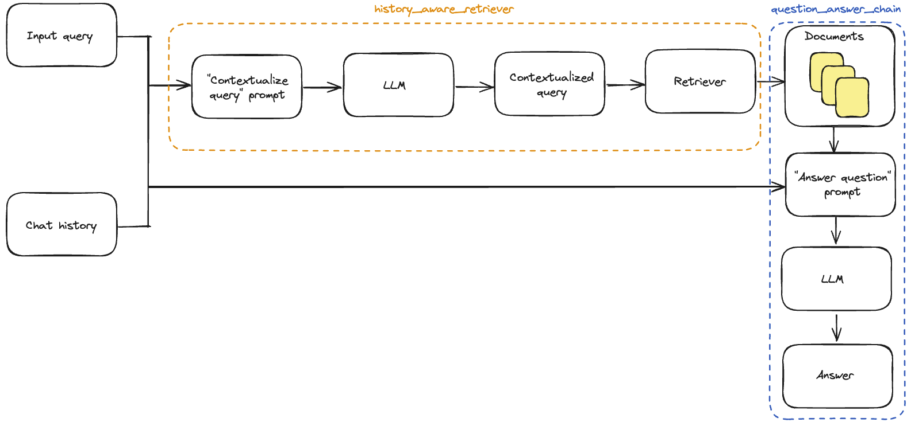

# चैट इतिहास जोड़ें

कई प्रश्न-उत्तर अनुप्रयोगों में हम उपयोगकर्ता को पूछताछ करने की अनुमति देना चाहते हैं, यानी अनुप्रयोग को पिछले प्रश्नों और उत्तरों का कुछ "स्मृति" और वर्तमान सोच में उन्हें शामिल करने के लिए कुछ तर्क की आवश्यकता होती है।

इस गाइड में हम **इतिहासी संदेशों को शामिल करने के लिए तर्क जोड़ने** पर ध्यान केंद्रित करते हैं। चैट इतिहास प्रबंधन पर अधिक जानकारी [यहाँ](/docs/expression_language/how_to/message_history) कवर की गई है।

हम [LLM Powered Autonomous Agents](https://lilianweng.github.io/posts/2023-06-23-agent/) ब्लॉग पोस्ट द्वारा लिलियन वेंग में [त्वरित शुरुआत](/docs/use_cases/question_answering/quickstart) में बनाए गए प्रश्न-उत्तर ऐप पर काम करेंगे। हमें अपने मौजूदा ऐप में दो चीजों को अपडेट करने की आवश्यकता होगी:

1. **प्रोम्प्ट**: इतिहासी संदेशों को इनपुट के रूप में समर्थन करने के लिए हमारे प्रोम्प्ट को अपडेट करें।
2. **प्रश्नों को संदर्भित करना**: चैट इतिहास के संदर्भ में नवीनतम उपयोगकर्ता प्रश्न को पुनर्गठित करने के लिए एक उप-श्रृंखला जोड़ें। यह तब आवश्यक है जब नवीनतम प्रश्न पिछले संदेशों से कुछ संदर्भ का संदर्भ लेता है। उदाहरण के लिए, यदि एक उपयोगकर्ता एक अनुवर्ती प्रश्न पूछता है जैसे "क्या आप दूसरे बिंदु पर विस्तार कर सकते हैं?", तो इसे पिछले संदेश के संदर्भ के बिना समझा नहीं जा सकता। इसलिए हम इस तरह के प्रश्न के साथ पुनर्प्राप्ति प्रभावी ढंग से नहीं कर सकते।

## सेटअप

### निर्भरताएं

इस वॉकथ्रू में हम OpenAI चैट मॉडल और एम्बेडिंग और Chroma वेक्टर स्टोर का उपयोग करेंगे, लेकिन यहाँ दिखाया गया सब कुछ किसी भी [ChatModel](/docs/modules/model_io/chat/) या [LLM](/docs/modules/model_io/llms/), [Embeddings](/docs/modules/data_connection/text_embedding/), और [VectorStore](/docs/modules/data_connection/vectorstores/) या [Retriever](/docs/modules/data_connection/retrievers/) के साथ काम करता है।

हम निम्नलिखित पैकेज का उपयोग करेंगे:

```python
%pip install --upgrade --quiet  langchain langchain-community langchainhub langchain-openai langchain-chroma bs4
```

हमें `OPENAI_API_KEY` पर्यावरण चर को सेट करना होगा, जो सीधे या `.env` फ़ाइल से लोड किया जा सकता है:

```python
import getpass
import os

os.environ["OPENAI_API_KEY"] = getpass.getpass()

# import dotenv

# dotenv.load_dotenv()
```

### LangSmith

LangChain के साथ बनाई जाने वाली अधिकांश अनुप्रयोगों में एक से अधिक चरण होंगे जिनमें एलएलएम कॉल की एक से अधिक बार होगी। जैसे-जैसे ये अनुप्रयोग और अधिक जटिल होते जाते हैं, यह महत्वपूर्ण हो जाता है कि आप अपने श्रृंखला या एजेंट के अंदर क्या हो रहा है उसकी जांच कर सकें। ऐसा करने का सबसे अच्छा तरीका [LangSmith](https://smith.langchain.com) है।

ध्यान दें कि LangSmith आवश्यक नहीं है, लेकिन यह उपयोगी है। यदि आप LangSmith का उपयोग करना चाहते हैं, तो उपर्युक्त लिंक पर साइन अप करने के बाद, ट्रेस लॉगिंग शुरू करने के लिए अपने पर्यावरण चरों को सेट करना सुनिश्चित करें:

```python
os.environ["LANGCHAIN_TRACING_V2"] = "true"
os.environ["LANGCHAIN_API_KEY"] = getpass.getpass()
```

## चैट इतिहास के बिना श्रृंखला

यह वही प्रश्न-उत्तर ऐप है जिसे हमने [LLM Powered Autonomous Agents](https://lilianweng.github.io/posts/2023-06-23-agent/) ब्लॉग पोस्ट द्वारा लिलियन वेंग में [त्वरित शुरुआत](/docs/use_cases/question_answering/quickstart) में बनाया था:

```python
import bs4
from langchain import hub
from langchain_chroma import Chroma
from langchain_community.document_loaders import WebBaseLoader
from langchain_core.output_parsers import StrOutputParser
from langchain_core.runnables import RunnablePassthrough
from langchain_openai import ChatOpenAI, OpenAIEmbeddings
from langchain_text_splitters import RecursiveCharacterTextSplitter
```

```python
# Load, chunk and index the contents of the blog.
loader = WebBaseLoader(
    web_paths=("https://lilianweng.github.io/posts/2023-06-23-agent/",),
    bs_kwargs=dict(
        parse_only=bs4.SoupStrainer(
            class_=("post-content", "post-title", "post-header")
        )
    ),
)
docs = loader.load()

text_splitter = RecursiveCharacterTextSplitter(chunk_size=1000, chunk_overlap=200)
splits = text_splitter.split_documents(docs)
vectorstore = Chroma.from_documents(documents=splits, embedding=OpenAIEmbeddings())

# Retrieve and generate using the relevant snippets of the blog.
retriever = vectorstore.as_retriever()
prompt = hub.pull("rlm/rag-prompt")
llm = ChatOpenAI(model="gpt-3.5-turbo", temperature=0)


def format_docs(docs):
    return "\n\n".join(doc.page_content for doc in docs)


rag_chain = (
    {"context": retriever | format_docs, "question": RunnablePassthrough()}
    | prompt
    | llm
    | StrOutputParser()
)
```

```python
rag_chain.invoke("What is Task Decomposition?")
```

```output
'Task Decomposition is a technique used to break down complex tasks into smaller and simpler steps. This approach helps agents to plan and execute tasks more efficiently by dividing them into manageable subgoals. Task decomposition can be achieved through various methods, including using prompting techniques, task-specific instructions, or human inputs.'
```

## प्रश्न को संदर्भित करना

पहले हमें एक उप-श्रृंखला को परिभाषित करने की आवश्यकता होगी जो ऐतिहासिक संदेशों और नवीनतम उपयोगकर्ता प्रश्न को लेता है और यदि यह किसी ऐतिहासिक जानकारी का संदर्भ करता है तो प्रश्न को पुनर्गठित करता है।

हम `MessagesPlaceholder` चर का उपयोग करके एक प्रोम्प्ट का उपयोग करेंगे जिसका नाम "chat_history" है। यह हमें "chat_history" इनपुट कुंजी का उपयोग करके संदेशों की एक सूची को प्रोम्प्ट में पास करने की अनुमति देता है, और ये संदेश सिस्टम संदेश और नवीनतम प्रश्न वाले मानव संदेश के बीच में डाले जाएंगे।

ध्यान दें कि हम [create_history_aware_retriever](https://api.python.langchain.com/en/latest/chains/langchain.chains.history_aware_retriever.create_history_aware_retriever.html) हेल्पर फ़ंक्शन का उपयोग करते हैं, जो `chat_history` खाली होने के मामले को संभालता है, और अन्यथा `prompt | llm | StrOutputParser() | retriever` को क्रम में लागू करता है।

`create_history_aware_retriever` एक श्रृंखला का निर्माण करता है जो `input` और `chat_history` कुंजियों को इनपुट के रूप में स्वीकार करता है, और एक पुनर्प्राप्तकर्ता के समान आउटपुट स्कीमा है।

```python
from langchain.chains import create_history_aware_retriever
from langchain_core.prompts import ChatPromptTemplate, MessagesPlaceholder

contextualize_q_system_prompt = """Given a chat history and the latest user question \
which might reference context in the chat history, formulate a standalone question \
which can be understood without the chat history. Do NOT answer the question, \
just reformulate it if needed and otherwise return it as is."""
contextualize_q_prompt = ChatPromptTemplate.from_messages(
    [
        ("system", contextualize_q_system_prompt),
        MessagesPlaceholder("chat_history"),
        ("human", "{input}"),
    ]
)
history_aware_retriever = create_history_aware_retriever(
    llm, retriever, contextualize_q_prompt
)
```

यह श्रृंखला हमारे पुनर्प्राप्तकर्ता में इनपुट प्रश्न का एक पुनर्गठन जोड़ देती है, ताकि पुनर्प्राप्ति वार्तालाप के संदर्भ को शामिल कर सके।

## चैट इतिहास के साथ श्रृंखला

और अब हम अपनी पूर्ण प्रश्न-उत्तर श्रृंखला बना सकते हैं।

यहाँ हम [create_stuff_documents_chain](https://api.python.langchain.com/en/latest/chains/langchain.chains.combine_documents.stuff.create_stuff_documents_chain.html) का उपयोग करते हैं ताकि `question_answer_chain` उत्पन्न हो, जिसमें `context`, `chat_history`, और `input` इनपुट कुंजियां होती हैं - यह पुनर्प्राप्त संदर्भ के साथ-साथ वार्तालाप इतिहास और प्रश्न को उत्पन्न करने के लिए स्वीकार करता है।

हम अपनी अंतिम `rag_chain` को [create_retrieval_chain](https://api.python.langchain.com/en/latest/chains/langchain.chains.retrieval.create_retrieval_chain.html) के साथ बनाते हैं। यह श्रृंखला `history_aware_retriever` और `question_answer_chain` को क्रम में लागू करती है, और सुविधा के लिए पुनर्प्राप्त संदर्भ जैसे मध्यवर्ती आउटपुट को बरकरार रखती है। इसमें `input` और `chat_history` इनपुट कुंजियां होती हैं, और `input`, `chat_history`, `context`, और `answer` को अपने आउटपुट में शामिल करती है।

```python
from langchain.chains import create_retrieval_chain
from langchain.chains.combine_documents import create_stuff_documents_chain

qa_system_prompt = """You are an assistant for question-answering tasks. \
Use the following pieces of retrieved context to answer the question. \
If you don't know the answer, just say that you don't know. \
Use three sentences maximum and keep the answer concise.\

{context}"""
qa_prompt = ChatPromptTemplate.from_messages(
    [
        ("system", qa_system_prompt),
        MessagesPlaceholder("chat_history"),
        ("human", "{input}"),
    ]
)


question_answer_chain = create_stuff_documents_chain(llm, qa_prompt)

rag_chain = create_retrieval_chain(history_aware_retriever, question_answer_chain)
```

```python
from langchain_core.messages import HumanMessage

chat_history = []

question = "What is Task Decomposition?"
ai_msg_1 = rag_chain.invoke({"input": question, "chat_history": chat_history})
chat_history.extend([HumanMessage(content=question), ai_msg_1["answer"]])

second_question = "What are common ways of doing it?"
ai_msg_2 = rag_chain.invoke({"input": second_question, "chat_history": chat_history})

print(ai_msg_2["answer"])
```

```output
Task decomposition can be done in several common ways, including using Language Model (LLM) with simple prompting like "Steps for XYZ" or "What are the subgoals for achieving XYZ?", providing task-specific instructions tailored to the specific task at hand, or incorporating human inputs to guide the decomposition process. These methods help in breaking down complex tasks into smaller, more manageable subtasks for efficient execution.
```

:::tip

[LangSmith ट्रेस](https://smith.langchain.com/public/243301e4-4cc5-4e52-a6e7-8cfe9208398d/r) देखें

:::

### स्रोत वापस लौटाना

अक्सर प्रश्न-उत्तर अनुप्रयोगों में यह महत्वपूर्ण होता है कि उपयोगकर्ताओं को उन स्रोतों को दिखाया जाए जिनका उपयोग उत्तर को उत्पन्न करने के लिए किया गया था। LangChain के बिल्ट-इन `create_retrieval_chain` `"context"` कुंजी में पुनर्प्राप्त स्रोत दस्तावेजों को प्रसारित करेगा:

```python
for document in ai_msg_2["context"]:
    print(document)
    print()
```

```output
page_content='Tree of Thoughts (Yao et al. 2023) extends CoT by exploring multiple reasoning possibilities at each step. It first decomposes the problem into multiple thought steps and generates multiple thoughts per step, creating a tree structure. The search process can be BFS (breadth-first search) or DFS (depth-first search) with each state evaluated by a classifier (via a prompt) or majority vote.\nTask decomposition can be done (1) by LLM with simple prompting like "Steps for XYZ.\\n1.", "What are the subgoals for achieving XYZ?", (2) by using task-specific instructions; e.g. "Write a story outline." for writing a novel, or (3) with human inputs.' metadata={'source': 'https://lilianweng.github.io/posts/2023-06-23-agent/'}

page_content='Fig. 1. Overview of a LLM-powered autonomous agent system.\nComponent One: Planning#\nA complicated task usually involves many steps. An agent needs to know what they are and plan ahead.\nTask Decomposition#\nChain of thought (CoT; Wei et al. 2022) has become a standard prompting technique for enhancing model performance on complex tasks. The model is instructed to “think step by step” to utilize more test-time computation to decompose hard tasks into smaller and simpler steps. CoT transforms big tasks into multiple manageable tasks and shed lights into an interpretation of the model’s thinking process.' metadata={'source': 'https://lilianweng.github.io/posts/2023-06-23-agent/'}

page_content='Resources:\n1. Internet access for searches and information gathering.\n2. Long Term memory management.\n3. GPT-3.5 powered Agents for delegation of simple tasks.\n4. File output.\n\nPerformance Evaluation:\n1. Continuously review and analyze your actions to ensure you are performing to the best of your abilities.\n2. Constructively self-criticize your big-picture behavior constantly.\n3. Reflect on past decisions and strategies to refine your approach.\n4. Every command has a cost, so be smart and efficient. Aim to complete tasks in the least number of steps.' metadata={'source': 'https://lilianweng.github.io/posts/2023-06-23-agent/'}

page_content='Fig. 11. Illustration of how HuggingGPT works. (Image source: Shen et al. 2023)\nThe system comprises of 4 stages:\n(1) Task planning: LLM works as the brain and parses the user requests into multiple tasks. There are four attributes associated with each task: task type, ID, dependencies, and arguments. They use few-shot examples to guide LLM to do task parsing and planning.\nInstruction:' metadata={'source': 'https://lilianweng.github.io/posts/2023-06-23-agent/'}
```

## एक साथ जोड़ना



यहां हमने ऐतिहासिक आउटपुट को शामिल करने के लिए एप्लिकेशन लॉजिक जोड़ने के बारे में जाना है, लेकिन हम अभी भी चैट इतिहास को मैन्युअल रूप से अपडेट कर रहे हैं और इसे प्रत्येक इनपुट में डाल रहे हैं। एक वास्तविक प्रश्न और उत्तर एप्लिकेशन में हमें चैट इतिहास को बनाए रखने और इसे स्वचालित रूप से डालने और अपडेट करने का कोई तरीका चाहिए।

इसके लिए हम इन्हें उपयोग कर सकते हैं:

- [BaseChatMessageHistory](/docs/modules/memory/chat_messages/): चैट इतिहास को संग्रहित करें।
- [RunnableWithMessageHistory](/docs/expression_language/how_to/message_history): एक LCEL श्रृंखला और `BaseChatMessageHistory` के लिए एक रैपर जो इनपुट में चैट इतिहास को इंजेक्ट करने और प्रत्येक कॉल के बाद इसे अपडेट करने का काम करता है।

एक स्थिर वार्तालाप श्रृंखला बनाने के लिए इन वर्गों को एक साथ कैसे उपयोग करें, इसके बारे में विस्तृत जानकारी के लिए [How to add message history (memory)](/docs/expression_language/how_to/message_history) LCEL पृष्ठ पर जाएं।

नीचे, हम दूसरे विकल्प का एक सरल उदाहरण कार्यान्वित करते हैं, जिसमें चैट इतिहास एक सरल डिक्शनरी में संग्रहित होता है।

सुविधा के लिए, हम एक ही कोड सेल में आवश्यक सभी चरणों को एक साथ जोड़ते हैं:

```python
import bs4
from langchain.chains import create_history_aware_retriever, create_retrieval_chain
from langchain.chains.combine_documents import create_stuff_documents_chain
from langchain_chroma import Chroma
from langchain_community.chat_message_histories import ChatMessageHistory
from langchain_community.document_loaders import WebBaseLoader
from langchain_core.chat_history import BaseChatMessageHistory
from langchain_core.prompts import ChatPromptTemplate, MessagesPlaceholder
from langchain_core.runnables.history import RunnableWithMessageHistory
from langchain_openai import ChatOpenAI, OpenAIEmbeddings
from langchain_text_splitters import RecursiveCharacterTextSplitter

llm = ChatOpenAI(model="gpt-3.5-turbo", temperature=0)


### Construct retriever ###
loader = WebBaseLoader(
    web_paths=("https://lilianweng.github.io/posts/2023-06-23-agent/",),
    bs_kwargs=dict(
        parse_only=bs4.SoupStrainer(
            class_=("post-content", "post-title", "post-header")
        )
    ),
)
docs = loader.load()

text_splitter = RecursiveCharacterTextSplitter(chunk_size=1000, chunk_overlap=200)
splits = text_splitter.split_documents(docs)
vectorstore = Chroma.from_documents(documents=splits, embedding=OpenAIEmbeddings())
retriever = vectorstore.as_retriever()


### Contextualize question ###
contextualize_q_system_prompt = """Given a chat history and the latest user question \
which might reference context in the chat history, formulate a standalone question \
which can be understood without the chat history. Do NOT answer the question, \
just reformulate it if needed and otherwise return it as is."""
contextualize_q_prompt = ChatPromptTemplate.from_messages(
    [
        ("system", contextualize_q_system_prompt),
        MessagesPlaceholder("chat_history"),
        ("human", "{input}"),
    ]
)
history_aware_retriever = create_history_aware_retriever(
    llm, retriever, contextualize_q_prompt
)


### Answer question ###
qa_system_prompt = """You are an assistant for question-answering tasks. \
Use the following pieces of retrieved context to answer the question. \
If you don't know the answer, just say that you don't know. \
Use three sentences maximum and keep the answer concise.\

{context}"""
qa_prompt = ChatPromptTemplate.from_messages(
    [
        ("system", qa_system_prompt),
        MessagesPlaceholder("chat_history"),
        ("human", "{input}"),
    ]
)
question_answer_chain = create_stuff_documents_chain(llm, qa_prompt)

rag_chain = create_retrieval_chain(history_aware_retriever, question_answer_chain)


### Statefully manage chat history ###
store = {}


def get_session_history(session_id: str) -> BaseChatMessageHistory:
    if session_id not in store:
        store[session_id] = ChatMessageHistory()
    return store[session_id]


conversational_rag_chain = RunnableWithMessageHistory(
    rag_chain,
    get_session_history,
    input_messages_key="input",
    history_messages_key="chat_history",
    output_messages_key="answer",
)
```

```python
conversational_rag_chain.invoke(
    {"input": "What is Task Decomposition?"},
    config={
        "configurable": {"session_id": "abc123"}
    },  # constructs a key "abc123" in `store`.
)["answer"]
```

```output
'Task decomposition is a technique used to break down complex tasks into smaller and simpler steps. This approach helps agents or models handle difficult tasks by dividing them into more manageable subtasks. It can be achieved through methods like Chain of Thought (CoT) or Tree of Thoughts, which guide the model in thinking step by step or exploring multiple reasoning possibilities at each step.'
```

```python
conversational_rag_chain.invoke(
    {"input": "What are common ways of doing it?"},
    config={"configurable": {"session_id": "abc123"}},
)["answer"]
```

```output
'Task decomposition can be done in common ways such as using Language Model (LLM) with simple prompting, task-specific instructions, or human inputs. For example, LLM can be guided with prompts like "Steps for XYZ" to break down tasks, or specific instructions like "Write a story outline" can be given for task decomposition. Additionally, human inputs can also be utilized to decompose tasks into smaller, more manageable steps.'
```
