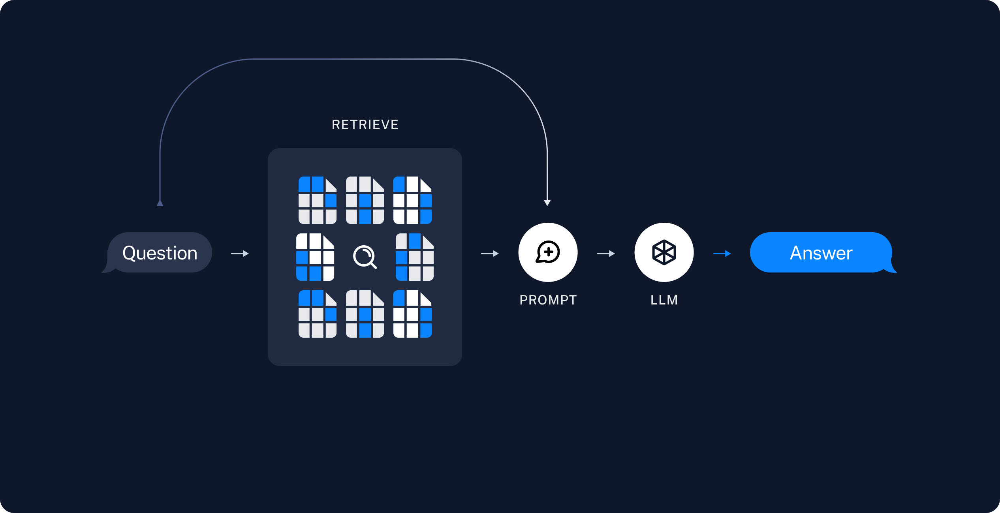

# RAG के साथ प्रश्न और उत्तर

## अवलोकन

एलएलएम द्वारा सक्षम किए गए सबसे शक्तिशाली अनुप्रयोगों में से एक है परिष्कृत प्रश्न-उत्तर (Q&A) चैटबॉट। ये ऐसे अनुप्रयोग हैं जो विशिष्ट स्रोत जानकारी के बारे में प्रश्नों का उत्तर दे सकते हैं। इन अनुप्रयोगों में रिट्रीवल ऑग्मेंटेड जनरेशन या RAG नामक तकनीक का उपयोग किया जाता है।

### RAG क्या है?

RAG एलएलएम ज्ञान को अतिरिक्त डेटा से बढ़ाने की एक तकनीक है।

एलएलएम व्यापक विषयों पर तर्क कर सकते हैं, लेकिन उनका ज्ञान उस सार्वजनिक डेटा तक सीमित है जिस पर उन्हें प्रशिक्षित किया गया था। यदि आप ऐसे AI अनुप्रयोग बनाना चाहते हैं जो निजी डेटा या मॉडल के कट-ऑफ तिथि के बाद पेश किए गए डेटा के बारे में तर्क कर सकते हैं, तो आपको मॉडल के ज्ञान को उस विशिष्ट जानकारी से बढ़ाना होगा जिसकी उसे आवश्यकता है। मॉडल प्रॉम्प्ट में उपयुक्त जानकारी लाने और उसे डालने की प्रक्रिया को रिट्रीवल ऑग्मेंटेड जनरेशन (RAG) के रूप में जाना जाता है।

LangChain में Q&A अनुप्रयोग, और RAG अनुप्रयोग सामान्य रूप से बनाने में मदद करने के लिए कई घटक हैं।

**नोट**: यहां हम अструक्चर्ड डेटा पर Q&A पर ध्यान केंद्रित करते हैं। दो RAG उपयोग मामले जिन्हें हम अन्यत्र कवर करते हैं वे हैं:

- [SQL डेटा पर Q&A](/docs/use_cases/sql/)
- [कोड पर Q&A](/docs/use_cases/code_understanding) (उदा., पायथन)

## RAG वास्तुकला

एक tyपिकल RAG अनुप्रयोग में दो मुख्य घटक होते हैं:

**अनुक्रमण**: स्रोत से डेटा को इंगेस्ट करने और उसे अनुक्रमित करने का पाइपलाइन। *यह आमतौर पर ऑफ़लाइन होता है।*

**रिट्रीवल और जनरेशन**: वास्तविक RAG श्रृंखला, जो उपयोगकर्ता के प्रश्न को रन टाइम पर लेती है और अनुक्रम से प्रासंगिक डेटा को पुनः प्राप्त करती है, फिर उसे मॉडल को पास करती है।

कच्चे डेटा से उत्तर तक का सबसे आम पूरा अनुक्रम इस प्रकार है:

#### अनुक्रमण

1. **लोड**: पहले हमें अपने डेटा को लोड करना होता है। यह [DocumentLoaders](/docs/modules/data_connection/document_loaders/) के साथ किया जाता है।
2. **विभाजन**: [Text splitters](/docs/modules/data_connection/document_transformers/) बड़े `Documents` को छोटे टुकड़ों में तोड़ देते हैं। यह न केवल डेटा अनुक्रमण के लिए उपयोगी है, बल्कि मॉडल में पास करने के लिए भी, क्योंकि बड़े टुकड़े खोजने में कठिन होते हैं और मॉडल की सीमित संदर्भ विंडो में नहीं फिट होते।
3. **संग्रह**: हमें अपने विभाजित टुकड़ों को संग्रहीत और अनुक्रमित करने के लिए कहीं जगह की आवश्यकता है, ताकि उन्हें बाद में खोजा जा सके। यह अक्सर [VectorStore](/docs/modules/data_connection/vectorstores/) और [Embeddings](/docs/modules/data_connection/text_embedding/) मॉडल का उपयोग करके किया जाता है।

#### रिट्रीवल और जनरेशन

4. **पुनः प्राप्त करना**: उपयोगकर्ता इनपुट दिए जाने पर, [Retriever](/docs/modules/data_connection/retrievers/) का उपयोग करके संग्रह से प्रासंगिक टुकड़े पुनः प्राप्त किए जाते हैं।
5. **जनरेशन**: एक [ChatModel](/docs/modules/model_io/chat) / [LLM](/docs/modules/model_io/llms/) प्रश्न और पुनः प्राप्त डेटा को शामिल करने वाले प्रॉम्प्ट का उपयोग करके उत्तर उत्पन्न करता है।

## विषय-सूची

- [त्वरित शुरुआत](/docs/use_cases/question_answering/quickstart): हम यहीं से शुरू करने की सलाह देते हैं। निम्नलिखित गाइड में से कई गाइड में यह मान लिया जाता है कि आप वास्तुकला में दिखाए गए वास्तुकला को पूरी तरह से समझते हैं।
- [स्रोतों को वापस लौटाना](/docs/use_cases/question_answering/sources): किसी विशिष्ट जनरेशन में उपयोग किए गए स्रोत दस्तावेजों को कैसे वापस लौटाया जाए।
- [स्ट्रीमिंग](/docs/use_cases/question_answering/streaming): अंतिम उत्तरों के साथ-साथ मध्यवर्ती चरणों को कैसे स्ट्रीम किया जाए।
- [चैट इतिहास जोड़ना](/docs/use_cases/question_answering/chat_history): Q&A ऐप में चैट इतिहास कैसे जोड़ा जाए।
- [हाइब्रिड खोज](/docs/use_cases/question_answering/hybrid): हाइब्रिड खोज कैसे करें।
- [प्रति-उपयोगकर्ता रिट्रीवल](/docs/use_cases/question_answering/per_user): प्रत्येक उपयोगकर्ता के पास अपना निजी डेटा होने पर रिट्रीवल कैसे करें।
- [एजेंटों का उपयोग](/docs/use_cases/question_answering/conversational_retrieval_agents): Q&A के लिए एजेंटों का कैसे उपयोग करें।
- [स्थानीय मॉडलों का उपयोग](/docs/use_cases/question_answering/local_retrieval_qa): Q&A के लिए स्थानीय मॉडलों का कैसे उपयोग करें।
