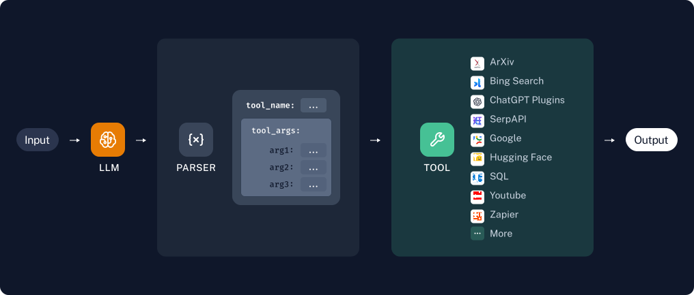

# त्वरित शुरुआत

इस गाइड में, हम Chains और Agents बनाने के मूलभूत तरीकों पर चर्चा करेंगे जो Tools को कॉल करते हैं। Tools लगभग कुछ भी हो सकते हैं - APIs, functions, databases, आदि। Tools हमें मॉडल की क्षमताओं को केवल पाठ/संदेश आउटपुट करने से परे बढ़ाने की अनुमति देते हैं। मॉडल को Tools के साथ उपयोग करने का कुंजी सही ढंग से मॉडल को प्रोम्प्ट करना और उसके प्रतिक्रिया को पार्स करना है ताकि वह सही Tools का चयन करे और उनके लिए सही इनपुट प्रदान करे।

## सेटअप

इस गाइड के लिए हमें निम्नलिखित पैकेज इंस्टॉल करने की आवश्यकता होगी:

```python
%pip install --upgrade --quiet langchain
```

यदि आप अपने रनों को [LangSmith](/docs/langsmith/) में ट्रेस करना चाहते हैं, तो निम्नलिखित पर्यावरण चर को अनकमेंट और सेट करें:

```python
import getpass
import os

# os.environ["LANGCHAIN_TRACING_V2"] = "true"
# os.environ["LANGCHAIN_API_KEY"] = getpass.getpass()
```

## एक टूल बनाएं

पहले, हमें एक टूल बनाना होगा जिसे हम कॉल कर सकें। इस उदाहरण के लिए, हम एक कस्टम टूल को एक फ़ंक्शन से बनाएंगे। कस्टम टूल बनाने के बारे में अधिक जानकारी के लिए, कृपया [इस गाइड](/docs/modules/tools/) देखें।

```python
from langchain_core.tools import tool


@tool
def multiply(first_int: int, second_int: int) -> int:
    """Multiply two integers together."""
    return first_int * second_int
```

```python
print(multiply.name)
print(multiply.description)
print(multiply.args)
```

```output
multiply
multiply(first_int: int, second_int: int) -> int - Multiply two integers together.
{'first_int': {'title': 'First Int', 'type': 'integer'}, 'second_int': {'title': 'Second Int', 'type': 'integer'}}
```

```python
multiply.invoke({"first_int": 4, "second_int": 5})
```

```output
20
```

## Chains

यदि हमें केवल एक निश्चित संख्या में बार टूल का उपयोग करना पता है, तो हम ऐसा करने के लिए एक श्रृंखला बना सकते हैं। आइए एक सरल श्रृंखला बनाते हैं जो केवल उपयोगकर्ता-निर्दिष्ट संख्याओं को गुणा करती है।



### टूल/फ़ंक्शन कॉलिंग

LLM के साथ टूल का उपयोग करने के सबसे विश्वसनीय तरीकों में से एक टूल कॉलिंग APIs (कभी-कभी फ़ंक्शन कॉलिंग भी कहा जाता है) है। यह केवल उन मॉडलों के साथ काम करता है जो स्पष्ट रूप से टूल कॉलिंग का समर्थन करते हैं। आप देख सकते हैं कि कौन से मॉडल टूल कॉलिंग का समर्थन करते हैं [यहाँ](/docs/integrations/chat/), और टूल कॉलिंग का उपयोग करने के बारे में अधिक जानें [इस गाइड में](/docs/modules/model_io/chat/function_calling)।

पहले हम अपने मॉडल और टूल को परिभाषित करेंगे। हम केवल एक टूल, `multiply` से शुरू करेंगे।

import ChatModelTabs from "@theme/ChatModelTabs";

<ChatModelTabs customVarName="llm"/>

```python
# | echo: false
# | output: false

from langchain_openai.chat_models import ChatOpenAI

llm = ChatOpenAI(model="gpt-3.5-turbo-0125", temperature=0)
```

हम `bind_tools` का उपयोग करेंगे ताकि हर मॉडल कॉल के साथ टूल की परिभाषा पास की जा सके, ताकि मॉडल जब उचित हो तो टूल को कॉल कर सके:

```python
llm_with_tools = llm.bind_tools([multiply])
```

जब मॉडल टूल को कॉल करता है, तो यह आउटपुट के `AIMessage.tool_calls` गुण में दिखाई देगा:

```python
msg = llm_with_tools.invoke("whats 5 times forty two")
msg.tool_calls
```

```output
[{'name': 'multiply',
  'args': {'first_int': 5, 'second_int': 42},
  'id': 'call_cCP9oA3tRz7HDrjFn1FdmDaG'}]
```

[LangSmith ट्रेस यहाँ देखें](https://smith.langchain.com/public/81ff0cbd-e05b-4720-bf61-2c9807edb708/r)।

### टूल को कॉल करना

महान! हम टूल इन्वोकेशन जनरेट करने में सक्षम हैं। लेकिन क्या अगर हम वास्तव में टूल को कॉल करना चाहते हैं? ऐसा करने के लिए, हमें जनरेट की गई टूल आर्ग्स को अपने टूल में पास करना होगा। एक सरल उदाहरण के रूप में, हम केवल पहले टूल_कॉल के तर्कों को निकालेंगे:

```python
from operator import itemgetter

chain = llm_with_tools | (lambda x: x.tool_calls[0]["args"]) | multiply
chain.invoke("What's four times 23")
```

```output
92
```

[LangSmith ट्रेस यहाँ देखें](https://smith.langchain.com/public/16bbabb9-fc9b-41e5-a33d-487c42df4f85/r)।

## Agents

जब हम जानते हैं कि किसी भी उपयोगकर्ता इनपुट के लिए टूल का उपयोग करने की विशिष्ट अनुक्रम की आवश्यकता है, तो Chains महान हैं। लेकिन कुछ उपयोग मामलों में, हम टूल का उपयोग कितनी बार करते हैं, यह इनपुट पर निर्भर करता है। इन मामलों में, हम मॉडल को खुद तय करने देना चाहते हैं कि वह टूल का उपयोग कितनी बार और किस क्रम में करे। [Agents](/docs/modules/agents/) हमें ऐसा करने देते हैं।

LangChain में कई बिल्ट-इन एजेंट हैं जो विभिन्न उपयोग मामलों के लिए अनुकूलित हैं। सभी [एजेंट प्रकारों](/docs/modules/agents/agent_types/) के बारे में पढ़ें।

हम [टूल कॉलिंग एजेंट](/docs/modules/agents/agent_types/tool_calling/) का उपयोग करेंगे, जो आम तौर पर सबसे विश्वसनीय प्रकार है और अधिकांश उपयोग मामलों के लिए अनुशंसित है।


```python
from langchain import hub
from langchain.agents import AgentExecutor, create_tool_calling_agent
```

```python
# Get the prompt to use - can be replaced with any prompt that includes variables "agent_scratchpad" and "input"!
prompt = hub.pull("hwchase17/openai-tools-agent")
prompt.pretty_print()
```

```output
================================ System Message ================================

You are a helpful assistant

============================= Messages Placeholder =============================

{chat_history}

================================ Human Message =================================

{input}

============================= Messages Placeholder =============================

{agent_scratchpad}
```

एजेंट इसलिए भी महान हैं क्योंकि वे एक से अधिक टूल का उपयोग करना आसान बनाते हैं। [एक से अधिक टूल वाली श्रृंखलाओं](/docs/use_cases/tool_use/multiple_tools) को बनाने के बारे में जानने के लिए, कृपया उस पृष्ठ देखें।

```python
@tool
def add(first_int: int, second_int: int) -> int:
    "Add two integers."
    return first_int + second_int


@tool
def exponentiate(base: int, exponent: int) -> int:
    "Exponentiate the base to the exponent power."
    return base**exponent


tools = [multiply, add, exponentiate]
```

```python
# Construct the tool calling agent
agent = create_tool_calling_agent(llm, tools, prompt)
```

```python
# Create an agent executor by passing in the agent and tools
agent_executor = AgentExecutor(agent=agent, tools=tools, verbose=True)
```

एक एजेंट के साथ, हम ऐसे प्रश्न पूछ सकते हैं जो हमारे टूल का अनिश्चित संख्या में उपयोग करते हैं:

```python
agent_executor.invoke(
    {
        "input": "Take 3 to the fifth power and multiply that by the sum of twelve and three, then square the whole result"
    }
)
```

```output


> Entering new AgentExecutor chain...

Invoking: `exponentiate` with `{'base': 3, 'exponent': 5}`


243
Invoking: `add` with `{'first_int': 12, 'second_int': 3}`


15
Invoking: `multiply` with `{'first_int': 243, 'second_int': 15}`


3645
Invoking: `exponentiate` with `{'base': 405, 'exponent': 2}`


164025The result of taking 3 to the fifth power is 243.

The sum of twelve and three is 15.

Multiplying 243 by 15 gives 3645.

Finally, squaring 3645 gives 164025.

> Finished chain.
```

```output
{'input': 'Take 3 to the fifth power and multiply that by the sum of twelve and three, then square the whole result',
 'output': 'The result of taking 3 to the fifth power is 243. \n\nThe sum of twelve and three is 15. \n\nMultiplying 243 by 15 gives 3645. \n\nFinally, squaring 3645 gives 164025.'}
```

[LangSmith ट्रेस यहाँ देखें](https://smith.langchain.com/public/eeeb27a4-a2f8-4f06-a3af-9c983f76146c/r)।

## अगले कदम

यहाँ हमने Chains और Agents के साथ टूल का उपयोग करने के मूलभूत तरीकों पर चर्चा की है। हम निम्नलिखित खंडों का अन्वेषण करने की सिफारिश करते हैं:

- [Agents](/docs/modules/agents/): एजेंट से संबंधित सब कुछ।
- [एक से अधिक टूल का चयन करना](/docs/use_cases/tool_use/multiple_tools): कई टूल का उपयोग करने वाली श्रृंखलाएं बनाने के बारे में।
- [टूल उपयोग के लिए प्रोम्प्टिंग](/docs/use_cases/tool_use/prompting): फ़ंक्शन-कॉलिंग APIs का उपयोग किए बिना टूल श्रृंखलाएं बनाने के बारे में।
- [समानांतर टूल उपयोग](/docs/use_cases/tool_use/parallel): एक साथ कई टूल को कॉल करने वाली श्रृंखलाएं बनाने के बारे में।
