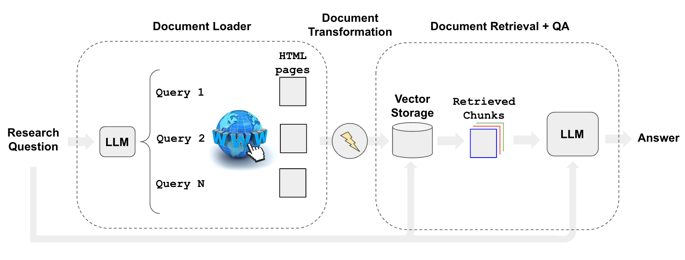

[](https://colab.research.google.com/github/langchain-ai/langchain/blob/master/docs/docs/use_cases/web_scraping.ipynb)

## उपयोग का मामला

[वेब रिसर्च](https://blog.langchain.dev/automating-web-research/) LLM अनुप्रयोगों में से एक है:

* उपयोगकर्ताओं ने इसे अपने शीर्ष वांछित एआई उपकरणों में से एक के रूप में [हाइलाइट किया है](https://twitter.com/GregKamradt/status/1679913813297225729?s=20)।
* [gpt-researcher](https://github.com/assafelovic/gpt-researcher) जैसे OSS रेपो लोकप्रियता में बढ़ रहे हैं।


## अवलोकन

वेब से सामग्री एकत्रित करने के कुछ घटक हैं:

* `खोज`: यूआरएल के लिए क्वेरी (उदा., `GoogleSearchAPIWrapper` का उपयोग करके)।
* `लोडिंग`: यूआरएल से HTML (उदा., `AsyncHtmlLoader`, `AsyncChromiumLoader`, आदि का उपयोग करके)।
* `ट्रांसफॉर्मिंग`: HTML से स्वरूपित पाठ (उदा., `HTML2Text` या `Beautiful Soup` का उपयोग करके)।

## त्वरित प्रारंभ

```python
pip install -q langchain-openai langchain playwright beautifulsoup4
playwright install

# Set env var OPENAI_API_KEY or load from a .env file:
# import dotenv
# dotenv.load_dotenv()
```

Chromium के एक हेडलेस इंस्टेंस का उपयोग करके HTML सामग्री को स्क्रैप करना।

* स्क्रैपिंग प्रक्रिया की असिंक्रोनस प्रकृति को Python की asyncio लाइब्रेरी का उपयोग करके नियंत्रित किया जाता है।
* वेब पेजों के साथ वास्तविक इंटरैक्शन Playwright द्वारा नियंत्रित किया जाता है।

```python
from langchain_community.document_loaders import AsyncChromiumLoader
from langchain_community.document_transformers import BeautifulSoupTransformer

# Load HTML
loader = AsyncChromiumLoader(["https://www.wsj.com"])
html = loader.load()
```

HTML सामग्री से `<p>, <li>, <div>, और <a>` टैग जैसी टेक्स्ट सामग्री को स्क्रैप करें:

* `<p>`: पैराग्राफ टैग। यह HTML में एक पैराग्राफ को परिभाषित करता है और संबंधित वाक्यों और/या वाक्यांशों को एक साथ समूहित करने के लिए उपयोग किया जाता है।

* `<li>`: सूची आइटम टैग। इसे क्रमबद्ध (`<ol>`) और अव्यवस्थित (`<ul>`) सूचियों में व्यक्तिगत आइटमों को परिभाषित करने के लिए उपयोग किया जाता है।

* `<div>`: विभाजन टैग। यह एक ब्लॉक-स्तरीय तत्व है जिसका उपयोग अन्य इनलाइन या ब्लॉक-स्तरीय तत्वों को समूहित करने के लिए किया जाता है।

* `<a>`: एंकर टैग। इसका उपयोग हाइपरलिंक्स को परिभाषित करने के लिए किया जाता है।

* `<span>`: एक इनलाइन कंटेनर जो किसी टेक्स्ट के एक भाग, या एक दस्तावेज़ के एक भाग को मार्क अप करने के लिए उपयोग किया जाता है।

कई समाचार वेबसाइटों (उदा., WSJ, CNN) के लिए, सुर्खियाँ और सारांश सभी `<span>` टैग में होते हैं।

```python
# Transform
bs_transformer = BeautifulSoupTransformer()
docs_transformed = bs_transformer.transform_documents(html, tags_to_extract=["span"])
```

```python
# Result
docs_transformed[0].page_content[0:500]
```

```output
'English EditionEnglish中文 (Chinese)日本語 (Japanese) More Other Products from WSJBuy Side from WSJWSJ ShopWSJ Wine Other Products from WSJ Search Quotes and Companies Search Quotes and Companies 0.15% 0.03% 0.12% -0.42% 4.102% -0.69% -0.25% -0.15% -1.82% 0.24% 0.19% -1.10% About Evan His Family Reflects His Reporting How You Can Help Write a Message Life in Detention Latest News Get Email Updates Four Americans Released From Iranian Prison The Americans will remain under house arrest until they are '
```

ये `Documents` अब विभिन्न LLM ऐप्स में डाउनस्ट्रीम उपयोग के लिए तैयार हैं, जैसा कि नीचे चर्चा की गई है।

## लोडर

### AsyncHtmlLoader

[AsyncHtmlLoader](/docs/integrations/document_loaders/async_html) `aiohttp` लाइब्रेरी का उपयोग करके असिंक्रोनस HTTP अनुरोध बनाता है, जो सरल और हल्के स्क्रैपिंग के लिए उपयुक्त है।

### AsyncChromiumLoader

[AsyncChromiumLoader](/docs/integrations/document_loaders/async_chromium) Playwright का उपयोग करके एक Chromium इंस्टेंस लॉन्च करता है, जो जावास्क्रिप्ट रेंडरिंग और अधिक जटिल वेब इंटरैक्शन को संभाल सकता है।

Chromium Playwright द्वारा समर्थित ब्राउज़रों में से एक है, जो ब्राउज़र स्वचालन को नियंत्रित करने के लिए उपयोग की जाने वाली एक लाइब्रेरी है।

हेडलैस मोड का मतलब है कि ब्राउज़र बिना ग्राफिकल यूजर इंटरफेस के चल रहा है, जो आमतौर पर वेब स्क्रैपिंग के लिए उपयोग किया जाता है। 

```python
from langchain_community.document_loaders import AsyncHtmlLoader

urls = ["https://www.espn.com", "https://lilianweng.github.io/posts/2023-06-23-agent/"]
loader = AsyncHtmlLoader(urls)
docs = loader.load()
```

## ट्रांसफार्मर

### HTML2Text

[HTML2Text](/docs/integrations/document_transformers/html2text) HTML सामग्री को बिना किसी विशेष टैग हेरफेर के सादे टेक्स्ट (मार्कडाउन जैसी फॉर्मेटिंग के साथ) में सरल रूपांतरण प्रदान करता है।

यह उन परिदृश्यों के लिए सबसे उपयुक्त है जहां लक्ष्य मानव-पठनीय टेक्स्ट निकालना है बिना किसी विशिष्ट HTML तत्वों को हेरफेर किए।

### Beautiful Soup

Beautiful Soup HTML सामग्री पर अधिक सूक्ष्म नियंत्रण प्रदान करता है, जिससे विशिष्ट टैग निकालने, हटाने और सामग्री सफाई को सक्षम किया जाता है।

यह उन मामलों के लिए उपयुक्त है जहां आप विशिष्ट जानकारी निकालना और HTML सामग्री को अपनी आवश्यकताओं के अनुसार साफ करना चाहते हैं। 

```python
from langchain_community.document_loaders import AsyncHtmlLoader

urls = ["https://www.espn.com", "https://lilianweng.github.io/posts/2023-06-23-agent/"]
loader = AsyncHtmlLoader(urls)
docs = loader.load()
```

```output
Fetching pages: 100%|#############################################################################################################| 2/2 [00:00<00:00,  7.01it/s]
```

```python
from langchain_community.document_transformers import Html2TextTransformer

html2text = Html2TextTransformer()
docs_transformed = html2text.transform_documents(docs)
docs_transformed[0].page_content[0:500]
```

```output
"Skip to main content  Skip to navigation\n\n<\n\n>\n\nMenu\n\n## ESPN\n\n  * Search\n\n  *   * scores\n\n  * NFL\n  * MLB\n  * NBA\n  * NHL\n  * Soccer\n  * NCAAF\n  * …\n\n    * Women's World Cup\n    * LLWS\n    * NCAAM\n    * NCAAW\n    * Sports Betting\n    * Boxing\n    * CFL\n    * NCAA\n    * Cricket\n    * F1\n    * Golf\n    * Horse\n    * MMA\n    * NASCAR\n    * NBA G League\n    * Olympic Sports\n    * PLL\n    * Racing\n    * RN BB\n    * RN FB\n    * Rugby\n    * Tennis\n    * WNBA\n    * WWE\n    * X Games\n    * XFL\n\n  * More"
```

## निष्कर्षण के साथ स्क्रैपिंग

### कार्य फ़ंक्शन कॉलिंग के साथ LLM

वेब स्क्रैपिंग कई कारणों से चुनौतीपूर्ण है।

उनमें से एक है आधुनिक वेबसाइटों के लेआउट और सामग्री की बदलती प्रकृति, जिसके लिए स्क्रैपिंग स्क्रिप्ट को समायोजित करने की आवश्यकता होती है।

निष्कर्षण श्रृंखला के साथ फ़ंक्शन (उदा., OpenAI) का उपयोग करके, हम आपके कोड को लगातार बदलने की आवश्यकता से बचते हैं जब वेबसाइटें बदलती हैं।

हम `gpt-3.5-turbo-0613` का उपयोग कर रहे हैं OpenAI Functions फीचर तक पहुंचने की गारंटी देने के लिए (हालांकि यह लेखन के समय तक सभी के लिए उपलब्ध हो सकता है)।

हम `temperature` को `0` पर भी रख रहे हैं ताकि LLM की रैंडमनेस को कम रखा जा सके। 

```python
from langchain_openai import ChatOpenAI

llm = ChatOpenAI(temperature=0, model="gpt-3.5-turbo-0613")
```

### एक स्कीमा परिभाषित करें

अगले, आप एक स्कीमा परिभाषित करें जो यह निर्दिष्ट करता है कि आप किस प्रकार का डेटा निकालना चाहते हैं।

यहां, कुंजी नाम महत्वपूर्ण हैं क्योंकि वे LLM को बताते हैं कि वे किस प्रकार की जानकारी चाहते हैं।

इसलिए, जितना संभव हो उतना विस्तृत रहें।

इस उदाहरण में, हम केवल समाचार लेख का नाम और सारांश The Wall Street Journal वेबसाइट से स्क्रैप करना चाहते हैं। 

```python
from langchain.chains import create_extraction_chain

schema = {
    "properties": {
        "news_article_title": {"type": "string"},
        "news_article_summary": {"type": "string"},
    },
    "required": ["news_article_title", "news_article_summary"],
}


def extract(content: str, schema: dict):
    return create_extraction_chain(schema=schema, llm=llm).run(content)
```

### BeautifulSoup के साथ वेब स्क्रैपर चलाएं

जैसा कि ऊपर दिखाया गया है, हम `BeautifulSoupTransformer` का उपयोग करेंगे। 

```python
import pprint

from langchain_text_splitters import RecursiveCharacterTextSplitter


def scrape_with_playwright(urls, schema):
    loader = AsyncChromiumLoader(urls)
    docs = loader.load()
    bs_transformer = BeautifulSoupTransformer()
    docs_transformed = bs_transformer.transform_documents(
        docs, tags_to_extract=["span"]
    )
    print("Extracting content with LLM")

    # Grab the first 1000 tokens of the site
    splitter = RecursiveCharacterTextSplitter.from_tiktoken_encoder(
        chunk_size=1000, chunk_overlap=0
    )
    splits = splitter.split_documents(docs_transformed)

    # Process the first split
    extracted_content = extract(schema=schema, content=splits[0].page_content)
    pprint.pprint(extracted_content)
    return extracted_content


urls = ["https://www.wsj.com"]
extracted_content = scrape_with_playwright(urls, schema=schema)
```

```output
Extracting content with LLM
[{'news_article_summary': 'The Americans will remain under house arrest until '
                          'they are allowed to return to the U.S. in coming '
                          'weeks, following a monthslong diplomatic push by '
                          'the Biden administration.',
  'news_article_title': 'Four Americans Released From Iranian Prison'},
 {'news_article_summary': 'Price pressures continued cooling last month, with '
                          'the CPI rising a mild 0.2% from June, likely '
                          'deterring the Federal Reserve from raising interest '
                          'rates at its September meeting.',
  'news_article_title': 'Cooler July Inflation Opens Door to Fed Pause on '
                        'Rates'},
 {'news_article_summary': 'The company has decided to eliminate 27 of its 30 '
                          'clothing labels, such as Lark & Ro and Goodthreads, '
                          'as it works to fend off antitrust scrutiny and cut '
                          'costs.',
  'news_article_title': 'Amazon Cuts Dozens of House Brands'},
 {'news_article_summary': 'President Biden’s order comes on top of a slowing '
                          'Chinese economy, Covid lockdowns and rising '
                          'tensions between the two powers.',
  'news_article_title': 'U.S. Investment Ban on China Poised to Deepen Divide'},
 {'news_article_summary': 'The proposed trial date in the '
                          'election-interference case comes on the same day as '
                          'the former president’s not guilty plea on '
                          'additional Mar-a-Lago charges.',
  'news_article_title': 'Trump Should Be Tried in January, Prosecutors Tell '
                        'Judge'},
 {'news_article_summary': 'The CEO who started in June says the platform has '
                          '“an entirely different road map” for the future.',
  'news_article_title': 'Yaccarino Says X Is Watching Threads but Has Its Own '
                        'Vision'},
 {'news_article_summary': 'Students foot the bill for flagship state '
                          'universities that pour money into new buildings and '
                          'programs with little pushback.',
  'news_article_title': 'Colleges Spend Like There’s No Tomorrow. ‘These '
                        'Places Are Just Devouring Money.’'},
 {'news_article_summary': 'Wildfires fanned by hurricane winds have torn '
                          'through parts of the Hawaiian island, devastating '
                          'the popular tourist town of Lahaina.',
  'news_article_title': 'Maui Wildfires Leave at Least 36 Dead'},
 {'news_article_summary': 'After its large armored push stalled, Kyiv has '
                          'fallen back on the kind of tactics that brought it '
                          'success earlier in the war.',
  'news_article_title': 'Ukraine Uses Small-Unit Tactics to Retake Captured '
                        'Territory'},
 {'news_article_summary': 'President Guillermo Lasso says the Aug. 20 election '
                          'will proceed, as the Andean country grapples with '
                          'rising drug gang violence.',
  'news_article_title': 'Ecuador Declares State of Emergency After '
                        'Presidential Hopeful Killed'},
 {'news_article_summary': 'This year’s hurricane season, which typically runs '
                          'from June to the end of November, has been '
                          'difficult to predict, climate scientists said.',
  'news_article_title': 'Atlantic Hurricane Season Prediction Increased to '
                        '‘Above Normal,’ NOAA Says'},
 {'news_article_summary': 'The NFL is raising the price of its NFL+ streaming '
                          'packages as it adds the NFL Network and RedZone.',
  'news_article_title': 'NFL to Raise Price of NFL+ Streaming Packages as It '
                        'Adds NFL Network, RedZone'},
 {'news_article_summary': 'Russia is planning a moon mission as part of the '
                          'new space race.',
  'news_article_title': 'Russia’s Moon Mission and the New Space Race'},
 {'news_article_summary': 'Tapestry’s $8.5 billion acquisition of Capri would '
                          'create a conglomerate with more than $12 billion in '
                          'annual sales, but it would still lack the '
                          'high-wattage labels and diversity that have fueled '
                          'LVMH’s success.',
  'news_article_title': "Why the Coach and Kors Marriage Doesn't Scare LVMH"},
 {'news_article_summary': 'The Supreme Court has blocked Purdue Pharma’s $6 '
                          'billion Sackler opioid settlement.',
  'news_article_title': 'Supreme Court Blocks Purdue Pharma’s $6 Billion '
                        'Sackler Opioid Settlement'},
 {'news_article_summary': 'The Social Security COLA is expected to rise in '
                          '2024, but not by a lot.',
  'news_article_title': 'Social Security COLA Expected to Rise in 2024, but '
                        'Not by a Lot'}]
```

हम पृष्ठ पर स्क्रैप किए गए सुर्खियों की तुलना कर सकते हैं:


[LangSmith trace](https://smith.langchain.com/public/c3070198-5b13-419b-87bf-3821cdf34fa6/r) को देखते हुए, हम देख सकते हैं कि हुड के नीचे क्या चल रहा है:

* यह [extraction](docs/use_cases/extraction) में समझाए अनुसार अनुसरण कर रहा है।
* हम इनपुट टेक्स्ट पर `information_extraction` फ़ंक्शन को कॉल करते हैं।
* यह यूआरएल सामग्री से प्रदान किए गए स्कीमा को पॉप्युलेट करने का प्रयास करेगा।

## शोध स्वचालन

स्क्रैपिंग से संबंधित, हम खोजी गई सामग्री का उपयोग करते हुए विशिष्ट प्रश्नों का उत्तर देना चाह सकते हैं।

हम एक पुनःप्राप्तकर्ता का उपयोग करके [वेब रिसर्च](https://blog.langchain.dev/automating-web-research/) की प्रक्रिया को स्वचालित कर सकते हैं, जैसे कि `WebResearchRetriever`।



आवश्यकताएँ [यहां से कॉपी करें](https://github.com/langchain-ai/web-explorer/blob/main/requirements.txt):

`pip install -r requirements.txt`

`GOOGLE_CSE_ID` और `GOOGLE_API_KEY` सेट करें। 

```python
from langchain.retrievers.web_research import WebResearchRetriever
from langchain_chroma import Chroma
from langchain_community.utilities import GoogleSearchAPIWrapper
from langchain_openai import ChatOpenAI, OpenAIEmbeddings
```

```python
# Vectorstore
vectorstore = Chroma(
    embedding_function=OpenAIEmbeddings(), persist_directory="./chroma_db_oai"
)

# LLM
llm = ChatOpenAI(temperature=0)

# Search
search = GoogleSearchAPIWrapper()
```

उपरोक्त उपकरणों के साथ पुनःप्राप्तकर्ता को प्रारंभ करें:

* कई प्रासंगिक खोज क्वेरी उत्पन्न करने के लिए एक LLM का उपयोग करें (एक LLM कॉल)
* प्रत्येक क्वेरी के लिए एक खोज निष्पादित करें
* प्रत्येक क्वेरी प्रति शीर्ष K लिंक चुनें (समानांतर में कई खोज कॉल)
* सभी चयनित लिंक से जानकारी लोड करें (समानांतर में पृष्ठ स्क्रैप करें)
* उन दस्तावेज़ों को एक वेक्टरस्टोर में अनुक्रमित करें
* प्रत्येक मूल उत्पन्न खोज क्वेरी के लिए सबसे प्रासंगिक दस्तावेज़ खोजें 

```python
# Initialize
web_research_retriever = WebResearchRetriever.from_llm(
    vectorstore=vectorstore, llm=llm, search=search
)
```

```python
# Run
import logging

logging.basicConfig()
logging.getLogger("langchain.retrievers.web_research").setLevel(logging.INFO)
from langchain.chains import RetrievalQAWithSourcesChain

user_input = "How do LLM Powered Autonomous Agents work?"
qa_chain = RetrievalQAWithSourcesChain.from_chain_type(
    llm, retriever=web_research_retriever
)
result = qa_chain({"question": user_input})
result
```

```output
INFO:langchain.retrievers.web_research:Generating questions for Google Search ...
INFO:langchain.retrievers.web_research:Questions for Google Search (raw): {'question': 'How do LLM Powered Autonomous Agents work?', 'text': LineList(lines=['1. What is the functioning principle of LLM Powered Autonomous Agents?\n', '2. How do LLM Powered Autonomous Agents operate?\n'])}
INFO:langchain.retrievers.web_research:Questions for Google Search: ['1. What is the functioning principle of LLM Powered Autonomous Agents?\n', '2. How do LLM Powered Autonomous Agents operate?\n']
INFO:langchain.retrievers.web_research:Searching for relevant urls ...
INFO:langchain.retrievers.web_research:Searching for relevant urls ...
INFO:langchain.retrievers.web_research:Search results: [{'title': 'LLM Powered Autonomous Agents | Hacker News', 'link': 'https://news.ycombinator.com/item?id=36488871', 'snippet': 'Jun 26, 2023 ... Exactly. A temperature of 0 means you always pick the highest probability token (i.e. the "max" function), while a temperature of 1 means you\xa0...'}]
INFO:langchain.retrievers.web_research:Searching for relevant urls ...
INFO:langchain.retrievers.web_research:Search results: [{'title': "LLM Powered Autonomous Agents | Lil'Log", 'link': 'https://lilianweng.github.io/posts/2023-06-23-agent/', 'snippet': 'Jun 23, 2023 ... Task decomposition can be done (1) by LLM with simple prompting like "Steps for XYZ.\\n1." , "What are the subgoals for achieving XYZ?" , (2) by\xa0...'}]
INFO:langchain.retrievers.web_research:New URLs to load: []
INFO:langchain.retrievers.web_research:Grabbing most relevant splits from urls...
```

```output
{'question': 'How do LLM Powered Autonomous Agents work?',
 'answer': "LLM-powered autonomous agents work by using LLM as the agent's brain, complemented by several key components such as planning, memory, and tool use. In terms of planning, the agent breaks down large tasks into smaller subgoals and can reflect and refine its actions based on past experiences. Memory is divided into short-term memory, which is used for in-context learning, and long-term memory, which allows the agent to retain and recall information over extended periods. Tool use involves the agent calling external APIs for additional information. These agents have been used in various applications, including scientific discovery and generative agents simulation.",
 'sources': ''}
```

### गहराई में जाना

* यहाँ एक [एप्लिकेशन](https://github.com/langchain-ai/web-explorer/tree/main) है जो इस पुनःप्राप्तकर्ता को एक हल्के UI के साथ लपेटता है।

## एक वेबसाइट पर प्रश्न उत्तर

किसी विशिष्ट वेबसाइट पर प्रश्नों का उत्तर देने के लिए, आप Apify के [Website Content Crawler](https://apify.com/apify/website-content-crawler) Actor का उपयोग कर सकते हैं, जो गहराई से वेबसाइटों जैसे दस्तावेज़ीकरण, ज्ञान आधारों, सहायता केंद्रों, या ब्लॉगों को क्रॉल कर सकता है, और वेब पृष्ठों से टेक्स्ट सामग्री को निकाल सकता है।

नीचे दिए गए उदाहरण में, हम LangChain के Chat LLM मॉडल के Python दस्तावेज़ीकरण को गहराई से क्रॉल करेंगे और उस पर एक प्रश्न का उत्तर देंगे।

पहले, आवश्यकताएं स्थापित करें
`pip install apify-client langchain-openai langchain`

अगले, `OPENAI_API_KEY` और `APIFY_API_TOKEN` को अपने पर्यावरण वेरिएबल्स में सेट करें।

पूरा कोड निम्नलिखित है:

```python
from langchain.indexes import VectorstoreIndexCreator
from langchain_community.docstore.document import Document
from langchain_community.utilities import ApifyWrapper

apify = ApifyWrapper()
# Call the Actor to obtain text from the crawled webpages
loader = apify.call_actor(
    actor_id="apify/website-content-crawler",
    run_input={"startUrls": [{"url": "/docs/integrations/chat/"}]},
    dataset_mapping_function=lambda item: Document(
        page_content=item["text"] or "", metadata={"source": item["url"]}
    ),
)

# Create a vector store based on the crawled data
index = VectorstoreIndexCreator().from_loaders([loader])

# Query the vector store
query = "Are any OpenAI chat models integrated in LangChain?"
result = index.query(query)
print(result)
```

```output
 Yes, LangChain offers integration with OpenAI chat models. You can use the ChatOpenAI class to interact with OpenAI models.
```
