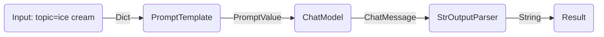
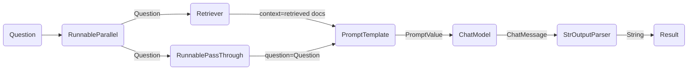

---
keywords:
- chain.invoke
sidebar_position: 0
title: 始めましょう
translated: true
---

LCELを使えば、基本的なコンポーネントから複雑なチェーンを簡単に構築でき、ストリーミング、並列処理、ログ記録などの機能がすぐに使えます。

## 基本的な例: プロンプト + モデル + 出力パーサー

最も基本的で一般的な使用例は、プロンプトテンプレートとモデルをチェーンさせることです。これがどのように機能するかを確認するために、トピックを受け取ってジョークを生成するチェーンを作成しましょう:

```python
%pip install --upgrade --quiet  langchain-core langchain-community langchain-openai
```

import ChatModelTabs from "@theme/ChatModelTabs";

<ChatModelTabs openaiParams={`model="gpt-4"`} />

```python
# | output: false
# | echo: false

from langchain_openai import ChatOpenAI

model = ChatOpenAI(model="gpt-4")
```

```python
from langchain_core.output_parsers import StrOutputParser
from langchain_core.prompts import ChatPromptTemplate

prompt = ChatPromptTemplate.from_template("tell me a short joke about {topic}")
output_parser = StrOutputParser()

chain = prompt | model | output_parser

chain.invoke({"topic": "ice cream"})
```

```output
"Why don't ice creams ever get invited to parties?\n\nBecause they always drip when things heat up!"
```

このコードの次の行に注目してください。ここでLCELを使って、これらの異なるコンポーネントを単一のチェーンにつなげています:

```python
chain = prompt | model | output_parser
```

`|`記号は[unix パイプ演算子](https://en.wikipedia.org/wiki/Pipeline_(Unix))に似ており、異なるコンポーネントをつなげ、一つのコンポーネントの出力を次のコンポーネントの入力として渡します。

このチェーンでは、ユーザー入力がプロンプトテンプレートに渡され、プロンプトテンプレートの出力がモデルに渡され、モデルの出力が出力パーサーに渡されます。それぞれのコンポーネントを個別に見ていきましょう。

### 1. プロンプト

`prompt`は`BasePromptTemplate`なので、テンプレート変数の辞書を受け取り、`PromptValue`を生成します。`PromptValue`は完成したプロンプトをラップしたものであり、`LLM`(入力として文字列を取る)や`ChatModel`(入力としてメッセージのシーケンスを取る)に渡すことができます。`BaseMessage`を生成するロジックと文字列を生成するロジックの両方を定義しているため、どちらのタイプのモデルにも対応できます。

```python
prompt_value = prompt.invoke({"topic": "ice cream"})
prompt_value
```

```output
ChatPromptValue(messages=[HumanMessage(content='tell me a short joke about ice cream')])
```

```python
prompt_value.to_messages()
```

```output
[HumanMessage(content='tell me a short joke about ice cream')]
```

```python
prompt_value.to_string()
```

```output
'Human: tell me a short joke about ice cream'
```

### 2. モデル

`PromptValue`は次に`model`に渡されます。この場合の`model`は`ChatModel`なので、`BaseMessage`を出力します。

```python
message = model.invoke(prompt_value)
message
```

```output
AIMessage(content="Why don't ice creams ever get invited to parties?\n\nBecause they always bring a melt down!")
```

`model`が`LLM`の場合は、文字列を出力します。

```python
from langchain_openai import OpenAI

llm = OpenAI(model="gpt-3.5-turbo-instruct")
llm.invoke(prompt_value)
```

```output
'\n\nRobot: Why did the ice cream truck break down? Because it had a meltdown!'
```

### 3. 出力パーサー

最後に、`model`の出力を`output_parser`に渡します。`output_parser`は`BaseOutputParser`なので、文字列または`BaseMessage`を入力として取ります。特定の`StrOutputParser`は入力を単純に文字列に変換します。

```python
output_parser.invoke(message)
```

```output
"Why did the ice cream go to therapy? \n\nBecause it had too many toppings and couldn't find its cone-fidence!"
```

### 4. 全体のパイプライン

手順を追ってみましょう:

1. ユーザー入力として`{"topic": "ice cream"}`を渡します。
2. `prompt`コンポーネントはユーザー入力を受け取り、`topic`を使ってプロンプトを構築し、`PromptValue`を生成します。
3. `model`コンポーネントは生成されたプロンプトを受け取り、OpenAI LLMモデルに渡して評価します。モデルの出力は`ChatMessage`オブジェクトです。
4. 最後に、`output_parser`コンポーネントは`ChatMessage`を受け取り、これをPythonの文字列に変換し、invoke メソッドから返します。



:::info

任意のコンポーネントの出力を確認したい場合は、`prompt`や`prompt | model`のようなチェーンの小さなバージョンをテストすることができます。

:::

```python
input = {"topic": "ice cream"}

prompt.invoke(input)
# > ChatPromptValue(messages=[HumanMessage(content='tell me a short joke about ice cream')])

(prompt | model).invoke(input)
# > AIMessage(content="Why did the ice cream go to therapy?\nBecause it had too many toppings and couldn't cone-trol itself!")
```

## RAG 検索例

次の例では、検索支援型生成チェーンを実行して、質問に対する回答にコンテキストを追加したいと思います。

<ChatModelTabs />

```python
# Requires:
# pip install langchain docarray tiktoken

from langchain_community.vectorstores import DocArrayInMemorySearch
from langchain_core.output_parsers import StrOutputParser
from langchain_core.prompts import ChatPromptTemplate
from langchain_core.runnables import RunnableParallel, RunnablePassthrough
from langchain_openai import OpenAIEmbeddings

vectorstore = DocArrayInMemorySearch.from_texts(
    ["harrison worked at kensho", "bears like to eat honey"],
    embedding=OpenAIEmbeddings(),
)
retriever = vectorstore.as_retriever()

template = """Answer the question based only on the following context:
{context}

Question: {question}
"""
prompt = ChatPromptTemplate.from_template(template)
output_parser = StrOutputParser()

setup_and_retrieval = RunnableParallel(
    {"context": retriever, "question": RunnablePassthrough()}
)
chain = setup_and_retrieval | prompt | model | output_parser

chain.invoke("where did harrison work?")
```

この場合、構成されたチェーンは次のようになります:

```python
chain = setup_and_retrieval | prompt | model | output_parser
```

これを説明すると、上記のプロンプトテンプレートでは `context` と `question` を値として置き換えることができます。プロンプトテンプレートを構築する前に、関連するドキュメントを検索し、それらをコンテキストの一部として含めたいと思います。

予備的な手順として、メモリ内ストアを使用してリトリーバーを設定しました。これにより、クエリに基づいてドキュメントを検索できます。これも実行可能なコンポーネントなので、他のコンポーネントとチェーンして使用できますが、個別に実行することもできます:

```python
retriever.invoke("where did harrison work?")
```

次に、`RunnableParallel` を使用して、検索されたドキュメントのエントリと元のユーザー質問を使用して、期待される入力を準備します。リトリーバーを使用してドキュメント検索を行い、`RunnablePassthrough` を使用してユーザーの質問を渡します:

```python
setup_and_retrieval = RunnableParallel(
    {"context": retriever, "question": RunnablePassthrough()}
)
```

完全なチェーンは次のようになります:

```python
setup_and_retrieval = RunnableParallel(
    {"context": retriever, "question": RunnablePassthrough()}
)
chain = setup_and_retrieval | prompt | model | output_parser
```

フローは次のようになります:

1. 最初のステップでは、2つのエントリを持つ `RunnableParallel` オブジェクトを作成します。最初のエントリ `context` には、リトリーバーによって取得されたドキュメントの結果が含まれます。2番目のエントリ `question` には、ユーザーの元の質問が含まれます。質問を渡すには、`RunnablePassthrough` を使用してこのエントリをコピーします。
2. 上記のステップで作成した辞書を `prompt` コンポーネントに渡します。ここでは、ユーザー入力である `question` と取得したドキュメントである `context` を使用してプロンプトを構築し、`PromptValue` を出力します。
3. `model` コンポーネントは生成されたプロンプトを受け取り、OpenAI LLM モデルに渡して評価します。モデルから生成された出力は `ChatMessage` オブジェクトです。
4. 最後に、`output_parser` コンポーネントは `ChatMessage` を受け取り、これをPythonの文字列に変換して、invoke メソッドから返します。



## 次のステップ

[LCEL の利点](/docs/expression_language/why)セクションを読むことをお勧めします。ここでは、一般的な機能を実現するために必要なコードを、LCEL を使用した場合と使用しない場合を比較しています。
