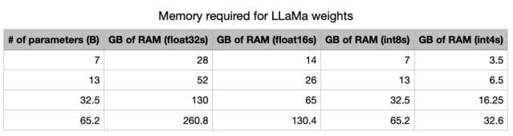

# LLMをローカルで実行する

## ユースケース

[PrivateGPT](https://github.com/imartinez/privateGPT)、[llama.cpp](https://github.com/ggerganov/llama.cpp)、[Ollama](https://github.com/ollama/ollama)、[GPT4All](https://github.com/nomic-ai/gpt4all)、[llamafile](https://github.com/Mozilla-Ocho/llamafile) などのプロジェクトの人気は、LLMをローカル（自分のデバイスで）で実行する需要を強調しています。

これには少なくとも2つの重要な利点があります：

1. `プライバシー`: データが第三者に送信されず、商業サービスの利用規約の対象とならない
2. `コスト`: 推論費用がかからず、特にトークンを多く消費するアプリケーション（例： [長時間シミュレーション](https://twitter.com/RLanceMartin/status/1691097659262820352?s=20)、要約）

## 概要

LLMをローカルで実行するにはいくつかの要件があります：

1. `オープンソースLLM`: 自由に修正および共有できるオープンソースLLM
2. `推論`: 受け入れ可能なレイテンシでデバイス上でこのLLMを実行する能力

### オープンソースLLM

ユーザーは急速に成長している[オープンソースLLM](https://cameronrwolfe.substack.com/p/the-history-of-open-source-llms-better)のセットにアクセスできるようになりました。

これらのLLMは少なくとも2つの次元で評価できます（図を参照）：

1. `ベースモデル`: ベースモデルは何で、どのように訓練されたのか？
2. `ファインチューニングアプローチ`: ベースモデルはファインチューニングされましたか？そうであれば、どの[指示セット](https://cameronrwolfe.substack.com/p/beyond-llama-the-power-of-open-llms#%C2%A7alpaca-an-instruction-following-llama-model)が使用されましたか？


これらのモデルの相対性能は、以下を含むいくつかのリーダーボードを使用して評価できます：

1. [LmSys](https://chat.lmsys.org/?arena)
2. [GPT4All](https://gpt4all.io/index.html)
3. [HuggingFace](https://huggingface.co/spaces/lmsys/chatbot-arena-leaderboard)

### 推論

これをサポートするためのいくつかのフレームワークが出現しており、様々なデバイスでのオープンソースLLMの推論をサポートしています：

1. [`llama.cpp`](https://github.com/ggerganov/llama.cpp): [ウェイト最適化/量子化](https://finbarr.ca/how-is-llama-cpp-possible/)を使用したllama推論コードのC++実装
2. [`gpt4all`](https://docs.gpt4all.io/index.html): 推論のために最適化されたCバックエンド
3. [`Ollama`](https://ollama.ai/): デバイス上で実行され、LLMを提供するアプリにモデルウェイトと環境をバンドル
4. [`llamafile`](https://github.com/Mozilla-Ocho/llamafile): モデルウェイトと必要なすべてのものを単一ファイルにバンドルし、追加のインストールステップなしにこのファイルからLLMをローカルで実行できるようにする

一般に、これらのフレームワークは以下のことを行います：

1. `量子化`: 生のモデルウェイトのメモリフットプリントを削減
2. `推論のための効率的な実装`: コンシューマーハードウェア（例：CPUまたはラップトップGPU）での推論をサポート

特に、量子化の重要性についての[この優れた投稿](https://finbarr.ca/how-is-llama-cpp-possible/)を参照してください。



精度を下げることで、LLMをメモリに格納するために必要なメモリを大幅に削減できます。

さらに、GPUメモリ帯域幅の重要性も見ることができます[シート](https://docs.google.com/spreadsheets/d/1OehfHHNSn66BP2h3Bxp2NJTVX97icU0GmCXF6pK23H8/edit#gid=0)!

Mac M2 Maxは、推論のためのGPUメモリ帯域幅が大きいため、M1よりも5-6倍高速です。


## クイックスタート

[`Ollama`](https://ollama.ai/)はmacOS上で推論を簡単に実行する方法の一つです。

詳細は[こちら](https://github.com/jmorganca/ollama?tab=readme-ov-file#ollama)の指示に従ってください。以下に要約します：

* アプリを[ダウンロードして実行](https://ollama.ai/download)します
* コマンドラインから、この[オプションのリスト](https://github.com/jmorganca/ollama)からモデルを取得します。例：`ollama pull llama2`
* アプリが実行されていると、すべてのモデルが自動的に`localhost:11434`で提供されます

```python
from langchain_community.llms import Ollama

llm = Ollama(model="llama2")
llm.invoke("The first man on the moon was ...")
```

```output
' The first man on the moon was Neil Armstrong, who landed on the moon on July 20, 1969 as part of the Apollo 11 mission. obviously.'
```

生成されている間にトークンをストリームします。

```python
from langchain.callbacks.manager import CallbackManager
from langchain.callbacks.streaming_stdout import StreamingStdOutCallbackHandler

llm = Ollama(
    model="llama2", callback_manager=CallbackManager([StreamingStdOutCallbackHandler()])
)
llm.invoke("The first man on the moon was ...")
```

```output
 The first man to walk on the moon was Neil Armstrong, an American astronaut who was part of the Apollo 11 mission in 1969. февруари 20, 1969, Armstrong stepped out of the lunar module Eagle and onto the moon's surface, famously declaring "That's one small step for man, one giant leap for mankind" as he took his first steps. He was followed by fellow astronaut Edwin "Buzz" Aldrin, who also walked on the moon during the mission.
```

```output
' The first man to walk on the moon was Neil Armstrong, an American astronaut who was part of the Apollo 11 mission in 1969. февруари 20, 1969, Armstrong stepped out of the lunar module Eagle and onto the moon\'s surface, famously declaring "That\'s one small step for man, one giant leap for mankind" as he took his first steps. He was followed by fellow astronaut Edwin "Buzz" Aldrin, who also walked on the moon during the mission.'
```

## 環境

モデルをローカルで実行する際、推論速度は課題となります（上記参照）。

レイテンシを最小限に抑えるためには、GPU上でローカルにモデルを実行することが望ましいです。これは多くの消費者用ラップトップに搭載されています（例：Appleデバイス](https://www.apple.com/newsroom/2022/06/apple-unveils-m2-with-breakthrough-performance-and-capabilities/))。

また、GPUメモリ帯域幅（上記参照）の利用可能性も重要です。

### AppleシリコンGPUの実行

`Ollama`および[`llamafile`](https://github.com/Mozilla-Ocho/llamafile?tab=readme-ov-file#gpu-support)は、AppleデバイスのGPUを自動的に利用します。

他のフレームワークでは、Apple GPUを利用するためにユーザーが環境を設定する必要があります。

例えば、`llama.cpp`のPythonバインディングは、[Metal](https://developer.apple.com/metal/)を介してGPUを使用するように設定できます。

Metalは、Appleが提供するグラフィックスおよび計算APIで、GPUへのほぼ直接的なアクセスを提供します。

[こちら](https://github.com/abetlen/llama-cpp-python/blob/main/docs/install/macos.md)のセットアップを参照してください。

特に、作成した正しい仮想環境をcondaが使用していることを確認してください（`miniforge3`）。

例：

```bash
conda activate /Users/rlm/miniforge3/envs/llama
```

上記が確認できたら：

```bash
CMAKE_ARGS="-DLLAMA_METAL=on" FORCE_CMAKE=1 pip install -U llama-cpp-python --no-cache-dir
```

## LLMs

量子化されたモデルウェイトにアクセスするための様々な方法があります。

1. [`HuggingFace`](https://huggingface.co/TheBloke) - 多くの量子化モデルがダウンロード可能で、[`llama.cpp`](https://github.com/ggerganov/llama.cpp)のようなフレームワークで実行できます。HuggingFaceから[`llamafile`形式](https://huggingface.co/models?other=llamafile)でモデルをダウンロードすることもできます。
2. [`gpt4all`](https://gpt4all.io/index.html) - モデルエクスプローラーは、ダウンロード可能なメトリックと関連する量子化モデルのリーダーボードを提供します
3. [`Ollama`](https://github.com/jmorganca/ollama) - いくつかのモデルに`pull`経由で直接アクセスできます

### Ollama

[Ollama](https://github.com/jmorganca/ollama)では、`ollama pull <model family>:<tag>`でモデルを取得できます：

* 例：Llama-7bの場合：`ollama pull llama2`は、最も基本的なバージョン（例：最小パラメータ数および4ビット量子化）のモデルをダウンロードします
* [モデルリスト](https://github.com/jmorganca/ollama?tab=readme-ov-file#model-library)から特定のバージョンを指定することもできます。例：`ollama pull llama2:13b`
* [APIリファレンスページ](https://api.python.langchain.com/en/latest/llms/langchain_community.llms.ollama.Ollama.html)で全パラメータを確認できます

```python
from langchain_community.llms import Ollama

llm = Ollama(model="llama2:13b")
llm.invoke("The first man on the moon was ... think step by step")
```

```output
' Sure! Here\'s the answer, broken down step by step:\n\nThe first man on the moon was... Neil Armstrong.\n\nHere\'s how I arrived at that answer:\n\n1. The first manned mission to land on the moon was Apollo 11.\n2. The mission included three astronauts: Neil Armstrong, Edwin "Buzz" Aldrin, and Michael Collins.\n3. Neil Armstrong was the mission commander and the first person to set foot on the moon.\n4. On July 20, 1969, Armstrong stepped out of the lunar module Eagle and onto the moon\'s surface, famously declaring "That\'s one small step for man, one giant leap for mankind."\n\nSo, the first man on the moon was Neil Armstrong!'
```

### Llama.cpp

Llama.cppは、[幅広いモデル](https://github.com/ggerganov/llama.cpp)と互換性があります。

例えば、以下では、[HuggingFace](https://huggingface.co/TheBloke/Llama-2-13B-GGML/tree/main)からダウンロードした4ビット量子化された`llama2-13b`で推論を実行します。

前述の通り、全パラメータについては[APIリファレンス](https://api.python.langchain.com/en/latest/llms/langchain.llms.llamacpp.LlamaCpp.html?highlight=llamacpp#langchain.llms.llamacpp.LlamaCpp)を参照してください。

[llama.cpp APIリファレンスドキュメント](https://api.python.langchain.com/en/latest/llms/langchain_community.llms.llamacpp.LlamaCpp.htm)から、いくつかコメントする価値のあるものを挙げます：

`n_gpu_layers`: GPUメモリにロードされるレイヤーの数

* 値: 1
* 意味: モデルの1つのレイヤーのみがGPUメモリにロードされます（1つで十分な場合が多い）。

`n_batch`: モデルが並列で処理すべきトークンの数

* 値: n_batch
* 意味: 1からn_ctx（この場合は2048に設定）までの値を選択することが推奨されます

`n_ctx`: トークンコンテキストウィンドウ

* 値: 2048
* 意味: モデルは一度に2048トークンのウィンドウを考慮します

`f16_kv`: キー/バリューキャッシュに半精度を使用するかどうか

* 値: True
* 意味: モデルは半精度を使用し、これによりメモリ効率が向上します。MetalはTrueのみをサポートします。

```python
%env CMAKE_ARGS="-DLLAMA_METAL=on"
%env FORCE_CMAKE=1
%pip install --upgrade --quiet  llama-cpp-python --no-cache-dirclear
```

```python
from langchain.callbacks.manager import CallbackManager
from langchain.callbacks.streaming_stdout import StreamingStdOutCallbackHandler
from langchain_community.llms import LlamaCpp

llm = LlamaCpp(
    model_path="/Users/rlm/Desktop/Code/llama.cpp/models/openorca-platypus2-13b.gguf.q4_0.bin",
    n_gpu_layers=1,
    n_batch=512,
    n_ctx=2048,
    f16_kv=True,
    callback_manager=CallbackManager([StreamingStdOutCallbackHandler()]),
    verbose=True,
)
```

コンソールログには、上記の手順でMetalが正しく有効化されたことを示す以下のメッセージが表示されます：

```output
ggml_metal_init: allocating
ggml_metal_init: using MPS
```

```python
llm.invoke("The first man on the moon was ... Let's think step by step")
```

```output
Llama.generate: prefix-match hit

 and use logical reasoning to figure out who the first man on the moon was.

Here are some clues:

1. The first man on the moon was an American.
2. He was part of the Apollo 11 mission.
3. He stepped out of the lunar module and became the first person to set foot on the moon's surface.
4. His last name is Armstrong.

Now, let's use our reasoning skills to figure out who the first man on the moon was. Based on clue #1, we know that the first man on the moon was an American. Clue #2 tells us that he was part of the Apollo 11 mission. Clue #3 reveals that he was the first person to set foot on the moon's surface. And finally, clue #4 gives us his last name: Armstrong.
Therefore, the first man on the moon was Neil Armstrong!


llama_print_timings:        load time =  9623.21 ms
llama_print_timings:      sample time =   143.77 ms /   203 runs   (    0.71 ms per token,  1412.01 tokens per second)
llama_print_timings: prompt eval time =   485.94 ms /     7 tokens (   69.42 ms per token,    14.40 tokens per second)
llama_print_timings:        eval time =  6385.16 ms /   202 runs   (   31.61 ms per token,    31.64 tokens per second)
llama_print_timings:       total time =  7279.28 ms
```

```output
" and use logical reasoning to figure out who the first man on the moon was.\n\nHere are some clues:\n\n1. The first man on the moon was an American.\n2. He was part of the Apollo 11 mission.\n3. He stepped out of the lunar module and became the first person to set foot on the moon's surface.\n4. His last name is Armstrong.\n\nNow, let's use our reasoning skills to figure out who the first man on the moon was. Based on clue #1, we know that the first man on the moon was an American. Clue #2 tells us that he was part of the Apollo 11 mission. Clue #3 reveals that he was the first person to set foot on the moon's surface. And finally, clue #4 gives us his last name: Armstrong.\nTherefore, the first man on the moon was Neil Armstrong!"
```

### GPT4All

[GPT4All](/docs/integrations/llms/gpt4all)モデルエクスプローラーからダウンロードしたモデルウェイトを使用できます。

上記のように、推論を実行し、[APIリファレンス](https://api.python.langchain.com/en/latest/llms/langchain_community.llms.gpt4all.GPT4All.html)を使用して興味のあるパラメータを設定できます。

```python
%pip install gpt4all
```

```python
from langchain_community.llms import GPT4All

llm = GPT4All(
    model="/Users/rlm/Desktop/Code/gpt4all/models/nous-hermes-13b.ggmlv3.q4_0.bin"
)
```

```python
llm.invoke("The first man on the moon was ... Let's think step by step")
```

```output
".\n1) The United States decides to send a manned mission to the moon.2) They choose their best astronauts and train them for this specific mission.3) They build a spacecraft that can take humans to the moon, called the Lunar Module (LM).4) They also create a larger spacecraft, called the Saturn V rocket, which will launch both the LM and the Command Service Module (CSM), which will carry the astronauts into orbit.5) The mission is planned down to the smallest detail: from the trajectory of the rockets to the exact movements of the astronauts during their moon landing.6) On July 16, 1969, the Saturn V rocket launches from Kennedy Space Center in Florida, carrying the Apollo 11 mission crew into space.7) After one and a half orbits around the Earth, the LM separates from the CSM and begins its descent to the moon's surface.8) On July 20, 1969, at 2:56 pm EDT (GMT-4), Neil Armstrong becomes the first man on the moon. He speaks these"
```

### llamafile

最も簡単な方法の一つは、[llamafile](https://github.com/Mozilla-Ocho/llamafile)を使用してLLMをローカルで実行することです。必要なのは：

1) [HuggingFace](https://huggingface.co/models?other=llamafile)からllamafileをダウンロードする
2) ファイルを実行可能にする
3) ファイルを実行する

llamafileは、モデルウェイトと、[`llama.cpp`](https://github.com/ggerganov/llama.cpp)の[特別にコンパイルされた](https://github.com/Mozilla-Ocho/llamafile?tab=readme-ov-file#technical-details)バージョンを単一のファイルにバンドルし、ほとんどのコンピュータで追加の依存関係なしに実行できます。また、モデルと対話するための[API](https://github.com/Mozilla-Ocho/llamafile/blob/main/llama.cpp/server/README.md#api-endpoints)を提供する埋め込み推論サーバーが含まれています。

以下の簡単なbashスクリプトは、すべてのセットアップ手順を示しています：

```bash
# HuggingFaceからllamafileをダウンロード
wget https://huggingface.co/jartine/TinyLlama-1.1B-Chat-v1.0-GGUF/resolve/main/TinyLlama-1.1B-Chat-v1.0.Q5_K_M.llamafile

# ファイルを実行可能にする。Windowsでは、ファイル名を「.exe」で終わるようにリネームします。
chmod +x TinyLlama-1.1B-Chat-v1.0.Q5_K_M.llamafile

# モデルサーバーを起動。デフォルトでhttp://localhost:8080でリッスンします。
./TinyLlama-1.1B-Chat-v1.0.Q5_K_M.llamafile --server --nobrowser
```

上記のセットアップ手順を実行した後、LangChainを使用してモデルと対話できます：

```python
from langchain_community.llms.llamafile import Llamafile

llm = Llamafile()

llm.invoke("The first man on the moon was ... Let's think step by step.")
```

```output
"\nFirstly, let's imagine the scene where Neil Armstrong stepped onto the moon. This happened in 1969. The first man on the moon was Neil Armstrong. We already know that.\n2nd, let's take a step back. Neil Armstrong didn't have any special powers. He had to land his spacecraft safely on the moon without injuring anyone or causing any damage. If he failed to do this, he would have been killed along with all those people who were on board the spacecraft.\n3rd, let's imagine that Neil Armstrong successfully landed his spacecraft on the moon and made it back to Earth safely. The next step was for him to be hailed as a hero by his people back home. It took years before Neil Armstrong became an American hero.\n4th, let's take another step back. Let's imagine that Neil Armstrong wasn't hailed as a hero, and instead, he was just forgotten. This happened in the 1970s. Neil Armstrong wasn't recognized for his remarkable achievement on the moon until after he died.\n5th, let's take another step back. Let's imagine that Neil Armstrong didn't die in the 1970s and instead, lived to be a hundred years old. This happened in 2036. In the year 2036, Neil Armstrong would have been a centenarian.\nNow, let's think about the present. Neil Armstrong is still alive. He turned 95 years old on July 20th, 2018. If he were to die now, his achievement of becoming the first human being to set foot on the moon would remain an unforgettable moment in history.\nI hope this helps you understand the significance and importance of Neil Armstrong's achievement on the moon!"
```

## プロンプト

いくつかのLLMは特定のプロンプトによって利益を得ることができます。

例えば、LLaMAは[特別なトークン](https://twitter.com/RLanceMartin/status/1681879318493003776?s=20)を使用します。

`ConditionalPromptSelector`を使用して、モデルタイプに基づいてプロンプトを設定できます。

```python
# 我々のLLMを設定
llm = LlamaCpp(
    model_path="/Users/rlm/Desktop/Code/llama.cpp/models/openorca-platypus2-13b.gguf.q4_0.bin",
    n_gpu_layers=1,
    n_batch=512,
    n_ctx=2048,
    f16_kv=True,
    callback_manager=CallbackManager([StreamingStdOutCallbackHandler()]),
    verbose=True,
)
```

モデルバージョンに基づいて関連プロンプトを設定します。

```python
from langchain.chains import LLMChain
from langchain.chains.prompt_selector import ConditionalPromptSelector
from langchain_core.prompts import PromptTemplate

DEFAULT_LLAMA_SEARCH_PROMPT = PromptTemplate(
    input_variables=["question"],
    template="""<<SYS>> \n You are an assistant tasked with improving Google search \
results. \n <</SYS>> \n\n [INST] Generate THREE Google search queries that \
are similar to this question. The output should be a numbered list of questions \
and each should have a question mark at the end: \n\n {question} [/INST]""",
)

DEFAULT_SEARCH_PROMPT = PromptTemplate(
    input_variables=["question"],
    template="""You are an assistant tasked with improving Google search \
results. Generate THREE Google search queries that are similar to \
this question. The output should be a numbered list of questions and each \
should have a question mark at the end: {question}""",
)

QUESTION_PROMPT_SELECTOR = ConditionalPromptSelector(
    default_prompt=DEFAULT_SEARCH_PROMPT,
    conditionals=[(lambda llm: isinstance(llm, LlamaCpp), DEFAULT_LLAMA_SEARCH_PROMPT)],
)

prompt = QUESTION_PROMPT_SELECTOR.get_prompt(llm)
prompt
```

```output
PromptTemplate(input_variables=['question'], output_parser=None, partial_variables={}, template='<<SYS>> \n You are an assistant tasked with improving Google search results. \n <</SYS>> \n\n [INST] Generate THREE Google search queries that are similar to this question. The output should be a numbered list of questions and each should have a question mark at the end: \n\n {question} [/INST]', template_format='f-string', validate_template=True)
```

```python
# チェーン
llm_chain = LLMChain(prompt=prompt, llm=llm)
question = "What NFL team won the Super Bowl in the year that Justin Bieber was born?"
llm_chain.run({"question": question})
```

```output
  Sure! Here are three similar search queries with a question mark at the end:

1. Which NBA team did LeBron James lead to a championship in the year he was drafted?
2. Who won the Grammy Awards for Best New Artist and Best Female Pop Vocal Performance in the same year that Lady Gaga was born?
3. What MLB team did Babe Ruth play for when he hit 60 home runs in a single season?


llama_print_timings:        load time = 14943.19 ms
llama_print_timings:      sample time =    72.93 ms /   101 runs   (    0.72 ms per token,  1384.87 tokens per second)
llama_print_timings: prompt eval time = 14942.95 ms /    93 tokens (  160.68 ms per token,     6.22 tokens per second)
llama_print_timings:        eval time =  3430.85 ms /   100 runs   (   34.31 ms per token,    29.15 tokens per second)
llama_print_timings:       total time = 18578.26 ms
```

```output
'  Sure! Here are three similar search queries with a question mark at the end:\n\n1. Which NBA team did LeBron James lead to a championship in the year he was drafted?\n2. Who won the Grammy Awards for Best New Artist and Best Female Pop Vocal Performance in the same year that Lady Gaga was born?\n3. What MLB team did Babe Ruth play for when he hit 60 home runs in a single season?'
```

LangChain Prompt Hubを使用して、モデル固有のプロンプトを取得および保存することもできます。

これは[LangSmith APIキー](https://docs.smith.langchain.com/)と連携します。

例えば、[ここ](https://smith.langchain.com/hub/rlm/rag-prompt-llama)にLLaMA固有のトークンを使用したRAGのプロンプトがあります。

## ユースケース

上記のいずれかのモデルから作成された`llm`を使用して、多くのユースケースに利用できます。

例えば、ローカルLLMを使用した[RAG](/docs/use_cases/question_answering/local_retrieval_qa)のガイドがあります。

一般に、ローカルLLMのユースケースは少なくとも2つの要因によって駆動される可能性があります：

* `プライバシー`: ユーザーが共有したくないプライベートデータ（例：日記など）
* `コスト`: テキスト前処理（抽出/タグ付け）、要約、およびエージェントシミュレーションはトークンを多く消費するタスクです

さらに、[ここ](https://blog.langchain.dev/using-langsmith-to-support-fine-tuning-of-open-source-llms/)でオープンソースLLMを利用したファインチューニングの概要を確認できます。
