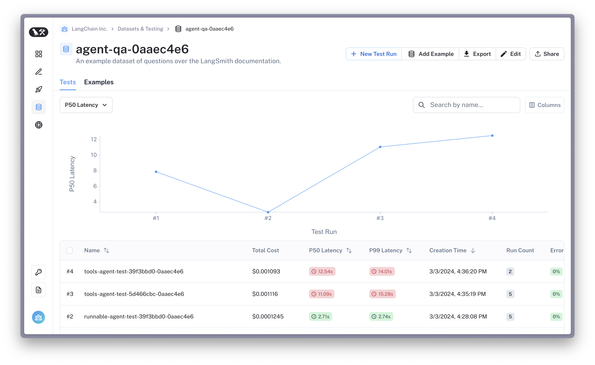

# LangSmith ウォークスルー

[](https://colab.research.google.com/github/langchain-ai/langchain/blob/master/docs/docs/langsmith/walkthrough.ipynb)

LangChainは、LLMアプリケーションやエージェントをプロトタイプ化するのが簡単です。しかし、LLMアプリケーションを本番環境に導入するのは意外と難しいかもしれません。プロンプト、チェーン、その他のコンポーネントを反復して改善する必要があります。

LangSmithは、LLMアプリケーションをデバッグ、テスト、継続的に改善するのを簡単にします。

どのような場合に役立つでしょうか? 以下のような場合に便利です:

- 新しいチェーン、エージェント、ツールセットをすばやくデバッグする
- ファインチューニング、few-shotプロンプティング、評価のためのデータセットを作成および管理する
- アプリケーションに対するリグレッションテストを実行し、開発を確実に行う
- 製品洞察と継続的な改善のための製品分析をキャプチャする

## 前提条件

**[LangSmithアカウントを作成](https://smith.langchain.com/)し、APIキーを作成してください (左下隅を参照)。[ドキュメント](https://docs.smith.langchain.com/)を確認して、プラットフォームに慣れてください**

LangSmithは閉鎖ベータ版であり、より多くのユーザーに提供するプロセス中です。ただし、ウェブサイトのフォームに記入すれば、優先的にアクセスできます。

さあ、始めましょう!

## LangSmithにログを記録する

まず、環境変数を設定して、LangChainにトレースをログに記録するよう指示します。これは、`LANGCHAIN_TRACING_V2`環境変数をtrueに設定することで行います。
ログを記録するプロジェクトを指定するには、`LANGCHAIN_PROJECT`環境変数を設定します (設定されていない場合は、`default`プロジェクトにログが記録されます)。これにより、プロジェクトが存在しない場合は自動的に作成されます。また、`LANGCHAIN_ENDPOINT`と`LANGCHAIN_API_KEY`環境変数も設定する必要があります。

トレースの設定方法の詳細については、[LangSmithドキュメント](https://docs.smith.langchain.com/docs/)を参照してください。

**注意:** Pythonでコンテキストマネージャーを使ってトレースをログに記録することもできます。

```python
from langchain_core.tracers.context import tracing_v2_enabled

with tracing_v2_enabled(project_name="My Project"):
    agent.run("How many people live in canada as of 2023?")
```

ただし、この例では環境変数を使用します。

```python
%pip install --upgrade --quiet  langchain langsmith langchainhub
%pip install --upgrade --quiet  langchain-openai tiktoken pandas duckduckgo-search
```

```python
import os
from uuid import uuid4

unique_id = uuid4().hex[0:8]
os.environ["LANGCHAIN_TRACING_V2"] = "true"
os.environ["LANGCHAIN_PROJECT"] = f"Tracing Walkthrough - {unique_id}"
os.environ["LANGCHAIN_ENDPOINT"] = "https://api.smith.langchain.com"
os.environ["LANGCHAIN_API_KEY"] = "<YOUR-API-KEY>"  # Update to your API key

# Used by the agent in this tutorial
os.environ["OPENAI_API_KEY"] = "<YOUR-OPENAI-API-KEY>"
```

APIと対話するためのLangSmithクライアントを作成します。

```python
from langsmith import Client

client = Client()
```

LangChainコンポーネントを作成し、プラットフォームにログを記録します。この例では、一般的な検索ツール(DuckDuckGo)にアクセスできるReAct形式のエージェントを作成します。エージェントのプロンプトは[Hubで確認できます](https://smith.langchain.com/hub/wfh/langsmith-agent-prompt)。

```python
from langchain import hub
from langchain.agents import AgentExecutor
from langchain.agents.format_scratchpad.openai_tools import (
    format_to_openai_tool_messages,
)
from langchain.agents.output_parsers.openai_tools import OpenAIToolsAgentOutputParser
from langchain_community.tools import DuckDuckGoSearchResults
from langchain_openai import ChatOpenAI

# Fetches the latest version of this prompt
prompt = hub.pull("wfh/langsmith-agent-prompt:5d466cbc")

llm = ChatOpenAI(
    model="gpt-3.5-turbo-16k",
    temperature=0,
)

tools = [
    DuckDuckGoSearchResults(
        name="duck_duck_go"
    ),  # General internet search using DuckDuckGo
]

llm_with_tools = llm.bind_tools(tools)

runnable_agent = (
    {
        "input": lambda x: x["input"],
        "agent_scratchpad": lambda x: format_to_openai_tool_messages(
            x["intermediate_steps"]
        ),
    }
    | prompt
    | llm_with_tools
    | OpenAIToolsAgentOutputParser()
)

agent_executor = AgentExecutor(
    agent=runnable_agent, tools=tools, handle_parsing_errors=True
)
```

レイテンシを低減するため、複数の入力に対して並行して実行しています。実行レイテンシには影響せずに、LangSmithにログが記録されます。

```python
inputs = [
    "What is LangChain?",
    "What's LangSmith?",
    "When was Llama-v2 released?",
    "What is the langsmith cookbook?",
    "When did langchain first announce the hub?",
]

results = agent_executor.batch([{"input": x} for x in inputs], return_exceptions=True)
```

```python
results[:2]
```

```output
[{'input': 'What is LangChain?',
  'output': 'I\'m sorry, but I couldn\'t find any information about "LangChain". Could you please provide more context or clarify your question?'},
 {'input': "What's LangSmith?",
  'output': 'I\'m sorry, but I couldn\'t find any information about "LangSmith". It could be a company, a product, or a person. Can you provide more context or details about what you are referring to?'}]
```

環境設定が正しくできていれば、[アプリ](https://smith.langchain.com/)の`Projects`セクションにエージェントのトレースが表示されるはずです。おめでとうございます!


しかし、エージェントがツールを効果的に使っているようには見えません。ベースラインを把握するために、これを評価しましょう。

## エージェントの評価

ログの記録に加えて、LangSmithではLLMアプリケーションのテストと評価も行えます。

このセクションでは、LangSmithを活用して、ベンチマークデータセットを作成し、エージェントに対するAI支援型の評価を行います。以下の手順で行います:

1. データセットの作成
2. ベンチマーク用の新しいエージェントの初期化
3. エージェントの出力を評価するための評価者の設定
4. データセットに対してエージェントを実行し、結果を評価する

### 1. LangSmithデータセットの作成

以下では、LangSmithクライアントを使用して、上記の入力質問とラベルのリストからデータセットを作成します。後ほど、新しいエージェントのパフォーマンスを測定するために使用します。データセットとは、入力-出力のペアで構成される、テストケースとして使用できる一連の例です。

データセットの作成方法(CSVやその他のファイルからの作成、プラットフォーム上での作成など)の詳細については、[LangSmithドキュメント](https://docs.smith.langchain.com/)を参照してください。

```python
outputs = [
    "LangChain is an open-source framework for building applications using large language models. It is also the name of the company building LangSmith.",
    "LangSmith is a unified platform for debugging, testing, and monitoring language model applications and agents powered by LangChain",
    "July 18, 2023",
    "The langsmith cookbook is a github repository containing detailed examples of how to use LangSmith to debug, evaluate, and monitor large language model-powered applications.",
    "September 5, 2023",
]
```

```python
dataset_name = f"agent-qa-{unique_id}"

dataset = client.create_dataset(
    dataset_name,
    description="An example dataset of questions over the LangSmith documentation.",
)

client.create_examples(
    inputs=[{"input": query} for query in inputs],
    outputs=[{"output": answer} for answer in outputs],
    dataset_id=dataset.id,
)
```

### 2. ベンチマーク用の新しいエージェントの初期化

LangSmithでは、任意のLLM、チェーン、エージェント、またはカスタム関数を評価できます。会話型エージェントは状態を持っている(メモリを持っている)ため、データセットの実行間でこの状態が共有されないよう、`chain_factory`(つまり`constructor`)関数を渡して初期化します。

この場合、OpenAIの関数呼び出しエンドポイントを使用するエージェントをテストします。

```python
from langchain import hub
from langchain.agents import AgentExecutor, AgentType, initialize_agent, load_tools
from langchain_openai import ChatOpenAI


# Since chains can be stateful (e.g. they can have memory), we provide
# a way to initialize a new chain for each row in the dataset. This is done
# by passing in a factory function that returns a new chain for each row.
def create_agent(prompt, llm_with_tools):
    runnable_agent = (
        {
            "input": lambda x: x["input"],
            "agent_scratchpad": lambda x: format_to_openai_tool_messages(
                x["intermediate_steps"]
            ),
        }
        | prompt
        | llm_with_tools
        | OpenAIToolsAgentOutputParser()
    )
    return AgentExecutor(agent=runnable_agent, tools=tools, handle_parsing_errors=True)
```

### 3. 評価の設定

UIでチェーンの結果を手動で比較するのは効果的ですが、時間がかかる場合があります。
自動メトリックやAI支援型のフィードバックを使用して、コンポーネントのパフォーマンスを評価するのが役立つかもしれません。

以下では、ヒューリスティック評価をログに記録するカスタムの実行評価者を作成します。

**ヒューリスティック評価者**

```python
from langsmith.evaluation import EvaluationResult
from langsmith.schemas import Example, Run


def check_not_idk(run: Run, example: Example):
    """Illustration of a custom evaluator."""
    agent_response = run.outputs["output"]
    if "don't know" in agent_response or "not sure" in agent_response:
        score = 0
    else:
        score = 1
    # You can access the dataset labels in example.outputs[key]
    # You can also access the model inputs in run.inputs[key]
    return EvaluationResult(
        key="not_uncertain",
        score=score,
    )
```

#### バッチ評価器

一部のメトリックは、個別のランや例に割り当てられることなく、全体的な "テスト" で集計されます。これは、精度、再現率、AUCなどの一般的な分類メトリックのように単純なものから、カスタムの集計メトリックまで様々です。

ランのリストとデータセットレコードのリストを受け取る関数(または呼び出し可能なもの)を定義することで、フル テストレベルでどんなバッチメトリックも定義できます。

```python
from typing import List


def max_pred_length(runs: List[Run], examples: List[Example]):
    predictions = [len(run.outputs["output"]) for run in runs]
    return EvaluationResult(key="max_pred_length", score=max(predictions))
```

以下では、上記のカスタム評価器と、次のことを行う事前実装のランの評価器を使って評価を設定します:
- 正解ラベルと結果を比較する
- 埋め込み距離を使ってセマンティックな(不)類似性を測る
- カスタムの基準を使って、エージェントの応答の "側面" をリファレンスフリーで評価する

使用例に適した評価器を選択する方法や、独自の評価器を作成する方法については、[LangSmith ドキュメンテーション](https://docs.smith.langchain.com/)を参照してください。

```python
from langchain.evaluation import EvaluatorType
from langchain.smith import RunEvalConfig

evaluation_config = RunEvalConfig(
    # Evaluators can either be an evaluator type (e.g., "qa", "criteria", "embedding_distance", etc.) or a configuration for that evaluator
    evaluators=[
        check_not_idk,
        # Measures whether a QA response is "Correct", based on a reference answer
        # You can also select via the raw string "qa"
        EvaluatorType.QA,
        # Measure the embedding distance between the output and the reference answer
        # Equivalent to: EvalConfig.EmbeddingDistance(embeddings=OpenAIEmbeddings())
        EvaluatorType.EMBEDDING_DISTANCE,
        # Grade whether the output satisfies the stated criteria.
        # You can select a default one such as "helpfulness" or provide your own.
        RunEvalConfig.LabeledCriteria("helpfulness"),
        # The LabeledScoreString evaluator outputs a score on a scale from 1-10.
        # You can use default criteria or write our own rubric
        RunEvalConfig.LabeledScoreString(
            {
                "accuracy": """
Score 1: The answer is completely unrelated to the reference.
Score 3: The answer has minor relevance but does not align with the reference.
Score 5: The answer has moderate relevance but contains inaccuracies.
Score 7: The answer aligns with the reference but has minor errors or omissions.
Score 10: The answer is completely accurate and aligns perfectly with the reference."""
            },
            normalize_by=10,
        ),
    ],
    batch_evaluators=[max_pred_length],
)
```

### 4. エージェントと評価器を実行する

[run_on_dataset](https://api.python.langchain.com/en/latest/smith/langchain.smith.evaluation.runner_utils.run_on_dataset.html#langchain.smith.evaluation.runner_utils.run_on_dataset) (または非同期の [arun_on_dataset](https://api.python.langchain.com/en/latest/smith/langchain.smith.evaluation.runner_utils.arun_on_dataset.html#langchain.smith.evaluation.runner_utils.arun_on_dataset))) 関数を使ってモデルを評価します。これにより以下のことが行われます:
1. 指定したデータセットから例行を取得する
2. 各例に対してエージェント(またはカスタム関数)を実行する
3. 得られたランのトレースと対応する参照例に評価器を適用して自動フィードバックを生成する

結果は LangSmith アプリで確認できます。

```python
from langchain import hub

# We will test this version of the prompt
prompt = hub.pull("wfh/langsmith-agent-prompt:798e7324")
```

```python
import functools

from langchain.smith import arun_on_dataset, run_on_dataset

chain_results = run_on_dataset(
    dataset_name=dataset_name,
    llm_or_chain_factory=functools.partial(
        create_agent, prompt=prompt, llm_with_tools=llm_with_tools
    ),
    evaluation=evaluation_config,
    verbose=True,
    client=client,
    project_name=f"tools-agent-test-5d466cbc-{unique_id}",
    # Project metadata communicates the experiment parameters,
    # Useful for reviewing the test results
    project_metadata={
        "env": "testing-notebook",
        "model": "gpt-3.5-turbo",
        "prompt": "5d466cbc",
    },
)

# Sometimes, the agent will error due to parsing issues, incompatible tool inputs, etc.
# These are logged as warnings here and captured as errors in the tracing UI.
```

### テスト結果を確認する

上記の出力にあるURLをクリックするか、LangSmith の "Testing & Datasets" ページに移動して、**"agent-qa-{unique_id}"** データセットのテスト結果トレースUIを確認できます。



ここでは、新しいランと選択した評価器からのフィードバックが表示されます。下部のテーブル形式の結果サマリーも確認できます。

```python
chain_results.to_dataframe()
```

### (オプション) 別のプロンプトと比較する

テストの実行結果が得られたので、エージェントに変更を加えてベンチマークすることができます。別のプロンプトで試してみましょう。

```python
candidate_prompt = hub.pull("wfh/langsmith-agent-prompt:39f3bbd0")

chain_results = run_on_dataset(
    dataset_name=dataset_name,
    llm_or_chain_factory=functools.partial(
        create_agent, prompt=candidate_prompt, llm_with_tools=llm_with_tools
    ),
    evaluation=evaluation_config,
    verbose=True,
    client=client,
    project_name=f"tools-agent-test-39f3bbd0-{unique_id}",
    project_metadata={
        "env": "testing-notebook",
        "model": "gpt-3.5-turbo",
        "prompt": "39f3bbd0",
    },
)
```

## データセットとランのエクスポート

LangSmith では、Web アプリ上で CSV やJSONLなどの一般的な形式にデータをエクスポートできます。クライアントを使ってランを取得し、自分のデータベースに保存したり、他の人と共有したりすることもできます。評価実行のランのトレースを取得してみましょう。

**注: 全てのランが利用可能になるまでしばらく時間がかかる可能性があります。**

```python
runs = client.list_runs(project_name=chain_results["project_name"], execution_order=1)
```

```python
# The resulting tests are stored in a project.  You can programmatically
# access important metadata from the test, such as the dataset version it was run on
# or your application's revision ID.
client.read_project(project_name=chain_results["project_name"]).metadata
```

```python
# After some time, the test metrics will be populated as well.
client.read_project(project_name=chain_results["project_name"]).feedback_stats
```

## まとめ

おめでとうございます! LangSmith を使ってエージェントのトレースと評価に成功しました!

これは始めるためのクイックガイドでしたが、開発フローを加速し、より良い結果を得るためのLangSmithの活用方法はまだまだあります。

LangSmith の活用方法の詳細については、[LangSmith ドキュメンテーション](https://docs.smith.langchain.com/)を確認するか、質問、機能リクエスト、フィードバックは [support@langchain.dev](mailto:support@langchain.dev) までお寄せください。
