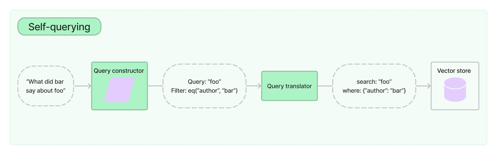

# 自己クエリ

:::info

[Integrations](/docs/integrations/retrievers/self_query) のドキュメントを参照して、組み込みの自己クエリ機能を持つベクトルストアについて学びましょう。

:::

自己クエリリトリーバーとは、名前が示すように、自身をクエリする機能を持つリトリーバーです。具体的には、自然言語のクエリを受け取ると、クエリ構築 LLM チェーンを使ってstructured クエリを書き、その structured クエリを基になるVectorStore に適用します。これにより、リトリーバーは、ユーザー入力クエリを保存されたドキュメントの内容とのセマンティック類似性比較に使うだけでなく、ユーザークエリからメタデータフィルターを抽出し、それらのフィルターを実行することもできます。



## 始めましょう

デモンストレーションのために、`Chroma` ベクトルストアを使用します。映画のサマリーを含む小さなデモセットのドキュメントを作成しました。

**注意:** 自己クエリリトリーバーを使うには、`lark` パッケージをインストールする必要があります。

```python
%pip install --upgrade --quiet  lark langchain-chroma
```

```python
from langchain_chroma import Chroma
from langchain_core.documents import Document
from langchain_openai import OpenAIEmbeddings

docs = [
    Document(
        page_content="A bunch of scientists bring back dinosaurs and mayhem breaks loose",
        metadata={"year": 1993, "rating": 7.7, "genre": "science fiction"},
    ),
    Document(
        page_content="Leo DiCaprio gets lost in a dream within a dream within a dream within a ...",
        metadata={"year": 2010, "director": "Christopher Nolan", "rating": 8.2},
    ),
    Document(
        page_content="A psychologist / detective gets lost in a series of dreams within dreams within dreams and Inception reused the idea",
        metadata={"year": 2006, "director": "Satoshi Kon", "rating": 8.6},
    ),
    Document(
        page_content="A bunch of normal-sized women are supremely wholesome and some men pine after them",
        metadata={"year": 2019, "director": "Greta Gerwig", "rating": 8.3},
    ),
    Document(
        page_content="Toys come alive and have a blast doing so",
        metadata={"year": 1995, "genre": "animated"},
    ),
    Document(
        page_content="Three men walk into the Zone, three men walk out of the Zone",
        metadata={
            "year": 1979,
            "director": "Andrei Tarkovsky",
            "genre": "thriller",
            "rating": 9.9,
        },
    ),
]
vectorstore = Chroma.from_documents(docs, OpenAIEmbeddings())
```

### 自己クエリリトリーバーの作成

では、リトリーバーをインスタンス化しましょう。これを行うには、ドキュメントがサポートするメタデータフィールドと、ドキュメントの内容の簡単な説明を事前に提供する必要があります。

```python
from langchain.chains.query_constructor.base import AttributeInfo
from langchain.retrievers.self_query.base import SelfQueryRetriever
from langchain_openai import ChatOpenAI

metadata_field_info = [
    AttributeInfo(
        name="genre",
        description="The genre of the movie. One of ['science fiction', 'comedy', 'drama', 'thriller', 'romance', 'action', 'animated']",
        type="string",
    ),
    AttributeInfo(
        name="year",
        description="The year the movie was released",
        type="integer",
    ),
    AttributeInfo(
        name="director",
        description="The name of the movie director",
        type="string",
    ),
    AttributeInfo(
        name="rating", description="A 1-10 rating for the movie", type="float"
    ),
]
document_content_description = "Brief summary of a movie"
llm = ChatOpenAI(temperature=0)
retriever = SelfQueryRetriever.from_llm(
    llm,
    vectorstore,
    document_content_description,
    metadata_field_info,
)
```

### 試してみる

さて、実際にリトリーバーを使ってみましょう!

```python
# This example only specifies a filter
retriever.invoke("I want to watch a movie rated higher than 8.5")
```

```output
[Document(page_content='Three men walk into the Zone, three men walk out of the Zone', metadata={'director': 'Andrei Tarkovsky', 'genre': 'thriller', 'rating': 9.9, 'year': 1979}),
 Document(page_content='A psychologist / detective gets lost in a series of dreams within dreams within dreams and Inception reused the idea', metadata={'director': 'Satoshi Kon', 'rating': 8.6, 'year': 2006})]
```

```python
# This example specifies a query and a filter
retriever.invoke("Has Greta Gerwig directed any movies about women")
```

```output
[Document(page_content='A bunch of normal-sized women are supremely wholesome and some men pine after them', metadata={'director': 'Greta Gerwig', 'rating': 8.3, 'year': 2019})]
```

```python
# This example specifies a composite filter
retriever.invoke("What's a highly rated (above 8.5) science fiction film?")
```

```output
[Document(page_content='A psychologist / detective gets lost in a series of dreams within dreams within dreams and Inception reused the idea', metadata={'director': 'Satoshi Kon', 'rating': 8.6, 'year': 2006}),
 Document(page_content='Three men walk into the Zone, three men walk out of the Zone', metadata={'director': 'Andrei Tarkovsky', 'genre': 'thriller', 'rating': 9.9, 'year': 1979})]
```

```python
# This example specifies a query and composite filter
retriever.invoke(
    "What's a movie after 1990 but before 2005 that's all about toys, and preferably is animated"
)
```

```output
[Document(page_content='Toys come alive and have a blast doing so', metadata={'genre': 'animated', 'year': 1995})]
```

### フィルターの k

自己クエリリトリーバーを使って、取得するドキュメントの数 `k` を指定することもできます。

これは、コンストラクターに `enable_limit=True` を渡すことで行えます。

```python
retriever = SelfQueryRetriever.from_llm(
    llm,
    vectorstore,
    document_content_description,
    metadata_field_info,
    enable_limit=True,
)

# This example only specifies a relevant query
retriever.invoke("What are two movies about dinosaurs")
```

```output
[Document(page_content='A bunch of scientists bring back dinosaurs and mayhem breaks loose', metadata={'genre': 'science fiction', 'rating': 7.7, 'year': 1993}),
 Document(page_content='Toys come alive and have a blast doing so', metadata={'genre': 'animated', 'year': 1995})]
```

## LCEL からスクラッチで構築する

内部の仕組みを確認し、より詳細な制御を行いたい場合は、スクラッチから自己クエリリトリーバーを再構築することができます。

まず、クエリ構築チェーンを作成する必要があります。このチェーンは、ユーザークエリを受け取り、ユーザーが指定したフィルターを捕捉する `StructuredQuery` オブジェクトを生成します。プロンプトとOutputパーサーを作成するためのヘルパー関数を提供しています。ここでは簡単のため、これらのパラメーターは無視します。

```python
from langchain.chains.query_constructor.base import (
    StructuredQueryOutputParser,
    get_query_constructor_prompt,
)

prompt = get_query_constructor_prompt(
    document_content_description,
    metadata_field_info,
)
output_parser = StructuredQueryOutputParser.from_components()
query_constructor = prompt | llm | output_parser
```

プロンプトを見てみましょう:

```python
print(prompt.format(query="dummy question"))
```

```output
Your goal is to structure the user's query to match the request schema provided below.

<< Structured Request Schema >>
When responding use a markdown code snippet with a JSON object formatted in the following schema:

\```json
{
    "query": string \ text string to compare to document contents
    "filter": string \ logical condition statement for filtering documents
}
\```

The query string should contain only text that is expected to match the contents of documents. Any conditions in the filter should not be mentioned in the query as well.

A logical condition statement is composed of one or more comparison and logical operation statements.

A comparison statement takes the form: `comp(attr, val)`:
- `comp` (eq | ne | gt | gte | lt | lte | contain | like | in | nin): comparator
- `attr` (string):  name of attribute to apply the comparison to
- `val` (string): is the comparison value

A logical operation statement takes the form `op(statement1, statement2, ...)`:
- `op` (and | or | not): logical operator
- `statement1`, `statement2`, ... (comparison statements or logical operation statements): one or more statements to apply the operation to

Make sure that you only use the comparators and logical operators listed above and no others.
Make sure that filters only refer to attributes that exist in the data source.
Make sure that filters only use the attributed names with its function names if there are functions applied on them.
Make sure that filters only use format `YYYY-MM-DD` when handling date data typed values.
Make sure that filters take into account the descriptions of attributes and only make comparisons that are feasible given the type of data being stored.
Make sure that filters are only used as needed. If there are no filters that should be applied return "NO_FILTER" for the filter value.

<< Example 1. >>
Data Source:

\```json
{
    "content": "Lyrics of a song",
    "attributes": {
        "artist": {
            "type": "string",
            "description": "Name of the song artist"
        },
        "length": {
            "type": "integer",
            "description": "Length of the song in seconds"
        },
        "genre": {
            "type": "string",
            "description": "The song genre, one of "pop", "rock" or "rap""
        }
    }
}
\```

User Query:
What are songs by Taylor Swift or Katy Perry about teenage romance under 3 minutes long in the dance pop genre

Structured Request:

\```json
{
    "query": "teenager love",
    "filter": "and(or(eq(\"artist\", \"Taylor Swift\"), eq(\"artist\", \"Katy Perry\")), lt(\"length\", 180), eq(\"genre\", \"pop\"))"
}
\```


<< Example 2. >>
Data Source:

\```json
{
    "content": "Lyrics of a song",
    "attributes": {
        "artist": {
            "type": "string",
            "description": "Name of the song artist"
        },
        "length": {
            "type": "integer",
            "description": "Length of the song in seconds"
        },
        "genre": {
            "type": "string",
            "description": "The song genre, one of "pop", "rock" or "rap""
        }
    }
}
\```

User Query:
What are songs that were not published on Spotify

Structured Request:

\```json
{
    "query": "",
    "filter": "NO_FILTER"
}
\```


<< Example 3. >>
Data Source:

\```json
{
    "content": "Brief summary of a movie",
    "attributes": {
    "genre": {
        "description": "The genre of the movie. One of ['science fiction', 'comedy', 'drama', 'thriller', 'romance', 'action', 'animated']",
        "type": "string"
    },
    "year": {
        "description": "The year the movie was released",
        "type": "integer"
    },
    "director": {
        "description": "The name of the movie director",
        "type": "string"
    },
    "rating": {
        "description": "A 1-10 rating for the movie",
        "type": "float"
    }
}
}
\```

User Query:
dummy question

Structured Request:

```

そして、完全なチェーンの出力は以下のようになります:

```python
query_constructor.invoke(
    {
        "query": "What are some sci-fi movies from the 90's directed by Luc Besson about taxi drivers"
    }
)
```

```output
StructuredQuery(query='taxi driver', filter=Operation(operator=<Operator.AND: 'and'>, arguments=[Comparison(comparator=<Comparator.EQ: 'eq'>, attribute='genre', value='science fiction'), Operation(operator=<Operator.AND: 'and'>, arguments=[Comparison(comparator=<Comparator.GTE: 'gte'>, attribute='year', value=1990), Comparison(comparator=<Comparator.LT: 'lt'>, attribute='year', value=2000)]), Comparison(comparator=<Comparator.EQ: 'eq'>, attribute='director', value='Luc Besson')]), limit=None)
```

クエリ構築機能は、自己クエリリトリーバーの中心的な要素です。優れた検索システムを作るには、クエリ構築機能が適切に機能することが重要です。これには、プロンプト、プロンプト内の例、属性の説明などを調整する必要があることが多いです。ホテルインベントリデータでクエリ構築機能を改善する例については、[このクックブック](https://github.com/langchain-ai/langchain/blob/master/cookbook/self_query_hotel_search.md)をご覧ください。

次の重要な要素は、structured クエリトランスレーターです。これは、汎用の `StructuredQuery` オブジェクトを、使用しているベクトルストアの構文に変換するオブジェクトです。LangChain には、いくつかの組み込みのトランスレーターが用意されています。すべてを確認するには、[Integrationsセクション](/docs/integrations/retrievers/self_query)を参照してください。

```python
from langchain.retrievers.self_query.chroma import ChromaTranslator

retriever = SelfQueryRetriever(
    query_constructor=query_constructor,
    vectorstore=vectorstore,
    structured_query_translator=ChromaTranslator(),
)
```

```python
retriever.invoke(
    "What's a movie after 1990 but before 2005 that's all about toys, and preferably is animated"
)
```

```output
[Document(page_content='Toys come alive and have a blast doing so', metadata={'genre': 'animated', 'year': 1995})]
```
