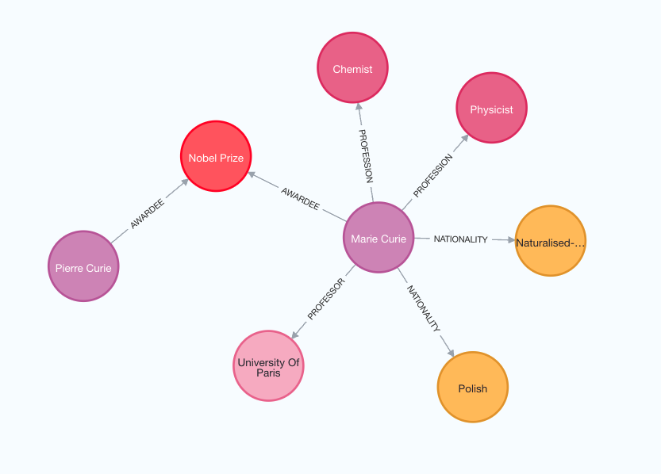

# ナレッジグラフの構築

このガイドでは、構造化されていないテキストからナレッジグラフを構築する基本的な方法について説明します。構築されたグラフは、RAGアプリケーションのナレッジベースとして使用できます。

## ⚠️ セキュリティに関する注意 ⚠️

ナレッジグラフの構築には、データベースへの書き込みアクセスが必要です。これには固有のリスクがあります。データをインポートする前に、必ず検証と確認を行ってください。一般的なセキュリティのベストプラクティスについては、[こちら](/docs/security)を参照してください。

## アーキテクチャ

ナレッジグラフの構築の概要は以下の通りです:

1. **テキストから構造化情報の抽出**: モデルを使用して、テキストから構造化されたグラフ情報を抽出します。
2. **グラフデータベースへの格納**: 抽出した構造化されたグラフ情報をグラフデータベースに格納することで、下流のRAGアプリケーションが利用できるようになります。

## セットアップ

まず、必要なパッケージをインストールし、環境変数を設定します。
この例では、Neo4jグラフデータベースを使用します。

```python
%pip install --upgrade --quiet  langchain langchain-community langchain-openai langchain-experimental neo4j
```

```output
Note: you may need to restart the kernel to use updated packages.
```

このガイドではデフォルトでOpenAIモデルを使用します。

```python
import getpass
import os

os.environ["OPENAI_API_KEY"] = getpass.getpass()

# Uncomment the below to use LangSmith. Not required.
# os.environ["LANGCHAIN_API_KEY"] = getpass.getpass()
# os.environ["LANGCHAIN_TRACING_V2"] = "true"
```

```output
 ········
```

次に、Neo4jの資格情報と接続を定義する必要があります。
[これらのインストール手順](https://neo4j.com/docs/operations-manual/current/installation/)に従って、Neo4jデータベースをセットアップしてください。

```python
import os

from langchain_community.graphs import Neo4jGraph

os.environ["NEO4J_URI"] = "bolt://localhost:7687"
os.environ["NEO4J_USERNAME"] = "neo4j"
os.environ["NEO4J_PASSWORD"] = "password"

graph = Neo4jGraph()
```

## LLMグラフトランスフォーマー

テキストからグラフデータを抽出することで、構造化されていない情報を構造化された形式に変換し、複雑な関係性やパターンをより深く理解し、効率的に探索することができます。`LLMGraphTransformer`は、LLMを活用してエンティティとその関係性を解析・分類することで、テキストドキュメントを構造化されたグラフドキュメントに変換します。使用するLLMモデルの選択は、抽出されるグラフデータの精度と微妙な違いに大きな影響を与えます。

```python
import os

from langchain_experimental.graph_transformers import LLMGraphTransformer
from langchain_openai import ChatOpenAI

llm = ChatOpenAI(temperature=0, model_name="gpt-4-turbo")

llm_transformer = LLMGraphTransformer(llm=llm)
```

では、サンプルテキストを渡して、結果を確認してみましょう。

```python
from langchain_core.documents import Document

text = """
Marie Curie, born in 1867, was a Polish and naturalised-French physicist and chemist who conducted pioneering research on radioactivity.
She was the first woman to win a Nobel Prize, the first person to win a Nobel Prize twice, and the only person to win a Nobel Prize in two scientific fields.
Her husband, Pierre Curie, was a co-winner of her first Nobel Prize, making them the first-ever married couple to win the Nobel Prize and launching the Curie family legacy of five Nobel Prizes.
She was, in 1906, the first woman to become a professor at the University of Paris.
"""
documents = [Document(page_content=text)]
graph_documents = llm_transformer.convert_to_graph_documents(documents)
print(f"Nodes:{graph_documents[0].nodes}")
print(f"Relationships:{graph_documents[0].relationships}")
```

```output
Nodes:[Node(id='Marie Curie', type='Person'), Node(id='Pierre Curie', type='Person'), Node(id='University Of Paris', type='Organization')]
Relationships:[Relationship(source=Node(id='Marie Curie', type='Person'), target=Node(id='Pierre Curie', type='Person'), type='MARRIED'), Relationship(source=Node(id='Marie Curie', type='Person'), target=Node(id='University Of Paris', type='Organization'), type='PROFESSOR')]
```

生成されたナレッジグラフの構造を理解するために、以下の画像を参照してください。



グラフ構築プロセスは、LLMを使用しているため、非決定的であることに注意してください。したがって、実行ごとに若干異なる結果が得られる可能性があります。

また、要件に応じて、抽出するノードとリレーションシップの種類を定義することもできます。

```python
llm_transformer_filtered = LLMGraphTransformer(
    llm=llm,
    allowed_nodes=["Person", "Country", "Organization"],
    allowed_relationships=["NATIONALITY", "LOCATED_IN", "WORKED_AT", "SPOUSE"],
)
graph_documents_filtered = llm_transformer_filtered.convert_to_graph_documents(
    documents
)
print(f"Nodes:{graph_documents_filtered[0].nodes}")
print(f"Relationships:{graph_documents_filtered[0].relationships}")
```

```output
Nodes:[Node(id='Marie Curie', type='Person'), Node(id='Pierre Curie', type='Person'), Node(id='University Of Paris', type='Organization')]
Relationships:[Relationship(source=Node(id='Marie Curie', type='Person'), target=Node(id='Pierre Curie', type='Person'), type='SPOUSE'), Relationship(source=Node(id='Marie Curie', type='Person'), target=Node(id='University Of Paris', type='Organization'), type='WORKED_AT')]
```

生成されたグラフをさらに理解するために、再度視覚化してみましょう。


`node_properties`パラメータを使用すると、ノードプロパティの抽出が可能になり、より詳細なグラフを作成できます。
`True`に設定すると、LLMが自動的に関連するノードプロパティを識別して抽出します。
一方、`node_properties`をstring型のリストとして定義すると、LLMは指定されたプロパティのみを選択的に抽出します。

```python
llm_transformer_props = LLMGraphTransformer(
    llm=llm,
    allowed_nodes=["Person", "Country", "Organization"],
    allowed_relationships=["NATIONALITY", "LOCATED_IN", "WORKED_AT", "SPOUSE"],
    node_properties=["born_year"],
)
graph_documents_props = llm_transformer_props.convert_to_graph_documents(documents)
print(f"Nodes:{graph_documents_props[0].nodes}")
print(f"Relationships:{graph_documents_props[0].relationships}")
```

```output
Nodes:[Node(id='Marie Curie', type='Person', properties={'born_year': '1867'}), Node(id='Pierre Curie', type='Person'), Node(id='University Of Paris', type='Organization')]
Relationships:[Relationship(source=Node(id='Marie Curie', type='Person'), target=Node(id='Pierre Curie', type='Person'), type='SPOUSE'), Relationship(source=Node(id='Marie Curie', type='Person'), target=Node(id='University Of Paris', type='Organization'), type='WORKED_AT')]
```

## グラフデータベースへの格納

生成されたグラフドキュメントは、`add_graph_documents`メソッドを使ってグラフデータベースに格納できます。

```python
graph.add_graph_documents(graph_documents_props)
```
