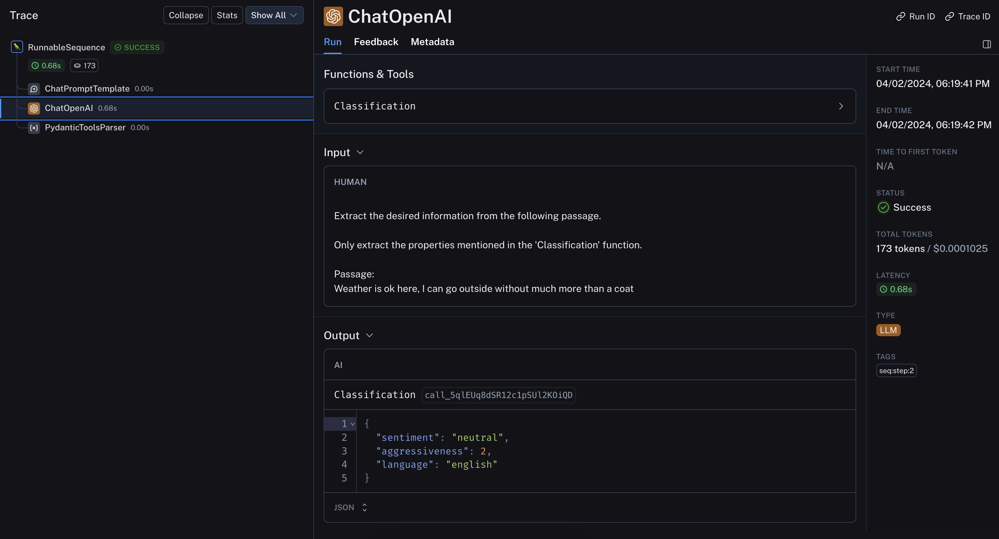

[](https://colab.research.google.com/github/langchain-ai/langchain/blob/master/docs/docs/use_cases/tagging.ipynb)

## 使用例

タグ付けとは、以下のようなクラスでドキュメントにラベルを付けることを意味します:

- 感情
- 言語
- スタイル (正式、非公式など)
- 対象トピック
- 政治的傾向


## 概要

タグ付けには以下のような要素があります:

* `function`: [抽出](/docs/use_cases/extraction)のように、タグ付けでは [functions](https://openai.com/blog/function-calling-and-other-api-updates) を使ってモデルがドキュメントにタグを付ける方法を指定します
* `schema`: ドキュメントにどのようにタグを付けるかを定義します

## クイックスタート

LangChain で OpenAI ツールを呼び出してタグ付けを行う非常に簡単な例を見てみましょう。OpenAI モデルでサポートされている [`with_structured_output`](/docs/modules/model_io/chat/structured_output) メソッドを使用します:

```python
%pip install --upgrade --quiet langchain langchain-openai

# Set env var OPENAI_API_KEY or load from a .env file:
# import dotenv
# dotenv.load_dotenv()
```

Pydantic モデルを使って、スキーマ内の各プロパティとその期待される型を定義しましょう。

```python
from langchain_core.prompts import ChatPromptTemplate
from langchain_core.pydantic_v1 import BaseModel, Field
from langchain_openai import ChatOpenAI

tagging_prompt = ChatPromptTemplate.from_template(
    """
Extract the desired information from the following passage.

Only extract the properties mentioned in the 'Classification' function.

Passage:
{input}
"""
)


class Classification(BaseModel):
    sentiment: str = Field(description="The sentiment of the text")
    aggressiveness: int = Field(
        description="How aggressive the text is on a scale from 1 to 10"
    )
    language: str = Field(description="The language the text is written in")


# LLM
llm = ChatOpenAI(temperature=0, model="gpt-3.5-turbo-0125").with_structured_output(
    Classification
)

tagging_chain = tagging_prompt | llm
```

```python
inp = "Estoy increiblemente contento de haberte conocido! Creo que seremos muy buenos amigos!"
tagging_chain.invoke({"input": inp})
```

```output
Classification(sentiment='positive', aggressiveness=1, language='Spanish')
```

JSON 出力が欲しい場合は、`.dict()` を呼び出せばいいです。

```python
inp = "Estoy muy enojado con vos! Te voy a dar tu merecido!"
res = tagging_chain.invoke({"input": inp})
res.dict()
```

```output
{'sentiment': 'negative', 'aggressiveness': 8, 'language': 'Spanish'}
```

例に示したように、期待通りの結果が得られます。

結果はさまざまで、例えば感情が異なる言語で返される ('positive', 'enojado' など) ことがあります。

次のセクションでは、これらの結果をどのように制御するかを見ていきます。

## より細かな制御

慎重にスキーマを定義することで、モデルの出力をより細かく制御できます。

具体的には以下のことができます:

- 各プロパティの可能な値を定義する
- プロパティの説明を追加して、モデルがプロパティを理解できるようにする
- 必須のプロパティを指定する

前述の Pydantic モデルを再定義して、これらの側面をコントロールしましょう:

```python
class Classification(BaseModel):
    sentiment: str = Field(..., enum=["happy", "neutral", "sad"])
    aggressiveness: int = Field(
        ...,
        description="describes how aggressive the statement is, the higher the number the more aggressive",
        enum=[1, 2, 3, 4, 5],
    )
    language: str = Field(
        ..., enum=["spanish", "english", "french", "german", "italian"]
    )
```

```python
tagging_prompt = ChatPromptTemplate.from_template(
    """
Extract the desired information from the following passage.

Only extract the properties mentioned in the 'Classification' function.

Passage:
{input}
"""
)

llm = ChatOpenAI(temperature=0, model="gpt-3.5-turbo-0125").with_structured_output(
    Classification
)

chain = tagging_prompt | llm
```

これで、期待通りの結果が得られるようになりました!

```python
inp = "Estoy increiblemente contento de haberte conocido! Creo que seremos muy buenos amigos!"
chain.invoke({"input": inp})
```

```output
Classification(sentiment='happy', aggressiveness=1, language='spanish')
```

```python
inp = "Estoy muy enojado con vos! Te voy a dar tu merecido!"
chain.invoke({"input": inp})
```

```output
Classification(sentiment='sad', aggressiveness=5, language='spanish')
```

```python
inp = "Weather is ok here, I can go outside without much more than a coat"
chain.invoke({"input": inp})
```

```output
Classification(sentiment='neutral', aggressiveness=2, language='english')
```

[LangSmith trace](https://smith.langchain.com/public/38294e04-33d8-4c5a-ae92-c2fe68be8332/r) を見ると、内部の仕組みがわかります:



### さらに深く

* [メタデータタガー](/docs/integrations/document_transformers/openai_metadata_tagger) ドキュメントトランスフォーマーを使って、LangChain `Document` からメタデータを抽出することができます。
* これはタギングチェーンと同じ基本的な機能を提供しますが、LangChain `Document` に適用されます。
