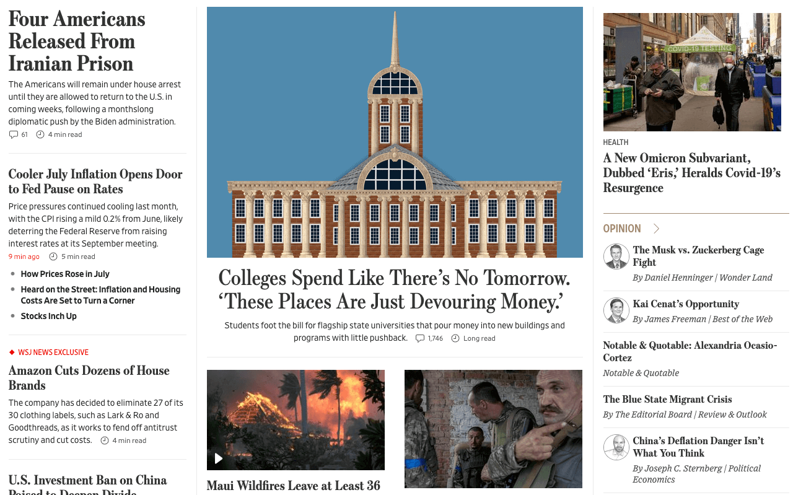

[](https://colab.research.google.com/github/langchain-ai/langchain/blob/master/docs/docs/use_cases/web_scraping.ipynb)

## ユースケース

[ウェブリサーチ](https://blog.langchain.dev/automating-web-research/)は、主要なLLMアプリケーションの一つです:

* ユーザーはこれを彼のトップに望むAIツールの一つとして[強調しています](https://twitter.com/GregKamradt/status/1679913813297225729?s=20)。
* [gpt-researcher](https://github.com/assafelovic/gpt-researcher)のようなOSSリポジトリが人気を集めています。


## 概要

ウェブからコンテンツを収集するにはいくつかの要素があります:

* `検索`: クエリからURLへの変換（例: `GoogleSearchAPIWrapper`を使用）。
* `読み込み`: URLからHTMLへの変換（例: `AsyncHtmlLoader`、`AsyncChromiumLoader`などを使用）。
* `変換`: HTMLからフォーマットされたテキストへの変換（例: `HTML2Text`や`Beautiful Soup`を使用）。

## クイックスタート

```python
pip install -q langchain-openai langchain playwright beautifulsoup4
playwright install

# Set env var OPENAI_API_KEY or load from a .env file:
# import dotenv
# dotenv.load_dotenv()
```

ヘッドレスインスタンスのChromiumを使用してHTMLコンテンツをスクレイピングします。

* スクレイピングプロセスの非同期性は、Pythonのasyncioライブラリを使用して処理されます。
* ウェブページとの実際の対話はPlaywrightによって処理されます。

```python
from langchain_community.document_loaders import AsyncChromiumLoader
from langchain_community.document_transformers import BeautifulSoupTransformer

# Load HTML
loader = AsyncChromiumLoader(["https://www.wsj.com"])
html = loader.load()
```

HTMLコンテンツから`<p>, <li>, <div>, そして <a>`タグのテキストコンテンツをスクレイピングします:

* `<p>`: 段落タグ。HTMLで段落を定義し、関連する文やフレーズをグループ化するために使用されます。

* `<li>`: リストアイテムタグ。順序付きリスト (`<ol>`) および順序なしリスト (`<ul>`) で使用され、リスト内の個々のアイテムを定義します。

* `<div>`: ディビジョンタグ。インラインまたはブロックレベルの他の要素をグループ化するためのブロックレベル要素です。

* `<a>`: アンカータグ。ハイパーリンクを定義するために使用されます。

* `<span>`: テキストの一部や文書の一部をマークアップするためのインラインコンテナ。

多くのニュースサイト（例: WSJ, CNN）では、見出しと要約はすべて`<span>`タグにあります。

```python
# Transform
bs_transformer = BeautifulSoupTransformer()
docs_transformed = bs_transformer.transform_documents(html, tags_to_extract=["span"])
```

```python
# Result
docs_transformed[0].page_content[0:500]
```

```output
'English EditionEnglish中文 (Chinese)日本語 (Japanese) More Other Products from WSJBuy Side from WSJWSJ ShopWSJ Wine Other Products from WSJ Search Quotes and Companies Search Quotes and Companies 0.15% 0.03% 0.12% -0.42% 4.102% -0.69% -0.25% -0.15% -1.82% 0.24% 0.19% -1.10% About Evan His Family Reflects His Reporting How You Can Help Write a Message Life in Detention Latest News Get Email Updates Four Americans Released From Iranian Prison The Americans will remain under house arrest until they are '
```

これらの`Documents`は、以下で説明する様々なLLMアプリでの下流使用のためにステージングされます。

## ローダー

### AsyncHtmlLoader

[AsyncHtmlLoader](/docs/integrations/document_loaders/async_html)は、非同期HTTPリクエストを行うために`aiohttp`ライブラリを使用し、よりシンプルで軽量なスクレイピングに適しています。

### AsyncChromiumLoader

[AsyncChromiumLoader](/docs/integrations/document_loaders/async_chromium)は、Playwrightを使用してChromiumインスタンスを起動し、JavaScriptのレンダリングやより複雑なウェブインタラクションを処理できます。

Chromiumは、ブラウザ自動化を制御するために使用されるライブラリであるPlaywrightがサポートするブラウザの一つです。

ヘッドレスモードは、グラフィカルユーザーインターフェイスなしでブラウザが動作することを意味し、ウェブスクレイピングによく使用されます。

```python
from langchain_community.document_loaders import AsyncHtmlLoader

urls = ["https://www.espn.com", "https://lilianweng.github.io/posts/2023-06-23-agent/"]
loader = AsyncHtmlLoader(urls)
docs = loader.load()
```

## トランスフォーマー

### HTML2Text

[HTML2Text](/docs/integrations/document_transformers/html2text)は、特定のタグ操作なしにHTMLコンテンツをプレーンテキスト（マークダウン風のフォーマット）に変換する簡潔な変換を提供します。

特定のHTML要素を操作する必要がなく、人間が読みやすいテキストを抽出することが目的のシナリオに最適です。

### Beautiful Soup

Beautiful Soupは、HTMLコンテンツをより細かく制御し、特定のタグの抽出、削除、コンテンツのクリーニングを可能にします。

特定の情報を抽出し、ニーズに応じてHTMLコンテンツをクリーンアップしたい場合に適しています。

```python
from langchain_community.document_loaders import AsyncHtmlLoader

urls = ["https://www.espn.com", "https://lilianweng.github.io/posts/2023-06-23-agent/"]
loader = AsyncHtmlLoader(urls)
docs = loader.load()
```

```output
Fetching pages: 100%|#############################################################################################################| 2/2 [00:00<00:00,  7.01it/s]
```

```python
from langchain_community.document_transformers import Html2TextTransformer

html2text = Html2TextTransformer()
docs_transformed = html2text.transform_documents(docs)
docs_transformed[0].page_content[0:500]
```

```output
"Skip to main content  Skip to navigation\n\n<\n\n>\n\nMenu\n\n## ESPN\n\n  * Search\n\n  *   * scores\n\n  * NFL\n  * MLB\n  * NBA\n  * NHL\n  * Soccer\n  * NCAAF\n  * …\n\n    * Women's World Cup\n    * LLWS\n    * NCAAM\n    * NCAAW\n    * Sports Betting\n    * Boxing\n    * CFL\n    * NCAA\n    * Cricket\n    * F1\n    * Golf\n    * Horse\n    * MMA\n    * NASCAR\n    * NBA G League\n    * Olympic Sports\n    * PLL\n    * Racing\n    * RN BB\n    * RN FB\n    * Rugby\n    * Tennis\n    * WNBA\n    * WWE\n    * X Games\n    * XFL\n\n  * More"
```

## 抽出を伴うスクレイピング

### 関数呼び出しを伴うLLM

ウェブスクレイピングは多くの理由で困難です。

その一つは、現代のウェブサイトのレイアウトやコンテンツの変化する性質であり、変更に対応するためにスクレイピングスクリプトを修正する必要があります。

関数（例: OpenAI）と抽出チェーンを使用することで、ウェブサイトが変わるたびにコードを変更する必要がなくなります。

`gpt-3.5-turbo-0613`を使用してOpenAI Functions機能へのアクセスを保証しています（ただし、執筆時点ではこれがすべての人に提供される可能性があります）。

また、LLMのランダム性を低く保つために`temperature`を`0`に設定しています。

```python
from langchain_openai import ChatOpenAI

llm = ChatOpenAI(temperature=0, model="gpt-3.5-turbo-0613")
```

### スキーマの定義

次に、抽出したいデータの種類を指定するためのスキーマを定義します。

ここで、キー名はLLMにどのような情報を求めているかを伝えるため、できるだけ詳細に記述します。

この例では、The Wall Street Journalのウェブサイトからニュース記事の名前と要約だけをスクレイピングしたいと考えています。

```python
from langchain.chains import create_extraction_chain

schema = {
    "properties": {
        "news_article_title": {"type": "string"},
        "news_article_summary": {"type": "string"},
    },
    "required": ["news_article_title", "news_article_summary"],
}


def extract(content: str, schema: dict):
    return create_extraction_chain(schema=schema, llm=llm).run(content)
```

### BeautifulSoupを使用したウェブスクレイパーの実行

上述のように、`BeautifulSoupTransformer`を使用します。

```python
import pprint

from langchain_text_splitters import RecursiveCharacterTextSplitter


def scrape_with_playwright(urls, schema):
    loader = AsyncChromiumLoader(urls)
    docs = loader.load()
    bs_transformer = BeautifulSoupTransformer()
    docs_transformed = bs_transformer.transform_documents(
        docs, tags_to_extract=["span"]
    )
    print("Extracting content with LLM")

    # Grab the first 1000 tokens of the site
    splitter = RecursiveCharacterTextSplitter.from_tiktoken_encoder(
        chunk_size=1000, chunk_overlap=0
    )
    splits = splitter.split_documents(docs_transformed)

    # Process the first split
    extracted_content = extract(schema=schema, content=splits[0].page_content)
    pprint.pprint(extracted_content)
    return extracted_content


urls = ["https://www.wsj.com"]
extracted_content = scrape_with_playwright(urls, schema=schema)
```

```output
Extracting content with LLM
[{'news_article_summary': 'The Americans will remain under house arrest until '
                          'they are allowed to return to the U.S. in coming '
                          'weeks, following a monthslong diplomatic push by '
                          'the Biden administration.',
  'news_article_title': 'Four Americans Released From Iranian Prison'},
 {'news_article_summary': 'Price pressures continued cooling last month, with '
                          'the CPI rising a mild 0.2% from June, likely '
                          'deterring the Federal Reserve from raising interest '
                          'rates at its September meeting.',
  'news_article_title': 'Cooler July Inflation Opens Door to Fed Pause on '
                        'Rates'},
 {'news_article_summary': 'The company has decided to eliminate 27 of its 30 '
                          'clothing labels, such as Lark & Ro and Goodthreads, '
                          'as it works to fend off antitrust scrutiny and cut '
                          'costs.',
  'news_article_title': 'Amazon Cuts Dozens of House Brands'},
 {'news_article_summary': 'President Biden’s order comes on top of a slowing '
                          'Chinese economy, Covid lockdowns and rising '
                          'tensions between the two powers.',
  'news_article_title': 'U.S. Investment Ban on China Poised to Deepen Divide'},
 {'news_article_summary': 'The proposed trial date in the '
                          'election-interference case comes on the same day as '
                          'the former president’s not guilty plea on '
                          'additional Mar-a-Lago charges.',
  'news_article_title': 'Trump Should Be Tried in January, Prosecutors Tell '
                        'Judge'},
 {'news_article_summary': 'The CEO who started in June says the platform has '
                          '“an entirely different road map” for the future.',
  'news_article_title': 'Yaccarino Says X Is Watching Threads but Has Its Own '
                        'Vision'},
 {'news_article_summary': 'Students foot the bill for flagship state '
                          'universities that pour money into new buildings and '
                          'programs with little pushback.',
  'news_article_title': 'Colleges Spend Like There’s No Tomorrow. ‘These '
                        'Places Are Just Devouring Money.’'},
 {'news_article_summary': 'Wildfires fanned by hurricane winds have torn '
                          'through parts of the Hawaiian island, devastating '
                          'the popular tourist town of Lahaina.',
  'news_article_title': 'Maui Wildfires Leave at Least 36 Dead'},
 {'news_article_summary': 'After its large armored push stalled, Kyiv has '
                          'fallen back on the kind of tactics that brought it '
                          'success earlier in the war.',
  'news_article_title': 'Ukraine Uses Small-Unit Tactics to Retake Captured '
                        'Territory'},
 {'news_article_summary': 'President Guillermo Lasso says the Aug. 20 election '
                          'will proceed, as the Andean country grapples with '
                          'rising drug gang violence.',
  'news_article_title': 'Ecuador Declares State of Emergency After '
                        'Presidential Hopeful Killed'},
 {'news_article_summary': 'This year’s hurricane season, which typically runs '
                          'from June to the end of November, has been '
                          'difficult to predict, climate scientists said.',
  'news_article_title': 'Atlantic Hurricane Season Prediction Increased to '
                        '‘Above Normal,’ NOAA Says'},
 {'news_article_summary': 'The NFL is raising the price of its NFL+ streaming '
                          'packages as it adds the NFL Network and RedZone.',
  'news_article_title': 'NFL to Raise Price of NFL+ Streaming Packages as It '
                        'Adds NFL Network, RedZone'},
 {'news_article_summary': 'Russia is planning a moon mission as part of the '
                          'new space race.',
  'news_article_title': 'Russia’s Moon Mission and the New Space Race'},
 {'news_article_summary': 'Tapestry’s $8.5 billion acquisition of Capri would '
                          'create a conglomerate with more than $12 billion in '
                          'annual sales, but it would still lack the '
                          'high-wattage labels and diversity that have fueled '
                          'LVMH’s success.',
  'news_article_title': "Why the Coach and Kors Marriage Doesn't Scare LVMH"},
 {'news_article_summary': 'The Supreme Court has blocked Purdue Pharma’s $6 '
                          'billion Sackler opioid settlement.',
  'news_article_title': 'Supreme Court Blocks Purdue Pharma’s $6 Billion '
                        'Sackler Opioid Settlement'},
 {'news_article_summary': 'The Social Security COLA is expected to rise in '
                          '2024, but not by a lot.',
  'news_article_title': 'Social Security COLA Expected to Rise in 2024, but '
                        'Not by a Lot'}]
```

ページに対してスクレイピングされた見出しを比較できます:



[LangSmith trace](https://smith.langchain.com/public/c3070198-5b13-419b-87bf-3821cdf34fa6/r)を見て、内部で何が起こっているかを確認できます:

* [抽出](docs/use_cases/extraction)で説明されている内容に従っています。
* 入力テキストに対して`information_extraction`関数を呼び出します。
* URLのコンテンツから提供されたスキーマを埋めようとします。

## リサーチ自動化

スクレイピングに関連して、検索されたコンテンツを使用して特定の質問に答えたい場合があります。

リトリーバーを使用して[ウェブリサーチ](https://blog.langchain.dev/automating-web-research/)を自動化できます。例えば、`WebResearchRetriever`。


要件を[ここから](https://github.com/langchain-ai/web-explorer/blob/main/requirements.txt)コピーします:

`pip install -r requirements.txt`

`GOOGLE_CSE_ID`と`GOOGLE_API_KEY`を設定します。

```python
from langchain.retrievers.web_research import WebResearchRetriever
from langchain_chroma import Chroma
from langchain_community.utilities import GoogleSearchAPIWrapper
from langchain_openai import ChatOpenAI, OpenAIEmbeddings
```

```python
# Vectorstore
vectorstore = Chroma(
    embedding_function=OpenAIEmbeddings(), persist_directory="./chroma_db_oai"
)

# LLM
llm = ChatOpenAI(temperature=0)

# Search
search = GoogleSearchAPIWrapper()
```

上記のツールでリトリーバーを初期化して:

* LLMを使用して複数の関連する検索クエリを生成（一つのLLM呼び出し）
* 各クエリの検索を実行
* 各クエリごとに上位Kリンクを選択（複数の検索呼び出しを並行して実行）
* 選ばれたすべてのリンクから情報を読み込み（ページを並行してスクレイピング）
* それらのドキュメントをベクターストアにインデックス化
* 元の生成された検索クエリごとに最も関連性の高いドキュメントを見つける

```python
# Initialize
web_research_retriever = WebResearchRetriever.from_llm(
    vectorstore=vectorstore, llm=llm, search=search
)
```

```python
# Run
import logging

logging.basicConfig()
logging.getLogger("langchain.retrievers.web_research").setLevel(logging.INFO)
from langchain.chains import RetrievalQAWithSourcesChain

user_input = "How do LLM Powered Autonomous Agents work?"
qa_chain = RetrievalQAWithSourcesChain.from_chain_type(
    llm, retriever=web_research_retriever
)
result = qa_chain({"question": user_input})
result
```

```output
INFO:langchain.retrievers.web_research:Generating questions for Google Search ...
INFO:langchain.retrievers.web_research:Questions for Google Search (raw): {'question': 'How do LLM Powered Autonomous Agents work?', 'text': LineList(lines=['1. What is the functioning principle of LLM Powered Autonomous Agents?\n', '2. How do LLM Powered Autonomous Agents operate?\n'])}
INFO:langchain.retrievers.web_research:Questions for Google Search: ['1. What is the functioning principle of LLM Powered Autonomous Agents?\n', '2. How do LLM Powered Autonomous Agents operate?\n']
INFO:langchain.retrievers.web_research:Searching for relevant urls ...
INFO:langchain.retrievers.web_research:Searching for relevant urls ...
INFO:langchain.retrievers.web_research:Search results: [{'title': 'LLM Powered Autonomous Agents | Hacker News', 'link': 'https://news.ycombinator.com/item?id=36488871', 'snippet': 'Jun 26, 2023 ... Exactly. A temperature of 0 means you always pick the highest probability token (i.e. the "max" function), while a temperature of 1 means you\xa0...'}]
INFO:langchain.retrievers.web_research:Searching for relevant urls ...
INFO:langchain.retrievers.web_research:Search results: [{'title': "LLM Powered Autonomous Agents | Lil'Log", 'link': 'https://lilianweng.github.io/posts/2023-06-23-agent/', 'snippet': 'Jun 23, 2023 ... Task decomposition can be done (1) by LLM with simple prompting like "Steps for XYZ.\\n1." , "What are the subgoals for achieving XYZ?" , (2) by\xa0...'}]
INFO:langchain.retrievers.web_research:New URLs to load: []
INFO:langchain.retrievers.web_research:Grabbing most relevant splits from urls...
```

```output
{'question': 'How do LLM Powered Autonomous Agents work?',
 'answer': "LLM-powered autonomous agents work by using LLM as the agent's brain, complemented by several key components such as planning, memory, and tool use. In terms of planning, the agent breaks down large tasks into smaller subgoals and can reflect and refine its actions based on past experiences. Memory is divided into short-term memory, which is used for in-context learning, and long-term memory, which allows the agent to retain and recall information over extended periods. Tool use involves the agent calling external APIs for additional information. These agents have been used in various applications, including scientific discovery and generative agents simulation.",
 'sources': ''}
```

### より深く掘り下げる

* こちらは、このリトリーバーを軽量UIでラップした[アプリ](https://github.com/langchain-ai/web-explorer/tree/main)です。

## ウェブサイトに対する質問応答

特定のウェブサイトに対する質問に答えるために、Apifyの[Website Content Crawler](https://apify.com/apify/website-content-crawler)アクターを使用できます。これは、ドキュメント、ナレッジベース、ヘルプセンター、ブログなどのウェブサイトを深くクロールし、
ウェブページからテキストコンテンツを抽出します。

以下の例では、LangChainのChat LLMモデルのPythonドキュメントを深くクロールし、それに関する質問に答えます。

最初に要件をインストールします
`pip install apify-client langchain-openai langchain`

次に、環境変数に`OPENAI_API_KEY`と`APIFY_API_TOKEN`を設定します。

完全なコードは次の通りです:

```python
from langchain.indexes import VectorstoreIndexCreator
from langchain_community.docstore.document import Document
from langchain_community.utilities import ApifyWrapper

apify = ApifyWrapper()
# Call the Actor to obtain text from the crawled webpages
loader = apify.call_actor(
    actor_id="apify/website-content-crawler",
    run_input={"startUrls": [{"url": "/docs/integrations/chat/"}]},
    dataset_mapping_function=lambda item: Document(
        page_content=item["text"] or "", metadata={"source": item["url"]}
    ),
)

# Create a vector store based on the crawled data
index = VectorstoreIndexCreator().from_loaders([loader])

# Query the vector store
query = "Are any OpenAI chat models integrated in LangChain?"
result = index.query(query)
print(result)
```

```output
 Yes, LangChain offers integration with OpenAI chat models. You can use the ChatOpenAI class to interact with OpenAI models.
```
