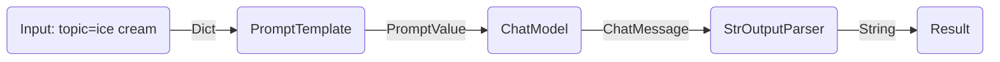
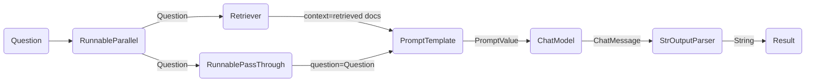

---
keywords:
- chain.invoke
sidebar_position: 0
title: Get started
translated: true
---

LCEL은 기본 구성 요소를 사용하여 복잡한 체인을 쉽게 구축할 수 있으며, 스트리밍, 병렬 처리 및 로깅과 같은 기능을 기본적으로 지원합니다.

## 기본 예제: 프롬프트 + 모델 + 출력 파서

가장 기본적이고 일반적인 사용 사례는 프롬프트 템플릿과 모델을 연결하는 것입니다. 이를 이해하기 위해 주제를 입력받아 농담을 생성하는 체인을 만들어보겠습니다:

```python
%pip install --upgrade --quiet langchain-core langchain-community langchain-openai
```

import ChatModelTabs from "@theme/ChatModelTabs";

<ChatModelTabs openaiParams={`model="gpt-4"`} />

```python
# | output: false

# | echo: false

from langchain_openai import ChatOpenAI

model = ChatOpenAI(model="gpt-4")
```

```python
from langchain_core.output_parsers import StrOutputParser
from langchain_core.prompts import ChatPromptTemplate

prompt = ChatPromptTemplate.from_template("tell me a short joke about {topic}")
output_parser = StrOutputParser()

chain = prompt | model | output_parser

chain.invoke({"topic": "ice cream"})
```

```output
"Why don't ice creams ever get invited to parties?\n\nBecause they always drip when things heat up!"
```

LCEL을 사용하여 서로 다른 구성 요소를 단일 체인으로 결합하는 코드는 다음과 같습니다:

```
chain = prompt | model | output_parser
```

`|` 기호는 [유닉스 파이프 연산자](<https://en.wikipedia.org/wiki/Pipeline_(Unix)>)와 유사하며, 각 구성 요소의 출력을 다음 구성 요소의 입력으로 전달합니다.

이 체인에서 사용자 입력은 프롬프트 템플릿에 전달되고, 프롬프트 템플릿 출력은 모델에 전달되며, 모델 출력은 출력 파서에 전달됩니다. 각 구성 요소를 개별적으로 살펴보겠습니다.

### 1. 프롬프트

`prompt`는 `BasePromptTemplate`으로, 템플릿 변수를 포함한 딕셔너리를 받아 `PromptValue`를 생성합니다. `PromptValue`는 완성된 프롬프트를 래핑한 것으로, `LLM`(문자열을 입력으로 받음) 또는 `ChatModel`(메시지 시퀀스를 입력으로 받음)에 전달될 수 있습니다. 이는 `BaseMessage`와 문자열을 생성하는 로직을 정의하므로 두 유형의 언어 모델과 모두 작동할 수 있습니다.

```python
prompt_value = prompt.invoke({"topic": "ice cream"})
prompt_value
```

```output
ChatPromptValue(messages=[HumanMessage(content='tell me a short joke about ice cream')])
```

```python
prompt_value.to_messages()
```

```output
[HumanMessage(content='tell me a short joke about ice cream')]
```

```python
prompt_value.to_string()
```

```output
'Human: tell me a short joke about ice cream'
```

### 2. 모델

`PromptValue`는 `model`에 전달됩니다. 이 경우 우리의 `model`은 `ChatModel`이므로 `BaseMessage`를 출력합니다.

```python
message = model.invoke(prompt_value)
message
```

```output
AIMessage(content="Why don't ice creams ever get invited to parties?\n\nBecause they always bring a melt down!")
```

우리의 `model`이 `LLM`인 경우 문자열을 출력합니다.

```python
from langchain_openai import OpenAI

llm = OpenAI(model="gpt-3.5-turbo-instruct")
llm.invoke(prompt_value)
```

```output
'\n\nRobot: Why did the ice cream truck break down? Because it had a meltdown!'
```

### 3. 출력 파서

마지막으로 `model` 출력을 `output_parser`에 전달합니다. `output_parser`는 문자열 또는 `BaseMessage`를 입력으로 받는 `BaseOutputParser`입니다. `StrOutputParser`는 모든 입력을 문자열로 변환합니다.

```python
output_parser.invoke(message)
```

```output
"Why did the ice cream go to therapy? \n\nBecause it had too many toppings and couldn't find its cone-fidence!"
```

### 4. 전체 파이프라인

단계를 따라가면:

1. 주제에 대한 사용자 입력을 `{"topic": "ice cream"}`으로 전달합니다.
2. `prompt` 구성 요소는 사용자 입력을 받아 프롬프트를 구성한 후 `PromptValue`를 생성합니다.
3. `model` 구성 요소는 생성된 프롬프트를 받아 OpenAI LLM 모델에 전달하여 평가합니다. 모델의 출력은 `ChatMessage` 객체입니다.
4. 마지막으로 `output_parser` 구성 요소는 `ChatMessage`를 받아 이를 Python 문자열로 변환하여 invoke 메서드에서 반환합니다.



:::info

구성 요소의 출출력을 궁금해하는 경우, `prompt` 또는 `prompt | model`과 같은 체인의 작은 버전을 테스트하여 중간 결과를 확인할 수 있습니다:

:::

```python
input = {"topic": "ice cream"}

prompt.invoke(input)
# > ChatPromptValue(messages=[HumanMessage(content='tell me a short joke about ice cream')])

(prompt | model).invoke(input)
# > AIMessage(content="Why did the ice cream go to therapy?\nBecause it had too many toppings and couldn't cone-trol itself!")

```

## RAG 검색 예제

다음 예에서는 질문에 응답할 때 일부 컨텍스트를 추가하기 위해 검색 보강 생성 체인을 실행하고자 합니다.

<ChatModelTabs />

```python
# Requires:

# pip install langchain docarray tiktoken

from langchain_community.vectorstores import DocArrayInMemorySearch
from langchain_core.output_parsers import StrOutputParser
from langchain_core.prompts import ChatPromptTemplate
from langchain_core.runnables import RunnableParallel, RunnablePassthrough
from langchain_openai import OpenAIEmbeddings

vectorstore = DocArrayInMemorySearch.from_texts(
    ["harrison worked at kensho", "bears like to eat honey"],
    embedding=OpenAIEmbeddings(),
)
retriever = vectorstore.as_retriever()

template = """Answer the question based only on the following context:
{context}

Question: {question}
"""
prompt = ChatPromptTemplate.from_template(template)
output_parser = StrOutputParser()

setup_and_retrieval = RunnableParallel(
    {"context": retriever, "question": RunnablePassthrough()}
)
chain = setup_and_retrieval | prompt | model | output_parser

chain.invoke("where did harrison work?")
```

이 경우, 구성된 체인은 다음과 같습니다:

```python
chain = setup_and_retrieval | prompt | model | output_parser
```

이를 설명하기 위해, 위의 프롬프트 템플릿이 `context`와 `question` 값을 입력받아 프롬프트에 대체한다는 것을 먼저 이해할 수 있습니다. 프롬프트 템플릿을 생성하기 전에 검색과 관련된 문서를 검색하여 컨텍스트의 일부로 포함하고자 합니다.

먼저 메모리 저장소를 사용하여 검색기를 설정했으며, 이는 쿼리를 기반으로 문서를 검색할 수 있습니다. 이는 다른 구성 요소와 체인으로 연결할 수 있는 실행 가능 구성 요소이지만, 별도로 실행해 볼 수도 있습니다:

```python
retriever.invoke("where did harrison work?")
```

그런 다음 `RunnableParallel`을 사용하여 검색된 문서의 항목과 원래 사용자 질문을 사용하여 프롬프트의 예상 입력을 준비합니다. 문서 검색을 위해 검색기를 사용하고, 사용자의 질문을 전달하기 위해 `RunnablePassthrough`를 사용합니다:

```python
setup_and_retrieval = RunnableParallel(
    {"context": retriever, "question": RunnablePassthrough()}
)
```

완전한 체인을 검토해 보겠습니다:

```python
setup_and_retrieval = RunnableParallel(
    {"context": retriever, "question": RunnablePassthrough()}
)
chain = setup_and_retrieval | prompt | model | output_parser
```

흐름은 다음과 같습니다:

1. 첫 번째 단계는 두 항목이 있는 `RunnableParallel` 객체를 생성합니다. 첫 번째 항목 `context`는 검색기에서 검색한 문서 결과를 포함합니다. 두 번째 항목 `question`은 사용자의 원래 질문을 포함합니다. 질문을 전달하기 위해 `RunnablePassthrough`를 사용하여 이 항목을 복사합니다.
2. 위 단계의 딕셔너리를 `prompt` 구성 요소에 전달합니다. 그런 다음 사용자 입력인 `question`과 검색된 문서인 `context`를 사용하여 프롬프트를 구성하고 `PromptValue`를 출력합니다.
3. `model` 구성 요소는 생성된 프롬프트를 받아 OpenAI LLM 모델에 전달하여 평가합니다. 모델의 출력은 `ChatMessage` 객체입니다.
4. 마지막으로 `output_parser` 구성 요소는 `ChatMessage`를 받아 이를 Python 문자열로 변환하여 invoke 메서드에서 반환합니다.



## 다음 단계

다음으로 [LCEL의 장점](/docs/expression_language/why) 섹션을 읽어보시기 바랍니다. 이 섹션에서는 LCEL을 사용한 일반적인 기능을 생성하는 데 필요한 코드와 그렇지 않은 코드의 비교를 확인할 수 있습니다.