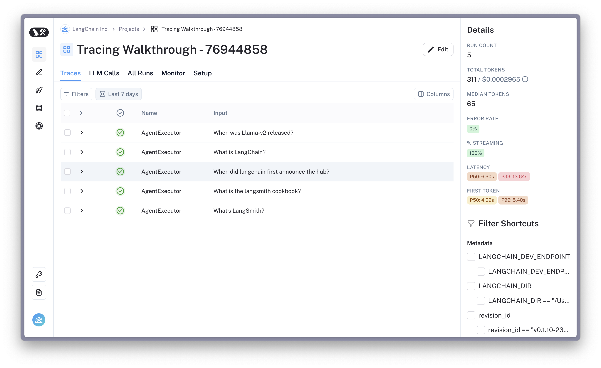

# LangSmith 안내서

[](https://colab.research.google.com/github/langchain-ai/langchain/blob/master/docs/docs/langsmith/walkthrough.ipynb)

LangChain은 LLM 애플리케이션과 에이전트를 프로토타이핑하기 쉽게 만듭니다. 그러나 LLM 애플리케이션을 프로덕션에 배포하는 것은 의외로 어려울 수 있습니다. 프롬프트, 체인 및 기타 구성 요소를 반복적으로 수정하여 고품질 제품을 구축해야 합니다.

LangSmith를 사용하면 LLM 애플리케이션을 디버깅, 테스트 및 지속적으로 개선할 수 있습니다.

이 기능이 유용할 수 있는 경우는 다음과 같습니다:

- 새로운 체인, 에이전트 또는 도구 세트를 빠르게 디버깅
- 파인 튜닝, 소량 프롬프팅 및 평가를 위한 데이터 세트 생성 및 관리
- 애플리케이션에 대한 회귀 테스트를 실행하여 개발을 안심하고 진행
- 제품 통찰력과 지속적인 개선을 위한 프로덕션 분석 캡처

## 전제 조건

**[LangSmith 계정을 만들고](https://smith.langchain.com/) API 키를 생성하세요(왼쪽 하단 참조). [문서](https://docs.smith.langchain.com/)를 살펴보면서 플랫폼에 익숙해지세요.**

LangSmith는 베타 버전이며 더 많은 사용자에게 배포되는 과정 중입니다. 그러나 웹사이트의 양식을 작성하면 빠른 액세스를 받을 수 있습니다.

이제 시작해 보겠습니다!

## LangSmith에 실행 로그 기록

먼저 환경 변수를 구성하여 LangChain에 추적을 기록하도록 합니다. 이는 `LANGCHAIN_TRACING_V2` 환경 변수를 true로 설정하여 수행됩니다.
어떤 프로젝트에 로그를 기록할지 지정하려면 `LANGCHAIN_PROJECT` 환경 변수를 설정하면 됩니다(설정하지 않으면 `default` 프로젝트에 기록됩니다). 이렇게 하면 프로젝트가 존재하지 않는 경우 자동으로 생성됩니다. `LANGCHAIN_ENDPOINT` 및 `LANGCHAIN_API_KEY` 환경 변수도 설정해야 합니다.

추적 설정에 대한 자세한 내용은 [LangSmith 문서](https://docs.smith.langchain.com/docs/)를 참조하세요.

**참고:** Python에서 컨텍스트 관리자를 사용하여 추적을 기록할 수도 있습니다.

```python
from langchain_core.tracers.context import tracing_v2_enabled

with tracing_v2_enabled(project_name="My Project"):
    agent.run("How many people live in canada as of 2023?")
```

그러나 이 예에서는 환경 변수를 사용합니다.

```python
%pip install --upgrade --quiet  langchain langsmith langchainhub
%pip install --upgrade --quiet  langchain-openai tiktoken pandas duckduckgo-search
```

```python
import os
from uuid import uuid4

unique_id = uuid4().hex[0:8]
os.environ["LANGCHAIN_TRACING_V2"] = "true"
os.environ["LANGCHAIN_PROJECT"] = f"Tracing Walkthrough - {unique_id}"
os.environ["LANGCHAIN_ENDPOINT"] = "https://api.smith.langchain.com"
os.environ["LANGCHAIN_API_KEY"] = "<YOUR-API-KEY>"  # Update to your API key

# Used by the agent in this tutorial
os.environ["OPENAI_API_KEY"] = "<YOUR-OPENAI-API-KEY>"
```

API와 상호 작용하기 위해 langsmith 클라이언트를 생성합니다.

```python
from langsmith import Client

client = Client()
```

LangChain 구성 요소를 생성하고 플랫폼에 실행 로그를 기록합니다. 이 예에서는 일반 검색 도구(DuckDuckGo)에 액세스할 수 있는 ReAct 스타일 에이전트를 생성합니다. 에이전트의 프롬프트는 [Hub](https://smith.langchain.com/hub/wfh/langsmith-agent-prompt)에서 확인할 수 있습니다.

```python
from langchain import hub
from langchain.agents import AgentExecutor
from langchain.agents.format_scratchpad.openai_tools import (
    format_to_openai_tool_messages,
)
from langchain.agents.output_parsers.openai_tools import OpenAIToolsAgentOutputParser
from langchain_community.tools import DuckDuckGoSearchResults
from langchain_openai import ChatOpenAI

# Fetches the latest version of this prompt
prompt = hub.pull("wfh/langsmith-agent-prompt:5d466cbc")

llm = ChatOpenAI(
    model="gpt-3.5-turbo-16k",
    temperature=0,
)

tools = [
    DuckDuckGoSearchResults(
        name="duck_duck_go"
    ),  # General internet search using DuckDuckGo
]

llm_with_tools = llm.bind_tools(tools)

runnable_agent = (
    {
        "input": lambda x: x["input"],
        "agent_scratchpad": lambda x: format_to_openai_tool_messages(
            x["intermediate_steps"]
        ),
    }
    | prompt
    | llm_with_tools
    | OpenAIToolsAgentOutputParser()
)

agent_executor = AgentExecutor(
    agent=runnable_agent, tools=tools, handle_parsing_errors=True
)
```

여러 입력에 대해 에이전트를 동시에 실행하여 대기 시간을 줄입니다. 실행 로그는 LangSmith에 백그라운드로 기록되므로 실행 대기 시간에 영향을 미치지 않습니다.

```python
inputs = [
    "What is LangChain?",
    "What's LangSmith?",
    "When was Llama-v2 released?",
    "What is the langsmith cookbook?",
    "When did langchain first announce the hub?",
]

results = agent_executor.batch([{"input": x} for x in inputs], return_exceptions=True)
```

```python
results[:2]
```

```output
[{'input': 'What is LangChain?',
  'output': 'I\'m sorry, but I couldn\'t find any information about "LangChain". Could you please provide more context or clarify your question?'},
 {'input': "What's LangSmith?",
  'output': 'I\'m sorry, but I couldn\'t find any information about "LangSmith". It could be a company, a product, or a person. Can you provide more context or details about what you are referring to?'}]
```

환경 설정을 성공적으로 완료했다면 [앱](https://smith.langchain.com/)의 `Projects` 섹션에 에이전트 추적이 표시되어야 합니다. 축하합니다!



에이전트가 도구를 효과적으로 사용하지 않는 것 같습니다. 기준선을 확인해 보겠습니다.

## 에이전트 평가

실행 로그 기록 외에도 LangSmith를 사용하여 LLM 애플리케이션을 테스트하고 평가할 수 있습니다.

이 섹션에서는 LangSmith를 활용하여 벤치마크 데이터 세트를 생성하고 에이전트에 대한 AI 지원 평가자를 실행합니다. 다음과 같은 단계를 수행합니다:

1. 데이터 세트 생성
2. 벤치마킹할 새 에이전트 초기화
3. 에이전트 출력을 평가하도록 평가자 구성
4. 데이터 세트에서 에이전트를 실행하고 결과 평가

### 1. LangSmith 데이터 세트 생성

아래에서는 LangSmith 클라이언트를 사용하여 위의 입력 질문과 레이블 목록에서 데이터 세트를 생성합니다. 나중에 새 에이전트의 성능을 측정하는 데 사용할 것입니다. 데이터 세트는 입력-출력 쌍으로 구성된 예제 모음입니다.

데이터 세트 생성에 대한 자세한 내용은 [LangSmith 문서](https://docs.smith.langchain.com/)를 참조하세요.

```python
outputs = [
    "LangChain is an open-source framework for building applications using large language models. It is also the name of the company building LangSmith.",
    "LangSmith is a unified platform for debugging, testing, and monitoring language model applications and agents powered by LangChain",
    "July 18, 2023",
    "The langsmith cookbook is a github repository containing detailed examples of how to use LangSmith to debug, evaluate, and monitor large language model-powered applications.",
    "September 5, 2023",
]
```

```python
dataset_name = f"agent-qa-{unique_id}"

dataset = client.create_dataset(
    dataset_name,
    description="An example dataset of questions over the LangSmith documentation.",
)

client.create_examples(
    inputs=[{"input": query} for query in inputs],
    outputs=[{"output": answer} for answer in outputs],
    dataset_id=dataset.id,
)
```

### 2. 벤치마킹할 새 에이전트 초기화

LangSmith를 사용하면 모든 LLM, 체인, 에이전트 또는 사용자 정의 함수를 평가할 수 있습니다. 대화형 에이전트는 상태 저장(메모리 보유)되므로 데이터 세트 실행 간에 상태가 공유되지 않도록 하기 위해 `chain_factory`(즉, `constructor`) 함수를 전달합니다.

이 경우 OpenAI의 함수 호출 엔드포인트를 사용하는 에이전트를 테스트할 것입니다.

```python
from langchain import hub
from langchain.agents import AgentExecutor, AgentType, initialize_agent, load_tools
from langchain_openai import ChatOpenAI


# Since chains can be stateful (e.g. they can have memory), we provide
# a way to initialize a new chain for each row in the dataset. This is done
# by passing in a factory function that returns a new chain for each row.
def create_agent(prompt, llm_with_tools):
    runnable_agent = (
        {
            "input": lambda x: x["input"],
            "agent_scratchpad": lambda x: format_to_openai_tool_messages(
                x["intermediate_steps"]
            ),
        }
        | prompt
        | llm_with_tools
        | OpenAIToolsAgentOutputParser()
    )
    return AgentExecutor(agent=runnable_agent, tools=tools, handle_parsing_errors=True)
```

### 3. 평가 구성

UI에서 체인의 결과를 수동으로 비교하는 것은 효과적이지만 시간이 많이 걸릴 수 있습니다.
자동화된 메트릭과 AI 지원 피드백을 사용하여 구성 요소의 성능을 평가하는 것이 도움이 될 수 있습니다.

아래에서는 휴리스틱 평가를 기록하는 사용자 정의 실행 평가자를 만들 것입니다.

**휴리스틱 평가자**

```python
from langsmith.evaluation import EvaluationResult
from langsmith.schemas import Example, Run


def check_not_idk(run: Run, example: Example):
    """Illustration of a custom evaluator."""
    agent_response = run.outputs["output"]
    if "don't know" in agent_response or "not sure" in agent_response:
        score = 0
    else:
        score = 1
    # You can access the dataset labels in example.outputs[key]
    # You can also access the model inputs in run.inputs[key]
    return EvaluationResult(
        key="not_uncertain",
        score=score,
    )
```

#### 배치 평가자

일부 메트릭은 개별 실행/예제에 할당되지 않고 전체 "테스트"에 대해 집계됩니다. 이는 정밀도, 재현율 또는 AUC와 같은 일반적인 분류 메트릭이거나 다른 사용자 정의 집계 메트릭일 수 있습니다.

전체 테스트 수준에서 배치 메트릭을 정의하려면 Run(시스템 추적) 목록과 Example(데이터셋 레코드) 목록을 받아들이는 함수(또는 호출 가능한 항목)를 정의하면 됩니다.

```python
from typing import List


def max_pred_length(runs: List[Run], examples: List[Example]):
    predictions = [len(run.outputs["output"]) for run in runs]
    return EvaluationResult(key="max_pred_length", score=max(predictions))
```

아래에서는 위에서 정의한 사용자 정의 평가자와 함께 다음과 같은 사전 구현된 실행 평가자를 사용하여 평가를 구성할 것입니다:
- 정답 레이블과 비교합니다.
- 임베딩 거리를 사용하여 의미적 (불)유사성을 측정합니다.
- 사용자 정의 기준을 사용하여 에이전트 응답의 '측면'을 참조 없이 평가합니다.

사용 사례에 적합한 평가자를 선택하고 사용자 정의 평가자를 만드는 방법에 대한 자세한 내용은 [LangSmith 문서](https://docs.smith.langchain.com/)를 참조하십시오.

```python
from langchain.evaluation import EvaluatorType
from langchain.smith import RunEvalConfig

evaluation_config = RunEvalConfig(
    # Evaluators can either be an evaluator type (e.g., "qa", "criteria", "embedding_distance", etc.) or a configuration for that evaluator
    evaluators=[
        check_not_idk,
        # Measures whether a QA response is "Correct", based on a reference answer
        # You can also select via the raw string "qa"
        EvaluatorType.QA,
        # Measure the embedding distance between the output and the reference answer
        # Equivalent to: EvalConfig.EmbeddingDistance(embeddings=OpenAIEmbeddings())
        EvaluatorType.EMBEDDING_DISTANCE,
        # Grade whether the output satisfies the stated criteria.
        # You can select a default one such as "helpfulness" or provide your own.
        RunEvalConfig.LabeledCriteria("helpfulness"),
        # The LabeledScoreString evaluator outputs a score on a scale from 1-10.
        # You can use default criteria or write our own rubric
        RunEvalConfig.LabeledScoreString(
            {
                "accuracy": """
Score 1: The answer is completely unrelated to the reference.
Score 3: The answer has minor relevance but does not align with the reference.
Score 5: The answer has moderate relevance but contains inaccuracies.
Score 7: The answer aligns with the reference but has minor errors or omissions.
Score 10: The answer is completely accurate and aligns perfectly with the reference."""
            },
            normalize_by=10,
        ),
    ],
    batch_evaluators=[max_pred_length],
)
```

### 4. 에이전트와 평가자 실행

[run_on_dataset](https://api.python.langchain.com/en/latest/smith/langchain.smith.evaluation.runner_utils.run_on_dataset.html#langchain.smith.evaluation.runner_utils.run_on_dataset) (또는 비동기 [arun_on_dataset](https://api.python.langchain.com/en/latest/smith/langchain.smith.evaluation.runner_utils.arun_on_dataset.html#langchain.smith.evaluation.runner_utils.arun_on_dataset)) 함수를 사용하여 모델을 평가하십시오. 이렇게 하면 다음과 같은 작업이 수행됩니다:
1. 지정된 데이터셋에서 예제 행을 가져옵니다.
2. 에이전트(또는 사용자 정의 함수)를 각 예제에 실행합니다.
3. 결과 실행 추적과 참조 예제에 평가자를 적용하여 자동 피드백을 생성합니다.

결과는 LangSmith 앱에서 확인할 수 있습니다.

```python
from langchain import hub

# We will test this version of the prompt
prompt = hub.pull("wfh/langsmith-agent-prompt:798e7324")
```

```python
import functools

from langchain.smith import arun_on_dataset, run_on_dataset

chain_results = run_on_dataset(
    dataset_name=dataset_name,
    llm_or_chain_factory=functools.partial(
        create_agent, prompt=prompt, llm_with_tools=llm_with_tools
    ),
    evaluation=evaluation_config,
    verbose=True,
    client=client,
    project_name=f"tools-agent-test-5d466cbc-{unique_id}",
    # Project metadata communicates the experiment parameters,
    # Useful for reviewing the test results
    project_metadata={
        "env": "testing-notebook",
        "model": "gpt-3.5-turbo",
        "prompt": "5d466cbc",
    },
)

# Sometimes, the agent will error due to parsing issues, incompatible tool inputs, etc.
# These are logged as warnings here and captured as errors in the tracing UI.
```

### 테스트 결과 검토

위의 출력에 있는 URL을 클릭하거나 LangSmith의 "Testing & Datasets" 페이지로 이동하여 아래 테스트 결과 추적 UI를 검토할 수 있습니다 **"agent-qa-{unique_id}"** 데이터셋.


이를 통해 새로운 실행과 선택한 평가자에서 기록된 피드백을 확인할 수 있습니다. 아래의 표 형식 요약에서도 결과를 탐색할 수 있습니다.

```python
chain_results.to_dataframe()
```

### (선택 사항) 다른 프롬프트와 비교

이제 테스트 실행 결과가 있으므로 에이전트를 변경하고 벤치마크할 수 있습니다. 다른 프롬프트로 다시 시도해 보고 결과를 확인해 보겠습니다.

```python
candidate_prompt = hub.pull("wfh/langsmith-agent-prompt:39f3bbd0")

chain_results = run_on_dataset(
    dataset_name=dataset_name,
    llm_or_chain_factory=functools.partial(
        create_agent, prompt=candidate_prompt, llm_with_tools=llm_with_tools
    ),
    evaluation=evaluation_config,
    verbose=True,
    client=client,
    project_name=f"tools-agent-test-39f3bbd0-{unique_id}",
    project_metadata={
        "env": "testing-notebook",
        "model": "gpt-3.5-turbo",
        "prompt": "39f3bbd0",
    },
)
```

## 데이터셋 및 실행 내보내기

LangSmith를 통해 CSV 또는 JSONL과 같은 일반적인 형식으로 데이터를 웹 앱에서 직접 내보낼 수 있습니다. 또한 클라이언트를 사용하여 실행 추적을 가져와서 자체 데이터베이스에 저장하거나 다른 사람과 공유할 수 있습니다. 평가 실행에서 실행 추적을 가져와 보겠습니다.

**참고: 모든 실행을 사용할 수 있게 되기까지 잠시 시간이 걸릴 수 있습니다.**

```python
runs = client.list_runs(project_name=chain_results["project_name"], execution_order=1)
```

```python
# The resulting tests are stored in a project.  You can programmatically
# access important metadata from the test, such as the dataset version it was run on
# or your application's revision ID.
client.read_project(project_name=chain_results["project_name"]).metadata
```

```python
# After some time, the test metrics will be populated as well.
client.read_project(project_name=chain_results["project_name"]).feedback_stats
```

## 결론

축하합니다! LangSmith를 사용하여 에이전트를 추적하고 평가하는 데 성공했습니다!

이것은 시작하는 데 도움이 되는 빠른 가이드였지만, LangSmith를 통해 개발 흐름을 가속화하고 더 나은 결과를 얻는 방법은 훨씬 더 많습니다.

LangSmith를 최대한 활용하는 방법에 대한 자세한 내용은 [LangSmith 문서](https://docs.smith.langchain.com/)를 확인하시고, [support@langchain.dev](mailto:support@langchain.dev)로 문의, 기능 요청 또는 피드백을 보내주시기 바랍니다.
