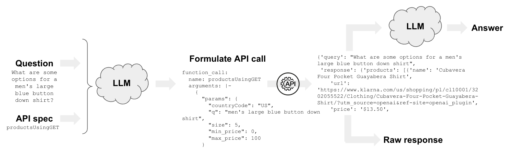
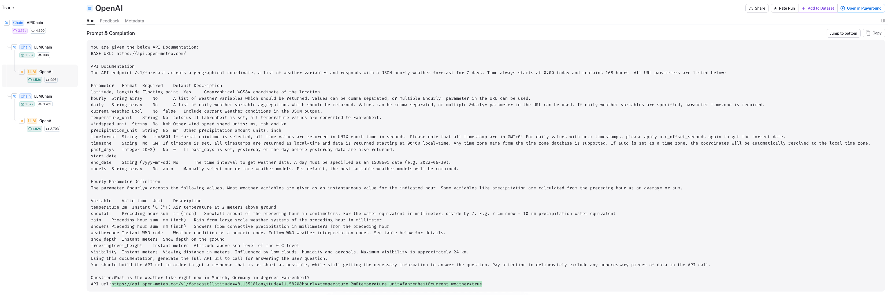

[](https://colab.research.google.com/github/langchain-ai/langchain/blob/master/docs/docs/use_cases/apis.ipynb)

## Use case

LLM을 외부 API와 상호 작용하게 하려면 어떻게 해야 할까요?

이는 LLM이 사용할 컨텍스트를 검색하는 데 매우 유용할 수 있습니다.

더 일반적으로는 자연어를 사용하여 API와 상호 작용할 수 있습니다!

## Overview

LLM을 외부 API와 인터페이스하는 두 가지 주요 방법이 있습니다:

- `Functions`: 예를 들어, [OpenAI 함수](https://platform.openai.com/docs/guides/gpt/function-calling)가 이를 수행하는 인기 있는 방법 중 하나입니다.
- `LLM 생성 인터페이스`: API 문서에 접근할 수 있는 LLM을 사용하여 인터페이스를 생성합니다.



## Quickstart

많은 API가 이미 OpenAI 함수 호출과 호환됩니다.

예를 들어, [Klarna](https://www.klarna.com/international/press/klarna-brings-smoooth-shopping-to-chatgpt/)는 API를 설명하는 YAML 파일을 가지고 있으며, 이를 통해 OpenAI와 상호 작용할 수 있습니다:

```
https://www.klarna.com/us/shopping/public/openai/v0/api-docs/
```

다른 옵션으로는 다음이 포함됩니다:

- 번역용 [Speak](https://api.speak.com/openapi.yaml)
- 만화를 위한 [XKCD](https://gist.githubusercontent.com/roaldnefs/053e505b2b7a807290908fe9aa3e1f00/raw/0a212622ebfef501163f91e23803552411ed00e4/openapi.yaml)

OpenAI 함수를 사용하여 API에 쿼리하려면 사양을 `get_openapi_chain`에 직접 제공할 수 있습니다:

```python
pip install langchain langchain-openai

# 환경 변수 OPENAI_API_KEY를 설정하거나 .env 파일에서 로드합니다:

# import dotenv

# dotenv.load_dotenv()

```

```python
from langchain.chains.openai_functions.openapi import get_openapi_chain

chain = get_openapi_chain(
    "https://www.klarna.com/us/shopping/public/openai/v0/api-docs/"
)
chain("남성용 대형 파란색 버튼 다운 셔츠의 옵션은 무엇인가요?")
```

```output
Attempting to load an OpenAPI 3.0.1 spec.  This may result in degraded performance. Convert your OpenAPI spec to 3.1.* spec for better support.
```

```output
{'query': "What are some options for a men's large blue button down shirt",
 'response': {'products': [{'name': 'Cubavera Four Pocket Guayabera Shirt',
    'url': 'https://www.klarna.com/us/shopping/pl/cl10001/3202055522/Clothing/Cubavera-Four-Pocket-Guayabera-Shirt/?utm_source=openai&ref-site=openai_plugin',
    'price': '$13.50',
    'attributes': ['Material:Polyester,Cotton',
     'Target Group:Man',
     'Color:Red,White,Blue,Black',
     'Properties:Pockets',
     'Pattern:Solid Color',
     'Size (Small-Large):S,XL,L,M,XXL']},
   {'name': 'Polo Ralph Lauren Plaid Short Sleeve Button-down Oxford Shirt',
    'url': 'https://www.klarna.com/us/shopping/pl/cl10001/3207163438/Clothing/Polo-Ralph-Lauren-Plaid-Short-Sleeve-Button-down-Oxford-Shirt/?utm_source=openai&ref-site=openai_plugin',
    'price': '$52.20',
    'attributes': ['Material:Cotton',
     'Target Group:Man',
     'Color:Red,Blue,Multicolor',
     'Size (Small-Large):S,XL,L,M,XXL']},
   {'name': 'Brixton Bowery Flannel Shirt',
    'url': 'https://www.klarna.com/us/shopping/pl/cl10001/3202331096/Clothing/Brixton-Bowery-Flannel-Shirt/?utm_source=openai&ref-site=openai_plugin',
    'price': '$27.48',
    'attributes': ['Material:Cotton',
     'Target Group:Man',
     'Color:Gray,Blue,Black,Orange',
     'Properties:Pockets',
     'Pattern:Checkered',
     'Size (Small-Large):XL,3XL,4XL,5XL,L,M,XXL']},
   {'name': 'Vineyard Vines Gingham On-The-Go brrr Classic Fit Shirt Crystal',
    'url': 'https://www.klarna.com/us/shopping/pl/cl10001/3201938510/Clothing/Vineyard-Vines-Gingham-On-The-Go-brrr-Classic-Fit-Shirt-Crystal/?utm_source=openai&ref-site=openai_plugin',
    'price': '$80.64',
    'attributes': ['Material:Cotton',
     'Target Group:Man',
     'Color:Blue',
     'Size (Small-Large):XL,XS,L,M']},
   {'name': "Carhartt Men's Loose Fit Midweight Short Sleeve Plaid Shirt",
    'url': 'https://www.klarna.com/us/shopping/pl/cl10001/3201826024/Clothing/Carhartt-Men-s-Loose-Fit-Midweight-Short-Sleeve-Plaid-Shirt/?utm_source=openai&ref-site=openai_plugin',
    'price': '$17.99',
    'attributes': ['Material:Cotton',
     'Target Group:Man',
     'Color:Red,Brown,Blue,Green',
     'Properties:Pockets',
     'Pattern:Checkered',
     'Size (Small-Large):S,XL,L,M']}]}}
```

## Functions

함수를 사용하여 외부 API를 호출할 때 어떤 일이 발생하는지 알아보겠습니다.

[LangSmith 추적](https://smith.langchain.com/public/76a58b85-193f-4eb7-ba40-747f0d5dd56e/r)을 살펴보세요:

- 제공된 API 사양으로 OpenAI LLM을 호출합니다:

```
https://www.klarna.com/us/shopping/public/openai/v0/api-docs/
```

- 프롬프트는 LLM에게 입력 질문과 함께 API 사양을 사용하도록 지시합니다:

```
Use the provided APIs to respond to this user query:
What are some options for a men's large blue button down shirt
```

- LLM은 제공된 API 사양에 명시된 대로 함수 호출 `productsUsingGET`의 매개변수를 반환합니다:

```
function_call:
  name: productsUsingGET
  arguments: |-
    {
      "params": {
        "countryCode": "US",
        "q": "men's large blue button down shirt",
        "size": 5,
        "min_price": 0,
        "max_price": 100
      }
    }
```


- 이 `Dict`는 분리되어 [여기서 API가 호출됩니다](https://github.com/langchain-ai/langchain/blob/7fc07ba5df99b9fa8bef837b0fafa220bc5c932c/libs/langchain/langchain/chains/openai_functions/openapi.py#L215).

## API Chain

`APIChain`과 제공된 API 문서를 사용하여 외부 API에 대한 인터페이스를 직접 만들 수도 있습니다.

```python
from langchain.chains import APIChain
from langchain.chains.api import open_meteo_docs
from langchain_openai import OpenAI

llm = OpenAI(temperature=0)
chain = APIChain.from_llm_and_api_docs(
    llm,
    open_meteo_docs.OPEN_METEO_DOCS,
    verbose=True,
    limit_to_domains=["https://api.open-meteo.com/"],
)
chain.run(
    "지금 독일 뮌헨의 날씨는 섭씨 몇 도인가요?"
)
```

```output


> Entering new APIChain chain...
https://api.open-meteo.com/v1/forecast?latitude=48.1351&longitude=11.5820&hourly=temperature_2m&temperature_unit=celsius&current_weather=true
{"latitude":48.14,"longitude":11.58,"generationtime_ms":0.1710653305053711,"utc_offset_seconds":0,"timezone":"GMT","timezone_abbreviation":"GMT","elevation":521.0,"current_weather_units":{"time":"iso8601","interval":"seconds","temperature":"°C","windspeed":"km/h","winddirection":"°","is_day":"","weathercode":"wmo code"},"current_weather":{"time":"2023-11-01T21:30","interval":900,"temperature":8.1,"windspeed":7.7,"winddirection":259,"is_day":0,"weathercode":3},"hourly_units":{"time":"iso8601","temperature_2m":"°C"},"hourly":{"time":["2023-11-01T00:00","2023-11-01T01:00","2023-11-01T02:00","2023-11-01T03:00","2023-11-01T04:00","2023-11-01T05:00","2023-11-01T06:00","2023-11-01T07:00","2023-11-01T08:00","2023-11-01T09:00","2023-11-01T10:00","2023-11-01T11:00","2023-11-01T12:00","2023-11-01T13:00","2023-11-01T14:00","2023-11-01T15:00","2023-11-01T16:00","2023-11-01T17:00","2023-11-01T18:00","2023-11-01T19:00","2023-11-01T20:00","2023-11-01T21:00","2023-11-01T22:00","2023-11-01T23:00","2023-11-02T00:00","2023-11-02T01:00","2023-11-02T02:00","2023-11-02T03:00","2023-11-02T04:00","2023-11-02T05:00","2023-11-02T06:00","2023-11-02T07:00","2023-11-02T08:00","2023-11-02T09:00","2023-11-02T10:00","2023-11-02T11:00","2023-11-02T12:00","2023-11-02T13:00","2023-11-02T14:00","2023-11-02T15:00","2023-11-02T16:00","2023-11-02T17:00","2023-11-02T18:00","2023-11-02T19:00","2023-11-02T20:00","2023-11-02T21:00","2023-11-02T22:00","2023-11-02T23:00","2023-11-03T00:00","2023-11-03T01:00","2023-11-03T02:00","2023-11-03T03:00","2023-11-03T04:00","2023-11-03T05:00","2023-11-03T06:00","2023-11-03T07:00","2023-11-03T08:00","2023-11-03T09:00","2023-11-03T10:00","2023-11-03T11:00","2023-11-03T12:00","2023-11-03T13:00","2023-11-03T14:00","2023-11-03T15:00","2023-11-03T16:00","2023-11-03T17:00","2023-11-03T18:00","2023-11-03T19:00","2023-11-03T20:00","2023-11-03T21:00","2023-11-03T22:00","2023-11-03T23:00","2023-11-04T00:00","2023-11-04T01:00","2023-11-04T02:00","2023-11-04T03:00","2023-11-04T04:00","2023-11-04T05:00","2023-11-04T06:00","2023-11-04T07:00","2023-11-04T08:00","2023-11-04T09:00","2023-11-04T10:00","2023-11-04T11:00","2023-11-04T12:00","2023-11-04T13:00","2023-11-04T14:00","2023-11-04T15:00","2023-11-04T16:00","2023-11-04T17:00","2023-11-04T18:00","2023-11-04T19:00","2023-11-04T20:00","2023-11-04T21:00","2023-11-04T22:00","2023-11-04T23:00","2023-11-05T00:00","2023-11-05T01:00","2023-11-05T02:00","2023-11-05T03:00","2023-11-05T04:00","2023-11-05T05:00","2023-11-05T06:00","2023-11-05T07:00","2023-11-05T08:00","2023-11-05T09:00","2023-11-05T10:00","2023-11-05T11:00","2023-11-05T12:00","2023-11-05T13:00","2023-11-05T14:00","2023-11-05T15:00","2023-11-05T16:00","2023-11-05T17:00","2023-11-05T18:00","2023-11-05T19:00","2023-11-05T20:00","2023-11-05T21:00","2023-11-05T22:00","2023-11-05T23:00","2023-11-06T00:00","2023-11-06T01:00","2023-11-06T02:00","2023-11-06T03:00","2023-11-06T04:00","2023-11-06T05:00","2023-11-06T06:00","2023-11-06T07:00","2023-11-06T08:00","2023-11-06T09:00","2023-11-06T10:00","2023-11-06T11:00","2023-11-06T12:00","2023-11-06T13:00","2023-11-06T14:00","2023-11-06T15:00","2023-11-06T16:00","2023-11-06T17:00","2023-11-06T18:00","2023-11-06T19:00","2023-11-06T20:00","2023-11-06T21:00","2023-11-06T22:00","2023-11-06T23:00"],"temperature_2m":[8.9,8.3,8.4,8.1,7.7,7.3,6.3,6.4,8.2,10.8,12.8,13.5,14.5,14.4,13.9,13.7,12.4,11.2,9.5,9.0,8.7,8.3,7.9,7.7,7.0,6.0,5.4,5.4,5.6,5.9,6.4,6.8,7.7,8.9,9.5,10.4,11.2,11.4,11.0,10.1,8.9,8.6,8.4,8.3,7.9,7.7,7.6,7.6,7.7,7.4,7.3,6.9,6.6,6.4,6.3,5.8,5.6,6.1,6.2,6.2,6.4,7.0,7.1,6.8,6.1,5.3,4.7,5.4,5.1,5.1,4.9,4.4,4.1,3.8,3.2,3.6,3.9,4.7,4.9,5.0,7.7,8.8,9.3,10.4,10.9,11.1,10.7,10.0,9.6,9.3,8.9,8.5,8.4,8.3,8.4,8.5,8.6,8.6,8.6,8.6,8.3,8.1,8.1,8.9,9.6,10.7,11.1,11.5,11.7,11.7,11.5,11.2,10.7,10.2,9.8,9.5,9.3,9.1,8.8,8.5,8.1,7.8,7.6,7.4,7.0,6.6,6.7,7.6,8.9,10.2,10.9,11.5,11.7,11.5,11.0,10.6,10.0,9.5,9.1,8.9,8.7,8.5,8.4,8.4,8.2,7.9,7.8,7.6,7.5,7.3,7.4,7.8,8.5,9.2,9.9,10.6,11.0,11.0,10.9,10.6,10.2,9.7,9.3,9.0,8.7,8.5,8.6,8.9]}}

> Finished chain.
```

```output
' 현재 독일 뮌헨의 기온은 섭씨 8.1도입니다.'
```

다음과 같이 API에 대한 정보를 제공합니다:

```python
open_meteo_docs.OPEN_METEO_DOCS[0:500]
```

```output
'BASE URL: https://api.open-meteo.com/\n\nAPI Documentation\nThe API endpoint /v1/forecast accepts a geographical coordinate, a list of weather variables and responds with a JSON hourly weather forecast for 7 days. Time always starts at 0:00 today and contains 168 hours. All URL parameters are listed below:\n\nParameter\tFormat\tRequired\tDefault\tDescription\nlatitude, longitude\tFloating point\tYes\t\tGeographical WGS84 coordinate of the location\nhourly\tString array\tNo\t\tA list of weather variables which shou'
```

내부적으로 우리는 두 가지 작업을 수행합니다:

- `api_request_chain`: 입력 질문과 api_docs를 기반으로 API URL을 생성합니다.
- `api_answer_chain`: API 응답을 기반으로 최종 답변을 생성합니다.

[LangSmith 추적](https://smith.langchain.com/public/1e0d18ca-0d76-444c-97df-a939a6a815a7/r)을 살펴보면 이를 확인할 수 있습니다:

- `api_request_chain`은 질문과 API 문서를 바탕으로 API URL을 생성합니다:



- [여기서](https://github.com/langchain-ai/langchain/blob/bbd22b9b761389a5e40fc45b0570e1830aabb707/libs/langchain/langchain/chains/api/base.py#L82) API 요청을 API URL과 함께 보냅니다.
- `api_answer_chain`은 API 응답을 받아 자연어 응답을 제공합니다:


### 더 깊이 들어가기

**다른 API로 테스트**

```python
import os

os.environ["TMDB_BEARER_TOKEN"] = ""
from langchain.chains.api import tmdb_docs

headers = {"Authorization": f"Bearer {os.environ['TMDB_BEARER_TOKEN']}"}
chain = APIChain.from_llm_and_api_docs(
    llm,
    tmdb_docs.TMDB_DOCS,
    headers=headers,
    verbose=True,
    limit_to_domains=["https://api.themoviedb.org/"],
)
chain.run("아바타를 검색하세요")
```

```python
import os

from langchain.chains import APIChain
from langchain.chains.api import podcast_docs
from langchain_openai import OpenAI

listen_api_key = "xxx"  # 여기서 API 키를 얻습니다: https://www.listennotes.com/api/pricing/
llm = OpenAI(temperature=0)
headers = {"X-ListenAPI-Key": listen_api_key}
chain = APIChain.from_llm_and_api_docs(
    llm,
    podcast_docs.PODCAST_DOCS,
    headers=headers,
    verbose=True,
    limit_to_domains=["https://listen-api.listennotes.com/"],
)
chain.run(
    "실리콘 밸리 은행에 대한 팟캐스트 에피소드를 검색하고, 오디오 길이가 30분 이상인 결과만 반환하세요."
)
```

**웹 요청**

URL 요청은 매우 일반적인 사용 사례이기 때문에 HTTP GET 요청을 수행하는 `LLMRequestsChain`을 제공합니다.

```python
from langchain.chains import LLMChain, LLMRequestsChain
from langchain_core.prompts import PromptTemplate
from langchain_openai import OpenAI
```

```python
template = """Between >>> and <<< are the raw search result text from google.
Extract the answer to the question '{query}' or say "not found" if the information is not contained.
Use the format
Extracted:<answer or "not found">
>>> {requests_result} <<<
Extracted:"""

PROMPT = PromptTemplate(
    input_variables=["query", "requests_result"],
    template=template,
)
```

```python
chain = LLMRequestsChain(llm_chain=LLMChain(llm=OpenAI(temperature=0), prompt=PROMPT))
question = "세계에서 가장 큰 세 나라와 그 크기는?"
inputs = {
    "query": question,
    "url": "https://www.google.com/search?q=" + question.replace(" ", "+"),
}
chain(inputs)
```

```output
{'query': 'What are the Three (3) biggest countries, and their respective sizes?',
 'url': 'https://www.google.com/search?q=What+are+the+Three+(3)+biggest+countries,+and+their+respective+sizes?',
 'output': ' 러시아 (17,098,242 km²), 캐나다 (9,984,670 km²), 중국 (9,706,961 km²)'}
```