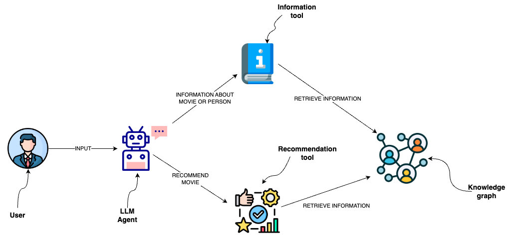

# 그래프 데이터베이스 위에 시맨틱 레이어 구축

그래프 데이터베이스(예: Neo4j)에서 정보를 검색하기 위해 데이터베이스 쿼리를 사용할 수 있습니다.
한 가지 방법은 LLM을 사용하여 Cypher 문을 생성하는 것입니다.
이 방법은 뛰어난 유연성을 제공하지만 솔루션이 취약할 수 있으며 일관되게 정확한 Cypher 문을 생성하지 못할 수 있습니다.
Cypher 문을 생성하는 대신 LLM 에이전트가 상호작용할 수 있는 시맨틱 레이어에서 Cypher 템플릿을 도구로 구현할 수 있습니다.



## 설정

먼저 필요한 패키지를 설치하고 환경 변수를 설정합니다:

```python
%pip install --upgrade --quiet langchain langchain-community langchain-openai neo4j
```

```output
Note: you may need to restart the kernel to use updated packages.
```

이 가이드에서는 기본적으로 OpenAI 모델을 사용하지만, 원하는 모델 제공업체로 교체할 수 있습니다.

```python
import getpass
import os

os.environ["OPENAI_API_KEY"] = getpass.getpass()

# 아래 주석을 해제하여 LangSmith를 사용하십시오. 필수는 아닙니다.

# os.environ["LANGCHAIN_API_KEY"] = getpass.getpass()

# os.environ["LANGCHAIN_TRACING_V2"] = "true"

```

```output
 ········
```

다음으로 Neo4j 자격 증명을 정의해야 합니다.
Neo4j 데이터베이스를 설정하려면 [이 설치 단계](https://neo4j.com/docs/operations-manual/current/installation/)를 따르십시오.

```python
os.environ["NEO4J_URI"] = "bolt://localhost:7687"
os.environ["NEO4J_USERNAME"] = "neo4j"
os.environ["NEO4J_PASSWORD"] = "password"
```

아래 예제는 Neo4j 데이터베이스와 연결을 설정하고 영화와 배우에 대한 예제 데이터를 채워줍니다.

```python
from langchain_community.graphs import Neo4jGraph

graph = Neo4jGraph()

# 영화 정보 가져오기

movies_query = """
LOAD CSV WITH HEADERS FROM
'https://raw.githubusercontent.com/tomasonjo/blog-datasets/main/movies/movies_small.csv'
AS row
MERGE (m:Movie {id:row.movieId})
SET m.released = date(row.released),
    m.title = row.title,
    m.imdbRating = toFloat(row.imdbRating)
FOREACH (director in split(row.director, '|') |
    MERGE (p:Person {name:trim(director)})
    MERGE (p)-[:DIRECTED]->(m))
FOREACH (actor in split(row.actors, '|') |
    MERGE (p:Person {name:trim(actor)})
    MERGE (p)-[:ACTED_IN]->(m))
FOREACH (genre in split(row.genres, '|') |
    MERGE (g:Genre {name:trim(genre)})
    MERGE (m)-[:IN_GENRE]->(g))
"""

graph.query(movies_query)
```

```output
[]
```

## Cypher 템플릿을 사용한 사용자 정의 도구

시맨틱 레이어는 지식 그래프와 상호작용하기 위해 LLM에 노출된 다양한 도구로 구성됩니다.
이들은 다양한 복잡성을 가질 수 있습니다. 시맨틱 레이어의 각 도구를 함수로 생각할 수 있습니다.

우리가 구현할 함수는 영화나 출연진에 대한 정보를 검색하는 것입니다.

```python
from typing import Optional, Type

from langchain.callbacks.manager import (
    AsyncCallbackManagerForToolRun,
    CallbackManagerForToolRun,
)

# 필요로 하는 항목 가져오기

from langchain.pydantic_v1 import BaseModel, Field
from langchain.tools import BaseTool

description_query = """
MATCH (m:Movie|Person)
WHERE m.title CONTAINS $candidate OR m.name CONTAINS $candidate
MATCH (m)-[r:ACTED_IN|HAS_GENRE]-(t)
WITH m, type(r) as type, collect(coalesce(t.name, t.title)) as names
WITH m, type+": "+reduce(s="", n IN names | s + n + ", ") as types
WITH m, collect(types) as contexts
WITH m, "type:" + labels(m)[0] + "\ntitle: "+ coalesce(m.title, m.name)
       + "\nyear: "+coalesce(m.released,"") +"\n" +
       reduce(s="", c in contexts | s + substring(c, 0, size(c)-2) +"\n") as context
RETURN context LIMIT 1
"""


def get_information(entity: str) -> str:
    try:
        data = graph.query(description_query, params={"candidate": entity})
        return data[0]["context"]
    except IndexError:
        return "No information was found"
```

정보를 검색하는 데 사용되는 Cypher 문을 정의한 것을 볼 수 있습니다.
따라서 Cypher 문을 생성하는 대신 LLM 에이전트를 사용하여 입력 매개변수만 채울 수 있습니다.
도구를 언제 사용하고 입력 매개변수를 언제 사용할지에 대한 추가 정보를 LLM 에이전트에게 제공하기 위해 함수를 도구로 래핑합니다.

```python
from typing import Optional, Type

from langchain.callbacks.manager import (
    AsyncCallbackManagerForToolRun,
    CallbackManagerForToolRun,
)

# 필요로 하는 항목 가져오기

from langchain.pydantic_v1 import BaseModel, Field
from langchain.tools import BaseTool


class InformationInput(BaseModel):
    entity: str = Field(description="질문에 언급된 영화나 사람")


class InformationTool(BaseTool):
    name = "Information"
    description = (
        "여러 배우나 영화에 대한 질문에 답할 때 유용함"
    )
    args_schema: Type[BaseModel] = InformationInput

    def _run(
        self,
        entity: str,
        run_manager: Optional[CallbackManagerForToolRun] = None,
    ) -> str:
        """도구 사용"""
        return get_information(entity)

    async def _arun(
        self,
        entity: str,
        run_manager: Optional[AsyncCallbackManagerForToolRun] = None,
    ) -> str:
        """비동기적으로 도구 사용"""
        return get_information(entity)
```

## OpenAI 에이전트

LangChain 표현 언어를 사용하면 그래프 데이터베이스와 상호작용하기 위한 에이전트를 시맨틱 레이어 위에 매우 편리하게 정의할 수 있습니다.

```python
from typing import List, Tuple

from langchain.agents import AgentExecutor
from langchain.agents.format_scratchpad import format_to_openai_function_messages
from langchain.agents.output_parsers import OpenAIFunctionsAgentOutputParser
from langchain_core.messages import AIMessage, HumanMessage
from langchain_core.prompts import ChatPromptTemplate, MessagesPlaceholder
from langchain_core.utils.function_calling import convert_to_openai_function
from langchain_openai import ChatOpenAI

llm = ChatOpenAI(model="gpt-3.5-turbo", temperature=0)
tools = [InformationTool()]

llm_with_tools = llm.bind(functions=[convert_to_openai_function(t) for t in tools])

prompt = ChatPromptTemplate.from_messages(
    [
        (
            "system",
            "당신은 영화를 찾고 추천하는 데 도움이 되는 어시스턴트입니다. "
            "도구가 후속 질문을 필요로 하는 경우, "
            "사용자에게 명확하게 물어보십시오. "
            "후속 질문에서 명확하게 해야 할 선택 사항이 있는 경우 이를 포함하십시오. "
            "사용자가 요청한 작업만 수행하십시오. ",
        ),
        MessagesPlaceholder(variable_name="chat_history"),
        ("user", "{input}"),
        MessagesPlaceholder(variable_name="agent_scratchpad"),
    ]
)


def _format_chat_history(chat_history: List[Tuple[str, str]]):
    buffer = []
    for human, ai in chat_history:
        buffer.append(HumanMessage(content=human))
        buffer.append(AIMessage(content=ai))
    return buffer


agent = (
    {
        "input": lambda x: x["input"],
        "chat_history": lambda x: _format_chat_history(x["chat_history"])
        if x.get("chat_history")
        else [],
        "agent_scratchpad": lambda x: format_to_openai_function_messages(
            x["intermediate_steps"]
        ),
    }
    | prompt
    | llm_with_tools
    | OpenAIFunctionsAgentOutputParser()
)

agent_executor = AgentExecutor(agent=agent, tools=tools, verbose=True)
```

```python
agent_executor.invoke({"input": "Casino에 누가 출연했나요?"})
```

```output

> Entering new AgentExecutor chain...

Invoking: `Information` with `{'entity': 'Casino'}`


type:Movie
title: Casino
year: 1995-11-22
ACTED_IN: Joe Pesci, Robert De Niro, Sharon Stone, James Woods
영화 "Casino"에는 Joe Pesci, Robert De Niro, Sharon Stone, James Woods가 출연했습니다.

> Finished chain.
```

```output
{'input': 'Casino에 누가 출연했나요?',
 'output': '영화 "Casino"에는 Joe Pesci, Robert De Niro, Sharon Stone, James Woods가 출연했습니다.'}
```