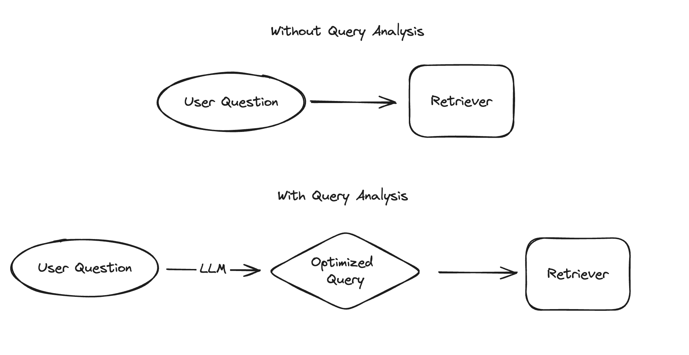

# 쿼리 분석

"검색"은 검색 강화 생성(Retrieval Augmented Generation)의 "검색" 부분을 포함하여 많은 사용 사례를 지원합니다. 가장 간단한 방법은 사용자 질문을 검색기에 직접 전달하는 것입니다. 성능을 향상시키기 위해 *쿼리 분석*을 사용하여 쿼리를 최적화할 수 있습니다. 이는 전통적으로 규칙 기반 기술에 의해 수행되었지만 LLM의 발전으로 LLM을 사용하는 것이 더 보편적이고 실용적이 되고 있습니다. 구체적으로는 원시 질문(또는 메시지 목록)을 LLM에 전달하고 최적화된 쿼리 하나 이상을 반환하는 것을 포함하며, 이 쿼리에는 일반적으로 문자열과 선택적으로 다른 구조화된 정보가 포함됩니다.

## 해결되는 문제

쿼리 분석은 검색기에 보낼 검색 쿼리를 최적화하는 데 도움을 줍니다. 다음과 같은 경우에 해당할 수 있습니다:

* 검색기가 데이터의 특정 필드를 대상으로 검색 및 필터링을 지원하며, 사용자 입력이 이러한 필드 중 어느 것에 해당할 수 있는 경우,
* 사용자 입력에 여러 개의 별개의 질문이 포함된 경우,
* 관련 정보를 검색하기 위해 여러 개의 쿼리가 필요한 경우,
* 검색 품질이 표현에 민감한 경우,
* 여러 검색기가 있을 수 있으며, 사용자 입력이 그 중 어느 것에 해당할 수 있는 경우.

각기 다른 문제는 각각 다른 솔루션을 필요로 합니다. 어떤 쿼리 분석 기술을 사용해야 하는지 결정하려면 현재 검색 시스템의 문제를 정확히 이해하는 것이 중요합니다. 이는 현재 애플리케이션의 실패 데이터를 검토하고 공통된 테마를 식별하는 것이 가장 좋습니다. 문제를 알고 나면 해결 방법을 모색할 수 있습니다.

## 빠른 시작

[빠른 시작](/docs/use_cases/query_analysis/quickstart) 페이지에서 기본적인 엔드 투 엔드 예제를 통해 쿼리 분석을 사용하는 방법을 확인하십시오. 여기에는 LangChain YouTube 비디오의 내용을 검색하는 검색 엔진을 만들고, 원시 사용자 질문을 해당 인덱스에 전달할 때 발생하는 실패 모드를 보여주며, 쿼리 분석이 이 문제를 해결하는 방법의 예를 설명합니다. 빠른 시작은 **쿼리 구조화**에 중점을 둡니다. 아래에는 데이터와 사용 사례에 따라 관련될 수 있는 추가 쿼리 분석 기술이 나와 있습니다.

## 기술

원시 질문 또는 메시지 목록에서 최적화된 쿼리로 전환하는 다양한 기술을 지원합니다. 여기에는 다음이 포함됩니다:

* [쿼리 분해](/docs/use_cases/query_analysis/techniques/decomposition): 사용자 입력에 여러 개의 별개의 질문이 포함된 경우, 입력을 각각 독립적으로 실행할 수 있는 개별 쿼리로 분해할 수 있습니다.
* [쿼리 확장](/docs/use_cases/query_analysis/techniques/expansion): 인덱스가 쿼리 표현에 민감한 경우, 사용자 질문의 여러 가지 패러프레이즈 버전을 생성하여 관련 결과를 검색할 가능성을 높일 수 있습니다.
* [가상 문서 임베딩 (HyDE)](/docs/use_cases/query_analysis/techniques/hyde): 유사성 검색 기반 인덱스(예: 벡터 스토어)를 사용하는 경우, 원시 질문으로 검색하는 것은 관련 문서의 임베딩과 유사하지 않을 수 있으므로 잘 작동하지 않을 수 있습니다. 대신 모델이 가상의 관련 문서를 생성하고 이를 사용하여 유사성 검색을 수행하는 것이 도움이 될 수 있습니다.
* [쿼리 라우팅](/docs/use_cases/query_analysis/techniques/routing): 여러 개의 인덱스가 있고 특정 사용자 입력에 대해 일부만 유용한 경우, 입력을 관련된 인덱스로만 검색하도록 라우팅할 수 있습니다.
* [한 단계 물러난 프롬프트](/docs/use_cases/query_analysis/techniques/step_back): 때로는 검색 품질과 모델 생성이 질문의 세부 사항에 의해 방해받을 수 있습니다. 이를 해결하는 한 가지 방법은 먼저 더 추상적인 "한 단계 물러난" 질문을 생성하고 원래 질문과 한 단계 물러난 질문을 모두 기반으로 검색하는 것입니다.
* [쿼리 구조화](/docs/use_cases/query_analysis/techniques/structuring): 문서에 여러 개의 검색 가능/필터링 가능한 속성이 있는 경우, 원시 사용자 질문에서 특정 속성을 검색/필터링해야 하는지를 추론할 수 있습니다. 예를 들어, 사용자가 비디오 게시 날짜에 대해 특정한 것을 입력한 경우, 이는 각 문서의 `publish_date` 속성에 대한 필터가 되어야 합니다.

## 방법

* [예제를 프롬프트에 추가하기](/docs/use_cases/query_analysis/how_to/few_shot): 쿼리 분석이 복잡해질수록 프롬프트에 예제를 추가하면 성능이 크게 향상될 수 있습니다.
* [높은 카디널리티의 범주형 변수 처리하기](/docs/use_cases/query_analysis/how_to/high_cardinality): 생성할 구조화된 쿼리의 많은 부분이 범주형 변수를 포함할 것입니다. 가능한 값이 많을 때 이를 올바르게 처리하는 것은 어려울 수 있습니다.
* [필터 구성하기](/docs/use_cases/query_analysis/how_to/constructing-filters): Pydantic 모델에서 작업 중인 벡터스토어의 특정 쿼리 언어로 필터를 구성하는 방법을 다룹니다.
* [여러 개의 쿼리 처리하기](/docs/use_cases/query_analysis/how_to/multiple_queries): 일부 쿼리 분석 기술은 여러 개의 쿼리를 생성합니다. 이 가이드는 모든 쿼리를 검색기에 전달하는 방법을 다룹니다.
* [쿼리가 없을 때 처리하기](/docs/use_cases/query_analysis/how_to/no_queries): 일부 쿼리 분석 기술은 쿼리를 전혀 생성하지 않을 수 있습니다. 이러한 상황을 우아하게 처리하는 방법을 다룹니다.
* [여러 개의 검색기 처리하기](/docs/use_cases/query_analysis/how_to/multiple_retrievers): 일부 쿼리 분석 기술은 여러 검색기 간의 라우팅을 포함합니다. 이를 우아하게 처리하는 방법을 다룹니다.