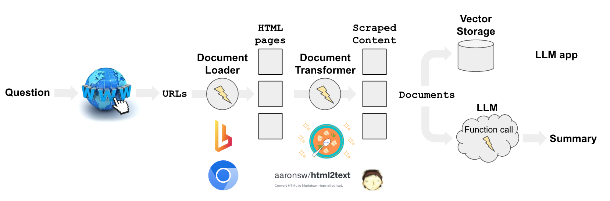
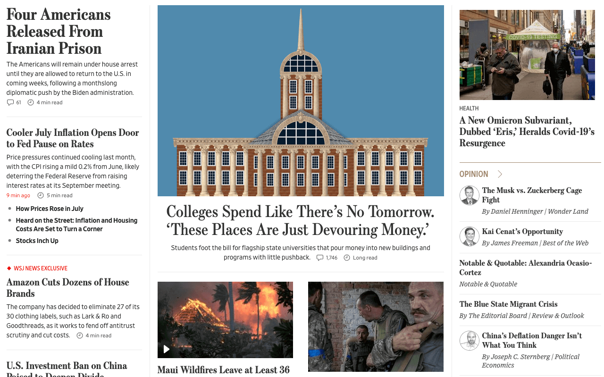
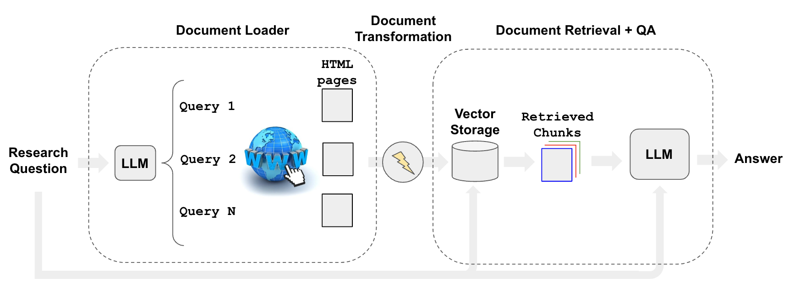

[](https://colab.research.google.com/github/langchain-ai/langchain/blob/master/docs/docs/use_cases/web_scraping.ipynb)

## 사용 사례

[웹 리서치](https://blog.langchain.dev/automating-web-research/)는 매우 유용한 LLM 응용 프로그램 중 하나입니다:

- 사용자들이 [가장 원하는 AI 도구](https://twitter.com/GregKamradt/status/1679913813297225729?s=20)로 강조합니다.
- [gpt-researcher](https://github.com/assafelovic/gpt-researcher)와 같은 오픈 소스 저장소의 인기가 높아지고 있습니다.



## 개요

웹에서 콘텐츠를 수집하는 데는 몇 가지 구성 요소가 있습니다:

- `검색`: URL을 쿼리 (예: `GoogleSearchAPIWrapper` 사용).
- `로딩`: URL을 HTML로 변환 (예: `AsyncHtmlLoader`, `AsyncChromiumLoader` 등 사용).
- `변환`: HTML을 형식화된 텍스트로 변환 (예: `HTML2Text` 또는 `Beautiful Soup` 사용).

## 빠른 시작

```python
pip install -q langchain-openai langchain playwright beautifulsoup4
playwright install

# 환경 변수 OPENAI_API_KEY 설정 또는 .env 파일에서 로드:

# import dotenv

# dotenv.load_dotenv()

```

크로미움의 헤드리스 인스턴스를 사용하여 HTML 콘텐츠를 스크래핑합니다.

- 스크래핑 프로세스의 비동기 특성은 Python의 asyncio 라이브러리를 사용하여 처리됩니다.
- 웹 페이지와의 실제 상호작용은 Playwright에 의해 처리됩니다.

```python
from langchain_community.document_loaders import AsyncChromiumLoader
from langchain_community.document_transformers import BeautifulSoupTransformer

# HTML 로드

loader = AsyncChromiumLoader(["https://www.wsj.com"])
html = loader.load()
```

HTML 콘텐츠에서 `<p>, <li>, <div>, <a>` 태그와 같은 텍스트 콘텐츠 태그를 스크래핑합니다:

- `<p>`: 단락 태그. HTML에서 단락을 정의하며 관련된 문장이나 구절을 그룹화하는 데 사용됩니다.
- `<li>`: 목록 항목 태그. 순서 있는 목록(`<ol>`) 및 순서 없는 목록(`<ul>`) 내에서 개별 항목을 정의하는 데 사용됩니다.
- `<div>`: 디비전 태그. 인라인 또는 블록 수준 요소를 그룹화하는 데 사용되는 블록 수준 요소입니다.
- `<a>`: 앵커 태그. 하이퍼링크를 정의하는 데 사용됩니다.
- `<span>`: 텍스트의 일부분 또는 문서의 일부분을 표시하는 인라인 컨테이너입니다.

많은 뉴스 웹사이트 (예: WSJ, CNN)에서는 제목과 요약이 모두 `<span>` 태그에 있습니다.

```python
# 변환

bs_transformer = BeautifulSoupTransformer()
docs_transformed = bs_transformer.transform_documents(html, tags_to_extract=["span"])
```

```python
# 결과

docs_transformed[0].page_content[0:500]
```

```output
'English EditionEnglish中文 (Chinese)日本語 (Japanese) More Other Products from WSJBuy Side from WSJWSJ ShopWSJ Wine Other Products from WSJ Search Quotes and Companies Search Quotes and Companies 0.15% 0.03% 0.12% -0.42% 4.102% -0.69% -0.25% -0.15% -1.82% 0.24% 0.19% -1.10% About Evan His Family Reflects His Reporting How You Can Help Write a Message Life in Detention Latest News Get Email Updates Four Americans Released From Iranian Prison The Americans will remain under house arrest until they are '
```

이러한 `Documents`는 이제 아래에서 논의된 다양한 LLM 응용 프로그램에서 다운스트림 사용을 위해 준비되었습니다.

## 로더

### AsyncHtmlLoader

[AsyncHtmlLoader](/docs/integrations/document_loaders/async_html)는 `aiohttp` 라이브러리를 사용하여 비동기 HTTP 요청을 수행하며, 더 간단하고 가벼운 스크래핑에 적합합니다.

### AsyncChromiumLoader

[AsyncChromiumLoader](/docs/integrations/document_loaders/async_chromium)는 Playwright를 사용하여 크로미움 인스턴스를 시작하며, JavaScript 렌더링 및 더 복잡한 웹 상호작용을 처리할 수 있습니다.

크로미움은 Playwright에서 지원하는 브라우저 중 하나이며, 브라우저 자동화를 제어하는 데 사용됩니다.

헤드리스 모드는 브라우저가 그래픽 사용자 인터페이스 없이 실행되는 것을 의미하며, 웹 스크래핑에 일반적으로 사용됩니다.

```python
from langchain_community.document_loaders import AsyncHtmlLoader

urls = ["https://www.espn.com", "https://lilianweng.github.io/posts/2023-06-23-agent/"]
loader = AsyncHtmlLoader(urls)
docs = loader.load()
```

## 트랜스포머

### HTML2Text

[HTML2Text](/docs/integrations/document_transformers/html2text)는 특정 태그 조작 없이 HTML 콘텐츠를 일반 텍스트 (마크다운 형식)로 간단히 변환합니다.

인간이 읽기 쉬운 텍스트를 추출하는 것이 목표일 때 가장 적합합니다.

### Beautiful Soup

Beautiful Soup은 HTML 콘텐츠에 대한 더 세밀한 제어를 제공하여 특정 태그 추출, 제거 및 콘텐츠 정리를 가능하게 합니다.

필요에 따라 HTML 콘텐츠를 추출하고 정리하고자 할 때 적합합니다.

```python
from langchain_community.document_loaders import AsyncHtmlLoader

urls = ["https://www.espn.com", "https://lilianweng.github.io/posts/2023-06-23-agent/"]
loader = AsyncHtmlLoader(urls)
docs = loader.load()
```

```output
Fetching pages: 100%|#############################################################################################################| 2/2 [00:00<00:00,  7.01it/s]
```

```python
from langchain_community.document_transformers import Html2TextTransformer

html2text = Html2TextTransformer()
docs_transformed = html2text.transform_documents(docs)
docs_transformed[0].page_content[0:500]
```

```output
"Skip to main content  Skip to navigation\n\n<\n\n>\n\nMenu\n\n## ESPN\n\n  * Search\n\n  *   * scores\n\n  * NFL\n  * MLB\n  * NBA\n  * NHL\n  * Soccer\n  * NCAAF\n  * …\n\n    * Women's World Cup\n    * LLWS\n    * NCAAM\n    * NCAAW\n    * Sports Betting\n    * Boxing\n    * CFL\n    * NCAA\n    * Cricket\n    * F1\n    * Golf\n    * Horse\n    * MMA\n    * NASCAR\n    * NBA G League\n    * Olympic Sports\n    * PLL\n    * Racing\n    * RN BB\n    * RN FB\n    * Rugby\n    * Tennis\n    * WNBA\n    * WWE\n    * X Games\n    * XFL\n\n  * More"
```

## 추출을 통한 스크래핑

### 함수 호출이 있는 LLM

웹 스크래핑은 여러 가지 이유로 어렵습니다.

그 중 하나는 현대 웹사이트의 레이아웃과 콘텐츠가 자주 변경되어, 변경 사항에 맞게 스크래핑 스크립트를 수정해야 하는 것입니다.

추출 체인과 함께 함수(OpenAI 등)를 사용하면 웹사이트가 변경될 때마다 코드를 변경할 필요가 없습니다.

우리는 OpenAI Functions 기능에 액세스하기 위해 `gpt-3.5-turbo-0613`을 사용합니다 (작성 시점에서는 모든 사용자에게 제공될 수도 있습니다).

또한 LLM의 무작위성을 낮추기 위해 `temperature`를 `0`으로 유지합니다.

```python
from langchain_openai import ChatOpenAI

llm = ChatOpenAI(temperature=0, model="gpt-3.5-turbo-0613")
```

### 스키마 정의

다음으로, 추출하려는 데이터 유형을 지정하는 스키마를 정의합니다.

여기서 키 이름이 중요합니다. 이는 LLM에게 어떤 종류의 정보를 원하는지 알려줍니다.

따라서 가능한 한 상세히 작성하세요.

이 예제에서는 Wall Street Journal 웹사이트에서 뉴스 기사 제목과 요약만 스크래핑하고자 합니다.

```python
from langchain.chains import create_extraction_chain

schema = {
    "properties": {
        "news_article_title": {"type": "string"},
        "news_article_summary": {"type": "string"},
    },
    "required": ["news_article_title", "news_article_summary"],
}


def extract(content: str, schema: dict):
    return create_extraction_chain(schema=schema, llm=llm).run(content)
```

### BeautifulSoup을 사용한 웹 스크래퍼 실행

위에서 설명한 것처럼 `BeautifulSoupTransformer`를 사용합니다.

```python
import pprint

from langchain_text_splitters import RecursiveCharacterTextSplitter


def scrape_with_playwright(urls, schema):
    loader = AsyncChromiumLoader(urls)
    docs = loader.load()
    bs_transformer = BeautifulSoupTransformer()
    docs_transformed = bs_transformer.transform_documents(
        docs, tags_to_extract=["span"]
    )
    print("Extracting content with LLM")

    # 사이트의 처음 1000 토큰을 가져옵니다.
    splitter = RecursiveCharacterTextSplitter.from_tiktoken_encoder(
        chunk_size=1000, chunk_overlap=0
    )
    splits = splitter.split_documents(docs_transformed)

    # 첫 번째 분할 처리
    extracted_content = extract(schema=schema, content=splits[0].page_content)
    pprint.pprint(extracted_content)
    return extracted_content


urls = ["https://www.wsj.com"]
extracted_content = scrape_with_playwright(urls, schema=schema)
```

```output
Extracting content with LLM
[{'news_article_summary': 'The Americans will remain under house arrest until '
                          'they are allowed to return to the U.S. in coming '
                          'weeks, following a monthslong diplomatic push by '
                          'the Biden administration.',
  'news_article_title': 'Four Americans Released From Iranian Prison'},
 {'news_article_summary': 'Price pressures continued cooling last month, with '
                          'the CPI rising a mild 0.2% from June, likely '
                          'deterring the Federal Reserve from raising interest '
                          'rates at its September meeting.',
  'news_article_title': 'Cooler July Inflation Opens Door to Fed Pause on '
                        'Rates'},
 {'news_article_summary': 'The company has decided to eliminate 27 of its 30 '
                          'clothing labels, such as Lark & Ro and Goodthreads, '
                          'as it works to fend off antitrust scrutiny and cut '
                          'costs.',
  'news_article_title': 'Amazon Cuts Dozens of House Brands'},
 {'news_article_summary': 'President Biden’s order comes on top of a slowing '
                          'Chinese economy, Covid lockdowns and rising '
                          'tensions between the two powers.',
  'news_article_title': 'U.S. Investment Ban on China Poised to Deepen Divide'},
 {'news_article_summary': 'The proposed trial date in the '
                          'election-interference case comes on the same day as '
                          'the former president’s not guilty plea on '
                          'additional Mar-a-Lago charges.',
  'news_article_title': 'Trump Should Be Tried in January, Prosecutors Tell '
                        'Judge'},
 {'news_article_summary': 'The CEO who started in June says the platform has '
                          '“an entirely different road map” for the future.',
  'news_article_title': 'Yaccarino Says X Is Watching Threads but Has Its Own '
                        'Vision'},
 {'news_article_summary': 'Students foot the bill for flagship state '
                          'universities that pour money into new buildings and '
                          'programs with little pushback.',
  'news_article_title': 'Colleges Spend Like There’s No Tomorrow. ‘These '
                        'Places Are Just Devouring Money.’'},
 {'news_article_summary': 'Wildfires fanned by hurricane winds have torn '
                          'through parts of the Hawaiian island, devastating '
                          'the popular tourist town of Lahaina.',
  'news_article_title': 'Maui Wildfires Leave at Least 36 Dead'},
 {'news_article_summary': 'After its large armored push stalled, Kyiv has '
                          'fallen back on the kind of tactics that brought it '
                          'success earlier in the war.',
  'news_article_title': 'Ukraine Uses Small-Unit Tactics to Retake Captured '
                        'Territory'},
 {'news_article_summary': 'President Guillermo Lasso says the Aug. 20 election '
                          'will proceed, as the Andean country grapples with '
                          'rising drug gang violence.',
  'news_article_title': 'Ecuador Declares State of Emergency After '
                        'Presidential Hopeful Killed'},
 {'news_article_summary': 'This year’s hurricane season, which typically runs '
                          'from June to the end of November, has been '
                          'difficult to predict, climate scientists said.',
  'news_article_title': 'Atlantic Hurricane Season Prediction Increased to '
                        '‘Above Normal,’ NOAA Says'},
 {'news_article_summary': 'The NFL is raising the price of its NFL+ streaming '
                          'packages as it adds the NFL Network and RedZone.',
  'news_article_title': 'NFL to Raise Price of NFL+ Streaming Packages as It '
                        'Adds NFL Network, RedZone'},
 {'news_article_summary': 'Russia is planning a moon mission as part of the '
                          'new space race.',
  'news_article_title': 'Russia’s Moon Mission and the New Space Race'},
 {'news_article_summary': 'Tapestry’s $8.5 billion acquisition of Capri would '
                          'create a conglomerate with more than $12 billion in '
                          'annual sales, but it would still lack the '
                          'high-wattage labels and diversity that have fueled '
                          'LVMH’s success.',
  'news_article_title': "Why the Coach and Kors Marriage Doesn't Scare LVMH"},
 {'news_article_summary': 'The Supreme Court has blocked Purdue Pharma’s $6 '
                          'billion Sackler opioid settlement.',
  'news_article_title': 'Supreme Court Blocks Purdue Pharma’s $6 Billion '
                        'Sackler Opioid Settlement'},
 {'news_article_summary': 'The Social Security COLA is expected to rise in '
                          '2024, but not by a lot.',
  'news_article_title': 'Social Security COLA Expected to Rise in 2024, but '
                        'Not by a Lot'}]
```

스크랩된 헤드라인을 페이지와 비교할 수 있습니다:



[LangSmith 추적](https://smith.langchain.com/public/c3070198-5b13-419b-87bf-3821cdf34fa6/r)을 보면 내부에서 무슨 일이 일어나고 있는지 확인할 수 있습니다:

- [추출](docs/use_cases/extraction)에서 설명한 내용을 따릅니다.
- 입력 텍스트에서 `information_extraction` 함수를 호출합니다.
- 제공된 스키마를 URL 콘텐츠에서 채우려고 시도합니다.

## 리서치 자동화

스크래핑과 관련하여, 검색된 콘텐츠를 사용하여 특정 질문에 답변하고자 할 수 있습니다.

리트리버를 사용하여 [웹 리서치](https://blog.langchain.dev/automating-web-research/) 프로세스를 자동화할 수 있습니다. 예를 들어 `WebResearchRetriever`를 사용할 수 있습니다.



필수 요구 사항은 [여기](https://github.com/langchain-ai/web-explorer/blob/main/requirements.txt)에서 복사하세요:

`pip install -r requirements.txt`

`GOOGLE_CSE_ID`와 `GOOGLE_API_KEY`를 설정합니다.

```python
from langchain.retrievers.web_research import WebResearchRetriever
from langchain_chroma import Chroma
from langchain_community.utilities import GoogleSearchAPIWrapper
from langchain_openai import ChatOpenAI, OpenAIEmbeddings
```

```python
# 벡터스토어

vectorstore = Chroma(
    embedding_function=OpenAIEmbeddings(), persist_directory="./chroma_db_oai"
)

# LLM

llm = ChatOpenAI(temperature=0)

# 검색

search = GoogleSearchAPIWrapper()
```

위의 도구를 사용하여 리트리버를 초기화합니다:

- LLM을 사용하여 여러 관련 검색 쿼리를 생성합니다 (하나의 LLM 호출).
- 각 쿼리에 대해 검색을 실행합니다.
- 쿼리당 상위 K 링크를 선택합니다 (여러 검색 호출을 병렬로 실행).
- 선택한 모든 링크에서 정보를 로드합니다 (페이지를 병렬로 스크래핑).
- 해당 문서를 벡터스토어에 인덱싱합니다.
- 원래 생성된 검색 쿼리에 대해 가장 관련성이 높은 문서를 찾습니다.

```python
# 초기화

web_research_retriever = WebResearchRetriever.from_llm(
    vectorstore=vectorstore, llm=llm, search=search
)
```

```python
# 실행

import logging

logging.basicConfig()
logging.getLogger("langchain.retrievers.web_research").setLevel(logging.INFO)
from langchain.chains import RetrievalQAWithSourcesChain

user_input = "How do LLM Powered Autonomous Agents work?"
qa_chain = RetrievalQAWithSourcesChain.from_chain_type(
    llm, retriever=web_research_retriever
)
result = qa_chain({"question": user_input})
result
```

```output
INFO:langchain.retrievers.web_research:Generating questions for Google Search ...
INFO:langchain.retrievers.web_research:Questions for Google Search (raw): {'question': 'How do LLM Powered Autonomous Agents work?', 'text': LineList(lines=['1. What is the functioning principle of LLM Powered Autonomous Agents?\n', '2. How do LLM Powered Autonomous Agents operate?\n'])}
INFO:langchain.retrievers.web_research:Questions for Google Search: ['1. What is the functioning principle of LLM Powered Autonomous Agents?\n', '2. How do LLM Powered Autonomous Agents operate?\n']
INFO:langchain.retrievers.web_research:Searching for relevant urls ...
INFO:langchain.retrievers.web_research:Searching for relevant urls ...
INFO:langchain.retrievers.web_research:Search results: [{'title': 'LLM Powered Autonomous Agents | Hacker News', 'link': 'https://news.ycombinator.com/item?id=36488871', 'snippet': 'Jun 26, 2023 ... Exactly. A temperature of 0 means you always pick the highest probability token (i.e. the "max" function), while a temperature of 1 means you\xa0...'}]
INFO:langchain.retrievers.web_research:Searching for relevant urls ...
INFO:langchain.retrievers.web_research:Search results: [{'title': "LLM Powered Autonomous Agents | Lil'Log", 'link': 'https://lilianweng.github.io/posts/2023-06-23-agent/', 'snippet': 'Jun 23, 2023 ... Task decomposition can be done (1) by LLM with simple prompting like "Steps for XYZ.\\n1." , "What are the subgoals for achieving XYZ?" , (2) by\xa0...'}]
INFO:langchain.retrievers.web_research:New URLs to load: []
INFO:langchain.retrievers.web_research:Grabbing most relevant splits from urls...
```

```output
{'question': 'How do LLM Powered Autonomous Agents work?',
 'answer': "LLM-powered autonomous agents work by using LLM as the agent's brain, complemented by several key components such as planning, memory, and tool use. In terms of planning, the agent breaks down large tasks into smaller subgoals and can reflect and refine its actions based on past experiences. Memory is divided into short-term memory, which is used for in-context learning, and long-term memory, which allows the agent to retain and recall information over extended periods. Tool use involves the agent calling external APIs for additional information. These agents have been used in various applications, including scientific discovery and generative agents simulation.",
 'sources': ''}
```

### 더 깊이 들어가기

- 여기에 이 리트리버를 가벼운 UI로 감싼 [앱](https://github.com/langchain-ai/web-explorer/tree/main)이 있습니다.

## 웹사이트에서 질문에 답변하기

특정 웹사이트에 대한 질문에 답변하려면 Apify의 [Website Content Crawler](https://apify.com/apify/website-content-crawler) Actor를 사용할 수 있습니다. 이 도구는 문서, 지식 기반, 도움말 센터 또는 블로그와 같은 웹사이트를 깊이 크롤링하고 웹 페이지에서 텍스트 콘텐츠를 추출할 수 있습니다.

아래 예제에서는 LangChain의 Chat LLM 모델의 Python 문서를 깊이 크롤링하고 이에 대해 질문에 답변할 것입니다.

먼저 요구 사항을 설치합니다:
`pip install apify-client langchain-openai langchain`

다음으로, 환경 변수에 `OPENAI_API_KEY`와 `APIFY_API_TOKEN`을 설정합니다.

전체 코드는 다음과 같습니다:

```python
from langchain.indexes import VectorstoreIndexCreator
from langchain_community.docstore.document import Document
from langchain_community.utilities import ApifyWrapper

apify = ApifyWrapper()
# 크롤링된 웹 페이지에서 텍스트를 얻기 위해 Actor 호출

loader = apify.call_actor(
    actor_id="apify/website-content-crawler",
    run_input={"startUrls": [{"url": "/docs/integrations/chat/"}]},
    dataset_mapping_function=lambda item: Document(
        page_content=item["text"] or "", metadata={"source": item["url"]}
    ),
)

# 크롤링된 데이터를 기반으로 벡터 스토어 생성

index = VectorstoreIndexCreator().from_loaders([loader])

# 벡터 스토어 쿼리

query = "Are any OpenAI chat models integrated in LangChain?"
result = index.query(query)
print(result)
```

```output
 Yes, LangChain offers integration with OpenAI chat models. You can use the ChatOpenAI class to interact with OpenAI models.
```